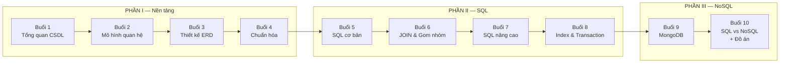

# Giáo trình: Cơ sở dữ liệu Quan hệ & Phi quan hệ

Bộ bài giảng 10 buổi dành cho sinh viên CNTT năm 2–3, dạy từ con số 0 đến mức
thiết kế được một CSDL hoàn chỉnh và biết chọn giữa SQL và NoSQL.

- **Hệ quản trị dùng trong bài:** Microsoft SQL Server 2022 (quan hệ) + MongoDB 7 (tài liệu)
- **Thời lượng:** 10 buổi × 3 tiết (lý thuyết 1.5 tiết + thực hành 1.5 tiết)
- **Ví dụ xuyên suốt:** hệ thống bán sách online **BookStore**

---

## Lộ trình



| Buổi | Chủ đề | Kỹ năng đạt được sau buổi học |
|------|--------|-------------------------------|
| [01](buoi-01-tong-quan-csdl.md) | Tổng quan CSDL & DBMS | Giải thích được vì sao cần CSDL thay vì file Excel |
| [02](buoi-02-mo-hinh-quan-he.md) | Mô hình quan hệ | Đọc hiểu bảng, khóa chính, khóa ngoại, ràng buộc |
| [03](buoi-03-thiet-ke-erd.md) | Mô hình thực thể – liên kết (ERD) | Vẽ được ERD từ mô tả nghiệp vụ, chuyển ERD → bảng |
| [04](buoi-04-chuan-hoa.md) | Phụ thuộc hàm & Chuẩn hóa 1NF–3NF | Phát hiện và sửa được schema dư thừa |
| [05](buoi-05-sql-co-ban.md) | DDL & DML, SELECT cơ bản | Tạo bảng, chèn/sửa/xóa, lọc và sắp xếp dữ liệu |
| [06](buoi-06-join-va-gom-nhom.md) | JOIN, GROUP BY, HAVING | Tổng hợp dữ liệu từ nhiều bảng, làm báo cáo |
| [07](buoi-07-sql-nang-cao.md) | Subquery, CTE, View, Window function | Viết truy vấn phân tích phức tạp |
| [08](buoi-08-index-va-transaction.md) | Index, EXPLAIN, Transaction, ACID | Tối ưu truy vấn chậm, xử lý đồng thời an toàn |
| [09](buoi-09-nosql-mongodb.md) | NoSQL & MongoDB | CRUD, thiết kế document, Aggregation Pipeline |
| [10](buoi-10-sql-vs-nosql-do-an.md) | So sánh & Đồ án cuối khóa | Chọn đúng CSDL cho bài toán, bảo vệ đồ án |

---

## Cấu trúc thư mục

```
database/
├── README.md                    ← bạn đang ở đây
├── setup/
│   ├── HUONG-DAN-CAI-DAT.md     ← cài SQL Server + MongoDB (thủ công & Docker)
│   └── docker-compose.yml
├── buoi-01..10-*.md             ← 10 file bài giảng
├── so-sanh-tsql-mongodb.md      ← bảng tra nhanh T-SQL ↔ MongoDB (phát cho HV)
├── thuc-hanh/
│   ├── 00-schema-bookstore.sql  ← tạo bảng
│   ├── 01-seed-bookstore.sql    ← dữ liệu mẫu
│   ├── bai-tap-buoi-05..08.sql  ← đề bài tập SQL
│   ├── mongo-00-seed.js         ← dữ liệu mẫu MongoDB
│   ├── mongo-01-crud.js         ← thực hành CRUD
│   └── mongo-02-aggregation.js  ← thực hành Aggregation Pipeline
└── dap-an/                      ← lời giải + ghi chú sư phạm (giảng viên)
```

📌 **Tài liệu phát cho học viên:** [Bảng tra nhanh T-SQL ↔ MongoDB](so-sanh-tsql-mongodb.md)
— in ra một trang, dùng từ buổi 9.

---

## Chuẩn bị trước buổi 1

1. Cài **SQL Server 2022 Developer** + **SSMS**, và **MongoDB Community** + **Compass**
   theo [hướng dẫn cài đặt](setup/HUONG-DAN-CAI-DAT.md).
   (Hoặc dùng Docker: `cd setup && docker compose up -d`.)
2. Nạp dữ liệu mẫu: mở `thuc-hanh/00-schema-bookstore.sql` rồi
   `thuc-hanh/01-seed-bookstore.sql` trong SSMS và nhấn **F5**.
3. Kiểm tra: `USE BookStore; SELECT COUNT(*) FROM Sach;` → phải ra **20**.

---

## Gợi ý cách dạy

- **Quy tắc 15 phút:** không giảng lý thuyết quá 15 phút liên tục mà không cho gõ lệnh.
- **Luôn hỏi "tại sao" trước "làm thế nào":** mỗi khái niệm mới nên bắt đầu bằng một
  tình huống hỏng hóc mà khái niệm đó sinh ra để giải quyết (mục *Vấn đề mở đầu*
  ở đầu mỗi buổi).
- **Cho học viên sai có kiểm soát:** mục *Lỗi thường gặp* trong mỗi buổi nên được
  demo trực tiếp trên máy chiếu, đọc kỹ thông báo lỗi.
- **Đánh giá:** 30% bài tập về nhà, 30% kiểm tra thực hành giữa kỳ (sau buổi 6),
  40% đồ án cuối khóa (buổi 10).
