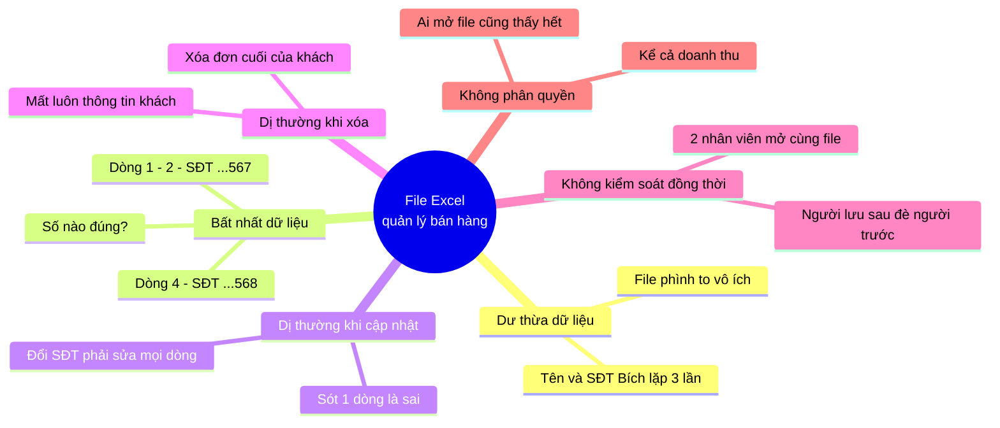
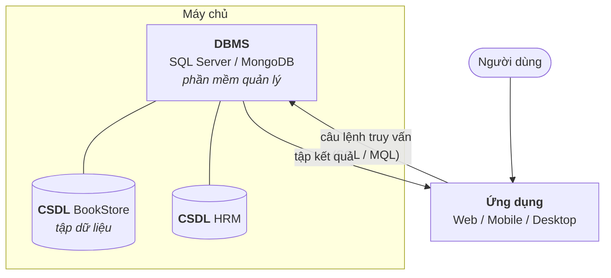
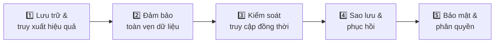
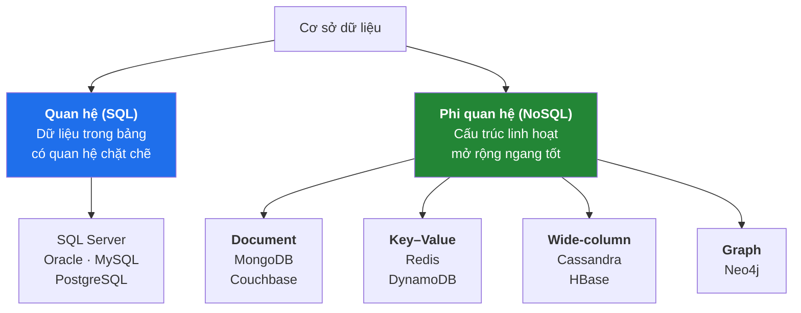
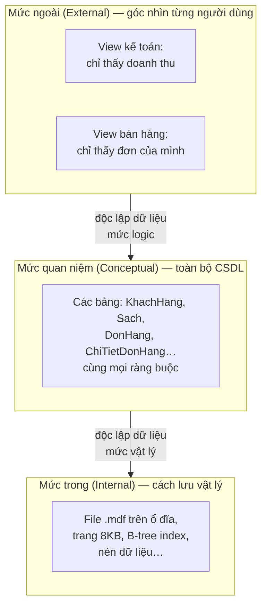

# Buổi 1 — Tổng quan về Cơ sở dữ liệu

> **Mục tiêu sau buổi học**
> 1. Giải thích được vì sao không nên quản lý dữ liệu bằng file Excel/CSV.
> 2. Phân biệt được *cơ sở dữ liệu* và *hệ quản trị cơ sở dữ liệu*.
> 3. Kể tên được 5 họ CSDL và biết mỗi họ sinh ra để giải bài toán gì.
> 4. Kết nối được vào SQL Server và MongoDB, chạy được câu lệnh đầu tiên.

---

## 1. Vấn đề mở đầu: cửa hàng sách của anh Nam

Anh Nam mở cửa hàng sách. Ban đầu anh quản lý bằng một file Excel duy nhất:

| Mã ĐH | Khách hàng | SĐT | Tên sách | Giá | SL |
|-------|-----------|-----|----------|-----|-----|
| DH001 | Trần Thị Bích | 0901234567 | Nhà giả kim | 79000 | 2 |
| DH001 | Trần Thị Bích | 0901234567 | Đắc nhân tâm | 88000 | 1 |
| DH002 | Lê Văn Cường | 0912345678 | Nhà giả kim | 79000 | 1 |
| DH003 | Trần Thị Bích | 0901234568 | Sapiens | 189000 | 1 |

Hãy để học viên tự chỉ ra vấn đề trước khi bạn giảng. Có ít nhất **6 vấn đề**:



**Kết luận cần chốt trên bảng:** dữ liệu càng nhiều người dùng chung, càng cần
một *phần mềm chuyên trách* đứng giữa để bảo vệ tính đúng đắn của nó.
Phần mềm đó gọi là **hệ quản trị cơ sở dữ liệu**.

---

## 2. Ba khái niệm hay bị lẫn lộn



| Khái niệm | Định nghĩa | Ví dụ đời thường |
|-----------|-----------|------------------|
| **Dữ liệu** (data) | Sự kiện thô, chưa có ngữ cảnh | `79000` |
| **Thông tin** (information) | Dữ liệu đã có ngữ cảnh, giúp ra quyết định | "Sách *Nhà giả kim* giá 79.000₫" |
| **CSDL** (Database) | Tập hợp dữ liệu có tổ chức, liên quan với nhau, lưu lâu dài | Toàn bộ dữ liệu cửa hàng BookStore |
| **DBMS** | Phần mềm để tạo, truy vấn, bảo vệ CSDL | SQL Server, MongoDB, Oracle, MySQL |

> **Câu hỏi bẫy hay hỏi trong lớp:** "MySQL là CSDL hay DBMS?"
> → Là **DBMS**. Nhiều người nói sai thành CSDL. `BookStore` mới là CSDL.

---

## 3. DBMS làm những gì cho ta? (5 nhiệm vụ cốt lõi)



1. **Lưu trữ & truy xuất hiệu quả** — tìm 1 khách trong 10 triệu bản ghi trong vài
   mili-giây nhờ *chỉ mục* (buổi 8), thay vì quét từng dòng.
2. **Toàn vẹn dữ liệu** — DBMS *từ chối* dữ liệu sai: không cho nhập đơn hàng của
   khách không tồn tại, không cho 2 khách trùng email (buổi 2).
3. **Kiểm soát đồng thời** — 1000 người mua cùng lúc, không ai bị trừ nhầm kho
   nhờ *giao dịch* và *khóa* (buổi 8).
4. **Sao lưu & phục hồi** — mất điện giữa lúc ghi, DBMS tự khôi phục về trạng
   thái nhất quán nhờ *nhật ký giao dịch*.
5. **Bảo mật** — nhân viên bán hàng xem được đơn hàng nhưng không xem được lương.

---

## 4. Bản đồ các họ cơ sở dữ liệu



| Họ | Mô hình dữ liệu | Mạnh nhất khi | Ví dụ ứng dụng thực tế |
|----|-----------------|---------------|------------------------|
| **Quan hệ** | Bảng – dòng – cột | Dữ liệu có cấu trúc rõ, quan hệ phức tạp, cần giao dịch chính xác | Ngân hàng, ERP, bán hàng, quản lý sinh viên |
| **Document** | JSON lồng nhau | Cấu trúc mỗi bản ghi khác nhau, thay đổi liên tục | Catalog sản phẩm, CMS, log sự kiện |
| **Key–Value** | `khóa → giá trị` | Cần cực nhanh, truy cập theo khóa duy nhất | Cache, session đăng nhập, giỏ hàng tạm |
| **Wide-column** | Bảng phân tán khổng lồ | Ghi rất nhiều, đọc theo dải khóa | Dữ liệu IoT, lịch sử tin nhắn |
| **Graph** | Đỉnh & cạnh | Quan hệ nhiều tầng là trọng tâm | Mạng xã hội, phát hiện gian lận, gợi ý |

> **Nhấn mạnh cho học viên:** NoSQL **không** có nghĩa là "không dùng SQL" và
> càng **không** có nghĩa "hiện đại hơn nên tốt hơn". NoSQL = *Not Only SQL* —
> là một nhóm công cụ chuyên dụng. Chọn sai công cụ thì càng hiện đại càng khổ.
> Buổi 10 sẽ có bảng ra quyết định đầy đủ.

---

## 5. Ba mức trừu tượng — vì sao đổi ổ cứng mà app không phải sửa code

Kiến trúc ANSI/SPARC, một ý tưởng cũ nhưng vẫn là xương sống của mọi DBMS:



**Ý nghĩa thực tế:** DBA thêm một chỉ mục hay chuyển sang ổ SSD (mức trong) →
ứng dụng **không cần sửa một dòng code** nào. Đây chính là điều mà cách quản lý
bằng file Excel không bao giờ làm được.

---

## 6. THỰC HÀNH — 45 phút

### 6.1. Kết nối SQL Server và chào hỏi

Mở **SSMS** → Connect → Server name `localhost` (hoặc `localhost,1433` nếu dùng
Docker) → New Query, gõ:

```sql
-- Kiểm tra kết nối và xem phiên bản
SELECT @@VERSION AS PhienBan;

-- Máy chủ này đang có những CSDL nào?
SELECT name AS TenCSDL, create_date AS NgayTao
FROM sys.databases
ORDER BY name;
```

> `master`, `model`, `msdb`, `tempdb` là 4 CSDL hệ thống — **đừng bao giờ sửa**
> chúng. Mọi CSDL ta tạo ra sẽ nằm cạnh chúng.

### 6.2. Tạo CSDL đầu tiên và một bảng

```sql
-- Tạo CSDL riêng để nghịch, tránh làm bẩn BookStore
CREATE DATABASE ThuNghiem;
GO

USE ThuNghiem;
GO

CREATE TABLE SinhVien (
    MaSV      INT PRIMARY KEY,
    HoTen     NVARCHAR(100) NOT NULL,   -- NVARCHAR để lưu tiếng Việt có dấu
    NamSinh   INT,
    Lop       NVARCHAR(20)
);

-- Chú ý tiền tố N trước chuỗi tiếng Việt!
INSERT INTO SinhVien (MaSV, HoTen, NamSinh, Lop) VALUES
    (1, N'Nguyễn Văn An',   2004, N'CNTT-K18'),
    (2, N'Trần Thị Bích',   2005, N'CNTT-K19'),
    (3, N'Lê Hoàng Cường',  2004, N'CNTT-K18');

SELECT * FROM SinhVien;
```

**Thí nghiệm bắt buộc làm trên máy chiếu** — bỏ chữ `N` đi:

```sql
INSERT INTO SinhVien (MaSV, HoTen, NamSinh, Lop)
VALUES (4, 'Phạm Thị Dung', 2005, 'CNTT-K19');   -- thiếu N

SELECT * FROM SinhVien;   -- Kết quả: 'Ph?m Th? Dung'
```

Cho cả lớp thấy dấu `?`. Đây là lỗi số 1 của người mới học SQL Server ở Việt Nam.
Sửa lại:

```sql
UPDATE SinhVien SET HoTen = N'Phạm Thị Dung' WHERE MaSV = 4;
SELECT * FROM SinhVien;
```

### 6.3. Thấy DBMS bảo vệ dữ liệu như thế nào

```sql
-- Thử chèn trùng khóa chính
INSERT INTO SinhVien (MaSV, HoTen) VALUES (1, N'Kẻ giả mạo');
-- Msg 2627: Violation of PRIMARY KEY constraint...

-- Thử để trống cột NOT NULL
INSERT INTO SinhVien (MaSV, HoTen) VALUES (5, NULL);
-- Msg 515: Cannot insert the value NULL into column 'HoTen'...
```

> **Điểm sư phạm quan trọng:** hãy đọc to thông báo lỗi cùng cả lớp. Học viên
> mới thường hoảng khi thấy chữ đỏ. Cần dạy ngay từ buổi 1 rằng lỗi đỏ ở đây là
> **DBMS đang làm đúng việc của nó** — nó vừa chặn một dữ liệu sai giúp bạn.
> So sánh: Excel sẽ vui vẻ nhận cả hai dòng trùng mã.

### 6.4. Chạm vào MongoDB

Mở terminal, gõ `mongosh` (hoặc chuỗi kết nối Docker ở file hướng dẫn cài đặt):

```javascript
// Chuyển sang CSDL thử nghiệm — Mongo tự tạo khi có dữ liệu đầu tiên
use ThuNghiem

// Chèn 3 "document" — hãy để ý: KHÔNG cần tạo bảng trước!
db.sinhvien.insertMany([
  { maSV: 1, hoTen: "Nguyễn Văn An",  namSinh: 2004, lop: "CNTT-K18" },
  { maSV: 2, hoTen: "Trần Thị Bích",  namSinh: 2005, lop: "CNTT-K19" },
  { maSV: 3, hoTen: "Lê Hoàng Cường", namSinh: 2004, lop: "CNTT-K18" }
])

db.sinhvien.find()
```

Bây giờ làm điều mà SQL Server **không cho phép**:

```javascript
// Document thứ 4 có cấu trúc HOÀN TOÀN KHÁC, vẫn được chấp nhận
db.sinhvien.insertOne({
  maSV: 4,
  hoTen: "Phạm Thị Dung",
  soThich: ["đọc sách", "bơi lội"],          // mảng
  lienHe: { email: "dung@abc.vn", sdt: "0909..." }  // object lồng nhau
})

db.sinhvien.find()
```

**Câu hỏi thảo luận cuối buổi (5 phút, không cần kết luận đúng/sai):**
Việc MongoDB cho phép mỗi bản ghi một cấu trúc khác nhau là **ưu điểm** hay
**nhược điểm**? Hãy nêu một tình huống nó cứu bạn, và một tình huống nó hại bạn.

*Gợi ý dẫn dắt:* cứu → thêm trường mới cho sản phẩm mà không phải dừng hệ thống
để `ALTER TABLE` trên bảng 50 triệu dòng. Hại → 3 tháng sau không ai biết
document nào có trường `lienHe`, code phải kiểm tra `null` khắp nơi.

---

## 7. Lỗi thường gặp

| Lỗi | Nguyên nhân | Cách sửa |
|-----|-------------|----------|
| Tiếng Việt thành `?????` | Dùng `VARCHAR` hoặc quên tiền tố `N` | Dùng `NVARCHAR` + `N'...'` |
| `Cannot open database "X" requested by the login` | Chưa `USE` đúng CSDL, hoặc gõ sai tên | Kiểm tra dropdown CSDL ở góc trên SSMS |
| Chạy `CREATE DATABASE` báo lỗi cú pháp sau `GO` | `GO` không phải lệnh T-SQL mà là dấu phân cách của SSMS | Không dùng `GO` trong code ứng dụng |
| Chạy nhầm câu lệnh trong CSDL `master` | Quên `USE BookStore;` | Luôn nhìn dropdown CSDL trước khi nhấn F5 |

---

## 8. Bài tập về nhà

**Bài 1 (nhận biết).** Với mỗi hệ thống dưới đây, chọn họ CSDL phù hợp nhất và
giải thích trong 1–2 câu:
- a) Hệ thống chuyển khoản của ngân hàng
- b) Lưu phiên đăng nhập của 5 triệu người dùng, hết hạn sau 30 phút
- c) Gợi ý "bạn có thể quen" trên mạng xã hội
- d) Catalog 2 triệu sản phẩm sàn TMĐT, mỗi ngành hàng có bộ thuộc tính riêng
- e) Quản lý điểm và học phí của một trường đại học

**Bài 2 (thông hiểu).** Quay lại bảng Excel của anh Nam ở mục 1. Hãy chỉ ra
**cụ thể**: nếu Bích đổi số điện thoại, phải sửa bao nhiêu ô? Điều gì xảy ra nếu
sửa sót một ô? Viết câu trả lời bằng lời, chưa cần dùng SQL.

**Bài 3 (vận dụng).** Trong CSDL `ThuNghiem`, tạo bảng `MonHoc` gồm: mã môn
(khóa chính), tên môn (không được rỗng), số tín chỉ. Chèn 5 môn học có dấu
tiếng Việt. Chụp màn hình kết quả `SELECT`.

**Bài 4 (vận dụng cao).** Trong MongoDB, tạo collection `monhoc` với 5 document
tương ứng. Thêm cho **riêng một** môn học trường `giangVien` là một mảng gồm 2 tên.
Sau đó chạy `db.monhoc.find({ giangVien: { $exists: true } })` và giải thích kết quả.

---

## 9. Chuẩn bị cho buổi 2

Đọc trước: khái niệm **khóa chính** và **khóa ngoại**. Thử tự trả lời:
*"Làm sao DBMS biết dòng nào trong bảng ChiTietDonHang thuộc về đơn hàng nào?"*

➡️ [Buổi 2 — Mô hình quan hệ](buoi-02-mo-hinh-quan-he.md)
