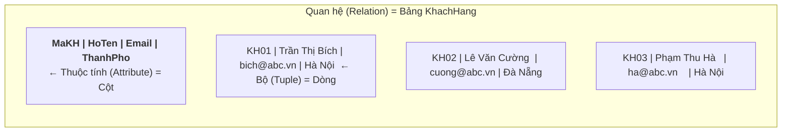
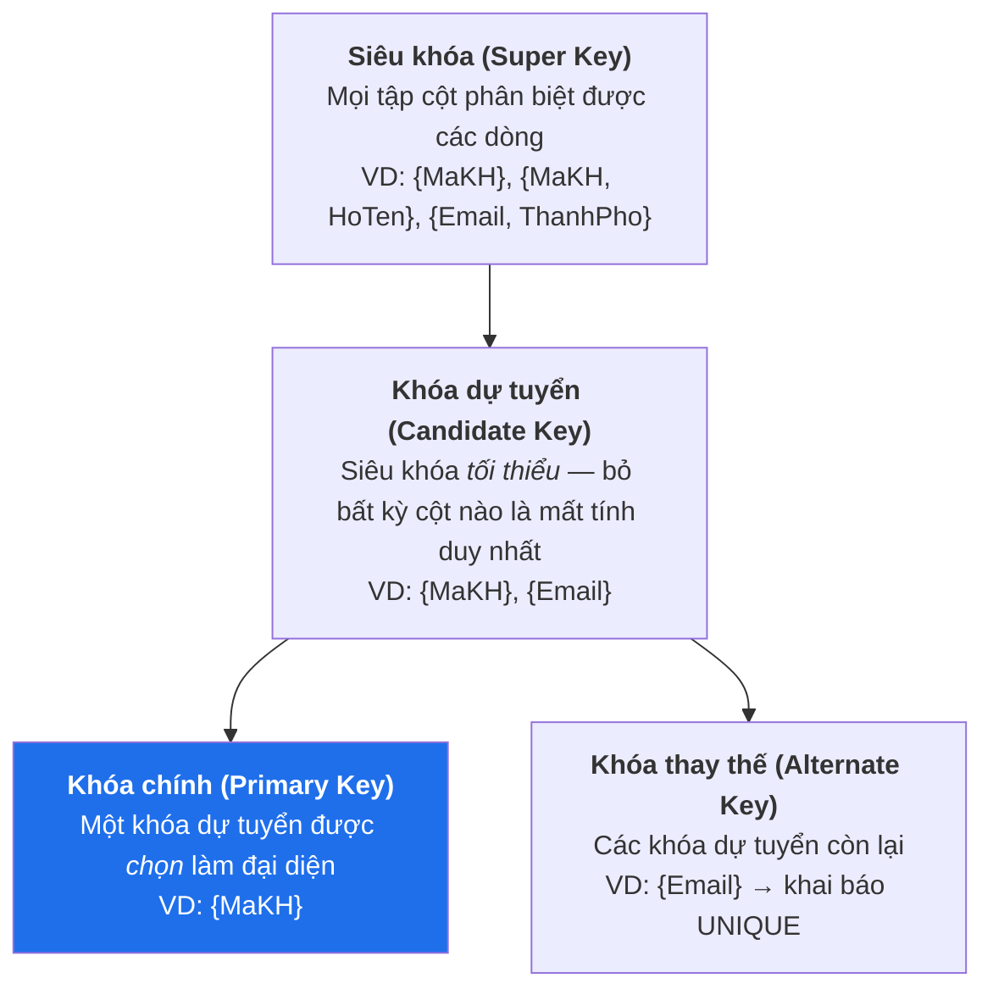
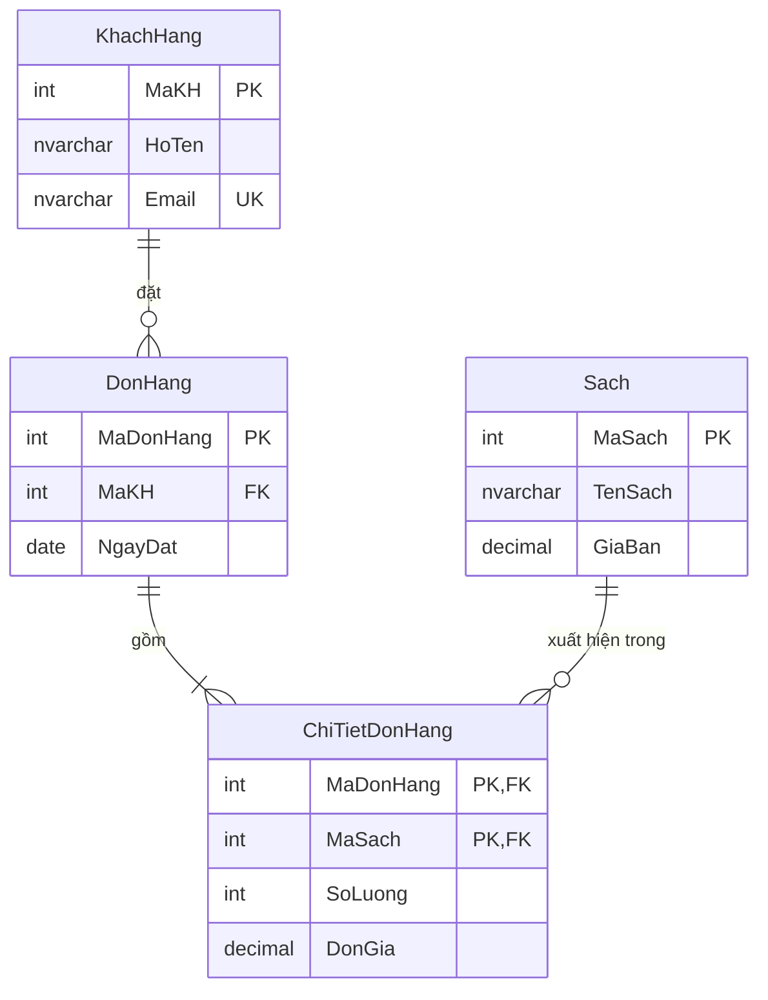
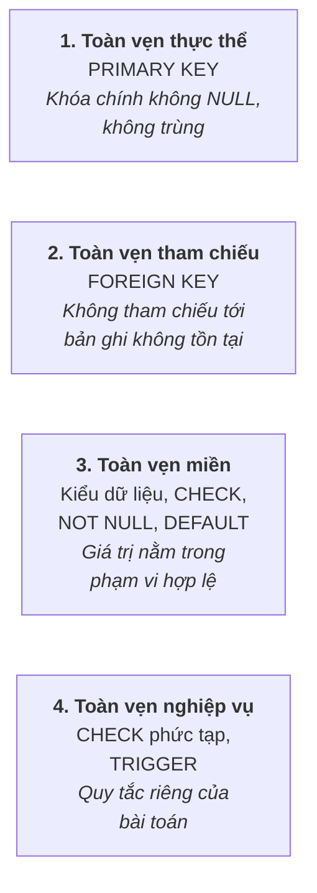
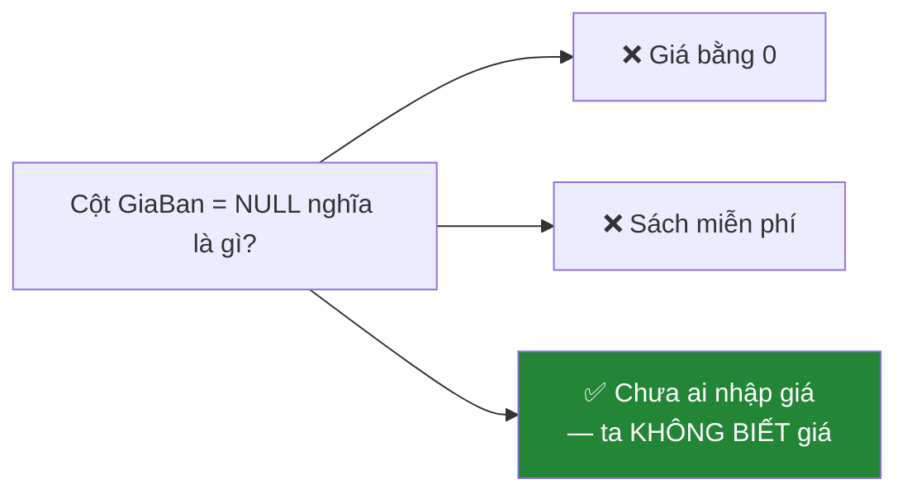

# Buổi 2 — Mô hình quan hệ

> **Mục tiêu sau buổi học**
> 1. Gọi đúng tên các thành phần: quan hệ, bộ, thuộc tính, miền giá trị.
> 2. Xác định được khóa chính / khóa ngoại cho một bảng bất kỳ.
> 3. Hiểu `NULL` là gì và vì sao nó nguy hiểm.
> 4. Tự tay tạo được ràng buộc và chứng minh nó chặn dữ liệu sai.

---

## 1. Vấn đề mở đầu

Buổi trước ta đã có bảng phẳng của anh Nam. Giờ tách ra thành nhiều bảng:

| DonHang | | | ChiTietDonHang | | |
|---|---|---|---|---|---|
| MaDonHang | MaKH | NgayDat | MaDonHang | MaSach | SoLuong |
| DH001 | KH01 | 2026-03-01 | DH001 | S01 | 2 |
| DH002 | KH02 | 2026-03-02 | DH001 | S02 | 1 |

**Câu hỏi:** Máy tính làm sao biết dòng `DH001 | S01 | 2` thuộc về đơn hàng nào?
Và làm sao ngăn ai đó chèn `DH999 | S01 | 2` khi đơn `DH999` không hề tồn tại?

Đáp án của cả buổi hôm nay gói trong hai chữ: **khóa chính** và **khóa ngoại**.

---

## 2. Từ vựng chuẩn của mô hình quan hệ

Edgar F. Codd đề xuất mô hình này năm 1970. Mỗi khái niệm có 2 tên: tên toán học
(hay gặp trong sách/đề thi) và tên thực hành (hay gặp khi đi làm).



| Tên toán học | Tên thực hành | Giải thích |
|--------------|---------------|------------|
| Quan hệ (Relation) | Bảng (Table) | Một tập hợp các bộ cùng cấu trúc |
| Bộ (Tuple) | Dòng / Bản ghi (Row / Record) | Một cá thể cụ thể: một khách hàng |
| Thuộc tính (Attribute) | Cột / Trường (Column / Field) | Một đặc tính: họ tên, email |
| Miền (Domain) | Kiểu dữ liệu (Data type) | Tập giá trị hợp lệ: `INT`, `NVARCHAR(100)` |
| Bậc (Degree) | Số cột | Bảng trên có bậc 4 |
| Lực lượng (Cardinality) | Số dòng | Bảng trên có lực lượng 3 |
| Lược đồ (Schema) | Cấu trúc bảng | `KhachHang(MaKH, HoTen, Email, ThanhPho)` |

> **Ba tính chất bắt buộc nhớ** (hay ra trong đề thi lý thuyết):
> 1. **Thứ tự dòng không có ý nghĩa** — không có "dòng đầu tiên". Muốn có thứ
>    tự thì phải `ORDER BY`.
> 2. **Thứ tự cột không có ý nghĩa** — luôn gọi cột bằng tên, đừng bao giờ viết
>    `SELECT *` rồi lấy "cột thứ 3" trong code ứng dụng.
> 3. **Không có hai dòng trùng nhau hoàn toàn** — đây chính là lý do tồn tại của
>    khóa chính.

---

## 3. Khóa — trái tim của mô hình quan hệ



### Quy tắc chọn khóa chính (dạy theo checklist, học viên rất dễ sai)

| Tiêu chí | Giải thích | Ví dụ vi phạm |
|----------|-----------|---------------|
| **Duy nhất** | Không hai dòng nào trùng | Chọn `HoTen` — có 2 người tên "Nguyễn Văn An" |
| **Không NULL** | Luôn phải có giá trị | Chọn `SoCCCD` — trẻ em chưa có |
| **Không đổi** | Giá trị theo bản ghi trọn đời | Chọn `Email` — khách đổi email là hỏng mọi tham chiếu |
| **Càng gọn càng tốt** | Ít cột, kiểu dữ liệu nhỏ | Khóa chính là `NVARCHAR(500)` |

> **Khóa tự nhiên vs khóa thay thế (surrogate key)**
> - *Khóa tự nhiên*: dữ liệu có sẵn ý nghĩa nghiệp vụ (số CCCD, ISBN sách).
> - *Khóa thay thế*: số tự tăng do hệ thống sinh, vô nghĩa với nghiệp vụ (`MaSach INT IDENTITY`).
>
> **Thực tế đi làm:** dùng khóa thay thế cho gần như mọi bảng, rồi đặt thêm
> `UNIQUE` lên khóa tự nhiên. Lý do: nghiệp vụ luôn thay đổi (ISBN có thể bị cấp
> trùng, mã nhân viên có thể đổi format), khóa thay thế thì không bao giờ đổi.

### Khóa ngoại (Foreign Key) — sợi dây nối các bảng



**Định nghĩa:** khóa ngoại là cột (hoặc nhóm cột) ở bảng *con*, mà giá trị của nó
**bắt buộc** phải tồn tại ở khóa chính của bảng *cha* (hoặc là `NULL`).

Đây gọi là **toàn vẹn tham chiếu** (referential integrity) — chính là thứ ngăn
được dòng `DH999` ma ở đầu buổi.

---

## 4. Bốn loại ràng buộc toàn vẹn



```sql
CREATE TABLE Sach (
    MaSach      INT IDENTITY(1,1) PRIMARY KEY,      -- (1) toàn vẹn thực thể
    ISBN        VARCHAR(20) UNIQUE,                 -- khóa thay thế
    TenSach     NVARCHAR(255) NOT NULL,             -- (3) toàn vẹn miền
    GiaBan      DECIMAL(12,2) NOT NULL
                CHECK (GiaBan > 0),                 -- (3) giá phải dương
    SoLuongTon  INT NOT NULL DEFAULT 0
                CHECK (SoLuongTon >= 0),            -- (4) không cho tồn kho âm
    NamXuatBan  INT CHECK (NamXuatBan BETWEEN 1400 AND 2100),
    MaDanhMuc   INT NOT NULL,
    CONSTRAINT FK_Sach_DanhMuc                      -- (2) toàn vẹn tham chiếu
        FOREIGN KEY (MaDanhMuc) REFERENCES DanhMuc(MaDanhMuc)
);
```

> **Mẹo đặt tên ràng buộc:** luôn đặt tên có nghĩa (`FK_Sach_DanhMuc`,
> `CK_Sach_GiaDuong`). Nếu không, SQL Server tự sinh tên kiểu
> `CK__Sach__GiaBan__5F7E2DAC` và khi lỗi xảy ra bạn sẽ không hiểu gì.

### Hành vi khi xóa/sửa bản ghi cha

```sql
FOREIGN KEY (MaDanhMuc) REFERENCES DanhMuc(MaDanhMuc)
    ON DELETE NO ACTION     -- mặc định: CHẶN, không cho xóa danh mục còn sách
    ON UPDATE CASCADE       -- sửa mã danh mục thì tự sửa lan sang bảng Sach
```

| Tùy chọn | Hành vi khi xóa bản ghi cha | Khi nào dùng |
|----------|----------------------------|--------------|
| `NO ACTION` (mặc định) | Báo lỗi, chặn thao tác | Mặc định an toàn — dùng cho hầu hết trường hợp |
| `CASCADE` | Xóa luôn tất cả bản ghi con | Chỉ khi con **không thể tồn tại độc lập**: xóa đơn hàng → xóa chi tiết đơn |
| `SET NULL` | Đặt khóa ngoại con thành `NULL` | Xóa nhân viên quản lý → nhân viên cấp dưới tạm không có sếp |
| `SET DEFAULT` | Đặt về giá trị mặc định | Xóa danh mục → sách chuyển về danh mục "Khác" |

> ⚠️ **Cảnh báo phải nói rõ trong lớp:** `ON DELETE CASCADE` rất tiện nhưng cực
> nguy hiểm. Xóa nhầm 1 khách hàng có thể kéo theo hàng nghìn đơn hàng biến mất
> lặng lẽ, không cảnh báo. Trong hệ thống thật, người ta thường **không xóa thật**
> mà dùng *xóa mềm*: thêm cột `DaXoa BIT DEFAULT 0`.

---

## 5. NULL — khái niệm gây nhiều lỗi nhất trong SQL

**`NULL` không phải là 0. Không phải chuỗi rỗng. `NULL` nghĩa là "không biết".**



Hệ quả — logic **ba trạng thái**: `TRUE`, `FALSE`, và `UNKNOWN`.

```sql
SELECT NULL = NULL;        -- KHÔNG phải TRUE, mà là UNKNOWN
SELECT 100 > NULL;         -- UNKNOWN
SELECT NULL + 50;          -- NULL (mọi phép tính với NULL đều ra NULL)
```

Vì thế **luôn dùng `IS NULL` / `IS NOT NULL`**, không bao giờ dùng `= NULL`:

```sql
-- ❌ SAI: luôn trả về 0 dòng, dù có bao nhiêu dòng NULL đi nữa
SELECT * FROM Sach WHERE GiaBan = NULL;

-- ✅ ĐÚNG
SELECT * FROM Sach WHERE GiaBan IS NULL;
```

Hàm xử lý `NULL` thường dùng:

```sql
SELECT
    TenSach,
    ISNULL(GiaBan, 0)                 AS GiaHienThi,   -- NULL → 0
    COALESCE(GiaKhuyenMai, GiaBan, 0) AS GiaCuoi       -- lấy giá trị non-NULL đầu tiên
FROM Sach;
```

> **Bẫy kinh điển sẽ gặp lại ở buổi 6:** `COUNT(*)` đếm mọi dòng, còn
> `COUNT(GiaBan)` **bỏ qua** các dòng có `GiaBan` là `NULL`. Hai con số này
> khác nhau và đó là nguồn gốc của vô số báo cáo sai.

---

## 6. THỰC HÀNH — 60 phút

### 6.1. Dựng một mini-schema và kiểm chứng từng ràng buộc

```sql
USE ThuNghiem;
GO

-- Dọn dẹp nếu chạy lại (xóa bảng con TRƯỚC bảng cha)
DROP TABLE IF EXISTS ChiTietDonHang;
DROP TABLE IF EXISTS DonHang;
DROP TABLE IF EXISTS KhachHang;
GO

CREATE TABLE KhachHang (
    MaKH     INT IDENTITY(1,1) PRIMARY KEY,
    HoTen    NVARCHAR(100) NOT NULL,
    Email    VARCHAR(150)  NOT NULL UNIQUE,
    NgaySinh DATE NULL,
    DiemTL   INT NOT NULL DEFAULT 0 CHECK (DiemTL >= 0)
);

CREATE TABLE DonHang (
    MaDonHang INT IDENTITY(1000,1) PRIMARY KEY,
    MaKH      INT NOT NULL,
    NgayDat   DATETIME2 NOT NULL DEFAULT SYSDATETIME(),
    TrangThai NVARCHAR(20) NOT NULL DEFAULT N'Moi'
              CHECK (TrangThai IN (N'Moi', N'DangGiao', N'HoanThanh', N'Huy')),
    CONSTRAINT FK_DonHang_KhachHang
        FOREIGN KEY (MaKH) REFERENCES KhachHang(MaKH)
);
GO

INSERT INTO KhachHang (HoTen, Email, NgaySinh) VALUES
    (N'Trần Thị Bích', 'bich@abc.vn',  '2000-05-12'),
    (N'Lê Văn Cường',  'cuong@abc.vn', NULL);   -- không biết ngày sinh → NULL

SELECT * FROM KhachHang;
```

### 6.2. Phá hoại có kiểm soát — chạy từng lệnh, đọc kỹ lỗi

Cho học viên **dự đoán trước** lệnh nào lỗi, rồi mới chạy:

```sql
-- (a) Trùng UNIQUE
INSERT INTO KhachHang (HoTen, Email) VALUES (N'Kẻ mạo danh', 'bich@abc.vn');
-- ❌ Msg 2627: Violation of UNIQUE KEY constraint

-- (b) Vi phạm CHECK
INSERT INTO KhachHang (HoTen, Email, DiemTL) VALUES (N'Test', 't@abc.vn', -100);
-- ❌ Msg 547: The INSERT statement conflicted with the CHECK constraint

-- (c) Vi phạm khóa ngoại — khách hàng 999 không tồn tại
INSERT INTO DonHang (MaKH) VALUES (999);
-- ❌ Msg 547: conflicted with the FOREIGN KEY constraint "FK_DonHang_KhachHang"

-- (d) Vi phạm CHECK trạng thái
INSERT INTO DonHang (MaKH, TrangThai) VALUES (1, N'LungTung');
-- ❌ Msg 547: CHECK constraint

-- (e) Hợp lệ ✅
INSERT INTO DonHang (MaKH) VALUES (1);
SELECT * FROM DonHang;
```

### 6.3. Chứng minh vì sao không được xóa bừa

```sql
-- Khách hàng 1 đang có đơn hàng. Thử xóa:
DELETE FROM KhachHang WHERE MaKH = 1;
-- ❌ Msg 547: The DELETE statement conflicted with the REFERENCE constraint
```

**Giải thích cho lớp:** nếu DBMS cho phép xóa, bảng `DonHang` sẽ còn một đơn trỏ
tới khách hàng không tồn tại — gọi là *bản ghi mồ côi* (orphan record). Toàn bộ
báo cáo doanh thu theo khách hàng sẽ sai từ đó về sau.

Cách xóa đúng — xóa con trước, cha sau:

```sql
DELETE FROM DonHang   WHERE MaKH  = 1;
DELETE FROM KhachHang WHERE MaKH = 1;
```

### 6.4. Thí nghiệm về NULL

```sql
INSERT INTO KhachHang (HoTen, Email, NgaySinh) VALUES (N'Phạm Thu Hà', 'ha@abc.vn', NULL);

SELECT COUNT(*)        AS TongSoDong    FROM KhachHang;  -- đếm tất cả
SELECT COUNT(NgaySinh) AS CoNgaySinh    FROM KhachHang;  -- bỏ qua NULL → số nhỏ hơn!

SELECT * FROM KhachHang WHERE NgaySinh = NULL;      -- 0 dòng — SAI
SELECT * FROM KhachHang WHERE NgaySinh IS NULL;     -- đúng kết quả

-- Bẫy nâng cao: NOT IN với NULL
SELECT * FROM KhachHang WHERE MaKH NOT IN (2, NULL);   -- 0 dòng! Vì sao?
```

*Giải thích câu cuối:* `MaKH NOT IN (2, NULL)` tương đương
`MaKH <> 2 AND MaKH <> NULL`. Vế sau luôn `UNKNOWN`, mà `TRUE AND UNKNOWN =
UNKNOWN` → không dòng nào thỏa. Đây là bug rất khó phát hiện trong hệ thống thật.

### 6.5. Đối chiếu với MongoDB — có ràng buộc không?

```javascript
use ThuNghiem

// Mặc định MongoDB KHÔNG kiểm tra gì cả — chèn gì cũng được
db.donhang.insertOne({ maKH: 999, tongTien: -500 })   // ✅ thành công (!)

// Muốn có ràng buộc thì phải khai báo JSON Schema Validator
db.createCollection("donhang_chuan", {
  validator: {
    $jsonSchema: {
      bsonType: "object",
      required: ["maKH", "tongTien", "trangThai"],
      properties: {
        maKH:      { bsonType: "int",    description: "bắt buộc, kiểu số nguyên" },
        tongTien:  { bsonType: "decimal", minimum: 0, description: "phải >= 0" },
        trangThai: { enum: ["Moi", "DangGiao", "HoanThanh", "Huy"] }
      }
    }
  },
  validationAction: "error"     // "warn" nếu chỉ muốn ghi log mà vẫn cho qua
})

db.donhang_chuan.insertOne({ maKH: 1, tongTien: NumberDecimal("100"), trangThai: "Sai" })
// ❌ Document failed validation
```

**Điểm mấu chốt cần chốt:**
- SQL Server: ràng buộc là **mặc định bật**, muốn lỏng phải cố ý nới ra.
- MongoDB: ràng buộc là **tùy chọn**, muốn chặt phải cố ý khai báo.
- Và MongoDB **không có khóa ngoại** — không có cách nào bắt nó tự kiểm tra
  `maKH: 999` có tồn tại hay không. Trách nhiệm đó chuyển sang code ứng dụng.
  Đây là đánh đổi quan trọng nhất khi chọn NoSQL (sẽ phân tích kỹ ở buổi 10).

---

## 7. Lỗi thường gặp

| Lỗi | Nguyên nhân | Cách sửa |
|-----|-------------|----------|
| `Cannot insert explicit value for identity column` | Cố chèn giá trị vào cột `IDENTITY` | Bỏ cột đó khỏi `INSERT`, để SQL Server tự sinh |
| Xóa bảng báo `could not drop object ... referenced by a FOREIGN KEY` | Đang xóa bảng cha khi bảng con còn tham chiếu | Xóa bảng con trước |
| `WHERE cot = NULL` không ra kết quả | Dùng `=` với `NULL` | Dùng `IS NULL` |
| Chọn `Email` làm khóa chính rồi khách đổi email | Khóa chính phải bất biến | Dùng `MaKH INT IDENTITY` + `UNIQUE(Email)` |
| `CHECK` không chặn được `NULL` | `CHECK (GiaBan > 0)` với `GiaBan = NULL` cho `UNKNOWN` → được chấp nhận | Thêm `NOT NULL` cho cột |

---

## 8. Bài tập về nhà

**Bài 1 (nhận biết).** Cho bảng `NhanVien(MaNV, SoCCCD, Email, HoTen, MaPhong)`.
Liệt kê: các siêu khóa (ít nhất 3), các khóa dự tuyển, khóa chính bạn chọn và
**giải thích lý do chọn**.

**Bài 2 (thông hiểu).** Giải thích trong 3–4 câu vì sao câu lệnh sau **luôn**
trả về 0 dòng dù bảng có dữ liệu:
```sql
SELECT * FROM Sach WHERE GiaBan <> NULL;
```

**Bài 3 (vận dụng).** Thiết kế và viết `CREATE TABLE` cho bài toán quản lý thư viện:
- `DocGia`: mã, họ tên (bắt buộc), email (duy nhất), ngày đăng ký (mặc định hôm nay)
- `Sach`: mã, tên (bắt buộc), số lượng tổng (≥ 0)
- `PhieuMuon`: mã, mã độc giả, mã sách, ngày mượn, ngày hẹn trả, ngày trả thực tế (cho phép NULL)

Yêu cầu: đủ khóa chính, khóa ngoại, ít nhất 2 `CHECK` có ý nghĩa nghiệp vụ
(gợi ý: ngày hẹn trả phải sau ngày mượn). Đặt tên đầy đủ cho mọi ràng buộc.

**Bài 4 (vận dụng cao).** Với schema ở bài 3, hãy viết **5 câu `INSERT` cố tình
sai**, mỗi câu vi phạm một loại ràng buộc khác nhau. Chụp lại thông báo lỗi và
ghi chú câu đó vi phạm ràng buộc nào.

**Bài 5 (mở rộng).** Trong bài toán thư viện, nếu một độc giả bị xóa khỏi hệ
thống, các phiếu mượn của họ nên xử lý thế nào? Phân tích 3 phương án
(`NO ACTION`, `CASCADE`, xóa mềm) và chọn một, giải thích.

---

➡️ [Buổi 3 — Thiết kế mô hình thực thể liên kết (ERD)](buoi-03-thiet-ke-erd.md)
