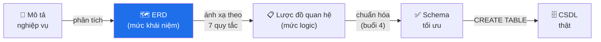
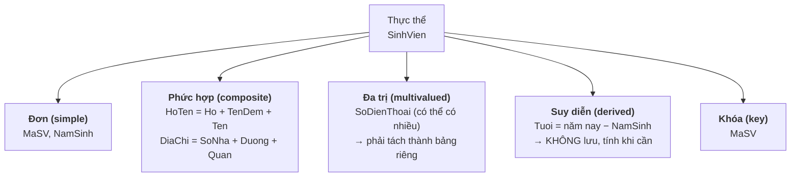
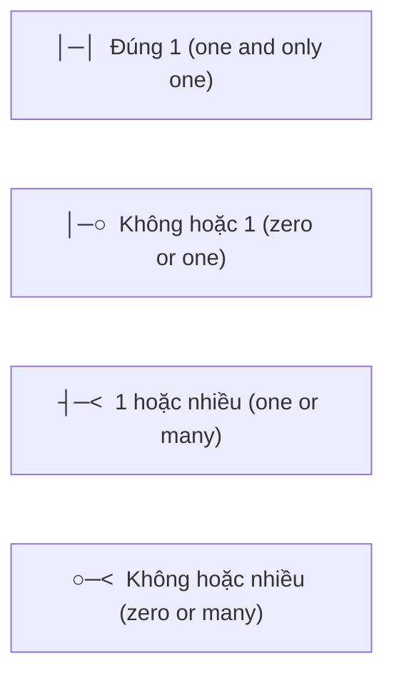
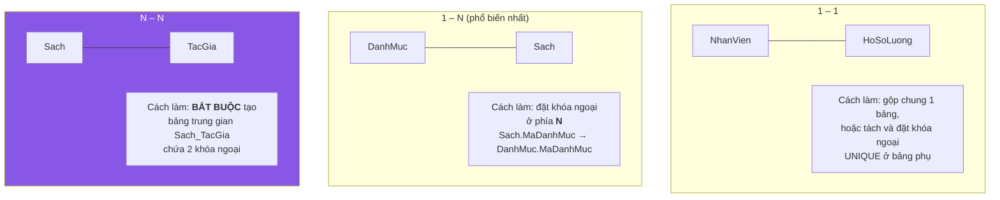
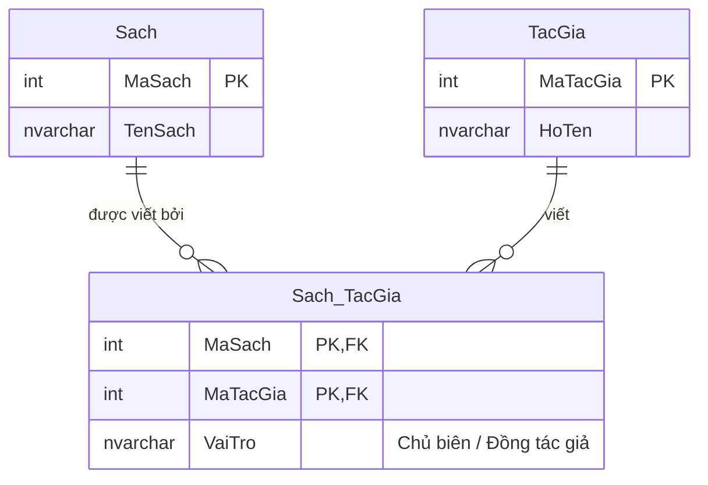
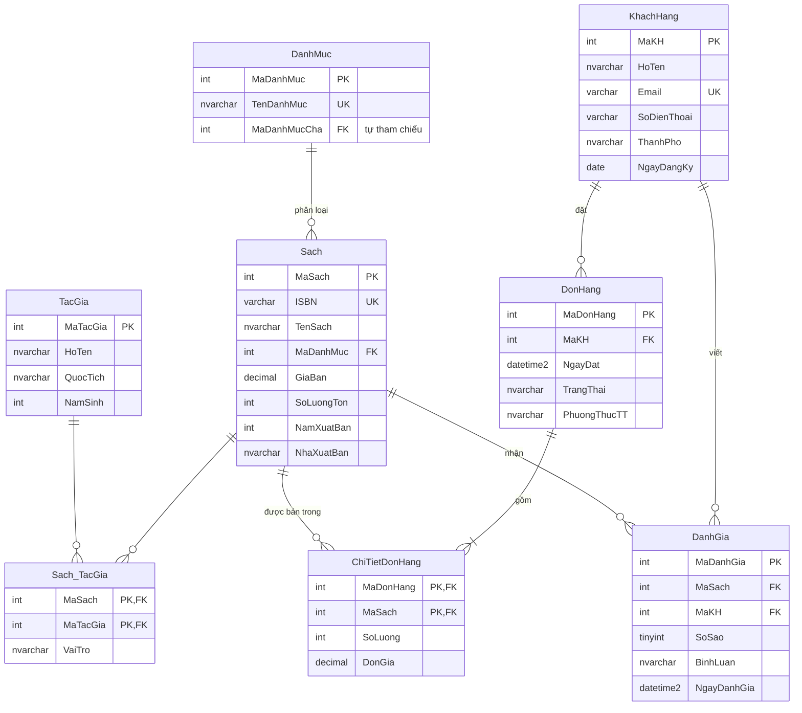

# Buổi 3 — Thiết kế mô hình thực thể – liên kết (ERD)

> **Mục tiêu sau buổi học**
> 1. Đọc được một sơ đồ ERD bất kỳ.
> 2. Từ một đoạn mô tả nghiệp vụ, rút ra được thực thể – thuộc tính – liên kết.
> 3. Xác định đúng bản số (1-1, 1-N, N-N) và xử lý được liên kết N-N.
> 4. Chuyển ERD thành các câu `CREATE TABLE` hoàn chỉnh.

---

## 1. Vấn đề mở đầu

Khách hàng đưa cho bạn một đoạn mô tả:

> *"Cửa hàng bán sách. Mỗi cuốn sách thuộc một danh mục và do một hoặc nhiều tác
> giả viết. Một tác giả có thể viết nhiều cuốn. Khách hàng đăng ký tài khoản rồi
> đặt hàng; mỗi đơn hàng có thể mua nhiều cuốn sách với số lượng khác nhau.
> Khách hàng có thể đánh giá sách bằng số sao và bình luận."*

**Nếu bắt tay gõ `CREATE TABLE` ngay bây giờ, bạn sẽ sai.** Cần một bước trung
gian: vẽ ra sơ đồ để cả bạn và khách hàng cùng nhìn và cùng đồng ý — đó là ERD.



---

## 2. Ba thành phần của ERD

### 2.1. Thực thể (Entity)

Là một **danh từ** trong nghiệp vụ mà ta cần lưu dữ liệu về nó.

> **Mẹo tìm thực thể:** gạch chân mọi danh từ trong mô tả, rồi hỏi từng cái:
> *"Ta có cần lưu nhiều thông tin về nó và có nhiều cá thể của nó không?"*
> - "sách" → có nhiều cuốn, cần lưu tên/giá/năm XB → ✅ thực thể
> - "cửa hàng" → chỉ có một, không cần lưu → ❌ không phải thực thể
> - "số sao" → chỉ là một con số mô tả đánh giá → ❌ đây là *thuộc tính*

### 2.2. Thuộc tính (Attribute)



> **Quy tắc vàng:** đừng lưu thuộc tính suy diễn. Lưu `NamSinh` chứ đừng lưu
> `Tuoi` — vì `Tuoi` sẽ sai ngay sau sinh nhật kế tiếp và bạn phải chạy job cập
> nhật cả triệu dòng mỗi đêm. Tương tự: lưu `SoLuong` và `DonGia`, đừng lưu
> `ThanhTien` (trừ khi có lý do hiệu năng rõ ràng).

### 2.3. Liên kết (Relationship) và bản số (Cardinality)

Ký hiệu chân chim (crow's foot) — chuẩn phổ biến nhất hiện nay:



Trong cú pháp Mermaid `erDiagram`:

| Ký hiệu | Đọc là | Ví dụ |
|---------|--------|-------|
| `\|\|--\|\|` | 1 và chỉ 1 — 1 và chỉ 1 | Người ↔ Hộ chiếu |
| `\|\|--o{` | 1 — không hoặc nhiều | Khách hàng — Đơn hàng (khách mới chưa có đơn) |
| `\|\|--\|{` | 1 — một hoặc nhiều | Đơn hàng — Chi tiết đơn (đơn phải có ≥1 dòng) |
| `}o--o{` | nhiều — nhiều | Sách ↔ Tác giả |

**Cách xác định bản số — luôn hỏi 2 chiều:**

> "Một **khách hàng** có thể có bao nhiêu **đơn hàng**?" → 0 hoặc nhiều
> "Một **đơn hàng** thuộc về bao nhiêu **khách hàng**?" → đúng 1
> ⟹ quan hệ **1 – N**

---

## 3. Ba loại liên kết và cách cài đặt



### Vì sao N–N bắt buộc phải có bảng trung gian?

Cho học viên thử tự làm không có bảng trung gian:

| MaSach | TenSach | MaTacGia |
|--------|---------|----------|
| S01 | Kinh tế học hài hước | TG01, TG02 ← **sai!** |

Lưu `"TG01, TG02"` vào một ô là vi phạm nguyên tắc **nguyên tố** (buổi 4 sẽ gọi
tên nó là vi phạm 1NF). Hậu quả: không `JOIN` được, không `WHERE MaTacGia =
'TG02'` được (phải dùng `LIKE '%TG02%'` — vừa chậm vừa sai khi có `TG020`).

Giải pháp đúng:



> **Điểm hay bị bỏ sót:** bảng trung gian thường **có thuộc tính riêng**.
> - `Sach_TacGia` cần thêm `VaiTro` (chủ biên hay đồng tác giả).
> - `ChiTietDonHang` cần `SoLuong` và `DonGia`.
>
> **Vì sao `ChiTietDonHang` phải lưu `DonGia` dù bảng `Sach` đã có `GiaBan`?**
> Vì giá sách thay đổi theo thời gian. Hóa đơn tháng 3 phải giữ nguyên giá tháng
> 3, không được đổi theo giá hôm nay. Đây gọi là *snapshot dữ liệu lịch sử* —
> một trong những chi tiết phân biệt người thiết kế có kinh nghiệm.

---

## 4. ERD hoàn chỉnh của BookStore

Đây là schema dùng xuyên suốt phần còn lại của khóa học. Hãy vẽ dần trên bảng
cùng học viên, đừng chiếu sẵn.



**Chú ý hai chi tiết tinh tế trong sơ đồ trên:**

1. `DanhMuc.MaDanhMucCha` là khóa ngoại **trỏ về chính bảng đó** — gọi là *liên
   kết đệ quy*, dùng để làm danh mục nhiều cấp (Sách → Văn học → Tiểu thuyết).
2. `DonHang ||--|{ ChiTietDonHang` dùng `|{` chứ không phải `o{`: một đơn hàng
   **bắt buộc** có ít nhất một dòng chi tiết. Đơn hàng rỗng là vô nghĩa.

---

## 5. Bảy quy tắc chuyển ERD → bảng

| # | Tình huống trong ERD | Cách chuyển thành bảng |
|---|---------------------|------------------------|
| 1 | Thực thể mạnh | Một bảng; thuộc tính khóa → `PRIMARY KEY` |
| 2 | Thuộc tính phức hợp | Tách thành nhiều cột (`HoTen` → `Ho`, `Ten`) |
| 3 | Thuộc tính đa trị | Tạo **bảng riêng** + khóa ngoại về thực thể gốc |
| 4 | Liên kết 1–N | Đặt khóa ngoại ở **phía nhiều** |
| 5 | Liên kết 1–1 | Đặt khóa ngoại ở phía tùy chọn, thêm `UNIQUE` |
| 6 | Liên kết N–N | Tạo bảng trung gian, khóa chính = cặp 2 khóa ngoại |
| 7 | Thực thể yếu | Khóa chính = khóa của thực thể chủ + khóa bộ phận |

### Ví dụ áp dụng quy tắc 3 — thuộc tính đa trị

Khách hàng có thể có nhiều số điện thoại:

```sql
-- ❌ SAI: nhồi vào một cột
-- KhachHang(MaKH, HoTen, SoDienThoai)  với giá trị '0901234567, 0912345678'

-- ✅ ĐÚNG: tách bảng
CREATE TABLE SoDienThoaiKH (
    MaKH        INT NOT NULL,
    SoDienThoai VARCHAR(15) NOT NULL,
    LoaiSo      NVARCHAR(20) NOT NULL DEFAULT N'Di động',
    CONSTRAINT PK_SoDienThoaiKH PRIMARY KEY (MaKH, SoDienThoai),
    CONSTRAINT FK_SDT_KhachHang FOREIGN KEY (MaKH)
        REFERENCES KhachHang(MaKH) ON DELETE CASCADE
);
```

---

## 6. THỰC HÀNH — 60 phút

### 6.1. Bài tập nhóm: phân tích mô tả (15 phút, làm trên giấy)

Chia lớp thành nhóm 3 người. Phát đoạn mô tả sau:

> *"Trung tâm ngoại ngữ ABC quản lý các khóa học. Mỗi khóa học có mã, tên, học
> phí và thuộc một cấp độ (A1, A2, B1...). Một khóa học được mở thành nhiều lớp
> ở các thời điểm khác nhau; mỗi lớp có ngày khai giảng, phòng học và do đúng
> một giáo viên phụ trách. Một giáo viên có thể dạy nhiều lớp. Học viên đăng ký
> vào các lớp; mỗi học viên có thể học nhiều lớp và mỗi lớp có nhiều học viên.
> Khi đăng ký cần lưu ngày đăng ký và số tiền đã đóng. Cuối khóa mỗi học viên
> trong lớp có một điểm tổng kết."*

**Yêu cầu nộp sau 15 phút:** danh sách thực thể, thuộc tính của mỗi thực thể,
các liên kết kèm bản số. *(Đáp án ở `dap-an/buoi-03-dap-an.md`.)*

Điểm cần lưu ý khi chữa:
- `KhoaHoc` và `Lop` là **hai thực thể khác nhau** — đây là chỗ đa số nhóm gộp nhầm.
- `DangKy` là liên kết N–N giữa `HocVien` và `Lop`, **có thuộc tính riêng**
  (`NgayDangKy`, `SoTienDaDong`, `DiemTongKet`).

### 6.2. Vẽ ERD bằng Mermaid

Cho học viên gõ trực tiếp vào <https://mermaid.live> để thấy sơ đồ hiện ra ngay:

```
erDiagram
    KhoaHoc ||--o{ Lop : "được mở thành"
    GiaoVien ||--o{ Lop : "phụ trách"
    Lop ||--o{ DangKy : ""
    HocVien ||--o{ DangKy : ""
```

### 6.3. Dùng SSMS sinh sơ đồ từ CSDL có sẵn

Đây là kỹ năng rất thực tế: khi vào công ty, bạn thường nhận một CSDL 80 bảng
không có tài liệu.

1. Trong SSMS, mở rộng CSDL `BookStore`.
2. Chuột phải **Database Diagrams** → **New Database Diagram**.
   *(Lần đầu SSMS hỏi cài đối tượng hỗ trợ → chọn Yes.)*
3. Chọn tất cả bảng → **Add**.
4. Chuột phải nền → **Arrange Tables**.

Cho học viên đối chiếu sơ đồ SSMS tự sinh với ERD ta vẽ tay ở mục 4.

> **Câu hỏi thảo luận:** sơ đồ do SSMS sinh ra **thiếu** thông tin gì so với ERD
> vẽ tay? → Thiếu ngữ nghĩa liên kết ("đặt", "phân loại"), thiếu bản số tối
> thiểu (không phân biệt được `o{` với `|{`), và không thể hiện được quy tắc
> nghiệp vụ. Công cụ chỉ đọc được cấu trúc, không đọc được ý định.

### 6.4. Viết CREATE TABLE cho trung tâm ngoại ngữ

Áp dụng 7 quy tắc, viết đầy đủ schema. Thứ tự tạo bảng phải theo chiều **cha
trước, con sau**:

```sql
USE ThuNghiem;
GO

CREATE TABLE GiaoVien (
    MaGV      INT IDENTITY(1,1) PRIMARY KEY,
    HoTen     NVARCHAR(100) NOT NULL,
    Email     VARCHAR(150) NOT NULL UNIQUE,
    ChuyenMon NVARCHAR(100)
);

CREATE TABLE KhoaHoc (
    MaKhoaHoc INT IDENTITY(1,1) PRIMARY KEY,
    TenKhoaHoc NVARCHAR(150) NOT NULL,
    CapDo      VARCHAR(5) NOT NULL CHECK (CapDo IN ('A1','A2','B1','B2','C1','C2')),
    HocPhi     DECIMAL(12,2) NOT NULL CHECK (HocPhi >= 0)
);

CREATE TABLE Lop (
    MaLop        INT IDENTITY(1,1) PRIMARY KEY,
    MaKhoaHoc    INT NOT NULL,
    MaGV         INT NOT NULL,
    NgayKhaiGiang DATE NOT NULL,
    PhongHoc     NVARCHAR(20),
    CONSTRAINT FK_Lop_KhoaHoc  FOREIGN KEY (MaKhoaHoc) REFERENCES KhoaHoc(MaKhoaHoc),
    CONSTRAINT FK_Lop_GiaoVien FOREIGN KEY (MaGV)      REFERENCES GiaoVien(MaGV)
);

CREATE TABLE HocVien (
    MaHV  INT IDENTITY(1,1) PRIMARY KEY,
    HoTen NVARCHAR(100) NOT NULL,
    Email VARCHAR(150) NOT NULL UNIQUE,
    NgaySinh DATE
);

-- Bảng trung gian N–N, có thuộc tính riêng
CREATE TABLE DangKy (
    MaHV         INT NOT NULL,
    MaLop        INT NOT NULL,
    NgayDangKy   DATE NOT NULL DEFAULT CAST(SYSDATETIME() AS DATE),
    SoTienDaDong DECIMAL(12,2) NOT NULL DEFAULT 0 CHECK (SoTienDaDong >= 0),
    DiemTongKet  DECIMAL(4,2) NULL CHECK (DiemTongKet BETWEEN 0 AND 10),
    CONSTRAINT PK_DangKy PRIMARY KEY (MaHV, MaLop),   -- 1 học viên không đăng ký 2 lần cùng lớp
    CONSTRAINT FK_DangKy_HocVien FOREIGN KEY (MaHV)  REFERENCES HocVien(MaHV),
    CONSTRAINT FK_DangKy_Lop     FOREIGN KEY (MaLop) REFERENCES Lop(MaLop)
);
GO
```

> **Chỉ ra cho học viên:** `DiemTongKet` để `NULL` là **cố ý** — lúc mới đăng ký
> chưa có điểm. Đây là ứng dụng đúng đắn của `NULL` đã học ở buổi 2:
> "chưa biết", không phải "bằng 0".

### 6.5. Nạp schema BookStore chính thức

```sql
-- Mở và chạy file này trong SSMS
-- thuc-hanh/00-schema-bookstore.sql
-- thuc-hanh/01-seed-bookstore.sql
```

Sau đó kiểm tra bằng cách xem toàn bộ khóa ngoại đã tạo:

```sql
USE BookStore;
SELECT
    fk.name                AS TenRangBuoc,
    OBJECT_NAME(fk.parent_object_id)     AS BangCon,
    OBJECT_NAME(fk.referenced_object_id) AS BangCha
FROM sys.foreign_keys AS fk
ORDER BY BangCon;
```

---

## 7. Lỗi thường gặp khi thiết kế

| Lỗi thiết kế | Biểu hiện | Cách sửa |
|--------------|-----------|----------|
| Nhồi nhiều giá trị vào một cột | `SoDienThoai = '090..., 091...'` | Tách bảng riêng (quy tắc 3) |
| Bỏ qua bảng trung gian ở N–N | Bảng `Sach` có cột `MaTacGia` duy nhất | Tạo `Sach_TacGia` |
| Lưu thuộc tính suy diễn | Có cột `Tuoi`, `ThanhTien`, `TongTienDonHang` | Tính khi truy vấn, hoặc dùng cột tính toán |
| Thiếu snapshot lịch sử | `ChiTietDonHang` không có `DonGia` | Thêm cột, copy giá tại thời điểm đặt |
| Đặt tên tùy tiện | `tbl1`, `col_a`, lẫn lộn tiếng Anh–Việt | Thống nhất quy ước ngay từ đầu |
| Thực thể "một cá thể" | Tạo bảng `CuaHang` chỉ có 1 dòng | Đưa vào bảng cấu hình chung |

**Quy ước đặt tên đề nghị dùng cho cả khóa:**
- Tên bảng: danh từ **số ít**, PascalCase — `KhachHang`, `ChiTietDonHang`
- Khóa chính: `Ma<TenBang>` — `MaKhachHang`, hoặc viết tắt nhất quán `MaKH`
- Khóa ngoại: **trùng tên** với khóa chính bảng cha
- Ràng buộc: `PK_`, `FK_<Con>_<Cha>`, `UQ_`, `CK_`, `IX_`

---

## 8. Bài tập về nhà

**Bài 1 (thông hiểu).** Với mỗi cặp dưới đây, xác định bản số và giải thích bằng
hai câu hỏi hai chiều:
- a) `SinhVien` – `LopHanhChinh`
- b) `SinhVien` – `MonHoc` (qua việc học)
- c) `NguoiDung` – `TaiKhoanNganHang`
- d) `NhanVien` – `NhanVien` (quan hệ quản lý cấp trên)

**Bài 2 (vận dụng).** Vẽ ERD (bằng Mermaid) cho hệ thống **quản lý phòng khám**:

> *Phòng khám có nhiều bác sĩ, mỗi bác sĩ thuộc một chuyên khoa. Bệnh nhân đến
> khám và được lập một phiếu khám, ghi rõ bác sĩ khám, ngày giờ, triệu chứng và
> chẩn đoán. Sau khi khám, bác sĩ kê đơn thuốc — mỗi đơn gồm nhiều loại thuốc
> với liều lượng và số ngày uống khác nhau. Mỗi loại thuốc có tên, đơn vị tính
> và giá.*

**Bài 3 (vận dụng cao).** Chuyển ERD ở bài 2 thành các câu `CREATE TABLE` đầy
đủ. Yêu cầu: đúng thứ tự tạo bảng, đặt tên mọi ràng buộc, có ít nhất 3 `CHECK`
mang ý nghĩa nghiệp vụ.

**Bài 4 (phản biện).** Một bạn thiết kế bảng đơn thuốc như sau:
```
DonThuoc(MaDon, MaBenhNhan, NgayKe, DanhSachThuoc)
-- DanhSachThuoc = N'Paracetamol 500mg x 2 viên/ngày x 5 ngày; Vitamin C x 1 viên/ngày x 7 ngày'
```
Hãy chỉ ra ít nhất **4 vấn đề** cụ thể sẽ gặp phải với thiết kế này, mỗi vấn đề
kèm một câu hỏi nghiệp vụ mà CSDL sẽ không trả lời được.

---

➡️ [Buổi 4 — Phụ thuộc hàm và Chuẩn hóa](buoi-04-chuan-hoa.md)
