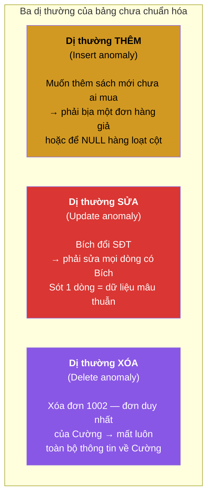
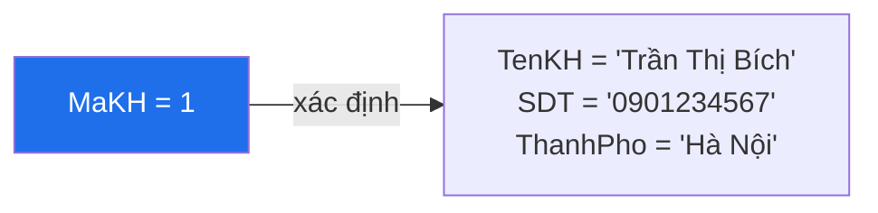
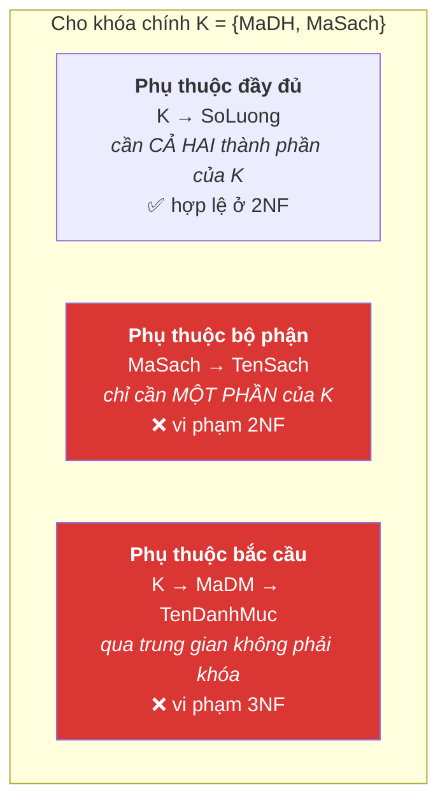
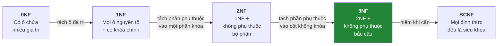
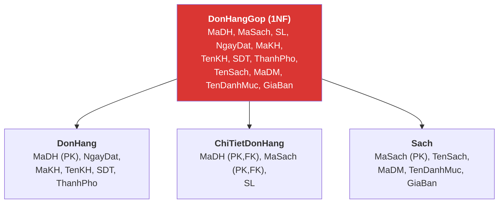
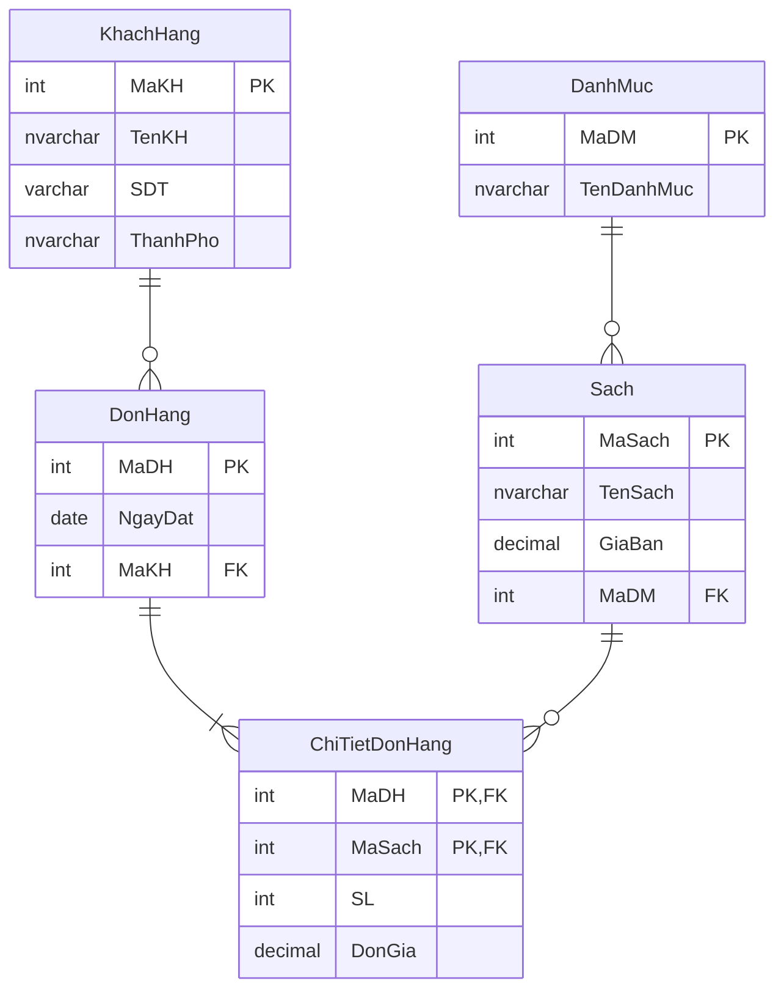

# Buổi 4 — Phụ thuộc hàm và Chuẩn hóa

> **Mục tiêu sau buổi học**
> 1. Đọc và viết được ký hiệu phụ thuộc hàm `X → Y`.
> 2. Nhận diện 3 loại dị thường (thêm, sửa, xóa) trong một bảng cụ thể.
> 3. Chuẩn hóa được một bảng từ 0NF lên 3NF, giải thích từng bước.
> 4. Biết khi nào **cố tình phi chuẩn hóa** và chấp nhận cái giá của nó.

---

## 1. Vấn đề mở đầu — bảng "tất cả trong một"

Một sinh viên nộp thiết kế sau và nói: *"Em gộp hết vào một bảng cho tiện, đỡ phải JOIN."*

**Bảng `DonHangGop`:**

| MaDH | NgayDat | MaKH | TenKH | SDT | ThanhPho | MaSach | TenSach | MaDM | TenDanhMuc | GiaBan | SL |
|------|---------|------|-------|-----|----------|--------|---------|------|-----------|--------|-----|
| 1000 | 05/01 | 1 | Trần Thị Bích | 0901234567 | Hà Nội | 1 | Nhà giả kim | 6 | Tiểu thuyết | 79000 | 2 |
| 1000 | 05/01 | 1 | Trần Thị Bích | 0901234567 | Hà Nội | 2 | Đắc nhân tâm | 8 | Kỹ năng sống | 88000 | 1 |
| 1002 | 18/02 | 2 | Lê Văn Cường | 0912345678 | Đà Nẵng | 1 | Nhà giả kim | 6 | Tiểu thuyết | 79000 | 1 |

Hãy để lớp tự tìm ra **ba loại dị thường**:



> **Câu trả lời cho sinh viên đó:** JOIN là việc SQL Server làm rất giỏi và rất
> nhanh (có index). Còn dữ liệu mâu thuẫn thì **không công cụ nào cứu được**.
> Chuẩn hóa là đánh đổi một chút tốc độ đọc để lấy sự đúng đắn — và trong 95%
> trường hợp đó là đánh đổi có lời.

---

## 2. Phụ thuộc hàm — công cụ để nói chính xác

**Định nghĩa:** `X → Y` (đọc: *X xác định hàm Y*) nghĩa là: nếu hai dòng có cùng
giá trị `X` thì **bắt buộc** phải có cùng giá trị `Y`.



Viết: `MaKH → TenKH, SDT, ThanhPho`

**Cách kiểm tra nhanh trong lớp:** hỏi *"Biết X rồi thì có suy ra được duy nhất
một Y không?"*

| Phụ thuộc hàm | Đúng/Sai | Lý do |
|---------------|----------|-------|
| `MaSach → TenSach` | ✅ | Một mã sách chỉ ứng với một tên |
| `TenSach → MaSach` | ❌ | "Nhà giả kim" có 2 mã (bản thường & bản bìa cứng) |
| `MaDH, MaSach → SoLuong` | ✅ | Trong một đơn, một cuốn có một số lượng |
| `MaDH → MaSach` | ❌ | Một đơn có nhiều sách |
| `MaSach → MaDM → TenDanhMuc` | ✅ (bắc cầu!) | Đây chính là thủ phạm phá 3NF |

### Ba loại phụ thuộc cần phân biệt



---

## 3. Thang chuẩn hóa



> **Câu hỏi học viên luôn hỏi: "Phải lên tới dạng chuẩn nào?"**
> Đáp: **3NF là đích thực tế.** Đạt 3NF là đã loại bỏ được gần như toàn bộ dị
> thường. BCNF/4NF/5NF chỉ đụng tới trong tình huống đặc biệt và thường xuất
> hiện trong đề thi nhiều hơn trong dự án thật.

---

## 4. Chuẩn hóa từng bước — làm chậm, làm kỹ trên bảng đầu buổi

### Bước 0 → 1NF: mọi ô phải nguyên tố

**Bảng gốc (0NF)** — giả sử ban đầu tệ hơn nữa, gộp cả danh sách sách vào một ô:

| MaDH | TenKH | DanhSachSach |
|------|-------|--------------|
| 1000 | Trần Thị Bích | Nhà giả kim (x2), Đắc nhân tâm (x1) |

**Vi phạm 1NF:** ô `DanhSachSach` chứa nhiều giá trị.

**Câu hỏi để lớp thấy vấn đề:** *"Viết câu SQL đếm xem cuốn 'Nhà giả kim' đã bán
được bao nhiêu cuốn."* → không thể viết được một cách đúng đắn.

**Sửa:** tách mỗi giá trị thành một dòng riêng → ta được bảng `DonHangGop` ở mục 1.
Bảng đó **đã đạt 1NF** với khóa chính `{MaDH, MaSach}`.

### Bước 1NF → 2NF: loại phụ thuộc bộ phận

Khóa chính là `{MaDH, MaSach}`. Xét từng cột không khóa:

| Cột | Phụ thuộc vào | Loại |
|-----|---------------|------|
| `SL` | `{MaDH, MaSach}` | đầy đủ ✅ |
| `NgayDat`, `MaKH`, `TenKH`, `SDT`, `ThanhPho` | chỉ `MaDH` | **bộ phận ❌** |
| `TenSach`, `MaDM`, `TenDanhMuc`, `GiaBan` | chỉ `MaSach` | **bộ phận ❌** |

**Sửa:** mỗi nhóm phụ thuộc bộ phận tách thành một bảng riêng.



Ba bảng này **đã đạt 2NF**. Nhưng chưa xong.

### Bước 2NF → 3NF: loại phụ thuộc bắc cầu

Xét bảng `Sach`: khóa chính `MaSach`.
- `MaSach → MaDM` ✅
- `MaDM → TenDanhMuc` ← **`MaDM` không phải khóa!**
- Suy ra `MaSach → TenDanhMuc` là **bắc cầu ❌**

*Hậu quả cụ thể:* đổi tên danh mục "Tiểu thuyết" thành "Tiểu thuyết & Truyện dài"
→ phải sửa mọi dòng sách thuộc danh mục đó.

Tương tự với bảng `DonHang`: `MaDH → MaKH → TenKH, SDT, ThanhPho` cũng bắc cầu.

**Sửa:** tách phần bắc cầu ra bảng riêng, giữ lại khóa ngoại.



🎉 **Đây chính là schema BookStore ta đã dùng ở buổi 3.** Hãy chỉ rõ cho học viên:
thiết kế ERD tốt thì tự nhiên đã gần đạt 3NF; chuẩn hóa là công cụ để *kiểm chứng*
và *sửa* thiết kế, không phải quy trình tách rời.

> **Chú ý cột `DonGia` trong `ChiTietDonHang`:** thoạt nhìn nó "trùng" với
> `Sach.GiaBan` và có vẻ vi phạm chuẩn hóa. **Không phải.** `GiaBan` là giá
> *hiện tại*, `DonGia` là giá *tại thời điểm đặt hàng*. Hai dữ kiện khác nhau,
> không có phụ thuộc hàm nào giữa chúng.

---

## 5. Câu thần chú và BCNF

> **"The key, the whole key, and nothing but the key — so help me Codd."**
>
> Mọi cột không khóa phải phụ thuộc vào:
> - **khóa** (*the key*) → 1NF
> - **toàn bộ khóa** (*the whole key*) → 2NF
> - **và chỉ khóa mà thôi** (*nothing but the key*) → 3NF

### BCNF — khi nào 3NF vẫn chưa đủ

Ví dụ kinh điển: `LichDay(MaHV, MonHoc, GiaoVien)`
- Mỗi giáo viên chỉ dạy **một** môn: `GiaoVien → MonHoc`
- Mỗi học viên với mỗi môn học **một** giáo viên: `{MaHV, MonHoc} → GiaoVien`

Khóa dự tuyển: `{MaHV, MonHoc}` và `{MaHV, GiaoVien}`. Mọi cột đều là thành phần
khóa nên **đạt 3NF**. Nhưng `GiaoVien → MonHoc` mà `GiaoVien` **không phải siêu
khóa** → **vi phạm BCNF**.

*Hậu quả thực tế:* không thể ghi nhận "thầy Minh dạy môn Toán" nếu chưa có học
viên nào đăng ký — lại là dị thường thêm.

**Sửa:** tách thành `GiaoVienMon(GiaoVien PK, MonHoc)` và `HocVienGV(MaHV, GiaoVien)`.

---

## 6. Phi chuẩn hóa — khi cố ý làm ngược lại

Chuẩn hóa không phải tôn giáo. Đôi khi ta **cố tình** vi phạm để đổi lấy tốc độ:

| Kỹ thuật | Ví dụ | Đánh đổi |
|----------|-------|----------|
| Lưu giá trị tổng hợp | Thêm `DonHang.TongTien` thay vì `SUM` mỗi lần | Đọc nhanh; phải cập nhật khi chi tiết đổi |
| Nhân bản cột | Thêm `ChiTietDonHang.TenSach` để khỏi JOIN | Đọc nhanh; tốn dung lượng, dễ lệch |
| Lưu số đếm | Thêm `Sach.SoLuotDanhGia`, `Sach.DiemTrungBinh` | Trang sản phẩm tải nhanh; phải đồng bộ |
| Bảng báo cáo riêng | Bảng `DoanhThuThang` tính sẵn hằng đêm | Báo cáo tức thì; dữ liệu trễ 1 ngày |

**Nguyên tắc bắt buộc dạy kèm:** phi chuẩn hóa chỉ được làm khi
1. đã **đo** được truy vấn đang chậm thật (buổi 8 sẽ học `EXPLAIN`/execution plan),
2. đã thử tối ưu bằng index mà vẫn không đủ, và
3. có cơ chế rõ ràng giữ dữ liệu nhân bản đồng bộ (trigger, job, hoặc cột tính toán).

SQL Server có cách phi chuẩn hóa **an toàn** — cột tính toán:

```sql
ALTER TABLE ChiTietDonHang
ADD ThanhTien AS (SoLuong * DonGia * (1 - GiamGia)) PERSISTED;
-- PERSISTED = lưu thật xuống đĩa, có thể đánh index
-- nhưng SQL Server TỰ tính lại, không bao giờ lệch
```

---

## 7. THỰC HÀNH — 60 phút

### 7.1. Tự tay chứng kiến dị thường

```sql
USE ThuNghiem;
GO

DROP TABLE IF EXISTS DonHangGop;
CREATE TABLE DonHangGop (
    MaDH INT, NgayDat DATE,
    MaKH INT, TenKH NVARCHAR(100), SDT VARCHAR(15), ThanhPho NVARCHAR(50),
    MaSach INT, TenSach NVARCHAR(200), MaDM INT, TenDanhMuc NVARCHAR(50),
    GiaBan DECIMAL(12,2), SL INT
);

INSERT INTO DonHangGop VALUES
 (1000,'2025-01-05',1,N'Trần Thị Bích','0901234567',N'Hà Nội',
       1,N'Nhà giả kim',6,N'Tiểu thuyết',79000,2),
 (1000,'2025-01-05',1,N'Trần Thị Bích','0901234567',N'Hà Nội',
       2,N'Đắc nhân tâm',8,N'Kỹ năng sống',88000,1),
 (1002,'2025-02-18',2,N'Lê Văn Cường','0912345678',N'Đà Nẵng',
       1,N'Nhà giả kim',6,N'Tiểu thuyết',79000,1);
```

**Thí nghiệm A — dị thường SỬA.** Bích đổi số điện thoại, nhưng nhân viên chỉ sửa 1 dòng:

```sql
UPDATE TOP (1) DonHangGop SET SDT = '0999888777' WHERE MaKH = 1;

SELECT DISTINCT MaKH, TenKH, SDT FROM DonHangGop WHERE MaKH = 1;
-- Kết quả: MỘT khách hàng, HAI số điện thoại. Số nào đúng? Không ai biết.
```

**Thí nghiệm B — dị thường XÓA.** Hủy đơn 1002:

```sql
DELETE FROM DonHangGop WHERE MaDH = 1002;
SELECT DISTINCT MaKH, TenKH FROM DonHangGop;
-- Lê Văn Cường đã biến mất khỏi hệ thống. Ta mất luôn một khách hàng thật.
```

**Thí nghiệm C — dị thường THÊM.** Nhập sách mới về kho, chưa ai mua:

```sql
INSERT INTO DonHangGop (MaSach, TenSach, MaDM, TenDanhMuc, GiaBan)
VALUES (99, N'Sách mới toanh', 3, N'Khoa học', 150000);

SELECT * FROM DonHangGop;
-- Một dòng NULL đầy rẫy. Mọi báo cáo COUNT/SUM từ giờ đều lệch.
```

### 7.2. Bài tập chuẩn hóa tại lớp (làm nhóm, 20 phút)

Cho bảng quản lý dự án chưa chuẩn hóa:

```
DuAn(MaNV, HoTenNV, MaPhong, TenPhong, TruongPhong,
     MaDA, TenDA, DiaDiemDA, SoGioLam)
```

Các phụ thuộc hàm đã biết:
```
MaNV   → HoTenNV, MaPhong
MaPhong → TenPhong, TruongPhong
MaDA   → TenDA, DiaDiemDA
MaNV, MaDA → SoGioLam
```

**Yêu cầu:**
1. Xác định khóa chính. *(Gợi ý: cần cả hai cột nào?)*
2. Bảng này đang ở dạng chuẩn nào? Chỉ rõ **một** phụ thuộc vi phạm.
3. Đưa về 2NF, ghi rõ các bảng thu được.
4. Đưa về 3NF, ghi rõ các bảng thu được.
5. Viết `CREATE TABLE` cho kết quả 3NF, đầy đủ khóa ngoại.

*(Đáp án chi tiết ở `dap-an/buoi-04-dap-an.md`.)*

### 7.3. Đối chiếu với MongoDB — nơi phi chuẩn hóa là mặc định

```javascript
use BookStoreDemo

// Trong MongoDB, người ta thường NHÚNG (embed) thông tin thay vì tách bảng
db.donhang.insertOne({
  maDH: 1000,
  ngayDat: ISODate("2025-01-05"),
  khachHang: {                       // ← nhúng, chấp nhận trùng lặp
    maKH: 1,
    hoTen: "Trần Thị Bích",
    sdt: "0901234567",
    thanhPho: "Hà Nội"
  },
  chiTiet: [                         // ← nhúng mảng, không cần bảng riêng
    { maSach: 1, tenSach: "Nhà giả kim",  donGia: 79000, soLuong: 2 },
    { maSach: 2, tenSach: "Đắc nhân tâm", donGia: 88000, soLuong: 1 }
  ],
  tongTien: 246000                   // ← lưu sẵn giá trị suy diễn
})

// Lấy toàn bộ đơn hàng chỉ bằng MỘT lần đọc đĩa, không JOIN
db.donhang.findOne({ maDH: 1000 })
```

**Thảo luận (10 phút) — đây là câu hỏi trung tâm của cả khóa học:**

| | SQL Server (chuẩn hóa) | MongoDB (nhúng) |
|---|---|---|
| Đọc 1 đơn hàng đầy đủ | 3 lần JOIN | 1 lần đọc |
| Bích đổi SĐT | `UPDATE` 1 dòng, xong | Phải cập nhật **mọi đơn hàng** của Bích |
| Đếm doanh thu theo danh mục | Truy vấn thẳng | Phải duyệt mảng lồng, phức tạp hơn |
| Đảm bảo không có đơn ma | DBMS tự lo | Code ứng dụng phải tự lo |

**Kết luận cần chốt:** MongoDB *không phải* "không cần chuẩn hóa". Nó chỉ dịch
chuyển quyết định chuẩn hóa từ DBMS sang **lập trình viên**. Muốn thiết kế
document tốt, bạn vẫn phải hiểu phụ thuộc hàm — thậm chí hiểu kỹ hơn, vì không
có ai chặn lỗi giúp bạn. Buổi 9 sẽ có quy tắc chọn nhúng hay tham chiếu.

---

## 8. Lỗi thường gặp

| Lỗi | Biểu hiện | Cách sửa |
|-----|-----------|----------|
| Chuẩn hóa quá đà | Tách bảng chỉ có 2 cột `(Ma, Ten)` cho mọi thứ, truy vấn nào cũng 8 JOIN | Dừng ở 3NF; cột enum ít giá trị dùng `CHECK` thay vì bảng tra cứu |
| Nhầm "trùng dữ liệu" với "vi phạm chuẩn hóa" | Bỏ `ChiTietDonHang.DonGia` vì "đã có ở bảng Sach" | Kiểm tra có phụ thuộc hàm thật không |
| Chỉ nhìn dữ liệu mẫu để suy phụ thuộc hàm | Thấy 3 dòng không trùng tên → kết luận `TenSach → MaSach` | Phụ thuộc hàm đến từ **nghiệp vụ**, không từ dữ liệu hiện có |
| Phi chuẩn hóa "cho nhanh" từ đầu | Chưa đo đã tối ưu | Chuẩn hóa trước, đo, rồi mới tính |
| Quên khóa ngoại sau khi tách bảng | Tách xong nhưng không nối lại | Mỗi lần tách phải tạo khóa ngoại tương ứng |

---

## 9. Bài tập về nhà

**Bài 1 (nhận biết).** Với bảng `SinhVien(MaSV, HoTen, MaLop, TenLop, MaKhoa, TenKhoa)`,
liệt kê tất cả phụ thuộc hàm bạn nhận ra và chỉ ra phụ thuộc bắc cầu.

**Bài 2 (thông hiểu).** Giải thích bằng ví dụ cụ thể (có số liệu) tại sao bảng
sau vi phạm 2NF:
```
KetQua(MaSV, MaMon, HoTenSV, TenMon, SoTinChi, Diem)
```

**Bài 3 (vận dụng).** Chuẩn hóa bảng hóa đơn nhà thuốc sau về 3NF, trình bày
**từng bước** 0NF → 1NF → 2NF → 3NF:

| SoHD | NgayBan | TenKH | SDT | DanhSachThuoc | TongTien |
|------|---------|-------|-----|---------------|----------|
| HD01 | 01/03 | Nguyễn Văn A | 0901... | Paracetamol(20v, 500đ/v), Vitamin C(10v, 1000đ/v) | 20000 |

**Bài 4 (vận dụng cao).** Cho `R(A, B, C, D, E)` với tập phụ thuộc hàm
`F = { A → BC, CD → E, B → D, E → A }`.
- a) Tìm tất cả khóa dự tuyển của R.
- b) R đang ở dạng chuẩn cao nhất nào? Giải thích.
- c) Nếu chưa đạt BCNF, hãy tách R về BCNF.

**Bài 5 (thực tế).** Mở CSDL `BookStore` và trả lời: bảng `Sach` có cột
`NhaXuatBan` lưu tên NXB dạng chuỗi. Điều này có vi phạm 3NF không? Trong tình
huống nào bạn nên tách ra bảng `NhaXuatBan` riêng, tình huống nào thì không cần?
Viết câu trả lời khoảng nửa trang.

---

➡️ [Buổi 5 — SQL cơ bản: DDL, DML và SELECT](buoi-05-sql-co-ban.md)
