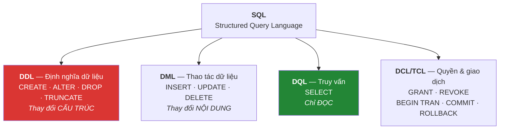
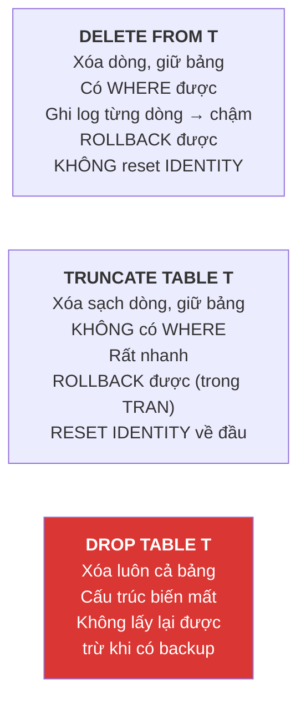
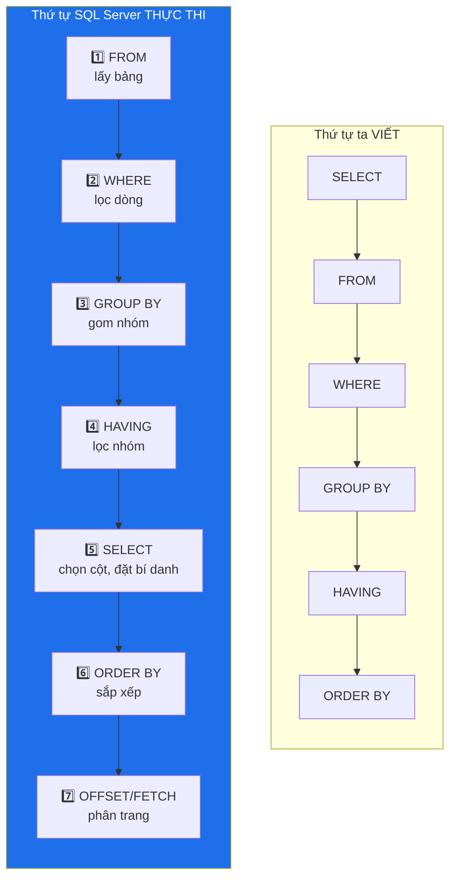

# Buổi 5 — SQL cơ bản: DDL, DML và SELECT

> **Mục tiêu sau buổi học**
> 1. Phân biệt được 4 nhóm lệnh SQL và biết lệnh nào nguy hiểm.
> 2. Tạo/sửa/xóa bảng, thêm/sửa/xóa dữ liệu một cách an toàn.
> 3. Viết được câu `SELECT` có lọc, sắp xếp, giới hạn số dòng.
> 4. Dùng thành thạo `WHERE` với `AND/OR/NOT`, `IN`, `BETWEEN`, `LIKE`, `IS NULL`.

---

## 1. Bản đồ ngôn ngữ SQL



> ⚠️ **Quy tắc sinh tồn — dán lên tường lớp học:**
> `DROP`, `TRUNCATE`, `DELETE` không `WHERE`, `UPDATE` không `WHERE` là
> **4 lệnh hủy diệt**. Trước khi chạy bất kỳ lệnh nào trong số đó trên hệ thống
> thật: (1) chắc chắn đang ở đúng CSDL, (2) chạy `SELECT` với cùng điều kiện
> `WHERE` trước để xem sẽ ảnh hưởng bao nhiêu dòng, (3) có bản sao lưu.

---

## 2. DDL — định nghĩa cấu trúc

### CREATE TABLE và các kiểu dữ liệu hay dùng

| Nhóm | Kiểu | Dùng khi | Lưu ý |
|------|------|----------|-------|
| Số nguyên | `TINYINT` (0–255), `SMALLINT`, `INT`, `BIGINT` | Mã, số lượng, tuổi | Chọn kiểu nhỏ nhất đủ dùng |
| Số thực chính xác | `DECIMAL(p, s)` | **Tiền tệ** | `DECIMAL(12,2)` = 10 chữ số phần nguyên, 2 phần thập phân |
| Số thực xấp xỉ | `FLOAT`, `REAL` | Số đo khoa học | ❌ **Không dùng cho tiền** — sai số làm tổng lệch |
| Chuỗi | `VARCHAR(n)` | Chuỗi **không dấu**: email, mã, ISBN | 1 byte/ký tự |
| Chuỗi Unicode | `NVARCHAR(n)` | Chuỗi **có dấu tiếng Việt** | 2 byte/ký tự, luôn dùng với tiền tố `N'...'` |
| Chuỗi dài | `NVARCHAR(MAX)` | Bài viết, mô tả dài | Lưu ngoài dòng dữ liệu, chậm hơn |
| Ngày giờ | `DATE`, `TIME`, `DATETIME2(n)` | Ngày sinh, thời điểm | Dùng `DATETIME2` thay `DATETIME` cũ |
| Logic | `BIT` | Cờ đúng/sai | Giá trị `1`/`0`, không phải `TRUE`/`FALSE` |
| Định danh | `UNIQUEIDENTIFIER` | GUID cho hệ phân tán | Tốn 16 byte, index kém hơn `INT` |

```sql
USE BookStore;
GO

CREATE TABLE NhaXuatBan (
    MaNXB     INT IDENTITY(1,1) PRIMARY KEY,
    TenNXB    NVARCHAR(150) NOT NULL UNIQUE,
    DiaChi    NVARCHAR(255) NULL,
    NamThanhLap SMALLINT NULL,
    ConHoatDong BIT NOT NULL DEFAULT 1
);
```

### ALTER TABLE — sửa cấu trúc bảng đã có

```sql
-- Thêm cột (cột mới phải cho phép NULL hoặc có DEFAULT)
ALTER TABLE Sach ADD MoTaNgan NVARCHAR(500) NULL;

-- Thêm cột NOT NULL: bắt buộc phải có DEFAULT
ALTER TABLE Sach ADD LuotXem INT NOT NULL DEFAULT 0;

-- Đổi kiểu dữ liệu / tính NULL
ALTER TABLE Sach ALTER COLUMN NhaXuatBan NVARCHAR(200) NULL;

-- Thêm ràng buộc
ALTER TABLE Sach ADD CONSTRAINT CK_Sach_SoTrang CHECK (SoTrang > 0);

-- Xóa ràng buộc rồi xóa cột
ALTER TABLE Sach DROP CONSTRAINT CK_Sach_SoTrang;
ALTER TABLE Sach DROP COLUMN MoTaNgan;

-- Đổi tên cột (thủ tục hệ thống, không phải lệnh ALTER)
EXEC sp_rename 'Sach.LuotXem', 'SoLuotXem', 'COLUMN';
```

### DROP vs TRUNCATE vs DELETE — bảng so sánh phải thuộc



> `TRUNCATE` **không chạy được** nếu bảng đang được tham chiếu bởi khóa ngoại —
> đây là một tính năng an toàn, không phải lỗi.

---

## 3. DML — thao tác dữ liệu

### INSERT

```sql
-- Dạng 1: chỉ định cột (LUÔN dùng dạng này trong code thật)
INSERT INTO TacGia (HoTen, QuocTich, NamSinh)
VALUES (N'Haruki Murakami', N'Nhật Bản', 1949);

-- Dạng 2: nhiều dòng một lệnh — nhanh hơn nhiều lệnh riêng lẻ
INSERT INTO TacGia (HoTen, QuocTich, NamSinh) VALUES
    (N'Higashino Keigo', N'Nhật Bản', 1958),
    (N'Marc Levy',       N'Pháp',     1961),
    (N'Nguyễn Phong Việt', N'Việt Nam', 1980);

-- Dạng 3: chèn từ kết quả truy vấn khác
INSERT INTO NhaXuatBan (TenNXB)
SELECT DISTINCT NhaXuatBan
FROM Sach
WHERE NhaXuatBan IS NOT NULL;

-- Lấy về mã vừa sinh ra
INSERT INTO TacGia (HoTen, QuocTich)
OUTPUT INSERTED.MaTacGia, INSERTED.HoTen
VALUES (N'Nguyễn Ngọc Thuần', N'Việt Nam');
```

> ❌ **Đừng bao giờ viết `INSERT INTO TacGia VALUES (...)`** (không liệt kê cột).
> Chỉ cần ai đó thêm một cột vào bảng là toàn bộ code của bạn hỏng.

### UPDATE — luôn kèm WHERE

```sql
-- QUY TRÌNH AN TOÀN 3 BƯỚC

-- Bước 1: SELECT để xem sẽ ảnh hưởng dòng nào
SELECT MaSach, TenSach, GiaBan FROM Sach WHERE MaDanhMuc = 5;

-- Bước 2: UPDATE với đúng điều kiện đó
UPDATE Sach
SET GiaBan = GiaBan * 0.9        -- giảm 10% cho sách CNTT
WHERE MaDanhMuc = 5;

-- Bước 3: kiểm tra lại
SELECT MaSach, TenSach, GiaBan FROM Sach WHERE MaDanhMuc = 5;
```

```sql
-- Cập nhật nhiều cột cùng lúc
UPDATE KhachHang
SET ThanhPho = N'Hà Nội',
    DiaChi   = N'99 Cầu Giấy',
    DiemTichLuy = DiemTichLuy + 50
WHERE MaKH = 11;
```

### DELETE

```sql
-- Luôn SELECT trước
SELECT * FROM DanhGia WHERE SoSao = 1 AND BinhLuan IS NULL;

DELETE FROM DanhGia
WHERE SoSao = 1 AND BinhLuan IS NULL;

-- Xem đã xóa bao nhiêu dòng
SELECT @@ROWCOUNT AS SoDongDaXoa;
```

> 💡 **Mẹo phòng thân trong SSMS:** vào Tools → Options → Query Execution →
> SQL Server → ANSI, bật **SET IMPLICIT_TRANSACTIONS**. Khi đó mọi thay đổi đều
> cần `COMMIT` thủ công, lỡ tay vẫn `ROLLBACK` được. Buổi 8 sẽ học kỹ.

---

## 4. SELECT — trái tim của SQL

### Thứ tự viết và thứ tự thực thi (rất quan trọng!)



**Hệ quả trực tiếp phải giải thích ngay** — vì `SELECT` chạy **sau** `WHERE`:

```sql
-- ❌ LỖI: bí danh GiaSauThue chưa tồn tại lúc WHERE chạy
SELECT TenSach, GiaBan * 1.1 AS GiaSauThue
FROM Sach
WHERE GiaSauThue > 100000;
-- Msg 207: Invalid column name 'GiaSauThue'

-- ✅ ĐÚNG: lặp lại biểu thức
SELECT TenSach, GiaBan * 1.1 AS GiaSauThue
FROM Sach
WHERE GiaBan * 1.1 > 100000;

-- ✅ Nhưng ORDER BY thì DÙNG ĐƯỢC bí danh, vì nó chạy SAU SELECT
SELECT TenSach, GiaBan * 1.1 AS GiaSauThue
FROM Sach
ORDER BY GiaSauThue DESC;
```

### SELECT cơ bản

```sql
USE BookStore;

-- Chọn cột cụ thể + đặt bí danh tiếng Việt
SELECT
    TenSach     AS [Tên sách],
    GiaBan      AS [Giá bán],
    SoLuongTon  AS [Tồn kho],
    GiaBan * SoLuongTon AS [Giá trị tồn]
FROM Sach;

-- Loại trùng lặp
SELECT DISTINCT NhaXuatBan FROM Sach WHERE NhaXuatBan IS NOT NULL;

-- Lấy N dòng đầu
SELECT TOP 5 TenSach, GiaBan FROM Sach ORDER BY GiaBan DESC;
```

> ⚠️ `SELECT *` chỉ dùng khi khám phá dữ liệu thủ công. Trong code ứng dụng
> **luôn liệt kê cột**: tránh kéo về dữ liệu thừa, tránh vỡ code khi bảng thay
> đổi, và cho phép SQL Server dùng *covering index* (buổi 8).

### WHERE — bộ lọc

```sql
-- So sánh
SELECT TenSach, GiaBan FROM Sach WHERE GiaBan > 100000;
SELECT TenSach FROM Sach WHERE NamXuatBan <> 2020;

-- Kết hợp logic: AND chạy trước OR — LUÔN dùng ngoặc cho rõ ràng
SELECT TenSach, GiaBan, MaDanhMuc
FROM Sach
WHERE (MaDanhMuc = 5 OR MaDanhMuc = 3)
  AND GiaBan < 200000;

-- IN: gọn hơn chuỗi OR
SELECT TenSach FROM Sach WHERE MaDanhMuc IN (3, 5, 6);

-- BETWEEN: bao gồm cả hai đầu mút
SELECT TenSach, GiaBan FROM Sach WHERE GiaBan BETWEEN 50000 AND 100000;

-- LIKE: tìm theo mẫu
SELECT TenSach FROM Sach WHERE TenSach LIKE N'%giả kim%';   -- chứa
SELECT HoTen   FROM KhachHang WHERE HoTen LIKE N'Nguyễn%';  -- bắt đầu bằng
SELECT Email   FROM KhachHang WHERE Email LIKE '%@email.vn';-- kết thúc bằng
SELECT ISBN    FROM Sach WHERE ISBN LIKE '978-604-1-0000_-_';  -- _ = đúng 1 ký tự

-- NULL
SELECT HoTen FROM KhachHang WHERE SoDienThoai IS NULL;
SELECT TenSach FROM Sach WHERE ISBN IS NOT NULL;
```

**Ký tự đại diện của `LIKE`:**

| Ký tự | Nghĩa | Ví dụ |
|-------|-------|-------|
| `%` | 0 hoặc nhiều ký tự bất kỳ | `'A%'` → An, Anh, Automation |
| `_` | Đúng 1 ký tự bất kỳ | `'_ũ'` → Vũ, Lũ |
| `[abc]` | Một ký tự thuộc tập | `'[HL]oàng'` → Hoàng, Loàng |
| `[^abc]` | Một ký tự **không** thuộc tập | `'[^N]guyễn'` |

> ⚠️ `LIKE N'%abc%'` (có `%` ở đầu) **không dùng được index** → quét toàn bảng.
> Với dữ liệu lớn, hãy dùng Full-Text Search. Sẽ nhắc lại ở buổi 8.

### ORDER BY và phân trang

```sql
-- Sắp xếp nhiều cấp
SELECT TenSach, MaDanhMuc, GiaBan
FROM Sach
ORDER BY MaDanhMuc ASC, GiaBan DESC;

-- NULL xếp ở đâu? SQL Server đặt NULL LÊN ĐẦU khi ASC
SELECT TenSach, ISBN FROM Sach ORDER BY ISBN;         -- NULL trước
-- Muốn đẩy NULL xuống cuối:
SELECT TenSach, ISBN FROM Sach
ORDER BY CASE WHEN ISBN IS NULL THEN 1 ELSE 0 END, ISBN;

-- Phân trang chuẩn (bắt buộc có ORDER BY)
SELECT TenSach, GiaBan
FROM Sach
ORDER BY MaSach
OFFSET 10 ROWS FETCH NEXT 5 ROWS ONLY;   -- trang 3, mỗi trang 5 dòng
```

### Hàm xử lý thường dùng

```sql
SELECT
    UPPER(HoTen)                       AS HoTenHoa,
    LEN(HoTen)                         AS SoKyTu,
    LEFT(HoTen, 3)                     AS BaKyTuDau,
    TRIM(HoTen)                        AS DaCatKhoangTrang,
    REPLACE(Email, '@email.vn', '')    AS TenDangNhap,
    CONCAT(HoTen, N' - ', ThanhPho)    AS MoTa
FROM KhachHang;

SELECT
    GETDATE()                          AS BayGio,
    YEAR(NgayDat)                      AS Nam,
    MONTH(NgayDat)                     AS Thang,
    DATEDIFF(DAY, NgayDat, GETDATE())  AS SoNgayTruoc,
    DATEADD(DAY, 7, NgayDat)           AS HanGiaoDuKien,
    FORMAT(NgayDat, 'dd/MM/yyyy')      AS NgayVN
FROM DonHang;

SELECT
    ROUND(GiaBan / 1000.0, 1)          AS GiaNghinDong,
    CEILING(GiaBan / 1000.0)           AS LamTronLen,
    ABS(-15)                           AS TriTuyetDoi
FROM Sach;
```

### CASE — rẽ nhánh trong truy vấn

```sql
SELECT
    TenSach,
    GiaBan,
    CASE
        WHEN GiaBan < 60000  THEN N'Rẻ'
        WHEN GiaBan < 150000 THEN N'Trung bình'
        WHEN GiaBan < 300000 THEN N'Cao'
        ELSE N'Rất cao'
    END AS PhanKhucGia,
    CASE WHEN SoLuongTon = 0 THEN N'Hết hàng' ELSE N'Còn hàng' END AS TinhTrang
FROM Sach
ORDER BY GiaBan;
```

---

## 5. THỰC HÀNH — 70 phút

Toàn bộ bài dưới đây chạy trên CSDL `BookStore`. Đề bài đầy đủ ở
`thuc-hanh/bai-tap-buoi-05.sql`, đáp án ở `dap-an/`.

### Nhóm A — Làm quen (làm cùng nhau trên máy chiếu)

```sql
USE BookStore;

-- A1. Xem toàn bộ sách
SELECT * FROM Sach;

-- A2. Chỉ tên và giá, sắp xếp giá giảm dần
SELECT TenSach, GiaBan FROM Sach ORDER BY GiaBan DESC;

-- A3. 3 cuốn đắt nhất
SELECT TOP 3 TenSach, GiaBan FROM Sach ORDER BY GiaBan DESC;

-- A4. Sách đang hết hàng
SELECT TenSach, SoLuongTon FROM Sach WHERE SoLuongTon = 0;

-- A5. Sách chưa có ISBN
SELECT TenSach FROM Sach WHERE ISBN IS NULL;
```

### Nhóm B — Học viên tự làm (25 phút)

1. Liệt kê tên và giá các sách có giá từ 80.000 đến 200.000, sắp xếp theo giá tăng dần.
2. Tìm tất cả khách hàng ở Hà Nội hoặc TP.HCM, hiển thị họ tên và email.
3. Tìm sách có tên chứa chữ "sử" (không phân biệt hoa thường).
4. Liệt kê khách hàng chưa có số điện thoại.
5. Hiển thị tên sách kèm cột `GiaTriTonKho = GiaBan × SoLuongTon`, chỉ lấy những
   sách có giá trị tồn kho trên 10 triệu.
6. Liệt kê các đơn hàng đặt trong năm 2025 có trạng thái `HoanThanh`.
7. Hiển thị tên sách và một cột `TinhTrangKho` phân loại:
   `SoLuongTon = 0` → "Hết hàng", `< 30` → "Sắp hết", ngược lại → "Đủ hàng".
8. Lấy 5 sách ở trang thứ 2 khi sắp xếp theo tên (gợi ý: `OFFSET`/`FETCH`).

### Nhóm C — DML an toàn (20 phút)

```sql
-- C1. Thêm một tác giả mới, in ra mã vừa sinh
INSERT INTO TacGia (HoTen, QuocTich, NamSinh)
OUTPUT INSERTED.MaTacGia AS MaVuaTao
VALUES (N'Nguyễn Nhật Ánh (bút danh khác)', N'Việt Nam', 1955);

-- C2. Thêm một cuốn sách mới cho danh mục Khoa học
INSERT INTO Sach (ISBN, TenSach, MaDanhMuc, GiaBan, SoLuongTon, NamXuatBan, NhaXuatBan)
VALUES ('978-604-1-00099-9', N'Vũ trụ trong vỏ hạt dẻ', 3, 175000, 40, 2022, N'NXB Trẻ');

-- C3. Tăng giá 5% cho toàn bộ sách CNTT — làm đủ 3 bước!
SELECT MaSach, TenSach, GiaBan FROM Sach WHERE MaDanhMuc = 5;   -- xem trước
UPDATE Sach SET GiaBan = ROUND(GiaBan * 1.05, 0) WHERE MaDanhMuc = 5;
SELECT MaSach, TenSach, GiaBan FROM Sach WHERE MaDanhMuc = 5;   -- kiểm tra

-- C4. Nhập thêm 50 cuốn cho những sách đang hết hàng
UPDATE Sach SET SoLuongTon = SoLuongTon + 50 WHERE SoLuongTon = 0;

-- C5. Xóa cuốn sách vừa thêm ở C2
DELETE FROM Sach WHERE ISBN = '978-604-1-00099-9';
```

### Nhóm D — Thí nghiệm "suýt chết" (làm chung, có kiểm soát)

```sql
-- Tạo bảng nháp để phá cho an toàn
SELECT * INTO Sach_Nhap FROM Sach;
SELECT COUNT(*) FROM Sach_Nhap;      -- 20 dòng

-- Mô phỏng tai nạn kinh điển: quên WHERE
UPDATE Sach_Nhap SET GiaBan = 0;
SELECT TenSach, GiaBan FROM Sach_Nhap;   -- toàn bộ về 0 😱

-- Bài học: cách phòng tránh bằng transaction
DROP TABLE Sach_Nhap;
SELECT * INTO Sach_Nhap FROM Sach;

BEGIN TRANSACTION;
    UPDATE Sach_Nhap SET GiaBan = 0;
    SELECT COUNT(*) AS SoDongBiAnhHuong FROM Sach_Nhap WHERE GiaBan = 0;
    -- Ơ, 20 dòng?! Không đúng ý định!
ROLLBACK TRANSACTION;    -- 🎉 cứu được

SELECT TenSach, GiaBan FROM Sach_Nhap;   -- giá vẫn nguyên vẹn
DROP TABLE Sach_Nhap;
```

---

## 6. Lỗi thường gặp

| Thông báo lỗi | Nguyên nhân | Cách sửa |
|---------------|-------------|----------|
| `Invalid column name 'X'` | Gõ sai tên cột, hoặc dùng bí danh trong `WHERE` | Kiểm tra chính tả; lặp lại biểu thức thay vì dùng bí danh |
| `Conversion failed when converting the varchar value ... to data type int` | So sánh chuỗi với số | Ép kiểu bằng `CAST`/`TRY_CAST` |
| `String or binary data would be truncated` | Chuỗi dài hơn kích thước cột | Tăng `NVARCHAR(n)` hoặc cắt bớt dữ liệu |
| `Cannot insert the value NULL into column` | Thiếu cột `NOT NULL` trong `INSERT` | Bổ sung giá trị hoặc đặt `DEFAULT` |
| Tiếng Việt thành `?????` | Quên tiền tố `N` | `N'Nhà giả kim'` |
| `The multi-part identifier could not be bound` | Dùng bí danh bảng chưa khai báo | Kiểm tra phần `FROM` |
| Kết quả `ORDER BY` không như mong đợi | Cột đang là kiểu chuỗi (`'10' < '9'`) | Ép về số: `ORDER BY CAST(col AS INT)` |
| `UPDATE` sửa nhầm toàn bảng | Quên `WHERE` | Dùng `BEGIN TRAN` + kiểm tra + `COMMIT` |

---

## 7. Bài tập về nhà

**Bài 1.** Viết câu lệnh tạo bảng `PhieuNhapKho(MaPhieu, MaSach, SoLuongNhap,
GiaNhap, NgayNhap, NhaCungCap)` với đầy đủ khóa chính, khóa ngoại về `Sach`,
và ít nhất 2 `CHECK`.

**Bài 2.** Viết 10 câu `SELECT` trên `BookStore`, mỗi câu dùng ít nhất một trong:
`DISTINCT`, `TOP`, `BETWEEN`, `IN`, `LIKE`, `IS NULL`, `CASE`, `ORDER BY` nhiều
cột, `OFFSET/FETCH`, hàm chuỗi. Ghi rõ câu hỏi nghiệp vụ mà mỗi truy vấn trả lời.

**Bài 3.** Cửa hàng làm chương trình khuyến mãi: giảm 15% cho mọi sách xuất bản
trước năm 2018 và còn tồn trên 50 cuốn. Viết `UPDATE` theo đúng **quy trình 3 bước**,
nộp cả 3 câu lệnh và ảnh chụp kết quả.

**Bài 4.** Giải thích tại sao câu sau chạy sai và sửa lại:
```sql
SELECT TenSach, GiaBan * SoLuongTon AS TongGiaTri
FROM Sach
WHERE TongGiaTri > 5000000
ORDER BY TongGiaTri DESC;
```

**Bài 5 (nâng cao).** Tìm những khách hàng có email không hợp lệ theo quy tắc:
phải có đúng một dấu `@`, phải có ít nhất một dấu `.` sau `@`. Gợi ý: kết hợp
`LIKE`, `CHARINDEX`, `LEN`, `REPLACE`.

---

➡️ [Buổi 6 — JOIN và Gom nhóm dữ liệu](buoi-06-join-va-gom-nhom.md)
