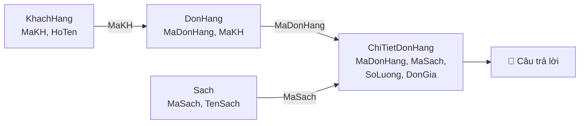
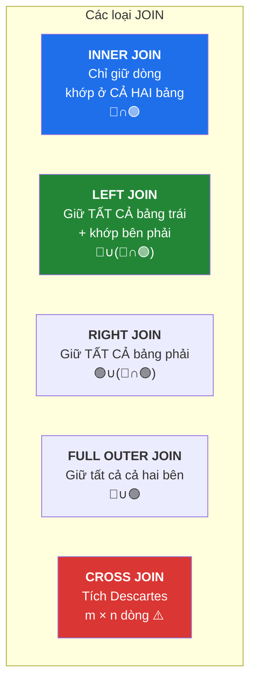
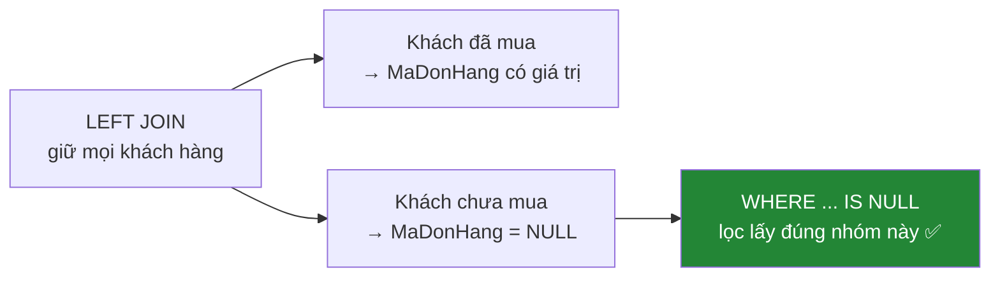
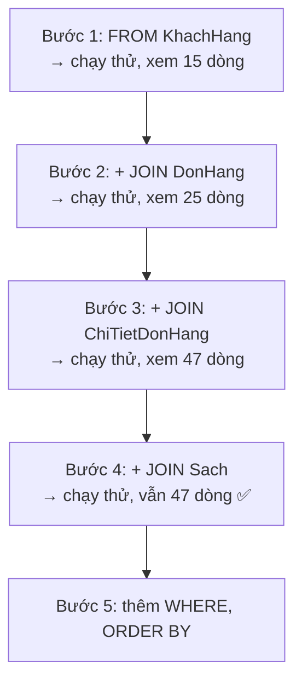
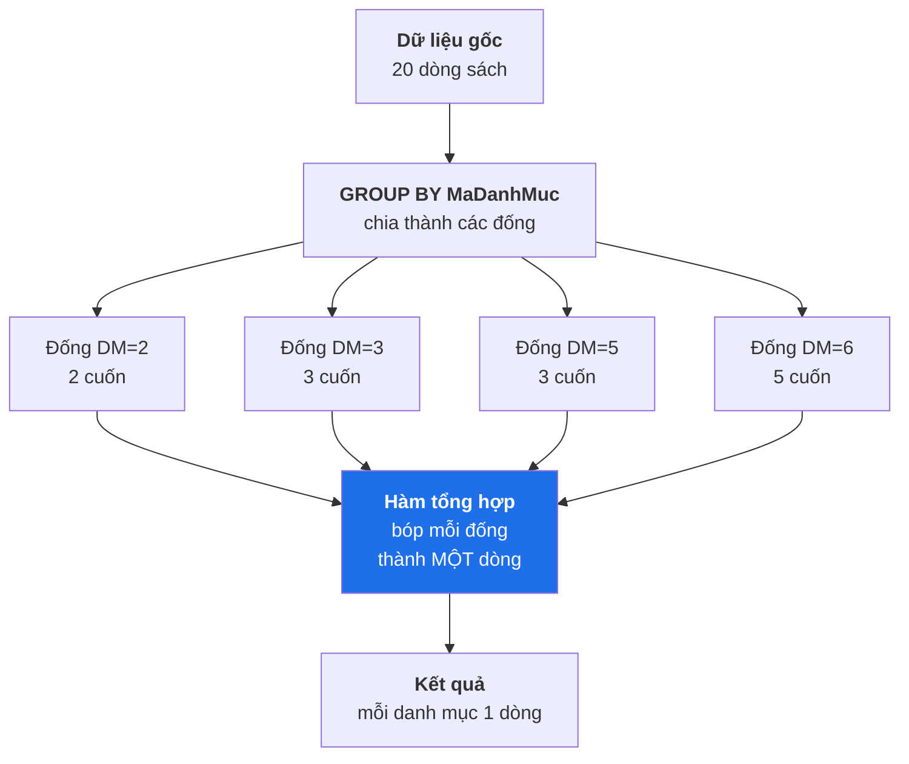
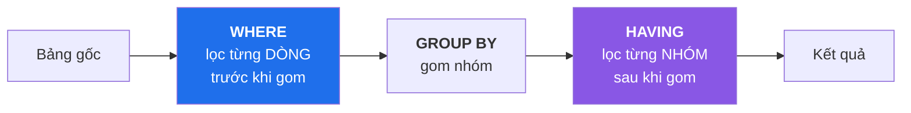

# Buổi 6 — JOIN và Gom nhóm dữ liệu

> **Mục tiêu sau buổi học**
> 1. Vẽ được sơ đồ và giải thích 5 loại JOIN.
> 2. Nối được 3–4 bảng để trả lời câu hỏi nghiệp vụ thật.
> 3. Dùng `GROUP BY` + hàm tổng hợp để làm báo cáo.
> 4. Phân biệt rõ `WHERE` và `HAVING`.

---

## 1. Vấn đề mở đầu

Sếp hỏi: *"Tháng trước ai mua nhiều tiền nhất, mua những sách gì?"*

Dữ liệu nằm rải ở 4 bảng: `KhachHang`, `DonHang`, `ChiTietDonHang`, `Sach`.
Không có câu `SELECT` đơn lẻ nào trả lời được. Ta cần **nối bảng**.



---

## 2. Năm loại JOIN



### Ví dụ trực quan với dữ liệu nhỏ

**Bảng `A` (KhachHang):**

| MaKH | HoTen |
|------|-------|
| 1 | Bích |
| 2 | Cường |
| 15 | Hồng |

**Bảng `B` (DonHang):**

| MaDonHang | MaKH |
|-----------|------|
| 1000 | 1 |
| 1002 | 2 |
| 9999 | 99 ← *giả sử khách đã bị xóa* |

| Loại JOIN | Kết quả | Ý nghĩa nghiệp vụ |
|-----------|---------|-------------------|
| `INNER` | (1,1000), (2,1002) | Chỉ khách **đã** mua hàng |
| `LEFT` | (1,1000), (2,1002), (15,NULL) | **Mọi** khách, kể cả chưa mua |
| `RIGHT` | (1,1000), (2,1002), (NULL,9999) | **Mọi** đơn, kể cả đơn mồ côi |
| `FULL` | cả 4 dòng trên | Tất cả, dùng để đối soát dữ liệu |
| `CROSS` | 3 × 3 = 9 dòng | Sinh mọi tổ hợp (dùng làm lịch, ma trận) |

### Cú pháp

```sql
USE BookStore;

-- INNER JOIN — mặc định, chữ INNER có thể bỏ
SELECT kh.HoTen, dh.MaDonHang, dh.NgayDat
FROM KhachHang AS kh
INNER JOIN DonHang AS dh ON kh.MaKH = dh.MaKH;

-- LEFT JOIN — thấy được cả khách chưa mua gì
SELECT kh.HoTen, dh.MaDonHang
FROM KhachHang AS kh
LEFT JOIN DonHang AS dh ON kh.MaKH = dh.MaKH
ORDER BY kh.HoTen;
-- Tạ Thị Hồng, Phan Thị Yến... sẽ hiện với MaDonHang = NULL
```

> 💡 **Luôn đặt bí danh bảng** (`kh`, `dh`, `ct`, `s`). Với 4 bảng trở lên,
> không có bí danh thì câu lệnh không đọc nổi.

### Mẫu truy vấn quan trọng nhất: "tìm cái KHÔNG có"

```sql
-- Những khách hàng CHƯA từng đặt đơn nào
SELECT kh.MaKH, kh.HoTen, kh.Email
FROM KhachHang AS kh
LEFT JOIN DonHang AS dh ON kh.MaKH = dh.MaKH
WHERE dh.MaDonHang IS NULL;      -- ← mấu chốt nằm ở đây
```



Đây là mẫu (pattern) sẽ dùng đi dùng lại: tìm sách chưa ai đánh giá, tìm sinh
viên chưa đăng ký môn nào, tìm sản phẩm chưa bán được cuốn nào...

### ⚠️ Bẫy chết người: điều kiện lọc ở `WHERE` với LEFT JOIN

```sql
-- ❌ SAI: câu này bị biến thành INNER JOIN!
SELECT kh.HoTen, dh.MaDonHang
FROM KhachHang kh
LEFT JOIN DonHang dh ON kh.MaKH = dh.MaKH
WHERE dh.TrangThai = N'HoanThanh';
-- Khách chưa mua có TrangThai = NULL, mà NULL = 'HoanThanh' là UNKNOWN
-- → bị loại → mất hết ý nghĩa của LEFT JOIN

-- ✅ ĐÚNG: đưa điều kiện vào phần ON
SELECT kh.HoTen, dh.MaDonHang
FROM KhachHang kh
LEFT JOIN DonHang dh
       ON kh.MaKH = dh.MaKH
      AND dh.TrangThai = N'HoanThanh';
```

**Quy tắc nhớ:** với `LEFT JOIN`, điều kiện về **bảng phải** đặt trong `ON`;
điều kiện về **bảng trái** đặt trong `WHERE`.

### Self JOIN — nối bảng với chính nó

```sql
-- Danh mục con kèm tên danh mục cha
SELECT
    con.TenDanhMuc  AS DanhMucCon,
    ISNULL(cha.TenDanhMuc, N'(gốc)') AS DanhMucCha
FROM DanhMuc AS con
LEFT JOIN DanhMuc AS cha ON con.MaDanhMucCha = cha.MaDanhMuc
ORDER BY DanhMucCha, DanhMucCon;
```

---

## 3. Nối nhiều bảng — trả lời câu hỏi của sếp

```sql
-- Chi tiết mua hàng đầy đủ: ai, khi nào, mua gì, bao nhiêu tiền
SELECT
    kh.HoTen                                        AS KhachHang,
    dh.MaDonHang,
    FORMAT(dh.NgayDat, 'dd/MM/yyyy')                AS NgayDat,
    s.TenSach,
    ct.SoLuong,
    ct.DonGia,
    ct.SoLuong * ct.DonGia * (1 - ct.GiamGia)       AS ThanhTien
FROM KhachHang     AS kh
JOIN DonHang       AS dh ON kh.MaKH      = dh.MaKH
JOIN ChiTietDonHang AS ct ON dh.MaDonHang = ct.MaDonHang
JOIN Sach          AS s  ON ct.MaSach    = s.MaSach
WHERE dh.TrangThai = N'HoanThanh'
ORDER BY dh.NgayDat DESC, kh.HoTen;
```

**Cách dạy nối nhiều bảng — xây dần từng bước, đừng viết một phát:**



> **Nếu số dòng tăng vọt bất thường sau một JOIN** → thường là quên điều kiện
> `ON`, hoặc nối nhầm cột, tạo ra tích Descartes.

### Nối N–N: sách và tác giả

```sql
SELECT
    s.TenSach,
    tg.HoTen AS TacGia,
    stg.VaiTro
FROM Sach          AS s
JOIN Sach_TacGia   AS stg ON s.MaSach = stg.MaSach
JOIN TacGia        AS tg  ON stg.MaTacGia = tg.MaTacGia
ORDER BY s.TenSach;

-- Gộp nhiều tác giả của cùng cuốn sách vào một ô (SQL Server 2017+)
SELECT
    s.TenSach,
    STRING_AGG(tg.HoTen, N', ') WITHIN GROUP (ORDER BY tg.HoTen) AS CacTacGia
FROM Sach        AS s
JOIN Sach_TacGia AS stg ON s.MaSach = stg.MaSach
JOIN TacGia      AS tg  ON stg.MaTacGia = tg.MaTacGia
GROUP BY s.MaSach, s.TenSach;
```

---

## 4. Hàm tổng hợp và GROUP BY

### Năm hàm tổng hợp cơ bản

```sql
SELECT
    COUNT(*)        AS TongSoSach,      -- đếm mọi dòng
    COUNT(ISBN)     AS SoSachCoISBN,    -- BỎ QUA NULL — số nhỏ hơn!
    COUNT(DISTINCT MaDanhMuc) AS SoDanhMucCoSach,
    SUM(SoLuongTon) AS TongTonKho,
    AVG(GiaBan)     AS GiaTrungBinh,
    MIN(GiaBan)     AS GiaThapNhat,
    MAX(GiaBan)     AS GiaCaoNhat
FROM Sach;
```

> ⚠️ **Bẫy `AVG` với kiểu nguyên:** `AVG(SoTrang)` trên cột `INT` trả về `INT`
> (bị cắt phần thập phân). Ép kiểu: `AVG(CAST(SoTrang AS DECIMAL(10,2)))`.
>
> ⚠️ **Mọi hàm tổng hợp (trừ `COUNT(*)`) đều bỏ qua `NULL`.** Đây là nguyên nhân
> số 1 của các báo cáo lệch số.

### GROUP BY — cách hoạt động



```sql
-- Thống kê theo danh mục
SELECT
    dm.TenDanhMuc,
    COUNT(*)            AS SoDauSach,
    SUM(s.SoLuongTon)   AS TongTon,
    CAST(AVG(s.GiaBan) AS DECIMAL(12,0)) AS GiaTB,
    MAX(s.GiaBan)       AS GiaCaoNhat
FROM Sach     AS s
JOIN DanhMuc  AS dm ON s.MaDanhMuc = dm.MaDanhMuc
GROUP BY dm.MaDanhMuc, dm.TenDanhMuc
ORDER BY SoDauSach DESC;
```

### 🔴 Quy tắc vàng của GROUP BY

> **Mọi cột xuất hiện trong `SELECT` mà không nằm trong hàm tổng hợp thì
> BẮT BUỘC phải có trong `GROUP BY`.**

```sql
-- ❌ SAI
SELECT MaDanhMuc, TenSach, COUNT(*) FROM Sach GROUP BY MaDanhMuc;
-- Msg 8120: Column 'Sach.TenSach' is invalid in the select list because it is
-- not contained in either an aggregate function or the GROUP BY clause.
```

**Giải thích trực quan cho học viên:** danh mục 6 có 5 cuốn sách. Khi gom thành
1 dòng, SQL Server phải in `TenSach` nào trong 5 cuốn? Nó không thể đoán → báo lỗi.
*(MySQL sẽ im lặng chọn bừa một cuốn — đó là lý do nhiều báo cáo MySQL bị sai
mà không ai biết.)*

### HAVING — lọc SAU khi gom nhóm



| | `WHERE` | `HAVING` |
|---|---|---|
| Lọc cái gì | Từng dòng | Từng nhóm |
| Chạy khi nào | Trước `GROUP BY` | Sau `GROUP BY` |
| Dùng được hàm tổng hợp? | ❌ Không | ✅ Có |
| Hiệu năng | Nhanh hơn (lọc sớm, ít dữ liệu hơn) | Chậm hơn |

```sql
-- Danh mục có từ 3 đầu sách trở lên VÀ giá trung bình trên 100k,
-- chỉ tính sách xuất bản từ 2018
SELECT
    dm.TenDanhMuc,
    COUNT(*) AS SoDauSach,
    CAST(AVG(s.GiaBan) AS DECIMAL(12,0)) AS GiaTB
FROM Sach    AS s
JOIN DanhMuc AS dm ON s.MaDanhMuc = dm.MaDanhMuc
WHERE s.NamXuatBan >= 2018              -- lọc DÒNG trước
GROUP BY dm.MaDanhMuc, dm.TenDanhMuc
HAVING COUNT(*) >= 3 AND AVG(s.GiaBan) > 100000   -- lọc NHÓM sau
ORDER BY GiaTB DESC;
```

> **Nguyên tắc hiệu năng:** điều kiện nào đặt được ở `WHERE` thì **đừng** đặt ở
> `HAVING`. Lọc sớm luôn rẻ hơn.

---

## 5. Báo cáo thực tế — làm cùng cả lớp

### Top 5 sách bán chạy nhất

```sql
SELECT TOP 5
    s.TenSach,
    SUM(ct.SoLuong)                                   AS SoCuonDaBan,
    SUM(ct.SoLuong * ct.DonGia * (1 - ct.GiamGia))    AS DoanhThu
FROM ChiTietDonHang AS ct
JOIN Sach    AS s  ON ct.MaSach = s.MaSach
JOIN DonHang AS dh ON ct.MaDonHang = dh.MaDonHang
WHERE dh.TrangThai = N'HoanThanh'      -- không tính đơn đã hủy!
GROUP BY s.MaSach, s.TenSach
ORDER BY SoCuonDaBan DESC;
```

### Doanh thu theo tháng

```sql
SELECT
    YEAR(dh.NgayDat)  AS Nam,
    MONTH(dh.NgayDat) AS Thang,
    COUNT(DISTINCT dh.MaDonHang) AS SoDon,
    SUM(ct.SoLuong * ct.DonGia * (1 - ct.GiamGia)) AS DoanhThu
FROM DonHang AS dh
JOIN ChiTietDonHang AS ct ON dh.MaDonHang = ct.MaDonHang
WHERE dh.TrangThai = N'HoanThanh'
GROUP BY YEAR(dh.NgayDat), MONTH(dh.NgayDat)
ORDER BY Nam, Thang;
```

> **Vì sao `COUNT(DISTINCT dh.MaDonHang)` chứ không phải `COUNT(*)`?**
> Sau khi JOIN với `ChiTietDonHang`, một đơn có 3 sách sẽ thành 3 dòng.
> `COUNT(*)` sẽ đếm thành 3 đơn. Đây là lỗi rất phổ biến khi làm báo cáo.

### Xếp hạng khách hàng

```sql
SELECT
    kh.HoTen,
    kh.ThanhPho,
    COUNT(DISTINCT dh.MaDonHang) AS SoDon,
    SUM(ct.SoLuong * ct.DonGia * (1 - ct.GiamGia)) AS TongChiTieu
FROM KhachHang AS kh
JOIN DonHang   AS dh ON kh.MaKH = dh.MaKH
JOIN ChiTietDonHang AS ct ON dh.MaDonHang = ct.MaDonHang
WHERE dh.TrangThai = N'HoanThanh'
GROUP BY kh.MaKH, kh.HoTen, kh.ThanhPho
HAVING SUM(ct.SoLuong * ct.DonGia * (1 - ct.GiamGia)) > 500000
ORDER BY TongChiTieu DESC;
```

### Điểm đánh giá trung bình mỗi sách (kể cả sách chưa ai đánh giá)

```sql
SELECT
    s.TenSach,
    COUNT(dg.MaDanhGia)               AS SoLuotDanhGia,
    CAST(AVG(CAST(dg.SoSao AS DECIMAL(3,2))) AS DECIMAL(3,2)) AS DiemTB
FROM Sach       AS s
LEFT JOIN DanhGia AS dg ON s.MaSach = dg.MaSach   -- LEFT để giữ cả sách chưa có đánh giá
GROUP BY s.MaSach, s.TenSach
ORDER BY DiemTB DESC, SoLuotDanhGia DESC;
```

### GROUPING SETS / ROLLUP — thêm dòng tổng cộng

```sql
-- Doanh thu theo thành phố, kèm dòng TỔNG CỘNG cuối bảng
SELECT
    ISNULL(kh.ThanhPho, N'▶ TỔNG CỘNG') AS ThanhPho,
    COUNT(DISTINCT dh.MaDonHang)        AS SoDon,
    SUM(ct.SoLuong * ct.DonGia)         AS DoanhThu
FROM KhachHang kh
JOIN DonHang dh ON kh.MaKH = dh.MaKH
JOIN ChiTietDonHang ct ON dh.MaDonHang = ct.MaDonHang
WHERE dh.TrangThai = N'HoanThanh'
GROUP BY ROLLUP (kh.ThanhPho);
```

---

## 6. THỰC HÀNH — 70 phút

Đề đầy đủ ở `thuc-hanh/bai-tap-buoi-06.sql`.

### Nhóm A — JOIN cơ bản (làm cùng)

1. Liệt kê mọi cuốn sách kèm **tên danh mục** của nó.
2. Liệt kê mọi đơn hàng kèm **tên khách hàng** đặt đơn đó.
3. Liệt kê mọi cuốn sách kèm **tên tác giả** (chú ý: sách có thể có nhiều tác giả).
4. Tìm những cuốn sách **chưa ai đánh giá** (dùng mẫu LEFT JOIN + IS NULL).
5. Tìm những khách hàng **chưa từng mua** gì.

### Nhóm B — Gom nhóm (học viên tự làm, 30 phút)

6. Mỗi danh mục có bao nhiêu đầu sách? Sắp xếp giảm dần.
7. Mỗi tác giả có bao nhiêu cuốn trong hệ thống?
8. Doanh thu của từng tháng năm 2025 (chỉ tính đơn `HoanThanh`).
9. Top 3 khách hàng chi tiêu nhiều nhất.
10. Mỗi thành phố có bao nhiêu khách hàng? Chỉ hiện thành phố có ≥ 2 khách.
11. Sách nào có điểm đánh giá trung bình ≥ 4.5 và có ít nhất 2 lượt đánh giá?
12. Mỗi trạng thái đơn hàng có bao nhiêu đơn và tổng giá trị bao nhiêu?
13. Nhà xuất bản nào có tổng giá trị tồn kho lớn nhất?
14. Trong mỗi danh mục, cuốn nào đắt nhất? *(gợi ý: cần kỹ thuật của buổi 7,
    thử làm bằng `MAX` + JOIN lại xem sao)*

### Nhóm C — Bẫy JOIN (làm chung, quan trọng)

```sql
-- C1. Chạy hai câu sau, giải thích vì sao KẾT QUẢ KHÁC NHAU
SELECT COUNT(*) FROM DonHang;                                    -- 25

SELECT COUNT(*)
FROM DonHang dh JOIN ChiTietDonHang ct ON dh.MaDonHang = ct.MaDonHang;  -- 47

SELECT COUNT(DISTINCT dh.MaDonHang)
FROM DonHang dh JOIN ChiTietDonHang ct ON dh.MaDonHang = ct.MaDonHang;  -- 25 ✅
```

```sql
-- C2. Chạy hai câu sau, giải thích vì sao câu thứ hai MẤT khách hàng
SELECT COUNT(*) FROM KhachHang kh LEFT JOIN DonHang dh ON kh.MaKH = dh.MaKH;

SELECT COUNT(*) FROM KhachHang kh
LEFT JOIN DonHang dh ON kh.MaKH = dh.MaKH
WHERE dh.TrangThai = N'HoanThanh';     -- ← lỗi kinh điển
```

```sql
-- C3. CROSS JOIN — đừng chạy trên bảng lớn!
SELECT COUNT(*) FROM Sach CROSS JOIN KhachHang;   -- 20 × 15 = 300
-- Trên hệ thống thật: 1 triệu sách × 1 triệu khách = 10^12 dòng → treo server
```

---

## 7. Lỗi thường gặp

| Lỗi | Nguyên nhân | Cách sửa |
|-----|-------------|----------|
| `Column 'X' is invalid in the select list...` | Cột không nằm trong `GROUP BY` | Thêm vào `GROUP BY` hoặc bọc hàm tổng hợp |
| Số dòng nhân lên bất thường | JOIN 2 bảng con của cùng bảng cha | Tách thành 2 truy vấn, hoặc dùng subquery (buổi 7) |
| `COUNT(*)` đếm đơn hàng ra số quá lớn | Đã JOIN với bảng chi tiết | Dùng `COUNT(DISTINCT MaDonHang)` |
| LEFT JOIN mất dòng | Điều kiện bảng phải nằm ở `WHERE` | Chuyển vào `ON` |
| `Ambiguous column name 'MaKH'` | Hai bảng cùng có cột đó | Ghi rõ `kh.MaKH` |
| `AVG` trả về số nguyên | Cột kiểu `INT` | `AVG(CAST(col AS DECIMAL(10,2)))` |
| Tổng doanh thu tính cả đơn đã hủy | Quên lọc trạng thái | Thêm `WHERE dh.TrangThai = N'HoanThanh'` |

---

## 8. Bài tập về nhà

**Bài 1.** Viết truy vấn liệt kê: tên sách, tên danh mục, danh sách tác giả (gộp
bằng `STRING_AGG`), số lượng đã bán, doanh thu. Sắp xếp theo doanh thu giảm dần.
Sách chưa bán được cuốn nào vẫn phải xuất hiện với doanh thu bằng 0.

**Bài 2.** Làm báo cáo "sức khỏe khách hàng": mỗi khách hàng gồm họ tên, thành
phố, ngày đăng ký, số đơn hàng, tổng chi tiêu, ngày mua gần nhất, và một cột
`PhanLoai` (`CASE`): chi tiêu > 1 triệu → "VIP", > 300k → "Thường xuyên",
> 0 → "Mới", chưa mua → "Chưa kích hoạt".

**Bài 3.** Tìm những cặp sách **thường được mua cùng nhau** trong một đơn hàng.
Kết quả: `TenSachA`, `TenSachB`, `SoLanMuaCung`, sắp xếp giảm dần.
*Gợi ý:* self-JOIN bảng `ChiTietDonHang` trên `MaDonHang`, điều kiện
`ct1.MaSach < ct2.MaSach` để không đếm trùng cặp và không ghép sách với chính nó.

**Bài 4.** Báo cáo tồn kho cảnh báo: liệt kê sách có `SoLuongTon` thấp hơn số
lượng đã bán trong 6 tháng gần nhất (tức là sắp hết hàng so với tốc độ bán).

**Bài 5 (giải thích).** Hai truy vấn sau cho kết quả khác nhau. Chạy cả hai, ghi
lại số dòng và giải thích chi tiết nguyên nhân:
```sql
-- (a)
SELECT dm.TenDanhMuc, COUNT(s.MaSach) AS SoSach
FROM DanhMuc dm LEFT JOIN Sach s ON dm.MaDanhMuc = s.MaDanhMuc
GROUP BY dm.TenDanhMuc;
-- (b)
SELECT dm.TenDanhMuc, COUNT(*) AS SoSach
FROM DanhMuc dm LEFT JOIN Sach s ON dm.MaDanhMuc = s.MaDanhMuc
GROUP BY dm.TenDanhMuc;
```

---

➡️ [Buổi 7 — SQL nâng cao: Subquery, CTE, View, Window Function](buoi-07-sql-nang-cao.md)
