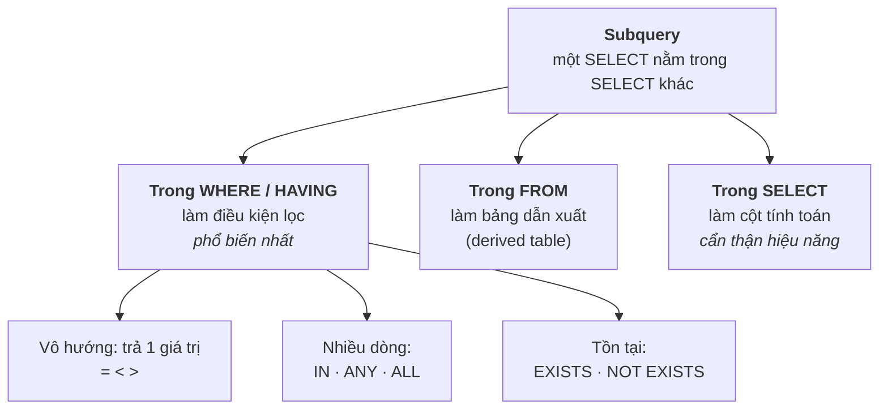
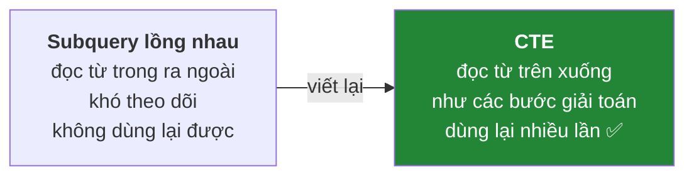
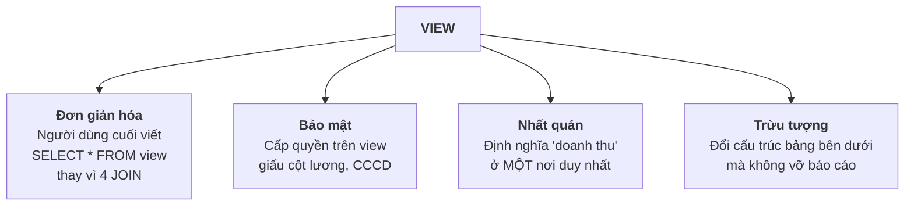
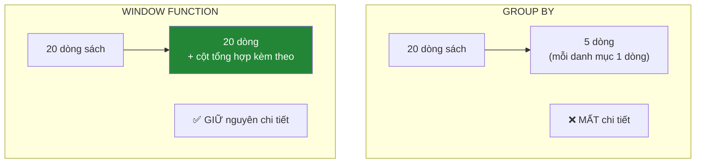

# Buổi 7 — SQL nâng cao: Subquery, CTE, View, Window Function

> **Mục tiêu sau buổi học**
> 1. Viết được truy vấn con ở cả 3 vị trí: `SELECT`, `FROM`, `WHERE`.
> 2. Dùng CTE để chia truy vấn phức tạp thành các bước dễ đọc.
> 3. Tạo View để đóng gói logic nghiệp vụ.
> 4. Dùng Window Function giải bài toán "top N mỗi nhóm", xếp hạng, chạy lũy kế.

---

## 1. Vấn đề mở đầu

Câu 14 của buổi trước còn nợ: **"Trong mỗi danh mục, cuốn sách nào đắt nhất?"**

Thử bằng `GROUP BY`:

```sql
-- ❌ Không chạy được
SELECT MaDanhMuc, TenSach, MAX(GiaBan) FROM Sach GROUP BY MaDanhMuc;
-- Msg 8120: TenSach không nằm trong GROUP BY
```

`GROUP BY` bóp cả nhóm thành 1 dòng nên **mất** thông tin chi tiết. Ta cần công
cụ vừa tổng hợp vừa giữ được chi tiết — đó là **Window Function**, và cả subquery,
CTE là các đường khác dẫn tới đích.

---

## 2. Truy vấn con (Subquery)



### 2.1. Subquery vô hướng — trả về đúng một giá trị

```sql
-- Sách có giá cao hơn giá trung bình toàn cửa hàng
SELECT TenSach, GiaBan
FROM Sach
WHERE GiaBan > (SELECT AVG(GiaBan) FROM Sach)
ORDER BY GiaBan DESC;
```

> Subquery vô hướng **bắt buộc** trả về 1 dòng 1 cột. Nếu trả nhiều dòng sẽ lỗi:
> `Subquery returned more than 1 value.`

### 2.2. Subquery nhiều dòng — `IN`, `ANY`, `ALL`

```sql
-- Khách hàng đã từng mua sách CNTT (danh mục 5)
SELECT HoTen, Email
FROM KhachHang
WHERE MaKH IN (
    SELECT dh.MaKH
    FROM DonHang dh
    JOIN ChiTietDonHang ct ON dh.MaDonHang = ct.MaDonHang
    JOIN Sach s ON ct.MaSach = s.MaSach
    WHERE s.MaDanhMuc = 5
);

-- Sách đắt hơn MỌI cuốn trong danh mục Thiếu nhi
SELECT TenSach, GiaBan FROM Sach
WHERE GiaBan > ALL (SELECT GiaBan FROM Sach WHERE MaDanhMuc = 4);

-- Sách đắt hơn ÍT NHẤT MỘT cuốn trong danh mục Khoa học
SELECT TenSach, GiaBan FROM Sach
WHERE GiaBan > ANY (SELECT GiaBan FROM Sach WHERE MaDanhMuc = 3);
```

> ⚠️ **Bẫy `NOT IN` với `NULL`** (đã cảnh báo ở buổi 2, giờ gặp lại trong thực tế):
> ```sql
> -- Nếu subquery trả về dù chỉ MỘT giá trị NULL, câu này luôn ra 0 dòng
> SELECT TenSach FROM Sach WHERE MaSach NOT IN (SELECT MaSach FROM ChiTietDonHang);
> ```
> **Luôn dùng `NOT EXISTS` thay cho `NOT IN`** khi có khả năng có `NULL`.

### 2.3. `EXISTS` / `NOT EXISTS` — tương quan (correlated)

```sql
-- Sách đã từng được bán ít nhất một lần
SELECT s.TenSach
FROM Sach s
WHERE EXISTS (
    SELECT 1                       -- không quan trọng chọn gì, chỉ cần "có dòng nào không"
    FROM ChiTietDonHang ct
    WHERE ct.MaSach = s.MaSach     -- ← tham chiếu bảng ngoài = "tương quan"
);

-- Sách CHƯA từng được bán — an toàn với NULL
SELECT s.TenSach
FROM Sach s
WHERE NOT EXISTS (
    SELECT 1 FROM ChiTietDonHang ct WHERE ct.MaSach = s.MaSach
);
```

**Ba cách viết cùng một câu hỏi "sách chưa bán":**

| Cách | Cú pháp | Đánh giá |
|------|---------|----------|
| `LEFT JOIN ... IS NULL` | buổi 6 | Nhanh, quen thuộc |
| `NOT EXISTS` | trên | Nhanh, **an toàn với NULL** ✅ khuyến nghị |
| `NOT IN` | `WHERE MaSach NOT IN (...)` | ⚠️ sai khi có NULL |

### 2.4. Subquery trong `FROM` — bảng dẫn xuất

```sql
-- Khách hàng có chi tiêu trên trung bình
SELECT tk.HoTen, tk.TongChi
FROM (
    SELECT kh.MaKH, kh.HoTen, SUM(ct.SoLuong * ct.DonGia) AS TongChi
    FROM KhachHang kh
    JOIN DonHang dh ON kh.MaKH = dh.MaKH
    JOIN ChiTietDonHang ct ON dh.MaDonHang = ct.MaDonHang
    WHERE dh.TrangThai = N'HoanThanh'
    GROUP BY kh.MaKH, kh.HoTen
) AS tk                                       -- ← BẮT BUỘC đặt bí danh
WHERE tk.TongChi > (
    SELECT AVG(TongChi) FROM (
        SELECT SUM(ct.SoLuong * ct.DonGia) AS TongChi
        FROM DonHang dh JOIN ChiTietDonHang ct ON dh.MaDonHang = ct.MaDonHang
        WHERE dh.TrangThai = N'HoanThanh'
        GROUP BY dh.MaKH
    ) AS tb
)
ORDER BY tk.TongChi DESC;
```

**Nhìn câu trên và hỏi lớp: có dễ đọc không?** → Không. Đó là lý do CTE ra đời.

---

## 3. CTE — Common Table Expression

CTE là cách đặt tên cho một truy vấn con và dùng lại nó, viết bằng `WITH`.



```sql
-- Cùng bài toán trên, viết bằng CTE
WITH ChiTieuKhach AS (
    SELECT kh.MaKH, kh.HoTen, SUM(ct.SoLuong * ct.DonGia) AS TongChi
    FROM KhachHang kh
    JOIN DonHang dh ON kh.MaKH = dh.MaKH
    JOIN ChiTietDonHang ct ON dh.MaDonHang = ct.MaDonHang
    WHERE dh.TrangThai = N'HoanThanh'
    GROUP BY kh.MaKH, kh.HoTen
)
SELECT HoTen, TongChi
FROM ChiTieuKhach
WHERE TongChi > (SELECT AVG(TongChi) FROM ChiTieuKhach)   -- dùng lại CTE!
ORDER BY TongChi DESC;
```

### Nhiều CTE nối tiếp — mỗi CTE là một bước suy nghĩ

```sql
WITH
DonHopLe AS (           -- Bước 1: lọc đơn hợp lệ
    SELECT MaDonHang, MaKH, NgayDat
    FROM DonHang
    WHERE TrangThai = N'HoanThanh'
),
DoanhThuDon AS (        -- Bước 2: tính tiền mỗi đơn
    SELECT d.MaDonHang, d.MaKH, d.NgayDat,
           SUM(ct.SoLuong * ct.DonGia * (1 - ct.GiamGia)) AS TienDon
    FROM DonHopLe d
    JOIN ChiTietDonHang ct ON d.MaDonHang = ct.MaDonHang
    GROUP BY d.MaDonHang, d.MaKH, d.NgayDat
),
TongTheoKhach AS (      -- Bước 3: gộp theo khách
    SELECT MaKH, COUNT(*) AS SoDon, SUM(TienDon) AS TongChi,
           AVG(TienDon) AS TrungBinhDon, MAX(NgayDat) AS MuaGanNhat
    FROM DoanhThuDon
    GROUP BY MaKH
)
SELECT kh.HoTen, kh.ThanhPho, t.SoDon,
       CAST(t.TongChi AS DECIMAL(12,0))      AS TongChi,
       CAST(t.TrungBinhDon AS DECIMAL(12,0)) AS TBMoiDon,
       FORMAT(t.MuaGanNhat, 'dd/MM/yyyy')    AS MuaGanNhat
FROM TongTheoKhach t
JOIN KhachHang kh ON t.MaKH = kh.MaKH
ORDER BY t.TongChi DESC;
```

### CTE đệ quy — duyệt cây danh mục

```sql
WITH CayDanhMuc AS (
    -- Neo (anchor): các danh mục gốc
    SELECT MaDanhMuc, TenDanhMuc, MaDanhMucCha,
           0 AS Cap,
           CAST(TenDanhMuc AS NVARCHAR(500)) AS DuongDan
    FROM DanhMuc
    WHERE MaDanhMucCha IS NULL

    UNION ALL

    -- Đệ quy: nối con vào cha
    SELECT dm.MaDanhMuc, dm.TenDanhMuc, dm.MaDanhMucCha,
           c.Cap + 1,
           CAST(c.DuongDan + N' > ' + dm.TenDanhMuc AS NVARCHAR(500))
    FROM DanhMuc dm
    JOIN CayDanhMuc c ON dm.MaDanhMucCha = c.MaDanhMuc
)
SELECT REPLICATE(N'    ', Cap) + TenDanhMuc AS CayThuMuc, Cap, DuongDan
FROM CayDanhMuc
ORDER BY DuongDan;
```

Kết quả:

```
Công nghệ thông tin        Cap 0
Khoa học                   Cap 0
Kinh tế                    Cap 0
    Kỹ năng sống           Cap 1
Thiếu nhi                  Cap 0
Văn học                    Cap 0
    Tiểu thuyết            Cap 1
    Truyện ngắn            Cap 1
```

> ⚠️ CTE đệ quy mặc định dừng ở 100 vòng lặp. Nếu dữ liệu có vòng lặp (A là cha
> của B, B là cha của A) sẽ chạy mãi. Giới hạn bằng
> `OPTION (MAXRECURSION 50)` ở cuối truy vấn.

---

## 4. VIEW — đóng gói truy vấn

**View là một truy vấn được đặt tên và lưu lại**, dùng như một bảng ảo.

```sql
CREATE VIEW vw_DoanhThuSach AS
SELECT
    s.MaSach,
    s.TenSach,
    dm.TenDanhMuc,
    s.GiaBan,
    s.SoLuongTon,
    ISNULL(SUM(ct.SoLuong), 0) AS SoDaBan,
    ISNULL(SUM(ct.SoLuong * ct.DonGia * (1 - ct.GiamGia)), 0) AS DoanhThu
FROM Sach s
JOIN DanhMuc dm ON s.MaDanhMuc = dm.MaDanhMuc
LEFT JOIN ChiTietDonHang ct ON s.MaSach = ct.MaSach
LEFT JOIN DonHang dh ON ct.MaDonHang = dh.MaDonHang
                     AND dh.TrangThai = N'HoanThanh'
GROUP BY s.MaSach, s.TenSach, dm.TenDanhMuc, s.GiaBan, s.SoLuongTon;
GO

-- Dùng như một bảng bình thường
SELECT * FROM vw_DoanhThuSach WHERE DoanhThu > 300000 ORDER BY DoanhThu DESC;
SELECT TenDanhMuc, SUM(DoanhThu) AS TongDT FROM vw_DoanhThuSach GROUP BY TenDanhMuc;
```

### Vì sao dùng View?



**Ví dụ bảo mật:**

```sql
CREATE VIEW vw_KhachHang_CongKhai AS
SELECT MaKH, HoTen, ThanhPho, NgayDangKy   -- KHÔNG có Email, SĐT, DiaChi
FROM KhachHang;
GO
-- GRANT SELECT ON vw_KhachHang_CongKhai TO NhanVienBanHang;
```

### Giới hạn của View

| Điều cần biết | Chi tiết |
|---------------|----------|
| View **không lưu dữ liệu** | Mỗi lần gọi là chạy lại truy vấn bên dưới |
| Không tự nhanh hơn | Muốn nhanh phải dùng **Indexed View** (`WITH SCHEMABINDING` + index) |
| `ORDER BY` không dùng được trong view | Trừ khi có `TOP`; sắp xếp ở câu gọi view |
| Cập nhật qua view có điều kiện | Chỉ được nếu view đơn giản (1 bảng, không `GROUP BY`, không `DISTINCT`) |

---

## 5. Window Function — công cụ mạnh nhất của SQL hiện đại

**Khác biệt cốt lõi so với `GROUP BY`:**



### Cú pháp

```
hàm() OVER (
    PARTITION BY  <chia nhóm>       -- tùy chọn
    ORDER BY      <sắp xếp trong nhóm>  -- tùy chọn
    ROWS/RANGE    <khung>            -- tùy chọn
)
```

### 5.1. So sánh trực tiếp

```sql
SELECT
    dm.TenDanhMuc,
    s.TenSach,
    s.GiaBan,
    AVG(s.GiaBan) OVER (PARTITION BY s.MaDanhMuc) AS GiaTB_DanhMuc,
    s.GiaBan - AVG(s.GiaBan) OVER (PARTITION BY s.MaDanhMuc) AS ChenhLech,
    COUNT(*)   OVER (PARTITION BY s.MaDanhMuc) AS SoSachCungDM,
    MAX(s.GiaBan) OVER (PARTITION BY s.MaDanhMuc) AS GiaCaoNhat_DM
FROM Sach s
JOIN DanhMuc dm ON s.MaDanhMuc = dm.MaDanhMuc
ORDER BY dm.TenDanhMuc, s.GiaBan DESC;
```

→ Vẫn đủ 20 dòng, mỗi dòng có thêm thông tin thống kê của nhóm nó thuộc về.

### 5.2. Ba hàm xếp hạng — phải phân biệt rõ

```sql
SELECT
    TenSach, GiaBan,
    ROW_NUMBER() OVER (ORDER BY GiaBan DESC) AS RowNum,
    RANK()       OVER (ORDER BY GiaBan DESC) AS Rank,
    DENSE_RANK() OVER (ORDER BY GiaBan DESC) AS DenseRank
FROM Sach;
```

Giả sử có 3 cuốn giá 100k, 100k, 90k:

| Giá | `ROW_NUMBER` | `RANK` | `DENSE_RANK` |
|-----|-------------|--------|--------------|
| 100k | 1 | 1 | 1 |
| 100k | 2 | **1** | **1** |
| 90k | 3 | **3** ← nhảy số | **2** ← liền mạch |

| Hàm | Dùng khi |
|-----|----------|
| `ROW_NUMBER()` | Phân trang, khử trùng lặp, "lấy đúng 1 dòng mỗi nhóm" |
| `RANK()` | Xếp hạng kiểu thể thao (đồng hạng nhất thì không có hạng nhì) |
| `DENSE_RANK()` | Xếp hạng liên tục (top 3 mức giá khác nhau) |

### 5.3. 🎯 Giải bài toán đầu buổi: Top N mỗi nhóm

```sql
-- Cuốn ĐẮT NHẤT trong mỗi danh mục
WITH XepHang AS (
    SELECT
        dm.TenDanhMuc, s.TenSach, s.GiaBan,
        ROW_NUMBER() OVER (PARTITION BY s.MaDanhMuc ORDER BY s.GiaBan DESC) AS Hang
    FROM Sach s
    JOIN DanhMuc dm ON s.MaDanhMuc = dm.MaDanhMuc
)
SELECT TenDanhMuc, TenSach, GiaBan
FROM XepHang
WHERE Hang = 1;             -- đổi thành Hang <= 3 để lấy top 3 mỗi danh mục
```

**Đây là mẫu truy vấn được dùng nhiều nhất trong công việc thật.** Hãy cho học
viên chép lại và đóng khung: *CTE + `ROW_NUMBER() OVER (PARTITION BY ... ORDER BY ...)`
+ `WHERE Hang <= N`*.

### 5.4. Lũy kế và so sánh với dòng trước

```sql
-- Doanh thu từng tháng + lũy kế + tăng trưởng so với tháng trước
WITH DoanhThuThang AS (
    SELECT
        YEAR(dh.NgayDat) AS Nam, MONTH(dh.NgayDat) AS Thang,
        SUM(ct.SoLuong * ct.DonGia * (1 - ct.GiamGia)) AS DoanhThu
    FROM DonHang dh
    JOIN ChiTietDonHang ct ON dh.MaDonHang = ct.MaDonHang
    WHERE dh.TrangThai = N'HoanThanh'
    GROUP BY YEAR(dh.NgayDat), MONTH(dh.NgayDat)
)
SELECT
    Nam, Thang,
    CAST(DoanhThu AS DECIMAL(12,0)) AS DoanhThu,
    CAST(SUM(DoanhThu) OVER (ORDER BY Nam, Thang
         ROWS BETWEEN UNBOUNDED PRECEDING AND CURRENT ROW) AS DECIMAL(12,0)) AS LuyKe,
    CAST(LAG(DoanhThu) OVER (ORDER BY Nam, Thang) AS DECIMAL(12,0)) AS ThangTruoc,
    CAST(
      100.0 * (DoanhThu - LAG(DoanhThu) OVER (ORDER BY Nam, Thang))
            / NULLIF(LAG(DoanhThu) OVER (ORDER BY Nam, Thang), 0)
      AS DECIMAL(6,1)
    ) AS TangTruongPhanTram
FROM DoanhThuThang
ORDER BY Nam, Thang;
```

> `NULLIF(x, 0)` biến 0 thành `NULL` để tránh lỗi **chia cho 0** — mẹo rất hay dùng.

**Các hàm window khác đáng biết:**

| Hàm | Công dụng |
|-----|-----------|
| `LAG(col, n)` / `LEAD(col, n)` | Lấy giá trị của dòng trước / sau |
| `FIRST_VALUE` / `LAST_VALUE` | Giá trị đầu / cuối của khung |
| `NTILE(4)` | Chia dữ liệu thành 4 phần bằng nhau (tứ phân vị) |
| `PERCENT_RANK()` | Vị trí phần trăm trong nhóm |

---

## 6. THỰC HÀNH — 70 phút

Đề đầy đủ ở `thuc-hanh/bai-tap-buoi-07.sql`.

### Nhóm A — Subquery (làm cùng)

1. Sách có giá cao hơn giá trung bình của **chính danh mục nó** (subquery tương quan).
2. Khách hàng đã mua sách của tác giả "Nguyễn Nhật Ánh".
3. Sách chưa từng được đánh giá — viết bằng **cả 3 cách** (`LEFT JOIN`, `NOT EXISTS`, `NOT IN`)
   rồi so sánh kết quả và giải thích nếu khác nhau.
4. Đơn hàng có tổng giá trị lớn nhất.

### Nhóm B — CTE (tự làm, 25 phút)

5. Dùng CTE tính doanh thu mỗi danh mục, sau đó chỉ lấy danh mục có doanh thu
   trên mức trung bình của các danh mục.
6. Dùng CTE đệ quy in cây danh mục có thụt lề.
7. Dùng nhiều CTE nối tiếp để làm báo cáo: mỗi tháng năm 2025 có bao nhiêu khách
   hàng **mới** (khách có đơn đầu tiên trong tháng đó).

### Nhóm C — Window Function (tự làm, 25 phút)

8. Xếp hạng sách theo doanh thu, dùng cả `ROW_NUMBER`, `RANK`, `DENSE_RANK`
   và giải thích sự khác nhau nếu có.
9. Top 2 sách bán chạy nhất **trong mỗi danh mục**.
10. Với mỗi đơn hàng, hiển thị: mã đơn, ngày đặt, tổng tiền, tổng tiền của đơn
    **liền trước** cùng khách hàng đó, và số ngày giữa hai lần mua.
11. Chia khách hàng thành 4 nhóm theo tổng chi tiêu bằng `NTILE(4)`, đặt tên
    nhóm là "Kim cương / Vàng / Bạc / Đồng".
12. Với mỗi sách, tính tỉ trọng doanh thu của nó so với tổng doanh thu danh mục
    (`DoanhThu / SUM(DoanhThu) OVER (PARTITION BY MaDanhMuc)`).

### Nhóm D — View

13. Tạo view `vw_ChiTietDonHangDayDu` gồm: mã đơn, ngày, tên khách, thành phố,
    tên sách, danh mục, số lượng, đơn giá, thành tiền, trạng thái.
14. Dùng view vừa tạo để trả lời 3 câu hỏi khác nhau, mỗi câu 1 dòng `SELECT`.
15. Tạo view `vw_ThongKeKhachHang` và giải thích nó giúp ích gì cho bộ phận
    chăm sóc khách hàng.

---

## 7. Lỗi thường gặp

| Lỗi | Nguyên nhân | Cách sửa |
|-----|-------------|----------|
| `Subquery returned more than 1 value` | Dùng `=` với subquery trả nhiều dòng | Đổi sang `IN`, hoặc thêm điều kiện/`TOP 1` |
| `NOT IN` trả về 0 dòng bất thường | Subquery có `NULL` | Dùng `NOT EXISTS` |
| `Incorrect syntax near ')'` ở subquery `FROM` | Thiếu bí danh cho bảng dẫn xuất | Thêm `AS t` |
| `Windowed functions cannot be used in the WHERE clause` | Lọc trực tiếp `ROW_NUMBER() = 1` | Bọc trong CTE rồi lọc ở câu ngoài |
| CTE báo `Invalid object name` | CTE chỉ sống trong **một** câu lệnh ngay sau nó | Không đặt `GO` hay câu lệnh khác chen giữa |
| `Maximum recursion 100 has been exhausted` | CTE đệ quy có vòng lặp trong dữ liệu | Sửa dữ liệu, hoặc `OPTION (MAXRECURSION n)` |
| View chạy chậm | View lồng view lồng view | "Làm phẳng" truy vấn, hoặc dùng Indexed View |
| `Divide by zero error` | Mẫu số bằng 0 | `NULLIF(mauSo, 0)` |

---

## 8. Bài tập về nhà

**Bài 1.** Viết truy vấn tìm, với **mỗi thành phố**, khách hàng chi tiêu nhiều
nhất ở thành phố đó (tên thành phố, tên khách, tổng chi tiêu).

**Bài 2.** Phân tích giỏ hàng: với mỗi danh mục, tính tỉ lệ phần trăm doanh thu
của nó trên tổng doanh thu toàn cửa hàng. Kết quả phải có cột lũy kế phần trăm
(để làm biểu đồ Pareto 80/20).

**Bài 3.** Tìm những khách hàng có **hai đơn hàng liên tiếp cách nhau dưới 30 ngày**.
Gợi ý: `LAG(NgayDat) OVER (PARTITION BY MaKH ORDER BY NgayDat)`.

**Bài 4.** Tạo view `vw_CanhBaoTonKho` liệt kê sách cần nhập thêm: tồn kho hiện
tại, số bán trung bình mỗi tháng, số tháng còn bán được với tồn kho hiện tại.
Sắp xếp theo mức độ khẩn cấp.

**Bài 5 (nâng cao).** Viết truy vấn tính "tỉ lệ giữ chân khách hàng": trong số
khách hàng có đơn đầu tiên vào mỗi tháng, bao nhiêu phần trăm quay lại mua lần 2
trong vòng 90 ngày?

**Bài 6 (so sánh).** Viết cùng một bài toán "top 3 sách bán chạy mỗi danh mục"
bằng **hai cách**: (a) subquery tương quan, (b) window function. So sánh độ dài
code và độ dễ đọc. *(Buổi 8 ta sẽ so sánh cả hiệu năng.)*

---

➡️ [Buổi 8 — Index, Transaction và ACID](buoi-08-index-va-transaction.md)
