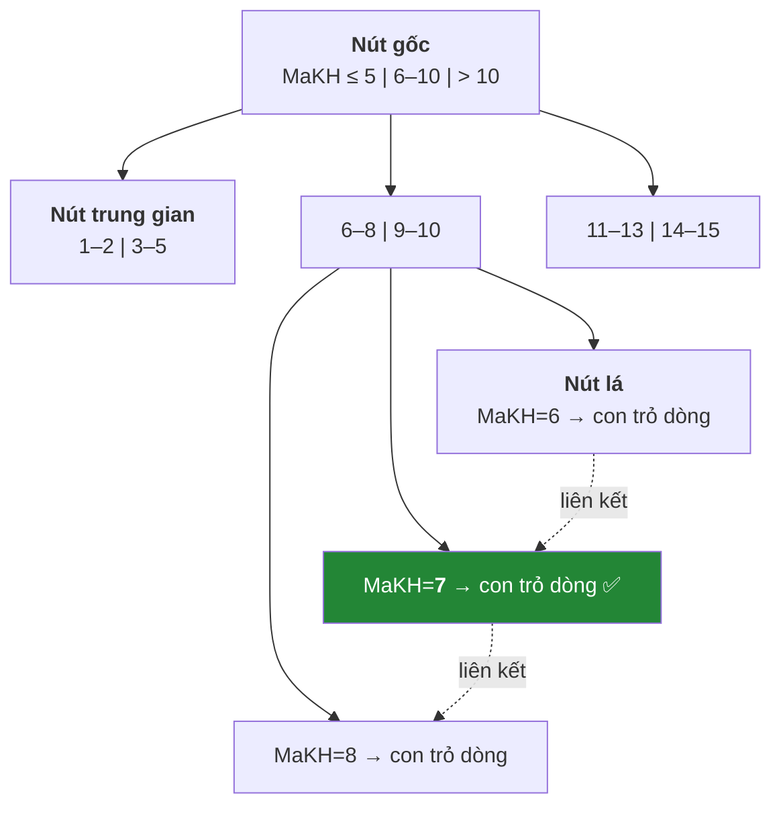
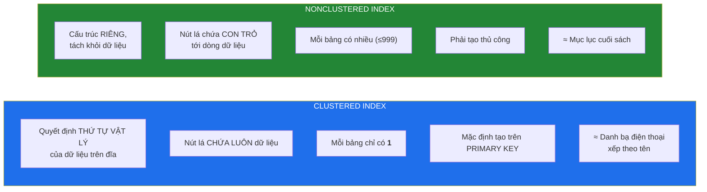
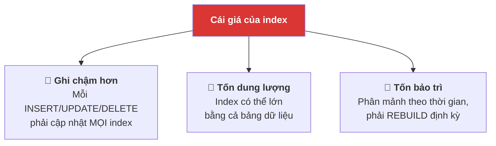
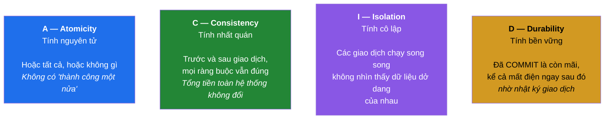
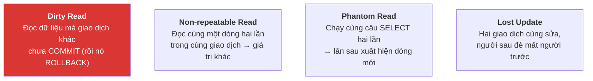
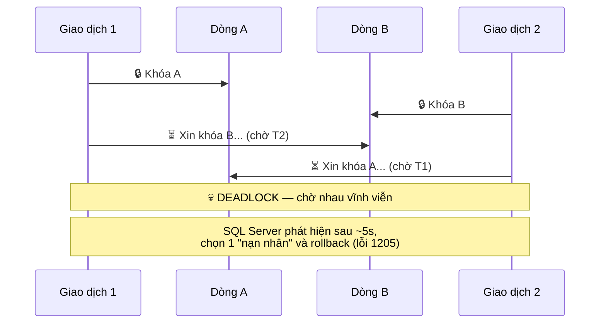

# Buổi 8 — Index, Transaction và ACID

> **Mục tiêu sau buổi học**
> 1. Giải thích index bằng phép so sánh mục lục sách, biết khi nào **không** nên tạo index.
> 2. Đọc được Execution Plan để tìm nguyên nhân truy vấn chậm.
> 3. Viết được giao dịch có `TRY...CATCH` và `ROLLBACK`.
> 4. Hiểu 4 tính chất ACID và 4 mức cô lập; nhận diện deadlock.

---

## 1. Phần I — INDEX

### 1.1. Vấn đề mở đầu

```sql
USE BookStore;

-- Tạo bảng lớn để thấy rõ sự khác biệt (500.000 dòng)
DROP TABLE IF EXISTS LogTruyCap;
CREATE TABLE LogTruyCap (
    MaLog     INT IDENTITY(1,1) PRIMARY KEY,
    MaKH      INT NOT NULL,
    ThoiGian  DATETIME2 NOT NULL,
    HanhDong  NVARCHAR(50) NOT NULL,
    DiaChiIP  VARCHAR(45)
);

-- Sinh dữ liệu bằng CTE đệ quy
WITH N AS (SELECT 1 AS n UNION ALL SELECT n+1 FROM N WHERE n < 500000)
INSERT INTO LogTruyCap (MaKH, ThoiGian, HanhDong, DiaChiIP)
SELECT
    (n % 15) + 1,
    DATEADD(MINUTE, -n, GETDATE()),
    CASE n % 4 WHEN 0 THEN N'DangNhap' WHEN 1 THEN N'XemSach'
               WHEN 2 THEN N'ThemGioHang' ELSE N'ThanhToan' END,
    CONCAT('192.168.', n % 255, '.', (n / 255) % 255)
FROM N
OPTION (MAXRECURSION 0);

SELECT COUNT(*) FROM LogTruyCap;   -- 500000
```

Bật đo thời gian rồi chạy:

```sql
SET STATISTICS IO, TIME ON;

SELECT * FROM LogTruyCap WHERE MaKH = 7 AND HanhDong = N'ThanhToan';
-- Ghi lại: số logical reads và elapsed time
```

Bây giờ tạo index và chạy lại:

```sql
CREATE NONCLUSTERED INDEX IX_LogTruyCap_MaKH_HanhDong
    ON LogTruyCap (MaKH, HanhDong);

SELECT * FROM LogTruyCap WHERE MaKH = 7 AND HanhDong = N'ThanhToan';
-- So sánh lại logical reads. Thường giảm hàng trăm lần.

SET STATISTICS IO, TIME OFF;
```

### 1.2. Index hoạt động thế nào

**Phép so sánh dùng để giảng:** tìm từ "cơ sở dữ liệu" trong một cuốn sách 800 trang.
- **Không index** = lật từng trang từ đầu → *Table Scan*
- **Có index** = tra mục lục cuối sách → *Index Seek*

Cấu trúc thực tế là **cây B+**:



Với 500.000 dòng, cây cao khoảng 3 tầng → **3 lần đọc** thay vì 500.000.

### 1.3. Clustered vs Nonclustered



```sql
-- Nonclustered đơn cột
CREATE NONCLUSTERED INDEX IX_Sach_GiaBan ON Sach (GiaBan);

-- Index tổng hợp (composite) — THỨ TỰ CỘT RẤT QUAN TRỌNG
CREATE NONCLUSTERED INDEX IX_DonHang_KH_Ngay ON DonHang (MaKH, NgayDat);

-- Covering index: INCLUDE thêm cột để truy vấn khỏi phải quay lại bảng
CREATE NONCLUSTERED INDEX IX_Sach_DanhMuc_Covering
    ON Sach (MaDanhMuc)
    INCLUDE (TenSach, GiaBan, SoLuongTon);

-- Filtered index: chỉ đánh index phần dữ liệu quan tâm → nhỏ và nhanh hơn
CREATE NONCLUSTERED INDEX IX_DonHang_ChuaXong
    ON DonHang (NgayDat)
    WHERE TrangThai IN (N'Moi', N'DangGiao');
```

### 1.4. 🔑 Quy tắc thứ tự cột trong index tổng hợp

Index `(MaKH, NgayDat)` giống như danh bạ xếp theo **Họ, rồi Tên**:

| Truy vấn | Dùng được index? | Vì sao |
|----------|------------------|--------|
| `WHERE MaKH = 5` | ✅ Có | Tra theo cột đầu |
| `WHERE MaKH = 5 AND NgayDat > '2025-01-01'` | ✅ Rất tốt | Dùng cả hai cột |
| `WHERE NgayDat > '2025-01-01'` | ❌ Không | Như tìm người tên "An" trong danh bạ xếp theo họ |

**Quy tắc:** cột lọc bằng `=` đặt trước, cột lọc theo dải (`>`, `<`, `BETWEEN`)
đặt sau.

### 1.5. Khi nào KHÔNG nên tạo index



| ❌ Không nên đánh index khi | Lý do |
|----------------------------|-------|
| Bảng rất nhỏ (< 1000 dòng) | Quét toàn bảng còn nhanh hơn đọc index |
| Cột có **độ chọn lọc thấp** | Cột `GioiTinh` chỉ 2 giá trị → index vô dụng |
| Bảng ghi nhiều hơn đọc rất nhiều | Bảng log, bảng hàng đợi |
| Cột hầu như không dùng trong `WHERE`/`JOIN`/`ORDER BY` | Index vô ích, chỉ tốn chi phí |

> **Kiểm tra độ chọn lọc:**
> ```sql
> SELECT COUNT(DISTINCT MaKH) * 1.0 / COUNT(*) AS DoChonLoc FROM LogTruyCap;
> ```
> Càng gần 1 càng đáng đánh index. Dưới 0.05 thì thường không đáng.

### 1.6. Những cách vô hiệu hóa index của chính bạn

```sql
-- ❌ Bọc hàm quanh cột → index chết
SELECT * FROM DonHang WHERE YEAR(NgayDat) = 2025;
-- ✅ Viết lại thành điều kiện dải
SELECT * FROM DonHang WHERE NgayDat >= '2025-01-01' AND NgayDat < '2026-01-01';

-- ❌ LIKE bắt đầu bằng %
SELECT * FROM Sach WHERE TenSach LIKE N'%giả kim%';
-- ✅ Tìm theo tiền tố thì dùng được index
SELECT * FROM Sach WHERE TenSach LIKE N'Nhà%';

-- ❌ Ép kiểu ngầm do so sánh sai kiểu
SELECT * FROM LogTruyCap WHERE DiaChiIP = 192;   -- VARCHAR so với INT
-- ✅
SELECT * FROM LogTruyCap WHERE DiaChiIP = '192.168.1.1';

-- ❌ Tính toán trên cột
SELECT * FROM Sach WHERE GiaBan * 1.1 > 100000;
-- ✅ Chuyển vế
SELECT * FROM Sach WHERE GiaBan > 100000 / 1.1;
```

### 1.7. Đọc Execution Plan

Trong SSMS: **Ctrl+M** (bật Actual Execution Plan) rồi chạy truy vấn.

| Toán tử | Ý nghĩa | Đánh giá |
|---------|---------|----------|
| **Index Seek** | Nhảy thẳng tới dòng cần | ✅ Tốt nhất |
| **Index Scan** | Duyệt hết index | ⚠️ Chấp nhận được nếu lấy nhiều dòng |
| **Table/Clustered Index Scan** | Duyệt toàn bộ bảng | ❌ Thường là dấu hiệu thiếu index |
| **Key Lookup** | Tìm được ở index rồi phải quay lại bảng lấy thêm cột | ⚠️ Sửa bằng `INCLUDE` |
| **Sort** | Sắp xếp trong bộ nhớ | ⚠️ Có index đúng thứ tự thì tránh được |
| **Hash Match** | Nối bảng bằng bảng băm | ⚠️ Bình thường với bảng lớn |

SSMS còn gợi ý index thiếu (dòng chữ xanh lá phía trên plan).

> ⚠️ **Đừng tin gợi ý của SSMS một cách mù quáng.** Nó chỉ nhìn *một* truy vấn,
> không biết bảng của bạn đang có 12 index khác. Hãy xem đó là gợi ý để cân nhắc.

Tìm truy vấn chậm nhất trên hệ thống:

```sql
SELECT TOP 10
    qs.total_elapsed_time / qs.execution_count / 1000 AS TrungBinh_ms,
    qs.execution_count AS SoLanChay,
    SUBSTRING(qt.text, (qs.statement_start_offset/2)+1,
        ((CASE qs.statement_end_offset WHEN -1 THEN DATALENGTH(qt.text)
          ELSE qs.statement_end_offset END - qs.statement_start_offset)/2)+1) AS CauLenh
FROM sys.dm_exec_query_stats AS qs
CROSS APPLY sys.dm_exec_sql_text(qs.sql_handle) AS qt
ORDER BY TrungBinh_ms DESC;
```

---

## 2. Phần II — TRANSACTION và ACID

### 2.1. Vấn đề mở đầu: chuyển khoản mất tiền

```sql
-- Trừ tiền tài khoản A
UPDATE TaiKhoan SET SoDu = SoDu - 1000000 WHERE MaTK = 'A';

--  ⚡ MẤT ĐIỆN TẠI ĐÂY ⚡

-- Cộng tiền tài khoản B
UPDATE TaiKhoan SET SoDu = SoDu + 1000000 WHERE MaTK = 'B';
```

Kết quả: 1 triệu đồng **bốc hơi**. Không được phép xảy ra.

**Giao dịch (transaction)** = một nhóm lệnh được coi là **một đơn vị không thể
chia cắt**: hoặc tất cả thành công, hoặc không gì xảy ra.

### 2.2. ACID



### 2.3. Cú pháp

```sql
USE BookStore;
GO

-- Chuẩn bị bảng ví dụ
DROP TABLE IF EXISTS TaiKhoan;
CREATE TABLE TaiKhoan (
    MaTK   VARCHAR(10) PRIMARY KEY,
    ChuTK  NVARCHAR(100) NOT NULL,
    SoDu   DECIMAL(18,2) NOT NULL CHECK (SoDu >= 0)
);
INSERT INTO TaiKhoan VALUES
    ('A', N'Trần Thị Bích', 5000000),
    ('B', N'Lê Văn Cường',  2000000);
GO
```

```sql
-- ✅ Mẫu giao dịch chuẩn — HỌC THUỘC MẪU NÀY
BEGIN TRY
    BEGIN TRANSACTION;

        UPDATE TaiKhoan SET SoDu = SoDu - 1000000 WHERE MaTK = 'A';
        UPDATE TaiKhoan SET SoDu = SoDu + 1000000 WHERE MaTK = 'B';

    COMMIT TRANSACTION;
    PRINT N'✅ Chuyển khoản thành công';
END TRY
BEGIN CATCH
    IF @@TRANCOUNT > 0
        ROLLBACK TRANSACTION;
    PRINT N'❌ Lỗi, đã hoàn tác: ' + ERROR_MESSAGE();
    THROW;                       -- ném lỗi lên cho ứng dụng biết
END CATCH;

SELECT * FROM TaiKhoan;
```

**Thí nghiệm bắt buộc:** chuyển 10 triệu (nhiều hơn số dư) để thấy `CHECK (SoDu >= 0)`
kích hoạt `CATCH` và `ROLLBACK`:

```sql
BEGIN TRY
    BEGIN TRANSACTION;
        UPDATE TaiKhoan SET SoDu = SoDu - 10000000 WHERE MaTK = 'A';  -- ❌ vi phạm CHECK
        UPDATE TaiKhoan SET SoDu = SoDu + 10000000 WHERE MaTK = 'B';
    COMMIT TRANSACTION;
END TRY
BEGIN CATCH
    IF @@TRANCOUNT > 0 ROLLBACK TRANSACTION;
    PRINT N'Đã hoàn tác: ' + ERROR_MESSAGE();
END CATCH;

SELECT * FROM TaiKhoan;   -- Cả hai tài khoản NGUYÊN VẸN — không ai mất tiền
```

### 2.4. Giao dịch nghiệp vụ thật: đặt hàng

```sql
CREATE OR ALTER PROCEDURE sp_DatHang
    @MaKH INT, @MaSach INT, @SoLuong INT
AS
BEGIN
    SET NOCOUNT ON;
    SET XACT_ABORT ON;              -- lỗi bất kỳ là tự rollback

    BEGIN TRY
        BEGIN TRANSACTION;

            DECLARE @Ton INT, @Gia DECIMAL(12,2);

            -- UPDLOCK giữ khóa để không ai chen ngang giữa kiểm tra và trừ kho
            SELECT @Ton = SoLuongTon, @Gia = GiaBan
            FROM Sach WITH (UPDLOCK)
            WHERE MaSach = @MaSach;

            IF @Ton IS NULL
                THROW 50001, N'Sách không tồn tại.', 1;
            IF @Ton < @SoLuong
                THROW 50002, N'Không đủ hàng trong kho.', 1;

            INSERT INTO DonHang (MaKH, TrangThai) VALUES (@MaKH, N'Moi');
            DECLARE @MaDon INT = SCOPE_IDENTITY();

            INSERT INTO ChiTietDonHang (MaDonHang, MaSach, SoLuong, DonGia)
            VALUES (@MaDon, @MaSach, @SoLuong, @Gia);

            UPDATE Sach SET SoLuongTon = SoLuongTon - @SoLuong WHERE MaSach = @MaSach;

        COMMIT TRANSACTION;
        SELECT @MaDon AS MaDonHangVuaTao;
    END TRY
    BEGIN CATCH
        IF @@TRANCOUNT > 0 ROLLBACK TRANSACTION;
        THROW;
    END CATCH
END;
GO

-- Thử
EXEC sp_DatHang @MaKH = 1, @MaSach = 1, @SoLuong = 3;    -- ✅
EXEC sp_DatHang @MaKH = 1, @MaSach = 8, @SoLuong = 9999; -- ❌ không đủ hàng
SELECT MaSach, TenSach, SoLuongTon FROM Sach WHERE MaSach IN (1, 8);
```

### 2.5. Bốn vấn đề đồng thời và bốn mức cô lập



| Mức cô lập | Dirty Read | Non-repeatable | Phantom | Ghi chú |
|------------|-----------|----------------|---------|---------|
| `READ UNCOMMITTED` | ❌ Có | ❌ Có | ❌ Có | Nhanh nhất, dữ liệu không tin được |
| `READ COMMITTED` ⭐ | ✅ Ngăn | ❌ Có | ❌ Có | **Mặc định của SQL Server** |
| `REPEATABLE READ` | ✅ | ✅ Ngăn | ❌ Có | Giữ khóa lâu hơn |
| `SERIALIZABLE` | ✅ | ✅ | ✅ Ngăn | An toàn nhất, chậm nhất |
| `SNAPSHOT` | ✅ | ✅ | ✅ | Dùng bản sao, không chặn người đọc |

```sql
-- Đổi mức cô lập cho phiên hiện tại
SET TRANSACTION ISOLATION LEVEL SERIALIZABLE;

-- Bật SNAPSHOT cho toàn CSDL (thường là lựa chọn tốt cho ứng dụng web)
ALTER DATABASE BookStore SET ALLOW_SNAPSHOT_ISOLATION ON;
ALTER DATABASE BookStore SET READ_COMMITTED_SNAPSHOT ON;
```

> ⚠️ **`WITH (NOLOCK)`** — bạn sẽ thấy nó khắp nơi trong code cũ. Nó tương đương
> `READ UNCOMMITTED`: có thể đọc ra dữ liệu chưa commit, đọc trùng dòng, hoặc bỏ
> sót dòng. **Tuyệt đối không dùng cho báo cáo tài chính.**

### 2.6. Deadlock — khóa chết



**Cách phòng tránh:**
1. **Luôn truy cập các bảng theo cùng một thứ tự** trong mọi thủ tục.
2. **Giữ giao dịch ngắn nhất có thể** — tuyệt đối không gọi API bên ngoài,
   không chờ người dùng nhập liệu ở giữa giao dịch.
3. Dùng mức cô lập thấp nhất mà nghiệp vụ chấp nhận được.
4. Trong ứng dụng, **thử lại** khi gặp lỗi 1205.

---

## 3. THỰC HÀNH — 70 phút

### 3.1. Đo tác động của index (làm cùng, 20 phút)

Chạy lại phần 1.1 và ghi kết quả vào bảng:

| Truy vấn | Logical reads (chưa index) | Logical reads (có index) | Toán tử trong plan |
|----------|---------------------------|--------------------------|--------------------|
| `WHERE MaKH = 7` | | | |
| `WHERE HanhDong = N'ThanhToan'` | | | |
| `WHERE MaKH = 7 AND HanhDong = ...` | | | |
| `WHERE YEAR(ThoiGian) = 2026` | | | |

Sau đó thử tạo covering index và đo lại:

```sql
CREATE NONCLUSTERED INDEX IX_Log_Covering
    ON LogTruyCap (MaKH, HanhDong) INCLUDE (ThoiGian, DiaChiIP);
```

Xem toàn bộ index đang có và mức độ được dùng:

```sql
SELECT
    OBJECT_NAME(i.object_id) AS Bang,
    i.name AS TenIndex,
    i.type_desc AS Loai,
    us.user_seeks AS SoLanSeek,
    us.user_scans AS SoLanScan,
    us.user_updates AS SoLanCapNhat
FROM sys.indexes i
LEFT JOIN sys.dm_db_index_usage_stats us
       ON i.object_id = us.object_id AND i.index_id = us.index_id
WHERE OBJECTPROPERTY(i.object_id, 'IsUserTable') = 1
ORDER BY Bang, TenIndex;
```

> **Index có `user_updates` cao mà `user_seeks` = 0 là index vô dụng** — chỉ tốn
> chi phí ghi. Nên xóa.

### 3.2. Mô phỏng đồng thời — cần MỞ 2 CỬA SỔ QUERY trong SSMS

**Thí nghiệm A — Dirty Read**

```sql
-- 🪟 CỬA SỔ 1: bắt đầu sửa nhưng CHƯA commit
BEGIN TRANSACTION;
UPDATE TaiKhoan SET SoDu = SoDu - 3000000 WHERE MaTK = 'A';
SELECT * FROM TaiKhoan;   -- A còn 2 triệu
-- ĐỪNG COMMIT, chuyển sang cửa sổ 2
```

```sql
-- 🪟 CỬA SỔ 2
SELECT * FROM TaiKhoan WHERE MaTK = 'A';
-- → BỊ TREO, đang chờ khóa (đây là READ COMMITTED làm việc đúng)

-- Bấm Cancel, rồi thử:
SELECT * FROM TaiKhoan WITH (NOLOCK) WHERE MaTK = 'A';
-- → Thấy ngay 2 triệu — nhưng đây là DỮ LIỆU BẨN!
```

```sql
-- 🪟 CỬA SỔ 1
ROLLBACK TRANSACTION;
SELECT * FROM TaiKhoan;   -- A vẫn 5 triệu
```

**Chốt bài học:** cửa sổ 2 đã ra quyết định dựa trên con số 2 triệu chưa từng
tồn tại thật. Nếu đó là hệ thống duyệt vay, ngân hàng vừa từ chối nhầm khách hàng.

**Thí nghiệm B — Lost Update**

```sql
-- 🪟 CỬA SỔ 1
BEGIN TRANSACTION;
DECLARE @ton1 INT;
SELECT @ton1 = SoLuongTon FROM Sach WHERE MaSach = 1;  -- đọc: ví dụ 120
WAITFOR DELAY '00:00:10';                              -- giả lập xử lý chậm
UPDATE Sach SET SoLuongTon = @ton1 - 5 WHERE MaSach = 1;
COMMIT;
```

```sql
-- 🪟 CỬA SỔ 2 — chạy NGAY trong lúc cửa sổ 1 đang chờ
BEGIN TRANSACTION;
DECLARE @ton2 INT;
SELECT @ton2 = SoLuongTon FROM Sach WHERE MaSach = 1;  -- cũng đọc 120
UPDATE Sach SET SoLuongTon = @ton2 - 3 WHERE MaSach = 1;
COMMIT;
```

Kết quả: bán 8 cuốn nhưng kho chỉ giảm 5 (hoặc 3). **Mất mát cập nhật.**

Cách sửa — giữ khóa ngay từ lúc đọc:

```sql
SELECT @ton1 = SoLuongTon FROM Sach WITH (UPDLOCK) WHERE MaSach = 1;
```

Hoặc tốt hơn: **không đọc rồi ghi**, mà ghi trực tiếp bằng biểu thức:

```sql
UPDATE Sach SET SoLuongTon = SoLuongTon - 5
WHERE MaSach = 1 AND SoLuongTon >= 5;
IF @@ROWCOUNT = 0 THROW 50002, N'Không đủ hàng', 1;
```

**Thí nghiệm C — Tự tạo Deadlock**

```sql
-- 🪟 CỬA SỔ 1
BEGIN TRANSACTION;
UPDATE TaiKhoan SET SoDu = SoDu - 100 WHERE MaTK = 'A';
WAITFOR DELAY '00:00:05';
UPDATE TaiKhoan SET SoDu = SoDu + 100 WHERE MaTK = 'B';
COMMIT;
```

```sql
-- 🪟 CỬA SỔ 2 — chạy ngay lập tức, chú ý THỨ TỰ NGƯỢC LẠI
BEGIN TRANSACTION;
UPDATE TaiKhoan SET SoDu = SoDu - 200 WHERE MaTK = 'B';
WAITFOR DELAY '00:00:05';
UPDATE TaiKhoan SET SoDu = SoDu + 200 WHERE MaTK = 'A';
COMMIT;
```

Một trong hai sẽ nhận: `Msg 1205: Transaction was deadlocked on lock resources
and has been chosen as the deadlock victim.`

**Sửa:** cho cả hai cửa sổ cùng sửa `'A'` trước rồi mới `'B'` → hết deadlock.

### 3.3. Bài tập tự làm (25 phút)

1. Viết thủ tục `sp_HuyDonHang(@MaDon)`: đổi trạng thái đơn sang `Huy` **và**
   hoàn lại số lượng tồn kho cho từng sách trong đơn. Bọc trong transaction đầy đủ.
2. Viết thủ tục `sp_ChuyenKho(@MaSachTu, @MaSachDen, @SoLuong)` — chuyển tồn kho
   giữa hai đầu sách, phải kiểm tra đủ hàng.
3. Bảng `LogTruyCap` hay bị truy vấn bởi:
   `WHERE ThoiGian BETWEEN ? AND ? AND HanhDong = ?`.
   Hãy thiết kế index phù hợp, giải thích **thứ tự cột** bạn chọn, rồi đo bằng
   `SET STATISTICS IO ON` để chứng minh.
4. Tìm trong `BookStore` một truy vấn từ buổi 6 hoặc 7 đang chạy chậm. Xem
   Execution Plan, thêm index, đo lại và báo cáo mức cải thiện.

---

## 4. Lỗi thường gặp

| Lỗi | Nguyên nhân | Cách sửa |
|-----|-------------|----------|
| `Msg 1205 ... deadlock victim` | Hai giao dịch khóa chéo nhau | Thống nhất thứ tự truy cập bảng; thử lại trong ứng dụng |
| `Lock request time out period exceeded` | Có giao dịch treo chưa commit | `SELECT * FROM sys.dm_tran_locks` để tìm; kiểm tra `@@TRANCOUNT` |
| Đã tạo index mà truy vấn vẫn chậm | Cột bị bọc hàm, hoặc `LIKE '%...'` | Viết lại điều kiện SARGable |
| `Cannot roll back ... No transaction or savepoint of that name` | `ROLLBACK` khi không còn giao dịch | Kiểm tra `IF @@TRANCOUNT > 0` trước |
| Giao dịch treo cả hệ thống | Có `WAITFOR`/gọi API/chờ nhập liệu bên trong `BEGIN TRAN` | Giao dịch chỉ chứa lệnh CSDL, càng ngắn càng tốt |
| Ghi dữ liệu chậm dần theo thời gian | Bảng có quá nhiều index | Xóa index có `user_seeks = 0` |
| `Msg 3902 COMMIT has no corresponding BEGIN TRANSACTION` | `ROLLBACK` ở `CATCH` rồi vẫn `COMMIT` | Dùng đúng mẫu `TRY/CATCH` ở mục 2.3 |
| Chạy 4 test case nhưng chỉ thấy lỗi của test đầu tiên | `SET XACT_ABORT ON` làm lỗi **hủy cả batch** | Đặt `GO` giữa các `EXEC` để mỗi test là một batch riêng |

---

## 5. Bài tập về nhà

**Bài 1.** Với bảng `LogTruyCap`, hãy: (a) đo thời gian 5 truy vấn khác nhau khi
chưa có index; (b) thiết kế bộ index tối thiểu phục vụ cả 5; (c) đo lại và lập
bảng so sánh; (d) giải thích vì sao **không** tạo index cho mọi cột.

**Bài 2.** Viết thủ tục `sp_ThanhToanDonHang(@MaDon, @PhuongThuc)` thực hiện đủ:
kiểm tra đơn tồn tại và đang ở trạng thái `Moi`, cập nhật trạng thái, cộng điểm
tích lũy cho khách (1 điểm/10.000đ), ghi log. Tất cả trong một giao dịch, có
`TRY...CATCH`, và **tự viết 4 test case** (2 thành công, 2 thất bại).

**Bài 3.** Giải thích bằng ví dụ số liệu cụ thể: vì sao mức cô lập
`READ COMMITTED` vẫn có thể cho `Non-repeatable Read`? Viết đoạn script 2 cửa sổ
để chứng minh.

**Bài 4.** Đọc bảng so sánh 4 mức cô lập và trả lời: với một website bán vé xem
phim (chống bán trùng ghế), bạn chọn mức nào? Giải thích đánh đổi.

**Bài 5 (dọn dẹp).** Viết truy vấn tìm mọi index trong `BookStore` chưa từng
được dùng kể từ lần khởi động server gần nhất, và sinh ra câu lệnh `DROP INDEX`
tương ứng (dùng nối chuỗi). **Không chạy** — chỉ sinh script và nộp.

---

➡️ [Buổi 9 — NoSQL và MongoDB](buoi-09-nosql-mongodb.md)
