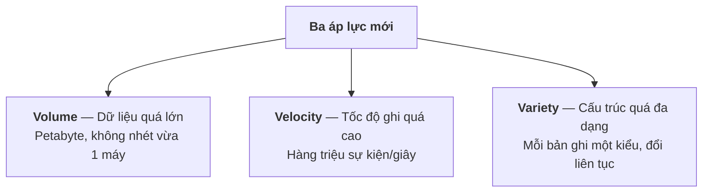
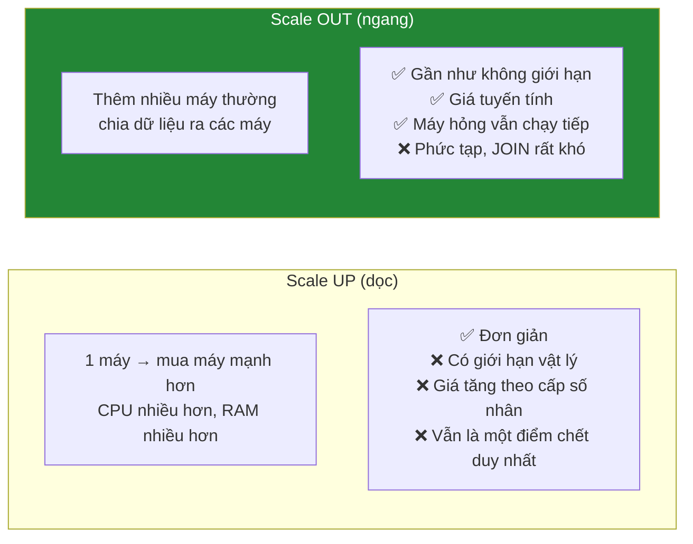
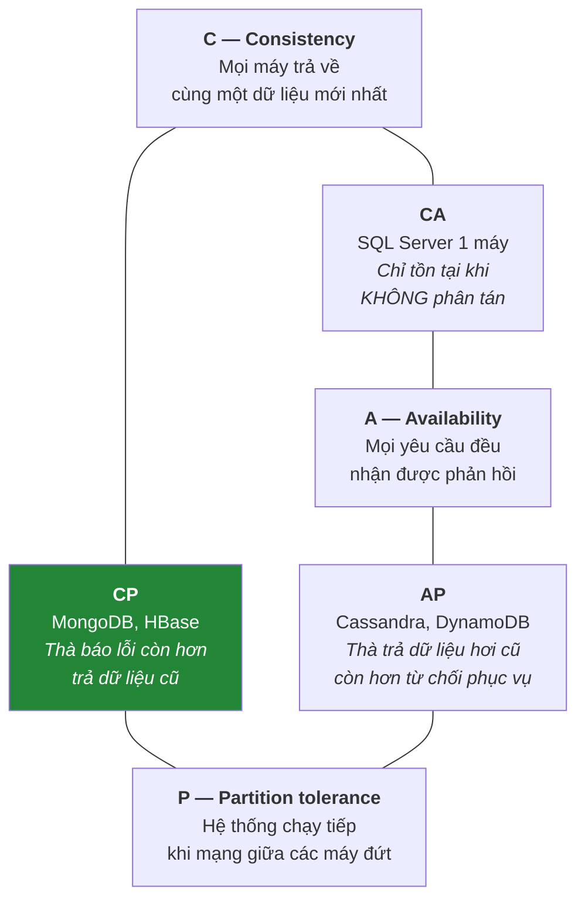
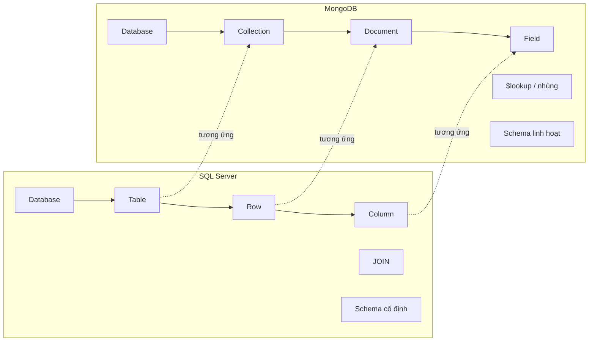
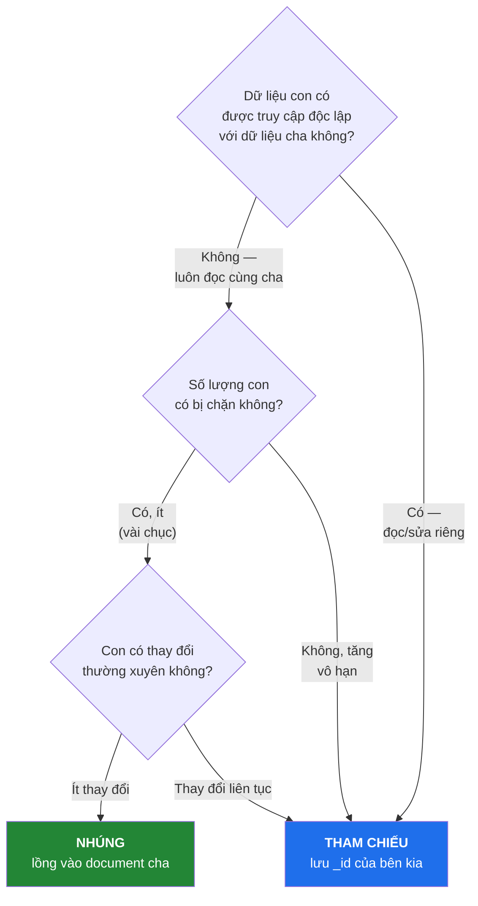
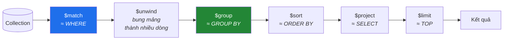
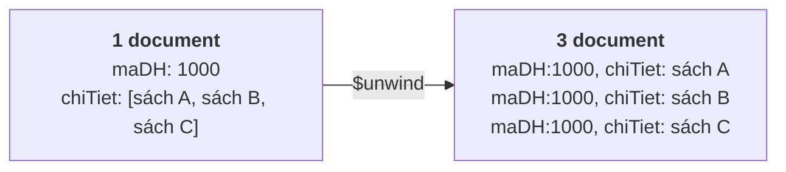

# Buổi 9 — NoSQL và MongoDB

> **Mục tiêu sau buổi học**
> 1. Giải thích được NoSQL sinh ra để giải bài toán gì mà SQL làm không tốt.
> 2. Thành thạo CRUD trong MongoDB, ánh xạ được từng lệnh sang SQL tương ứng.
> 3. Quyết định được khi nào **nhúng** và khi nào **tham chiếu**.
> 4. Viết được Aggregation Pipeline tương đương `GROUP BY` + `JOIN`.

---

## 1. Vì sao NoSQL ra đời

Đầu những năm 2000, Google/Amazon/Facebook gặp bài toán mà CSDL quan hệ không
giải nổi bằng cách mở rộng thông thường:



### Hai cách mở rộng



CSDL quan hệ được thiết kế cho scale UP. NoSQL sinh ra để scale OUT.

### Định lý CAP

Khi dữ liệu nằm trên nhiều máy và mạng giữa chúng có thể đứt, **chỉ chọn được 2 trong 3**:



> **Điểm quan trọng phải nói rõ:** khi đã phân tán, `P` là **bắt buộc** (mạng
> chắc chắn sẽ đứt lúc nào đó). Nên lựa chọn thật sự chỉ là **CP hay AP**.

**ACID vs BASE:**

| ACID (SQL) | BASE (nhiều NoSQL) |
|------------|-------------------|
| **A**tomicity | **B**asically **A**vailable — luôn phản hồi |
| **C**onsistency | **S**oft state — trạng thái có thể đang thay đổi |
| **I**solation | **E**ventually consistent — *rồi sẽ* nhất quán |
| **D**urability | |

*Ví dụ eventual consistency:* bạn đăng bài Facebook, bạn thấy ngay, nhưng bạn bè
ở nước khác thấy sau 2 giây. Chấp nhận được. Còn số dư ngân hàng thì **không**.

---

## 2. MongoDB — mô hình dữ liệu



Document được lưu dạng **BSON** (Binary JSON) — JSON có thêm kiểu dữ liệu
(`ObjectId`, `Date`, `Decimal128`, `Binary`).

```javascript
{
  _id: ObjectId("65f1a2b3c4d5e6f7a8b9c0d1"),   // khóa chính, MongoDB tự sinh
  tenSach: "Nhà giả kim",
  giaBan: NumberDecimal("79000"),               // dùng Decimal cho tiền!
  danhMuc: "Tiểu thuyết",
  tacGia: ["Paulo Coelho"],                     // mảng
  thongTinXB: {                                 // object lồng nhau
    nhaXuatBan: "NXB Hội Nhà Văn",
    nam: 2020,
    soTrang: 228
  },
  tags: ["bestseller", "triết lý", "phiêu lưu"],
  ngayTao: ISODate("2025-01-15T00:00:00Z")
}
```

---

## 3. CRUD — đối chiếu trực tiếp với SQL

Mọi lệnh dưới đây chạy trong `mongosh`.

```javascript
use BookStore
```

### CREATE

| SQL | MongoDB |
|-----|---------|
| `INSERT INTO Sach (...) VALUES (...)` | `db.sach.insertOne({...})` |
| `INSERT ... VALUES (...), (...)` | `db.sach.insertMany([{...}, {...}])` |

```javascript
db.sach.insertOne({
  tenSach: "Nhà giả kim",
  giaBan: NumberDecimal("79000"),
  soLuongTon: 120,
  danhMuc: "Tiểu thuyết",
  tacGia: ["Paulo Coelho"],
  namXuatBan: 2020,
  tags: ["bestseller", "triết lý"]
})

db.sach.insertMany([
  { tenSach: "Đắc nhân tâm", giaBan: NumberDecimal("88000"), soLuongTon: 200,
    danhMuc: "Kỹ năng sống", tacGia: ["Dale Carnegie"], namXuatBan: 2019 },
  { tenSach: "Sapiens", giaBan: NumberDecimal("189000"), soLuongTon: 45,
    danhMuc: "Khoa học", tacGia: ["Yuval Noah Harari"], namXuatBan: 2021,
    giaiThuong: ["Sách hay 2015"] }        // ← trường chỉ document này có
])
```

### READ

| SQL | MongoDB |
|-----|---------|
| `SELECT * FROM Sach` | `db.sach.find()` |
| `SELECT TenSach, GiaBan FROM Sach` | `db.sach.find({}, { tenSach: 1, giaBan: 1, _id: 0 })` |
| `WHERE GiaBan > 100000` | `db.sach.find({ giaBan: { $gt: 100000 } })` |
| `WHERE a = 1 AND b = 2` | `db.sach.find({ a: 1, b: 2 })` |
| `WHERE a = 1 OR b = 2` | `db.sach.find({ $or: [{a:1}, {b:2}] })` |
| `WHERE MaDM IN (3,5)` | `db.sach.find({ maDM: { $in: [3,5] } })` |
| `WHERE TenSach LIKE '%kim%'` | `db.sach.find({ tenSach: /kim/i })` |
| `WHERE ISBN IS NULL` | `db.sach.find({ isbn: { $exists: false } })` |
| `ORDER BY GiaBan DESC` | `.sort({ giaBan: -1 })` |
| `TOP 5` | `.limit(5)` |
| `OFFSET 10 FETCH 5` | `.skip(10).limit(5)` |
| `SELECT COUNT(*)` | `db.sach.countDocuments()` |
| `SELECT DISTINCT danhMuc` | `db.sach.distinct("danhMuc")` |

**Toán tử so sánh:** `$eq $ne $gt $gte $lt $lte $in $nin`
**Toán tử logic:** `$and $or $not $nor`
**Toán tử phần tử:** `$exists $type`
**Toán tử mảng:** `$all $elemMatch $size`

```javascript
// Sách giá 50k–150k, thuộc 2 danh mục, sắp xếp giá giảm dần, lấy 5 cuốn
db.sach.find(
  {
    giaBan: { $gte: 50000, $lte: 150000 },
    danhMuc: { $in: ["Tiểu thuyết", "Kỹ năng sống"] }
  },
  { tenSach: 1, giaBan: 1, danhMuc: 1, _id: 0 }
).sort({ giaBan: -1 }).limit(5)

// Truy vấn vào trường lồng nhau — dùng dấu chấm
db.sach.find({ "thongTinXB.nam": { $gte: 2020 } })

// Truy vấn trong mảng — tự động khớp bất kỳ phần tử nào
db.sach.find({ tacGia: "Paulo Coelho" })
db.sach.find({ tags: { $all: ["bestseller", "triết lý"] } })   // có ĐỦ cả hai
db.sach.find({ tacGia: { $size: 2 } })                          // đúng 2 tác giả
```

### UPDATE

| SQL | MongoDB |
|-----|---------|
| `UPDATE ... SET x = 1 WHERE ...` | `db.c.updateOne(<lọc>, { $set: { x: 1 } })` |
| Cập nhật nhiều dòng | `db.c.updateMany(...)` |
| `SET x = x + 1` | `{ $inc: { x: 1 } }` |

```javascript
db.sach.updateOne(
  { tenSach: "Nhà giả kim" },
  { $set: { giaBan: NumberDecimal("85000") },
    $inc: { soLuongTon: -5 },
    $currentDate: { ngayCapNhat: true } }
)

// Tăng giá 10% cho mọi sách Khoa học
db.sach.updateMany({ danhMuc: "Khoa học" }, { $mul: { giaBan: 1.1 } })

// Thao tác mảng
db.sach.updateOne({ tenSach: "Sapiens" }, { $push:     { tags: "lịch sử" } })
db.sach.updateOne({ tenSach: "Sapiens" }, { $addToSet: { tags: "lịch sử" } })  // không thêm nếu đã có
db.sach.updateOne({ tenSach: "Sapiens" }, { $pull:     { tags: "cũ" } })

// upsert: có thì sửa, không có thì tạo mới
db.sach.updateOne(
  { isbn: "978-604-1-99999-9" },
  { $set: { tenSach: "Sách mới", giaBan: NumberDecimal("100000") } },
  { upsert: true }
)
```

> ⚠️ **Lỗi kinh điển của người mới:** quên `$set`.
> `db.sach.updateOne({...}, { giaBan: 90000 })` → lỗi, hoặc ở driver cũ sẽ
> **thay thế toàn bộ document**, làm mất mọi trường khác.

### DELETE

```javascript
db.sach.deleteOne({ tenSach: "Sách mới" })
db.sach.deleteMany({ soLuongTon: 0 })
db.sach.deleteMany({})        // ⚠️ xóa sạch collection
```

---

## 4. 🎯 Thiết kế document: NHÚNG hay THAM CHIẾU

Đây là **quyết định quan trọng nhất** khi làm việc với MongoDB.



### Nhúng (Embedding)

```javascript
db.donhang.insertOne({
  maDH: 1000,
  ngayDat: ISODate("2025-01-05"),
  khachHang: { maKH: 1, hoTen: "Trần Thị Bích", sdt: "0901234567" },
  chiTiet: [
    { maSach: 1, tenSach: "Nhà giả kim",  donGia: NumberDecimal("79000"), soLuong: 2 },
    { maSach: 2, tenSach: "Đắc nhân tâm", donGia: NumberDecimal("88000"), soLuong: 1 }
  ],
  tongTien: NumberDecimal("246000"),
  trangThai: "HoanThanh"
})

// Lấy toàn bộ đơn hàng bằng MỘT lần đọc — không JOIN
db.donhang.findOne({ maDH: 1000 })
```

| ✅ Ưu điểm | ❌ Nhược điểm |
|-----------|--------------|
| Đọc cực nhanh, 1 lần truy cập đĩa | Trùng lặp dữ liệu |
| Cập nhật cả cụm là nguyên tử | Sửa tên khách → phải sửa mọi đơn |
| Không cần JOIN | Document có giới hạn **16 MB** |

### Tham chiếu (Referencing)

```javascript
db.khachhang.insertOne({ _id: 1, hoTen: "Trần Thị Bích", email: "bich@email.vn" })
db.donhang.insertOne({ maDH: 1000, maKH: 1, tongTien: NumberDecimal("246000") })

// Phải nối bằng $lookup (tương đương LEFT JOIN)
db.donhang.aggregate([
  { $lookup: { from: "khachhang", localField: "maKH", foreignField: "_id", as: "kh" } },
  { $unwind: "$kh" },
  { $project: { maDH: 1, tongTien: 1, tenKH: "$kh.hoTen" } }
])
```

### Bảng quyết định nhanh

| Tình huống | Cách làm | Lý do |
|-----------|----------|-------|
| Địa chỉ của khách hàng | **Nhúng** | Ít, luôn đọc cùng khách, hiếm khi đổi |
| Chi tiết đơn hàng | **Nhúng** | Số lượng có hạn, luôn đọc cùng đơn, **không đổi sau khi chốt** |
| Bình luận bài viết | **Tham chiếu** (hoặc nhúng vài cái mới nhất) | Tăng vô hạn |
| Sản phẩm trong danh mục | **Tham chiếu** | Sản phẩm được đọc/sửa độc lập |
| Thông tin khách trong đơn hàng | **Nhúng bản chụp** (tên, sđt, địa chỉ giao) | Hóa đơn phải giữ đúng thông tin lúc đặt |

> **Mẫu lai (rất hay dùng):** nhúng vài trường hay đọc nhất + giữ tham chiếu.
> ```javascript
> { maDH: 1000,
>   khachHang: { maKH: 1, hoTen: "Trần Thị Bích" },  // đủ để hiển thị danh sách
>   ... }   // cần đầy đủ thì $lookup sang collection khachhang
> ```

---

## 5. Aggregation Pipeline

Pipeline là chuỗi các **giai đoạn (stage)**, dữ liệu chảy qua từng giai đoạn như
băng chuyền — giống `|` trong Linux.



### Các stage thường dùng

| Stage | Tương đương SQL | Công dụng |
|-------|-----------------|-----------|
| `$match` | `WHERE` | Lọc document — **đặt càng sớm càng tốt** |
| `$group` | `GROUP BY` | Gom nhóm và tính tổng hợp |
| `$sort` | `ORDER BY` | Sắp xếp |
| `$project` | `SELECT` | Chọn/biến đổi trường |
| `$limit` / `$skip` | `TOP` / `OFFSET` | Giới hạn, phân trang |
| `$lookup` | `LEFT JOIN` | Nối collection |
| `$unwind` | (không có) | Bung mỗi phần tử mảng thành một document |
| `$addFields` | thêm cột tính toán | Thêm trường mới |
| `$facet` | nhiều truy vấn song song | Thống kê nhiều chiều một lần |

### Ví dụ 1: Doanh thu theo trạng thái

```javascript
// SQL: SELECT trangThai, COUNT(*), SUM(tongTien) FROM DonHang
//      WHERE ngayDat >= '2025-01-01' GROUP BY trangThai ORDER BY 3 DESC
db.donhang.aggregate([
  { $match: { ngayDat: { $gte: ISODate("2025-01-01") } } },
  { $group: {
      _id: "$trangThai",
      soDon:     { $sum: 1 },
      tongTien:  { $sum: "$tongTien" },
      trungBinh: { $avg: "$tongTien" }
  }},
  { $sort: { tongTien: -1 } },
  { $project: { _id: 0, trangThai: "$_id", soDon: 1, tongTien: 1,
                trungBinh: { $round: ["$trungBinh", 0] } } }
])
```

### Ví dụ 2: `$unwind` — top sách bán chạy từ mảng lồng

```javascript
db.donhang.aggregate([
  { $match: { trangThai: "HoanThanh" } },
  { $unwind: "$chiTiet" },              // 1 đơn 3 sách → 3 document
  { $group: {
      _id: "$chiTiet.maSach",
      tenSach:   { $first: "$chiTiet.tenSach" },
      soCuonBan: { $sum: "$chiTiet.soLuong" },
      doanhThu:  { $sum: { $multiply: ["$chiTiet.soLuong", "$chiTiet.donGia"] } }
  }},
  { $sort: { soCuonBan: -1 } },
  { $limit: 5 }
])
```

**Giải thích `$unwind` bằng hình:**



### Ví dụ 3: `$lookup` — nối collection

```javascript
db.donhang.aggregate([
  { $lookup: {
      from: "khachhang",
      localField: "maKH",
      foreignField: "_id",
      as: "thongTinKH"
  }},
  { $unwind: "$thongTinKH" },     // $lookup trả về MẢNG, cần bung ra
  { $group: {
      _id: "$thongTinKH.thanhPho",
      soKhach: { $addToSet: "$maKH" },
      doanhThu: { $sum: "$tongTien" }
  }},
  { $project: { _id: 0, thanhPho: "$_id", soKhach: { $size: "$soKhach" }, doanhThu: 1 } },
  { $sort: { doanhThu: -1 } }
])
```

> ⚠️ `$lookup` **chậm hơn JOIN của SQL Server** đáng kể, đặc biệt khi không có
> index trên `foreignField`. Nếu bạn thấy mình `$lookup` ở khắp nơi, đó là dấu
> hiệu bạn nên dùng CSDL quan hệ, hoặc nên thiết kế lại theo hướng nhúng.

---

## 6. Index trong MongoDB

```javascript
db.sach.createIndex({ tenSach: 1 })                       // 1 = tăng dần
db.sach.createIndex({ danhMuc: 1, giaBan: -1 })           // tổng hợp
db.sach.createIndex({ isbn: 1 }, { unique: true })        // duy nhất
db.sach.createIndex({ tenSach: "text", moTa: "text" })    // tìm kiếm toàn văn
db.log.createIndex({ ngayTao: 1 }, { expireAfterSeconds: 2592000 })  // TTL: tự xóa sau 30 ngày

db.sach.getIndexes()
db.sach.find({ danhMuc: "Khoa học" }).explain("executionStats")
// Xem "stage": IXSCAN (tốt) hay COLLSCAN (quét toàn bộ — xấu)

// Tìm kiếm toàn văn
db.sach.find({ $text: { $search: "giả kim triết lý" } })
```

Quy tắc thứ tự cột trong index tổng hợp **giống hệt SQL Server** (quy tắc ESR):
**E**quality → **S**ort → **R**ange.

---

## 7. Transaction trong MongoDB

Từ phiên bản 4.0, MongoDB **có** giao dịch ACID đa document (cần replica set):

```javascript
const session = db.getMongo().startSession()
session.startTransaction()
try {
  const sach = session.getDatabase("BookStore").sach
  const dh   = session.getDatabase("BookStore").donhang

  sach.updateOne({ _id: 1 }, { $inc: { soLuongTon: -2 } })
  dh.insertOne({ maDH: 2000, maKH: 1, chiTiet: [{ maSach: 1, soLuong: 2 }] })

  session.commitTransaction()
} catch (e) {
  session.abortTransaction()
  print("Đã hoàn tác: " + e)
} finally {
  session.endSession()
}
```

> **Nhưng:** giao dịch trong MongoDB **tốn kém hơn** SQL Server nhiều. Triết lý
> của MongoDB là *thiết kế document sao cho một thao tác nghiệp vụ chỉ đụng vào
> một document* — khi đó thao tác đã tự nguyên tử, không cần transaction.

---

## 8. THỰC HÀNH — 70 phút

File thực hành: `thuc-hanh/mongo-00-seed.js`, `mongo-01-crud.js`, `mongo-02-aggregation.js`.

### 8.1. Nạp dữ liệu và làm quen (15 phút)

```bash
mongosh "mongodb://localhost:27017/BookStore" --file thuc-hanh/mongo-00-seed.js
mongosh "mongodb://localhost:27017/BookStore"
```

```javascript
show collections
db.sach.countDocuments()
db.sach.findOne()
db.donhang.findOne()
```

### 8.2. CRUD — học viên tự làm (25 phút)

1. Tìm mọi sách có giá trên 100.000, chỉ hiện tên và giá.
2. Tìm sách của tác giả "Nguyễn Nhật Ánh".
3. Tìm sách có tên chứa chữ "sử" (không phân biệt hoa thường).
4. Tìm sách xuất bản từ 2020 trở lại đây **và** còn tồn dưới 50 cuốn.
5. Tìm sách có nhiều hơn 1 tác giả.
6. Tìm sách **không có** trường `isbn`.
7. Sắp xếp sách theo giá giảm dần, lấy 3 cuốn của trang thứ 2.
8. Thêm một cuốn sách mới đầy đủ trường lồng nhau và mảng tags.
9. Tăng giá 5% cho mọi sách thuộc danh mục "Công nghệ thông tin".
10. Thêm tag "khuyen-mai" cho mọi sách tồn trên 100 cuốn (dùng `$addToSet`).
11. Xóa mọi sách có `soLuongTon = 0`.

### 8.3. Aggregation — làm cùng rồi tự làm (25 phút)

12. Đếm số sách theo từng danh mục, sắp xếp giảm dần.
13. Tính giá trung bình, cao nhất, thấp nhất theo danh mục.
14. Top 5 sách bán chạy nhất (dùng `$unwind` trên `chiTiet`).
15. Doanh thu theo tháng của năm 2025.
16. Top 3 khách hàng chi tiêu nhiều nhất.
17. Với mỗi tác giả, đếm số đầu sách và tổng giá trị tồn kho.
    *Gợi ý:* `$unwind: "$tacGia"` trước khi `$group`.
18. Dùng `$lookup` nối `donhang` với `khachhang`, thống kê doanh thu theo thành phố.
19. Tính điểm đánh giá trung bình của mỗi cuốn sách.

### 8.4. Bài tập thiết kế (10 phút, thảo luận)

Cho bài toán **blog**: bài viết, tác giả, bình luận, thẻ (tag), lượt thích.

Hãy quyết định cho từng cặp: **nhúng hay tham chiếu**? Giải thích:
- Bài viết ↔ Tác giả
- Bài viết ↔ Bình luận
- Bài viết ↔ Tags
- Bài viết ↔ Lượt thích (có thể lên tới hàng trăm nghìn)

Sau đó viết ra cấu trúc document `baiviet` mà bạn đề xuất.

---

## 9. Lỗi thường gặp

| Lỗi | Nguyên nhân | Cách sửa |
|-----|-------------|----------|
| `update only works with $ operators` | Quên `$set` | `{ $set: { field: value } }` |
| Document bị mất hết trường sau update | Truyền object trần thay vì `$set` | Luôn dùng toán tử cập nhật |
| So sánh số không ra kết quả | Dữ liệu lưu dạng chuỗi `"79000"` | Thống nhất kiểu; dùng `$toInt`/validator |
| Truy vấn rất chậm | `COLLSCAN` — thiếu index | `explain()` rồi `createIndex()` |
| `$lookup` trả về mảng rỗng | Sai `localField`/`foreignField`, hoặc lệch kiểu (`ObjectId` vs `Number`) | Kiểm tra kiểu của cả hai phía |
| `BSONObjectTooLarge` | Document vượt 16 MB do nhúng mảng vô hạn | Chuyển sang tham chiếu |
| Tính tiền bị sai lẻ | Lưu tiền bằng `Double` | Dùng `NumberDecimal` |
| Dữ liệu bất nhất giữa các document | Không có schema validator | Khai báo `$jsonSchema` (buổi 2) |

---

## 10. Bài tập về nhà

**Bài 1.** Chuyển toàn bộ CSDL `BookStore` từ SQL Server sang MongoDB theo thiết
kế **của bạn**. Viết file `.js` tạo collection và nạp dữ liệu. Trong phần chú
thích, giải thích mỗi quyết định nhúng/tham chiếu.

**Bài 2.** Viết lại **5 truy vấn báo cáo** đã làm ở buổi 6 (SQL) bằng Aggregation
Pipeline. Đặt SQL và MongoDB cạnh nhau, nhận xét cái nào dễ viết hơn và vì sao.

**Bài 3.** Thiết kế collection cho hệ thống **theo dõi cảm biến IoT**: mỗi cảm
biến gửi nhiệt độ/độ ẩm mỗi 10 giây, lưu 1 năm, cần truy vấn "nhiệt độ trung
bình theo giờ của cảm biến X trong tháng qua". Giải thích tại sao MongoDB phù
hợp hơn SQL Server ở đây, và mô hình document bạn chọn.

**Bài 4.** Viết schema validator (`$jsonSchema`) cho collection `sach`, đảm bảo:
`tenSach` bắt buộc và là chuỗi, `giaBan` bắt buộc và > 0, `tacGia` là mảng không
rỗng, `namXuatBan` trong khoảng 1400–2100. Thử chèn 3 document sai để chứng minh
validator hoạt động.

**Bài 5 (đối chiếu).** Lập bảng so sánh 15 thao tác giữa T-SQL và MongoDB
(tạo bảng/collection, chèn, cập nhật, xóa, lọc, sắp xếp, phân trang, gom nhóm,
nối bảng, index, giao dịch, ràng buộc, đếm, distinct, tìm kiếm văn bản).

---

➡️ [Buổi 10 — So sánh SQL vs NoSQL và Đồ án cuối khóa](buoi-10-sql-vs-nosql-do-an.md)
