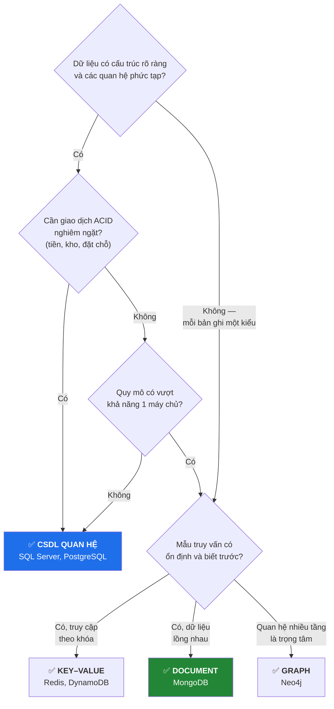
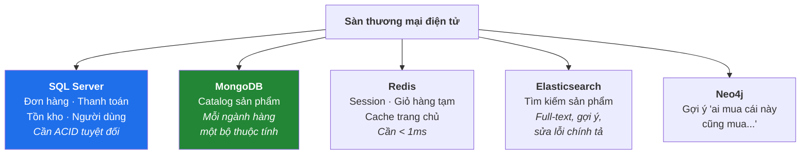
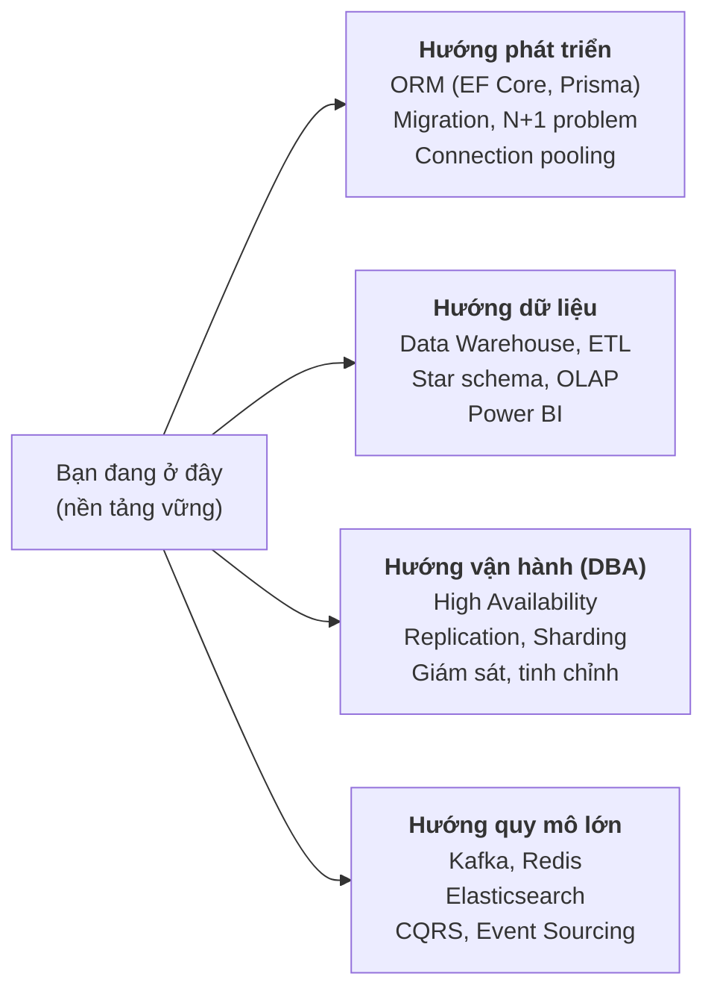

# Buổi 10 — SQL vs NoSQL và Đồ án cuối khóa

> **Mục tiêu sau buổi học**
> 1. Chọn được CSDL phù hợp cho một bài toán và **bảo vệ được lựa chọn đó**.
> 2. Biết mô hình đa CSDL (polyglot persistence) trong hệ thống thật.
> 3. Nắm các thực hành tốt về bảo mật và sao lưu.
> 4. Hoàn thành và trình bày đồ án cuối khóa.

---

## 1. Bảng so sánh tổng hợp

| Tiêu chí | SQL Server (Quan hệ) | MongoDB (Document) |
|----------|---------------------|-------------------|
| **Mô hình dữ liệu** | Bảng – dòng – cột, schema cố định | Document BSON lồng nhau, schema linh hoạt |
| **Ngôn ngữ** | SQL (chuẩn hóa, học một lần dùng mọi nơi) | MQL/Aggregation (riêng của MongoDB) |
| **Schema** | Định nghĩa trước, DBMS bắt tuân thủ | Tùy chọn, ứng dụng tự chịu trách nhiệm |
| **Quan hệ** | JOIN mạnh, khóa ngoại tự động kiểm tra | `$lookup` chậm hơn, **không có khóa ngoại** |
| **Giao dịch** | ACID đầy đủ, rẻ, mặc định | Có từ v4.0 nhưng tốn kém, khuyến khích tránh |
| **Mở rộng** | Scale UP là chính (scale out khó) | Scale OUT bằng sharding, sinh ra để làm việc này |
| **Toàn vẹn dữ liệu** | DBMS đảm bảo | Ứng dụng đảm bảo |
| **Truy vấn tùy biến** | Rất mạnh, bất kỳ chiều nào | Tốt nếu truy vấn khớp với thiết kế document |
| **Thay đổi cấu trúc** | `ALTER TABLE` — tốn kém trên bảng lớn | Thêm trường tự do, không cần migration |
| **Nhân lực** | Rất sẵn, kiến thức dùng lại được | Ít hơn |



### Bốn ngộ nhận cần phá bỏ

| Ngộ nhận | Sự thật |
|----------|---------|
| "NoSQL nhanh hơn SQL" | Nhanh hơn **cho một số mẫu truy vấn nhất định**. Với JOIN phức tạp, SQL Server nhanh hơn nhiều |
| "NoSQL hiện đại hơn nên tốt hơn" | Hai công cụ khác nhau cho hai bài toán khác nhau. SQL vẫn chiếm đa số hệ thống mới |
| "NoSQL không cần thiết kế schema" | Vẫn cần — chỉ là schema nằm trong **code ứng dụng** thay vì trong DBMS. Không thiết kế = thảm họa sau 6 tháng |
| "Dùng NoSQL thì khỏi lo chuẩn hóa" | Vẫn phải hiểu phụ thuộc hàm để quyết định nhúng/tham chiếu |

---

## 2. Polyglot Persistence — hệ thống thật dùng nhiều CSDL



> **Cảnh báo cân bằng:** mỗi CSDL thêm vào là thêm một hệ thống phải vận hành,
> sao lưu, giám sát, và thêm một bộ kiến thức đội ngũ phải có. Nguyên tắc thực
> tế: **bắt đầu bằng một CSDL quan hệ**, chỉ thêm CSDL khác khi có một vấn đề
> cụ thể đã đo được mà nó giải quyết.

### Ví dụ phân tích tình huống — làm cùng cả lớp (15 phút)

| Hệ thống | Lựa chọn hợp lý | Lý do |
|----------|-----------------|-------|
| Ngân hàng lõi | SQL Server / Oracle | ACID là bắt buộc theo luật, quan hệ phức tạp |
| Mạng xã hội (feed) | Cassandra + Redis + Graph | Ghi cực nhiều, chấp nhận trễ vài giây |
| CMS/blog | MongoDB hoặc PostgreSQL | Nội dung lồng nhau, cấu trúc thay đổi |
| Cảm biến IoT | Time-series DB (InfluxDB) / MongoDB | Ghi liên tục, truy vấn theo khoảng thời gian |
| Quản lý sinh viên | SQL Server | Quan hệ rõ, cần báo cáo tùy biến, dữ liệu nhỏ |
| Giỏ hàng đang mua | Redis | Tạm thời, cần rất nhanh, mất cũng không chết ai |
| Kho dữ liệu phân tích | Columnar (BigQuery, Redshift) | Quét hàng tỉ dòng, ít cột |

---

## 3. Bảo mật và vận hành — những thứ không dạy thì sinh viên sẽ không biết

### 3.1. SQL Injection — mối nguy số 1

```csharp
// ❌ CỰC KỲ NGUY HIỂM — nối chuỗi
string sql = "SELECT * FROM NguoiDung WHERE TenDN = '" + tenDN + "'";
// Kẻ tấn công nhập:  ' OR '1'='1' --
// Câu lệnh trở thành: SELECT * FROM NguoiDung WHERE TenDN = '' OR '1'='1' --'
// → trả về TOÀN BỘ người dùng
```

```csharp
// ✅ AN TOÀN — tham số hóa
var cmd = new SqlCommand("SELECT * FROM NguoiDung WHERE TenDN = @tenDN", conn);
cmd.Parameters.AddWithValue("@tenDN", tenDN);
```

**Ba quy tắc bắt buộc:**
1. **Luôn** dùng truy vấn tham số hóa, không bao giờ nối chuỗi.
2. Cấp quyền tối thiểu — tài khoản ứng dụng **không** được là `sa`/`db_owner`.
3. Không hiện thông báo lỗi CSDL ra cho người dùng cuối.

> MongoDB cũng có **NoSQL injection** khi truyền thẳng object từ request:
> gửi `{"password": {"$ne": null}}` sẽ khớp mọi mật khẩu. Luôn ép kiểu đầu vào.

### 3.2. Phân quyền

```sql
CREATE LOGIN app_bookstore WITH PASSWORD = 'M@tKhauManh#2026';
USE BookStore;
CREATE USER app_bookstore FOR LOGIN app_bookstore;

-- Chỉ cấp đúng những gì cần
GRANT SELECT, INSERT, UPDATE ON dbo.DonHang        TO app_bookstore;
GRANT SELECT, INSERT, UPDATE ON dbo.ChiTietDonHang TO app_bookstore;
GRANT SELECT                  ON dbo.Sach          TO app_bookstore;
DENY  DELETE                  ON dbo.KhachHang     TO app_bookstore;

-- Kiểm tra
EXECUTE AS USER = 'app_bookstore';
SELECT * FROM KhachHang;     -- được
DELETE FROM KhachHang;       -- bị từ chối
REVERT;
```

### 3.3. Sao lưu

```sql
-- Full backup
BACKUP DATABASE BookStore
TO DISK = 'C:\Backup\BookStore_Full.bak'
WITH FORMAT, COMPRESSION, STATS = 10;

-- Differential (chỉ phần thay đổi từ full gần nhất)
BACKUP DATABASE BookStore
TO DISK = 'C:\Backup\BookStore_Diff.bak' WITH DIFFERENTIAL;

-- Transaction log (cho phép phục hồi tới đúng một thời điểm)
BACKUP LOG BookStore TO DISK = 'C:\Backup\BookStore_Log.trn';

-- Phục hồi
RESTORE DATABASE BookStore FROM DISK = 'C:\Backup\BookStore_Full.bak'
WITH REPLACE, RECOVERY;
```

MongoDB:
```bash
mongodump --uri="mongodb://localhost:27017/BookStore" --out=./backup
mongorestore --uri="mongodb://localhost:27017" ./backup
```

> **Nguyên tắc 3-2-1:** 3 bản sao, 2 loại phương tiện khác nhau, 1 bản ở nơi
> khác về mặt địa lý. Và: **bản sao lưu chưa từng được phục hồi thử thì chưa
> phải là bản sao lưu.**

---

## 4. Checklist tổng kết khóa học

Phát cho học viên tự đánh giá:

**Thiết kế**
- [ ] Vẽ được ERD từ mô tả nghiệp vụ
- [ ] Xác định đúng khóa chính, khóa ngoại
- [ ] Xử lý đúng quan hệ N–N bằng bảng trung gian
- [ ] Chuẩn hóa được về 3NF và giải thích được từng bước
- [ ] Biết khi nào cố ý phi chuẩn hóa

**SQL**
- [ ] `CREATE`/`ALTER`/`DROP` bảng với đầy đủ ràng buộc
- [ ] `INSERT`/`UPDATE`/`DELETE` theo quy trình an toàn 3 bước
- [ ] Dùng thành thạo 5 loại JOIN, biết bẫy `LEFT JOIN` + `WHERE`
- [ ] `GROUP BY` + `HAVING`, phân biệt với `WHERE`
- [ ] Subquery, CTE, View
- [ ] Window function, giải được bài "top N mỗi nhóm"

**Hiệu năng & An toàn**
- [ ] Tạo index đúng chỗ, biết khi nào **không** nên tạo
- [ ] Đọc được Execution Plan
- [ ] Viết giao dịch có `TRY...CATCH`
- [ ] Giải thích ACID và 4 mức cô lập
- [ ] Biết cách phòng SQL Injection

**NoSQL**
- [ ] CRUD MongoDB
- [ ] Quyết định nhúng vs tham chiếu có lý lẽ
- [ ] Viết Aggregation Pipeline
- [ ] Chọn được CSDL phù hợp cho một bài toán mới

---

## 5. ĐỒ ÁN CUỐI KHÓA

### Yêu cầu chung

Làm nhóm **2–3 người**. Chọn **một** trong các đề dưới đây, hoặc tự đề xuất
(phải được giảng viên duyệt).

| Đề | Bài toán | Điểm khó |
|----|----------|---------|
| **A** | Hệ thống quản lý phòng khám | Lịch hẹn không trùng, đơn thuốc nhiều dòng |
| **B** | Hệ thống đặt vé xem phim | Chống bán trùng ghế (transaction!) |
| **C** | Sàn thương mại điện tử mini | Nhiều người bán, khuyến mãi, đánh giá |
| **D** | Hệ thống quản lý thư viện | Mượn/trả, phạt quá hạn, đặt trước |
| **E** | Mạng xã hội chia sẻ công thức nấu ăn | Nội dung linh hoạt → phần NoSQL nặng |
| **F** | Hệ thống LMS (học trực tuyến) | Khóa học, bài giảng, tiến độ, quiz |

### Sản phẩm phải nộp

**1. Báo cáo phân tích thiết kế (PDF, 10–20 trang)**
- Mô tả nghiệp vụ và phạm vi (rõ cái gì làm, cái gì không làm)
- ERD đầy đủ (Mermaid hoặc công cụ vẽ khác)
- Từ điển dữ liệu: mọi bảng, mọi cột, kiểu, ràng buộc, ý nghĩa
- Chứng minh schema đạt 3NF (chỉ ra phụ thuộc hàm, giải thích)
- Nếu có chỗ phi chuẩn hóa → giải thích lý do

**2. Phần SQL Server (`.sql`)**
- Script tạo CSDL đầy đủ ràng buộc (`schema.sql`)
- Dữ liệu mẫu **có ý nghĩa**, tối thiểu 30 dòng cho bảng chính (`seed.sql`)
- **15 truy vấn** trả lời câu hỏi nghiệp vụ thật, trong đó bắt buộc có:
  - ≥ 3 câu JOIN từ 3 bảng trở lên
  - ≥ 3 câu `GROUP BY` + `HAVING`
  - ≥ 2 câu dùng subquery hoặc CTE
  - ≥ 2 câu dùng window function
- **2 View** phục vụ báo cáo
- **2 Stored Procedure** có transaction + `TRY...CATCH` (ví dụ: đặt vé, mượn sách)
- **Phần tối ưu:** chọn 3 truy vấn chậm, chụp Execution Plan trước/sau khi thêm
  index, lập bảng so sánh số liệu

**3. Phần MongoDB (`.js`)**
- Thiết kế lại **một phần** hệ thống bằng MongoDB
- Giải thích **từng** quyết định nhúng/tham chiếu
- Script tạo collection + validator + index + dữ liệu mẫu
- **8 truy vấn**, trong đó ≥ 3 dùng Aggregation Pipeline

**4. Báo cáo so sánh (2–3 trang)**
- Với hệ thống của nhóm, nên dùng SQL, NoSQL hay cả hai? **Bảo vệ lập luận.**
- Chỉ ra 2 truy vấn dễ hơn hẳn ở SQL, 2 truy vấn dễ hơn hẳn ở MongoDB

**5. Trình bày (15 phút + 5 phút hỏi đáp)**

### Thang điểm

| Hạng mục | Điểm |
|----------|------|
| Thiết kế CSDL (ERD, chuẩn hóa, ràng buộc) | 25 |
| Truy vấn SQL (đúng, đa dạng, giải quyết bài toán thật) | 25 |
| Stored Procedure + Transaction | 10 |
| Tối ưu hiệu năng (index, đo đạc) | 10 |
| Phần MongoDB | 15 |
| Báo cáo so sánh & lập luận | 10 |
| Trình bày | 5 |
| **Tổng** | **100** |

### Câu hỏi giảng viên sẽ hỏi khi bảo vệ

Báo trước cho học viên để họ chuẩn bị:
1. "Vì sao cột này để `NULL` được? Nghiệp vụ nào cần điều đó?"
2. "Nếu xóa một bản ghi ở bảng cha thì bảng con thế nào? Vì sao chọn cách đó?"
3. "Chỉ cho tôi một chỗ trong schema có thể vi phạm 3NF và giải thích."
4. "Nếu hệ thống có 10 triệu bản ghi, truy vấn nào sẽ chết trước? Vì sao?"
5. "Nếu hai người cùng đặt ghế cuối cùng trong 1 phần nghìn giây, chuyện gì xảy ra?"
6. "Vì sao nhóm chọn nhúng ở chỗ này mà tham chiếu ở chỗ kia?"

### Mốc thời gian đề nghị

| Tuần | Nộp gì |
|------|--------|
| Sau buổi 4 | Chọn đề + mô tả nghiệp vụ + ERD nháp |
| Sau buổi 6 | Schema hoàn chỉnh + dữ liệu mẫu + 8 truy vấn |
| Sau buổi 8 | Đủ 15 truy vấn + View + Stored Procedure + phần tối ưu |
| Sau buổi 10 | Phần MongoDB + báo cáo + bảo vệ |

---

## 6. Học tiếp gì sau khóa này



**Tài nguyên đề nghị:**
- *Database System Concepts* — Silberschatz (giáo trình kinh điển)
- *SQL Server Execution Plans* — Grant Fritchey (miễn phí bản PDF)
- *Designing Data-Intensive Applications* — Martin Kleppmann (**đọc sau khi đã
  đi làm 1 năm — cuốn hay nhất về hệ thống dữ liệu hiện đại**)
- MongoDB University (khóa online miễn phí, có chứng chỉ)
- <https://use-the-index-luke.com> — học index qua ví dụ

---

## 7. Lời kết cho lớp

Ba điều muốn học viên nhớ sau 10 buổi:

1. **Thiết kế đúng quan trọng hơn viết truy vấn giỏi.** Một schema tồi sẽ hành hạ
   bạn suốt vòng đời dự án; một truy vấn dở thì sửa trong 10 phút.
2. **Luôn hỏi "vì sao" trước khi chọn công nghệ.** Không có CSDL nào tốt nhất,
   chỉ có CSDL phù hợp nhất với ràng buộc cụ thể của bạn.
3. **Dữ liệu sống lâu hơn ứng dụng.** Code sẽ được viết lại 3–4 lần, framework
   sẽ lỗi thời, nhưng dữ liệu khách hàng thì còn mãi. Hãy đối xử với nó tương xứng.

---

⬅️ [Về trang chủ giáo trình](README.md)
