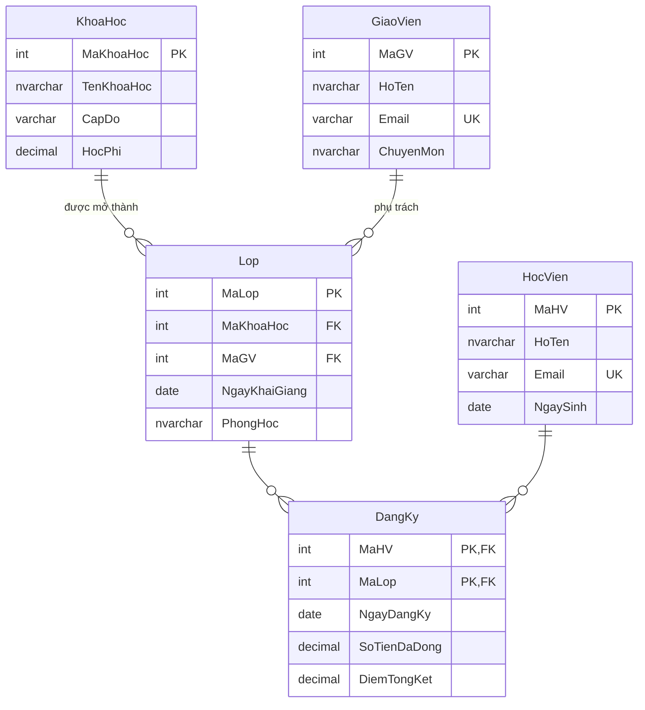
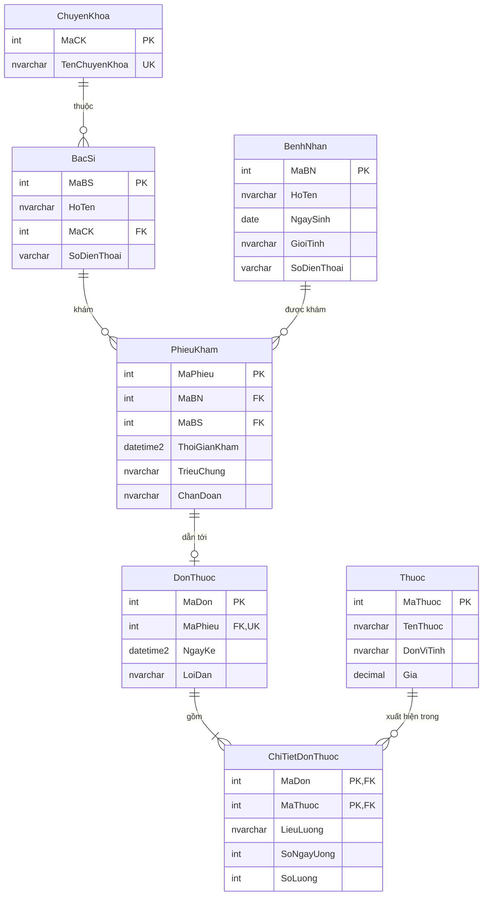

# Đáp án Buổi 3 — Thiết kế ERD

> ⚠️ Tài liệu dành cho giảng viên. Đừng phát cho học viên trước khi họ tự làm.

---

## Bài tập tại lớp 6.1 — Trung tâm ngoại ngữ ABC

### Thực thể và thuộc tính

| Thực thể | Thuộc tính | Khóa chính |
|----------|-----------|------------|
| `KhoaHoc` | MaKhoaHoc, TenKhoaHoc, CapDo, HocPhi | MaKhoaHoc |
| `Lop` | MaLop, NgayKhaiGiang, PhongHoc | MaLop |
| `GiaoVien` | MaGV, HoTen, Email, ChuyenMon | MaGV |
| `HocVien` | MaHV, HoTen, Email, NgaySinh | MaHV |
| `DangKy` *(liên kết có thuộc tính)* | NgayDangKy, SoTienDaDong, DiemTongKet | (MaHV, MaLop) |

### Liên kết và bản số

| Liên kết | Bản số | Kiểm chứng hai chiều |
|----------|--------|---------------------|
| `KhoaHoc` — `Lop` | 1 – N | Một khóa học mở thành **nhiều** lớp / Một lớp thuộc **đúng một** khóa học |
| `GiaoVien` — `Lop` | 1 – N | Một giáo viên dạy **nhiều** lớp / Một lớp có **đúng một** giáo viên phụ trách |
| `HocVien` — `Lop` | **N – N** | Một học viên học **nhiều** lớp / Một lớp có **nhiều** học viên |

### ERD



### Ba lỗi các nhóm hay mắc — cần chữa kỹ

**1. Gộp `KhoaHoc` và `Lop` làm một.**
Đây là lỗi phổ biến nhất. Hỏi lại lớp: *"Khóa 'Tiếng Anh B1' mở 3 đợt trong năm,
mỗi đợt giáo viên khác nhau, phòng khác nhau. Nếu gộp một bảng thì học phí và
tên khóa bị lặp 3 lần — vi phạm gì?"* → vi phạm 2NF (buổi 4).

**2. Đặt `DiemTongKet` vào bảng `HocVien`.**
Sai: một học viên học nhiều lớp thì có nhiều điểm. Điểm phụ thuộc vào **cặp**
`(MaHV, MaLop)`, nên phải nằm ở bảng liên kết.

**3. Bỏ qua bảng `DangKy`, đặt `MaLop` vào `HocVien`.**
Sai: học viên chỉ học được một lớp. Không mô tả đúng nghiệp vụ N–N.

### Câu hỏi mở rộng cho nhóm làm nhanh

- Nếu một lớp có thể do **2 giáo viên** cùng dạy (chính + trợ giảng), sơ đồ đổi
  thế nào? → `Lop` — `GiaoVien` trở thành N–N, cần bảng `PhanCong(MaLop, MaGV, VaiTro)`.
- Nếu học viên có thể **học lại** cùng một lớp? → khóa chính `(MaHV, MaLop)` không
  còn đủ, cần thêm `LanHoc` hoặc dùng khóa thay thế `MaDangKy INT IDENTITY`.

---

## Bài tập về nhà 2 & 3 — Hệ thống phòng khám

### ERD



**Điểm cần giải thích:**
- `PhieuKham ||--o| DonThuoc` là **1–1 tùy chọn**: không phải lần khám nào cũng
  kê đơn. Cài đặt: đặt `MaPhieu` ở bảng `DonThuoc` và thêm `UNIQUE`.
- `ChiTietDonThuoc` là bảng trung gian N–N **có thuộc tính riêng** (liều lượng,
  số ngày uống) — đây chính là ý mà bài 4 muốn học viên thấy.

### CREATE TABLE

```sql
CREATE TABLE ChuyenKhoa (
    MaCK          INT IDENTITY(1,1) NOT NULL,
    TenChuyenKhoa NVARCHAR(100)     NOT NULL,
    CONSTRAINT PK_ChuyenKhoa PRIMARY KEY (MaCK),
    CONSTRAINT UQ_ChuyenKhoa_Ten UNIQUE (TenChuyenKhoa)
);

CREATE TABLE BacSi (
    MaBS        INT IDENTITY(1,1) NOT NULL,
    HoTen       NVARCHAR(100) NOT NULL,
    MaCK        INT           NOT NULL,
    SoDienThoai VARCHAR(15)   NULL,
    CONSTRAINT PK_BacSi PRIMARY KEY (MaBS),
    CONSTRAINT FK_BacSi_ChuyenKhoa FOREIGN KEY (MaCK) REFERENCES ChuyenKhoa(MaCK)
);

CREATE TABLE BenhNhan (
    MaBN        INT IDENTITY(1,1) NOT NULL,
    HoTen       NVARCHAR(100) NOT NULL,
    NgaySinh    DATE          NULL,
    GioiTinh    NVARCHAR(10)  NULL,
    SoDienThoai VARCHAR(15)   NULL,
    CONSTRAINT PK_BenhNhan PRIMARY KEY (MaBN),
    CONSTRAINT CK_BenhNhan_GioiTinh CHECK (GioiTinh IS NULL OR GioiTinh IN (N'Nam', N'Nữ', N'Khác')),
    CONSTRAINT CK_BenhNhan_NgaySinh CHECK (NgaySinh IS NULL OR NgaySinh <= CAST(GETDATE() AS DATE))
);

CREATE TABLE PhieuKham (
    MaPhieu      INT IDENTITY(1,1) NOT NULL,
    MaBN         INT NOT NULL,
    MaBS         INT NOT NULL,
    ThoiGianKham DATETIME2(0) NOT NULL CONSTRAINT DF_PK_TG DEFAULT SYSDATETIME(),
    TrieuChung   NVARCHAR(500) NULL,
    ChanDoan     NVARCHAR(500) NULL,
    CONSTRAINT PK_PhieuKham PRIMARY KEY (MaPhieu),
    CONSTRAINT FK_PhieuKham_BenhNhan FOREIGN KEY (MaBN) REFERENCES BenhNhan(MaBN),
    CONSTRAINT FK_PhieuKham_BacSi    FOREIGN KEY (MaBS) REFERENCES BacSi(MaBS)
);

CREATE TABLE Thuoc (
    MaThuoc    INT IDENTITY(1,1) NOT NULL,
    TenThuoc   NVARCHAR(150) NOT NULL,
    DonViTinh  NVARCHAR(30)  NOT NULL,
    Gia        DECIMAL(12,2) NOT NULL,
    CONSTRAINT PK_Thuoc PRIMARY KEY (MaThuoc),
    CONSTRAINT UQ_Thuoc_Ten UNIQUE (TenThuoc),
    CONSTRAINT CK_Thuoc_Gia CHECK (Gia >= 0)          -- CHECK 1
);

CREATE TABLE DonThuoc (
    MaDon    INT IDENTITY(1,1) NOT NULL,
    MaPhieu  INT NOT NULL,
    NgayKe   DATETIME2(0) NOT NULL CONSTRAINT DF_DT_Ngay DEFAULT SYSDATETIME(),
    LoiDan   NVARCHAR(500) NULL,
    CONSTRAINT PK_DonThuoc PRIMARY KEY (MaDon),
    CONSTRAINT UQ_DonThuoc_Phieu UNIQUE (MaPhieu),     -- ← ép quan hệ 1–1
    CONSTRAINT FK_DonThuoc_PhieuKham FOREIGN KEY (MaPhieu)
        REFERENCES PhieuKham(MaPhieu) ON DELETE CASCADE
);

CREATE TABLE ChiTietDonThuoc (
    MaDon      INT NOT NULL,
    MaThuoc    INT NOT NULL,
    LieuLuong  NVARCHAR(100) NOT NULL,
    SoNgayUong INT NOT NULL,
    SoLuong    INT NOT NULL,
    CONSTRAINT PK_ChiTietDonThuoc PRIMARY KEY (MaDon, MaThuoc),
    CONSTRAINT FK_CTDT_DonThuoc FOREIGN KEY (MaDon)   REFERENCES DonThuoc(MaDon) ON DELETE CASCADE,
    CONSTRAINT FK_CTDT_Thuoc    FOREIGN KEY (MaThuoc) REFERENCES Thuoc(MaThuoc),
    CONSTRAINT CK_CTDT_SoNgay   CHECK (SoNgayUong > 0),   -- CHECK 2
    CONSTRAINT CK_CTDT_SoLuong  CHECK (SoLuong > 0)       -- CHECK 3
);
```

**Thứ tự tạo bảng bắt buộc:** `ChuyenKhoa` → `BacSi` → `BenhNhan` → `PhieuKham`
→ `Thuoc` → `DonThuoc` → `ChiTietDonThuoc`. Cha trước, con sau.

---

## Bài tập về nhà 4 — Phản biện thiết kế đơn thuốc gộp chuỗi

Thiết kế bị phê phán:
```
DonThuoc(MaDon, MaBenhNhan, NgayKe, DanhSachThuoc)
```

**Bốn vấn đề và câu hỏi nghiệp vụ không trả lời được:**

| # | Vấn đề | Câu hỏi CSDL bó tay |
|---|--------|---------------------|
| 1 | **Vi phạm 1NF** — ô chứa nhiều giá trị | *"Tháng này kê Paracetamol tổng cộng bao nhiêu viên?"* — phải phân tích chuỗi bằng tay |
| 2 | **Không có toàn vẹn tham chiếu** — tên thuốc là chuỗi tự do | *"Danh sách đơn có kê thuốc mã T015?"* — không JOIN được; ai đó gõ "Paracetamol" / "paracetamol" / "Para 500" là ba loại thuốc khác nhau trong mắt hệ thống |
| 3 | **Không tính được tiền** — không có giá, không có số lượng dạng số | *"Tổng tiền thuốc của bệnh nhân này trong quý?"* — không tính được |
| 4 | **Không kiểm tra được nghiệp vụ** | *"Cảnh báo khi kê 2 thuốc tương tác nhau"* / *"Trừ tồn kho thuốc"* — không làm được vì không biết đơn gồm những mã thuốc nào |

**Vấn đề thứ 5 (thưởng điểm nếu học viên tìm ra):** không thống kê được thuốc
nào được kê nhiều nhất → không lập được kế hoạch nhập kho.

**Cách sửa:** tách thành `DonThuoc` + `ChiTietDonThuoc` + `Thuoc` như phần trên.

---

## Bài tập về nhà 1 — Bản số các cặp

| Cặp | Bản số | Giải thích hai chiều |
|-----|--------|---------------------|
| a) `SinhVien` – `LopHanhChinh` | **N – 1** | Một SV thuộc đúng 1 lớp / Một lớp có nhiều SV → khóa ngoại `MaLop` ở bảng `SinhVien` |
| b) `SinhVien` – `MonHoc` | **N – N** | Một SV học nhiều môn / Một môn có nhiều SV → bảng `KetQua(MaSV, MaMon, Diem)` |
| c) `NguoiDung` – `TaiKhoanNganHang` | Tùy nghiệp vụ: **1 – N** (một người nhiều tài khoản) hoặc **N – N** (tài khoản đồng sở hữu) | Phải **hỏi khách hàng**, không tự suy diễn |
| d) `NhanVien` – `NhanVien` (quản lý) | **1 – N đệ quy** | Một NV có 1 sếp / Một sếp quản nhiều NV → cột `MaQuanLy` khóa ngoại trỏ về chính bảng, cho phép `NULL` (giám đốc không có sếp) |

> **Điểm sư phạm ở câu (c):** đây là lúc dạy học viên rằng thiết kế CSDL không
> phải bài toán có một đáp án. Câu trả lời đúng là *"tôi cần hỏi thêm khách hàng"*.
