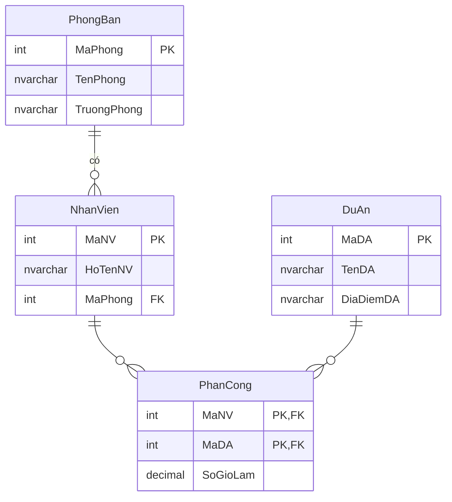

# Đáp án Buổi 4 — Chuẩn hóa

> ⚠️ Tài liệu dành cho giảng viên.

---

## Bài tập tại lớp 7.2 — Bảng quản lý dự án

```
DuAn(MaNV, HoTenNV, MaPhong, TenPhong, TruongPhong, MaDA, TenDA, DiaDiemDA, SoGioLam)

F = { MaNV        → HoTenNV, MaPhong
      MaPhong     → TenPhong, TruongPhong
      MaDA        → TenDA, DiaDiemDA
      MaNV, MaDA  → SoGioLam }
```

### Câu 1 — Khóa chính

**`{MaNV, MaDA}`**

*Chứng minh:* từ `{MaNV, MaDA}` suy ra được `HoTenNV, MaPhong` (qua `MaNV`),
rồi `TenPhong, TruongPhong` (qua `MaPhong`), rồi `TenDA, DiaDiemDA` (qua `MaDA`),
và `SoGioLam` trực tiếp → bao phủ toàn bộ thuộc tính. Bỏ `MaNV` hay `MaDA` đều
mất tính bao phủ → đây là khóa **tối thiểu**.

### Câu 2 — Đang ở dạng chuẩn nào?

**Đang ở 1NF** (mọi ô nguyên tố, có khóa chính) nhưng **vi phạm 2NF**.

Phụ thuộc bộ phận vi phạm — chỉ cần nêu một, nhưng nên liệt kê hết cho học viên thấy:

| Phụ thuộc | Vi phạm |
|-----------|---------|
| `MaNV → HoTenNV, MaPhong` | Chỉ phụ thuộc **một phần** khóa `{MaNV, MaDA}` |
| `MaDA → TenDA, DiaDiemDA` | Chỉ phụ thuộc **một phần** khóa |

*Hậu quả cụ thể cần chỉ ra:* nhân viên tham gia 5 dự án → tên nhân viên lặp 5
lần. Đổi tên phòng phải sửa hàng trăm dòng.

### Câu 3 — Đưa về 2NF

Tách theo từng phần khóa:

```
NhanVien(MaNV, HoTenNV, MaPhong, TenPhong, TruongPhong)
DuAn(MaDA, TenDA, DiaDiemDA)
PhanCong(MaNV, MaDA, SoGioLam)
```

Đã đạt 2NF: trong `PhanCong`, `SoGioLam` phụ thuộc đầy đủ vào cả `{MaNV, MaDA}`.

### Câu 4 — Đưa về 3NF

Bảng `NhanVien` còn phụ thuộc **bắc cầu**:
`MaNV → MaPhong → TenPhong, TruongPhong`, mà `MaPhong` không phải khóa.

*Hậu quả:* không thể lưu một phòng ban chưa có nhân viên nào (dị thường thêm);
xóa nhân viên cuối của phòng thì mất luôn thông tin phòng (dị thường xóa).

Tách tiếp:

```
NhanVien(MaNV, HoTenNV, MaPhong)          -- MaPhong là FK
PhongBan(MaPhong, TenPhong, TruongPhong)
DuAn(MaDA, TenDA, DiaDiemDA)
PhanCong(MaNV, MaDA, SoGioLam)
```



### Câu 5 — CREATE TABLE

```sql
CREATE TABLE PhongBan (
    MaPhong     INT IDENTITY(1,1) NOT NULL,
    TenPhong    NVARCHAR(100) NOT NULL,
    TruongPhong NVARCHAR(100) NULL,
    CONSTRAINT PK_PhongBan PRIMARY KEY (MaPhong),
    CONSTRAINT UQ_PhongBan_Ten UNIQUE (TenPhong)
);

CREATE TABLE NhanVien (
    MaNV     INT IDENTITY(1,1) NOT NULL,
    HoTenNV  NVARCHAR(100) NOT NULL,
    MaPhong  INT NOT NULL,
    CONSTRAINT PK_NhanVien PRIMARY KEY (MaNV),
    CONSTRAINT FK_NhanVien_PhongBan FOREIGN KEY (MaPhong) REFERENCES PhongBan(MaPhong)
);

CREATE TABLE DuAn (
    MaDA      INT IDENTITY(1,1) NOT NULL,
    TenDA     NVARCHAR(150) NOT NULL,
    DiaDiemDA NVARCHAR(150) NULL,
    CONSTRAINT PK_DuAn PRIMARY KEY (MaDA)
);

CREATE TABLE PhanCong (
    MaNV     INT NOT NULL,
    MaDA     INT NOT NULL,
    SoGioLam DECIMAL(8,2) NOT NULL CONSTRAINT DF_PC_Gio DEFAULT 0,
    CONSTRAINT PK_PhanCong PRIMARY KEY (MaNV, MaDA),
    CONSTRAINT FK_PhanCong_NhanVien FOREIGN KEY (MaNV) REFERENCES NhanVien(MaNV),
    CONSTRAINT FK_PhanCong_DuAn     FOREIGN KEY (MaDA) REFERENCES DuAn(MaDA),
    CONSTRAINT CK_PhanCong_Gio      CHECK (SoGioLam >= 0)
);
```

> **Ghi chú thiết kế đáng bàn với lớp:** `TruongPhong` đang là chuỗi tên. Nếu
> trưởng phòng cũng là một nhân viên, nên đổi thành `MaTruongPhong INT` khóa
> ngoại về `NhanVien` — nhưng khi đó sinh ra phụ thuộc vòng giữa hai bảng, phải
> cho phép `NULL` và tạo khóa ngoại bằng `ALTER TABLE` sau khi cả hai bảng đã tồn tại.

---

## Bài tập về nhà 1

`SinhVien(MaSV, HoTen, MaLop, TenLop, MaKhoa, TenKhoa)`

```
MaSV   → HoTen, MaLop
MaLop  → TenLop, MaKhoa
MaKhoa → TenKhoa
```

**Phụ thuộc bắc cầu:**
- `MaSV → MaLop → TenLop` (bắc cầu qua `MaLop`)
- `MaSV → MaLop → MaKhoa → TenKhoa` (bắc cầu **hai tầng**)

**Kết quả 3NF:**
```
SinhVien(MaSV, HoTen, MaLop)
Lop(MaLop, TenLop, MaKhoa)
Khoa(MaKhoa, TenKhoa)
```

---

## Bài tập về nhà 2

`KetQua(MaSV, MaMon, HoTenSV, TenMon, SoTinChi, Diem)` — khóa chính `{MaSV, MaMon}`.

**Vi phạm 2NF** vì:
- `MaSV → HoTenSV` (chỉ phụ thuộc một phần khóa)
- `MaMon → TenMon, SoTinChi` (chỉ phụ thuộc một phần khóa)

**Ví dụ số liệu để chứng minh:**

| MaSV | MaMon | HoTenSV | TenMon | SoTinChi | Diem |
|------|-------|---------|--------|----------|------|
| SV01 | CSDL | Nguyễn Văn An | Cơ sở dữ liệu | 3 | 8.5 |
| SV01 | MMT | Nguyễn Văn An | Mạng máy tính | 3 | 7.0 |
| SV02 | CSDL | Trần Thị Bích | Cơ sở dữ liệu | 3 | 9.0 |

- "Nguyễn Văn An" lặp lại ở mọi môn An học → đổi tên phải sửa nhiều dòng.
- "Cơ sở dữ liệu / 3 tín chỉ" lặp ở mọi sinh viên học môn đó → đổi số tín chỉ
  từ 3 lên 4 phải sửa hàng nghìn dòng, sót một dòng là báo cáo học vụ sai.
- Không thể thêm môn học mới chưa có sinh viên nào đăng ký (dị thường thêm).

**3NF:** `SinhVien(MaSV, HoTenSV)`, `MonHoc(MaMon, TenMon, SoTinChi)`,
`KetQua(MaSV, MaMon, Diem)`.

---

## Bài tập về nhà 3 — Hóa đơn nhà thuốc

### 0NF (bảng gốc)

| SoHD | NgayBan | TenKH | SDT | DanhSachThuoc | TongTien |
|------|---------|-------|-----|---------------|----------|
| HD01 | 01/03 | Nguyễn Văn A | 0901... | Paracetamol(20v, 500đ/v), Vitamin C(10v, 1000đ/v) | 20000 |

### → 1NF: tách ô đa trị thành nhiều dòng

```
HoaDonPhang(SoHD, NgayBan, TenKH, SDT, TenThuoc, SoLuong, DonGia)
Khóa chính: {SoHD, TenThuoc}
```

| SoHD | NgayBan | TenKH | SDT | TenThuoc | SoLuong | DonGia |
|------|---------|-------|-----|----------|---------|--------|
| HD01 | 01/03 | Nguyễn Văn A | 0901... | Paracetamol | 20 | 500 |
| HD01 | 01/03 | Nguyễn Văn A | 0901... | Vitamin C | 10 | 1000 |

> **Lưu ý:** bỏ `TongTien` vì đây là **thuộc tính suy diễn**
> (`SUM(SoLuong × DonGia)`), không được lưu.

### → 2NF: tách phụ thuộc bộ phận

`SoHD → NgayBan, TenKH, SDT` chỉ phụ thuộc một phần khóa.

```
HoaDon(SoHD, NgayBan, TenKH, SDT)
ChiTietHoaDon(SoHD, TenThuoc, SoLuong, DonGia)
```

### → 3NF: tách phụ thuộc bắc cầu + chuẩn hóa khóa

`SoHD → SDT → TenKH` (một số điện thoại xác định một khách hàng) → bắc cầu.
Đồng thời `TenThuoc` là chuỗi, nên thay bằng mã.

```
KhachHang(MaKH, TenKH, SDT)
Thuoc(MaThuoc, TenThuoc, DonViTinh, GiaHienTai)
HoaDon(SoHD, NgayBan, MaKH)
ChiTietHoaDon(SoHD, MaThuoc, SoLuong, DonGia)
```

> **Câu hỏi bẫy hay được học viên đặt ra:** *"`DonGia` ở `ChiTietHoaDon` trùng với
> `Thuoc.GiaHienTai`, có phải dư thừa không?"*
> **Không.** `GiaHienTai` là giá hôm nay; `DonGia` là giá **tại thời điểm bán**.
> Hóa đơn đã in ra không được đổi giá theo thời gian. Không có phụ thuộc hàm nào
> giữa hai cột này.

---

## Bài tập về nhà 4 — Bài toán hình thức

`R(A, B, C, D, E)`, `F = { A → BC, CD → E, B → D, E → A }`

### a) Tìm khóa dự tuyển

Tính bao đóng từng ứng viên:

- `A⁺ = A, B, C` *(A→BC)* `, D` *(B→D)* `, E` *(CD→E)* = **ABCDE** ✅ khóa
- `B⁺ = B, D` = BD ❌
- `E⁺ = E, A` *(E→A)* `, B, C, D` = **ABCDE** ✅ khóa
- `CD⁺ = C, D, E` *(CD→E)* `, A` *(E→A)* `, B` *(A→BC)* = **ABCDE** ✅ khóa
- `BC⁺ = B, C, D` *(B→D)* `, E` *(CD→E)* `, A` *(E→A)* = **ABCDE** ✅ khóa

**Khóa dự tuyển: `{A}`, `{E}`, `{CD}`, `{BC}`**

Thuộc tính khóa: `A, B, C, D, E` — **tất cả** đều là thuộc tính khóa.

### b) Dạng chuẩn cao nhất

Vì mọi thuộc tính đều là thuộc tính khóa, **không có thuộc tính không khóa nào**
→ tự động đạt **3NF** (điều kiện 2NF và 3NF chỉ ràng buộc thuộc tính không khóa).

**Kiểm tra BCNF:** mọi định thức phải là siêu khóa.
- `A → BC`: `A` là khóa ✅
- `CD → E`: `CD` là khóa ✅
- `E → A`: `E` là khóa ✅
- `B → D`: `B⁺ = BD` ≠ ABCDE → **`B` KHÔNG phải siêu khóa** ❌

⟹ **R đạt 3NF nhưng vi phạm BCNF.**

### c) Tách về BCNF

Tách theo phụ thuộc vi phạm `B → D`:

```
R1(B, D)      với B → D          — đạt BCNF (B là khóa của R1)
R2(A, B, C, E) = R − {D} + {B}
```

Kiểm tra R2 với `F` chiếu lên `{A,B,C,E}`: `A → BC`, `E → A`, và suy ra
`BC → E`? Từ `BC⁺ = ABCDE` nên có `BC → E`. Khóa của R2: `{A}`, `{E}`, `{BC}`.
Mọi định thức đều là khóa → **R2 đạt BCNF**.

**Kết quả: `R1(B, D)` và `R2(A, B, C, E)`.**

> ⚠️ **Điểm quan trọng phải nói với lớp:** phép tách này **không bảo toàn phụ
> thuộc hàm** — `CD → E` không kiểm tra được trên riêng R1 hay R2. Đây chính là
> lý do thực tế người ta thường **dừng ở 3NF**: 3NF luôn tách được vừa bảo toàn
> phụ thuộc vừa nối không mất mát, còn BCNF thì không đảm bảo được cả hai.

---

## Bài tập về nhà 5 — `Sach.NhaXuatBan` có vi phạm 3NF không?

**Trả lời ngắn:** phụ thuộc vào việc **có thuộc tính nào khác của NXB được lưu
trong bảng `Sach` hay không**.

**Trường hợp KHÔNG vi phạm (hiện tại):** bảng `Sach` chỉ lưu **tên** NXB, không
lưu địa chỉ/điện thoại/năm thành lập của NXB. Khi đó `MaSach → NhaXuatBan` là
phụ thuộc trực tiếp vào khóa, không có bắc cầu. Đây chỉ là một thuộc tính mô tả,
giống như `NamXuatBan`.

**Trường hợp VI PHẠM:** nếu ta thêm các cột `DiaChiNXB`, `SoDienThoaiNXB` vào
bảng `Sach`, thì xuất hiện `MaSach → NhaXuatBan → DiaChiNXB` — bắc cầu, vi phạm
3NF. Lúc đó **bắt buộc** phải tách bảng `NhaXuatBan`.

**Nên tách khi:**
- Cần lưu thêm thông tin về NXB (địa chỉ, liên hệ, hợp đồng, chiết khấu)
- Cần đảm bảo tên NXB nhất quán (tránh "NXB Trẻ" / "Nhà xuất bản Trẻ" / "nxb tre")
- Cần liệt kê mọi NXB, kể cả NXB chưa có sách nào trong hệ thống
- Cần báo cáo theo NXB một cách đáng tin cậy

**Không cần tách khi:**
- Chỉ dùng để hiển thị, không bao giờ lọc/nhóm theo NXB
- Số lượng NXB rất ít và cố định (khi đó `CHECK` là đủ)

> Đây là bài tập rèn tư duy quan trọng: **chuẩn hóa không phải luật lệ máy móc**,
> mà là công cụ để trả lời câu hỏi *"dữ liệu này có nguy cơ bất nhất không?"*.
