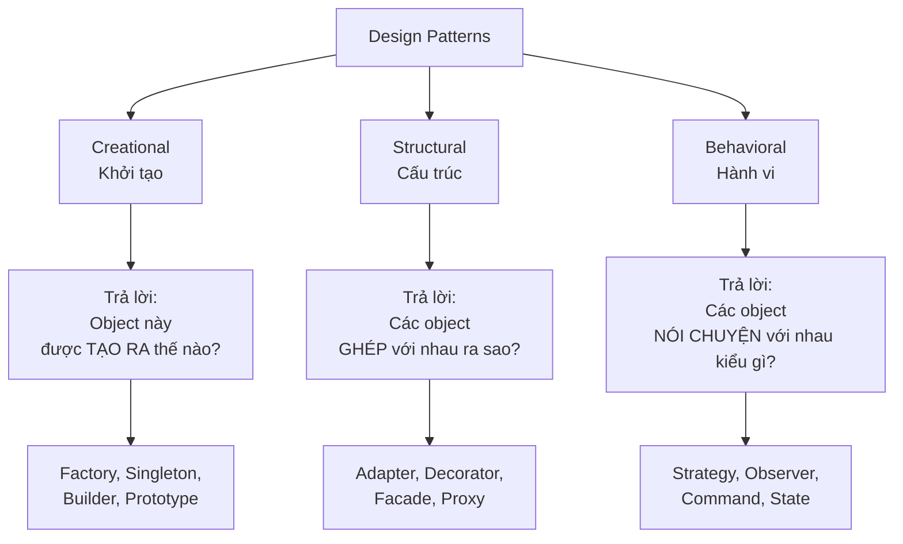

# Bài 00 — Vì sao cần Design Patterns?

> **Mục tiêu buổi này:** học viên hiểu pattern *không phải* là thư viện, không phải là thứ để
> khoe, mà là **từ vựng chung** giữa các lập trình viên và là **cách chống lại thay đổi**.

---

## 1. Mở đầu: một câu chuyện

Bạn xây một quán cà phê. Ngày đầu chỉ bán cà phê đen, code thế này:

```js
function pha() {
  return "Cà phê đen";
}
```

Tuần sau bán thêm cà phê sữa. Tháng sau thêm bạc xỉu, cà phê muối, cold brew. Mỗi lần thêm,
bạn lại mở đúng file đó ra sửa. Rồi một hôm bạn sửa nhầm, cà phê đen ra vị muối.

**Design pattern không làm quán bạn bán được nhiều hơn.** Nó làm cho việc *thêm món mới* không
đụng vào món cũ. Đó là toàn bộ câu chuyện.

---

## 2. Design Pattern là gì?

> Một **giải pháp đã được kiểm chứng** cho một **vấn đề thiết kế lặp đi lặp lại**, được mô tả
> ở mức đủ trừu tượng để dùng lại ở nhiều ngữ cảnh khác nhau.

Ba từ khóa cần nhấn mạnh khi giảng:

| Từ khóa | Nghĩa là | Không phải là |
|---------|----------|---------------|
| **Giải pháp** | Cách tổ chức class/hàm/object | Đoạn code copy-paste được |
| **Lặp đi lặp lại** | Vấn đề bạn sẽ gặp lại ở dự án sau | Vấn đề chỉ có ở dự án này |
| **Trừu tượng** | Mô tả vai trò, không mô tả tên biến | Một API cụ thể |

**Ẩn dụ để giảng:** Pattern giống như *thế cờ* trong cờ vua. Không ai bắt bạn phải đi thế đó,
nhưng khi bạn nói "khai cuộc Ý", người kia hiểu ngay 6 nước đi mà không cần bạn mô tả từng nước.
Pattern làm điều tương tự trong code review: "chỗ này nên dùng Strategy" — 4 từ thay cho 10 phút giải thích.

---

## 3. Ba nhóm pattern (theo GoF)



Chỉ cần học viên nhớ **ba câu hỏi** ở giữa sơ đồ là đủ để tự phân loại bất kỳ pattern nào sau này.

---

## 4. Nguyên tắc nền: pattern nào cũng phục vụ một trong các nguyên lý SOLID

Không cần dạy SOLID thành một buổi riêng. Chỉ cần giới thiệu 2 nguyên lý mà **mọi pattern trong
giáo trình này đều xoay quanh**:

### 4.1. Open/Closed — Mở để mở rộng, đóng để sửa đổi

```
Code TỐT:   thêm tính năng  →  thêm file mới        →  file cũ không đụng tới
Code XẤU:   thêm tính năng  →  sửa 5 chỗ trong file cũ  →  vỡ 3 chỗ khác
```

### 4.2. Dependency Inversion — Phụ thuộc vào cái trừu tượng, đừng phụ thuộc vào cái cụ thể

```
XẤU:                          TỐT:
┌──────────┐                  ┌──────────┐
│  Đơn hàng │                  │  Đơn hàng │
└─────┬────┘                  └─────┬────┘
      │ gọi thẳng                   │ gọi qua "hợp đồng"
      ▼                             ▼
┌──────────┐                  ┌──────────────┐
│  MoMo    │                  │ CổngThanhToán │  ← interface
└──────────┘                  └───┬───────┬──┘
                                  ▼       ▼
                              ┌──────┐ ┌──────┐
                              │ MoMo │ │ VNPay│
                              └──────┘ └──────┘
```

Bên trái: đổi sang VNPay phải sửa class Đơn hàng.
Bên phải: đổi sang VNPay chỉ cần viết class mới, Đơn hàng **không biết và không cần biết**.

---

## 5. Cảnh báo quan trọng — dạy ngay từ buổi đầu

Đây là phần hay bị bỏ qua, nhưng lại quan trọng nhất với người mới:

> ### ⚠️ Dùng sai pattern còn tệ hơn không dùng pattern nào.

Ba dấu hiệu lạm dụng, hãy đưa lên slide:

1. **Class `AbstractSingletonProxyFactoryBean`** — nếu tên class dài hơn việc nó làm, bạn đã đi quá xa.
2. **Một interface, một implementation, mãi mãi.** Trừu tượng hóa cho một thứ chỉ có một loại là
   chi phí không có lợi ích.
3. **"Sau này biết đâu cần."** Không. Viết đơn giản trước; khi cái thay đổi *thực sự* xuất hiện
   lần thứ hai, lúc đó mới refactor sang pattern. Quy tắc gọi là **Rule of Three**.

**Câu chốt để học viên nhớ:**
> Pattern là *phản ứng* với một thay đổi đã xảy ra, không phải *dự đoán* một thay đổi có thể xảy ra.

---

## 6. Đặc thù JavaScript — điều học viên cần biết trước

Sách GoF gốc viết cho C++/Smalltalk. JavaScript có vài điểm khác làm một số pattern **đơn giản
hơn hẳn** hoặc **biến mất**:

| Đặc điểm JS | Hệ quả |
|-------------|--------|
| Hàm là first-class (truyền được như biến) | Strategy, Command, Observer thu gọn còn vài dòng |
| Không có interface | "Hợp đồng" là quy ước, dựa vào duck typing |
| Object mở rộng được lúc runtime | Decorator, Proxy làm được ở mức ngôn ngữ (`Proxy`, `Reflect`) |
| Module ESM có sẵn | Singleton và Module gần như miễn phí |

Trong giáo trình này ta dùng **`class` của ES6** để code khớp với sơ đồ UML kinh điển — dễ cho học
viên đối chiếu tài liệu. Nhưng mỗi bài đều có mục **"Cách làm rất JavaScript"** chỉ ra bản rút gọn.

---

## 7. Bài tập khởi động (không cần pattern nào)

Mở file [`src/00-gioi-thieu/bai-tap.js`](../src/00-gioi-thieu/bai-tap.js).

Trong đó có một hàm tính phí ship viết theo kiểu `if/else` dài. Nhiệm vụ:

1. Chạy thử, xác nhận nó đúng.
2. **Đếm** xem để thêm một hãng vận chuyển mới, bạn phải sửa bao nhiêu chỗ.
3. Ghi câu trả lời vào comment cuối file.
4. **Chưa cần sửa gì cả.** Ta sẽ quay lại chính file này ở [Bài 09 — Strategy](09-strategy.md).

> Mục đích của bài tập này thuần túy là để học viên *cảm nhận cái đau* trước khi được đưa thuốc.
> Đừng tiết lộ đáp án ở buổi này.

---

## 8. Câu hỏi kiểm tra nhanh

1. Design pattern có phải là thư viện không? Vì sao?
2. Ba nhóm pattern trả lời ba câu hỏi gì?
3. "Rule of Three" nói gì?
4. Nêu một trường hợp mà **không** dùng pattern là lựa chọn đúng.

---

➡️ Bài tiếp theo: [01 — Factory](01-factory.md)
