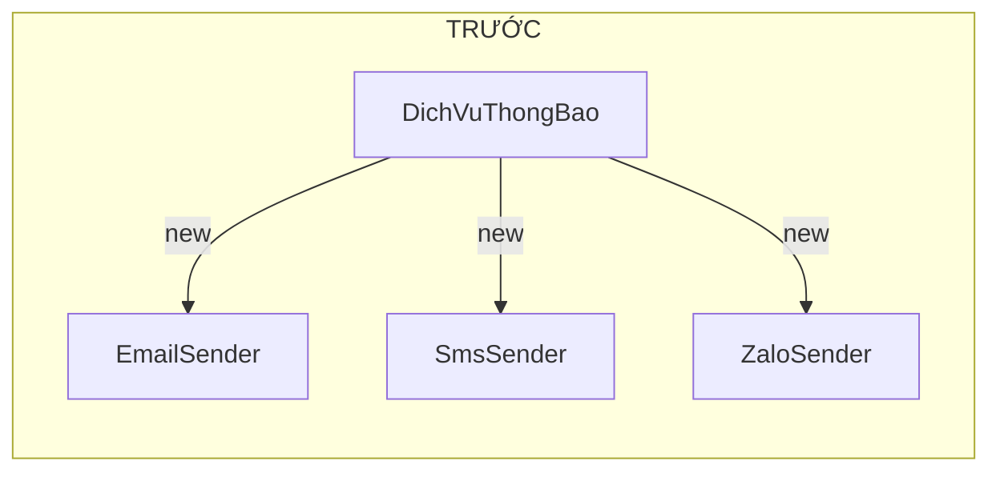
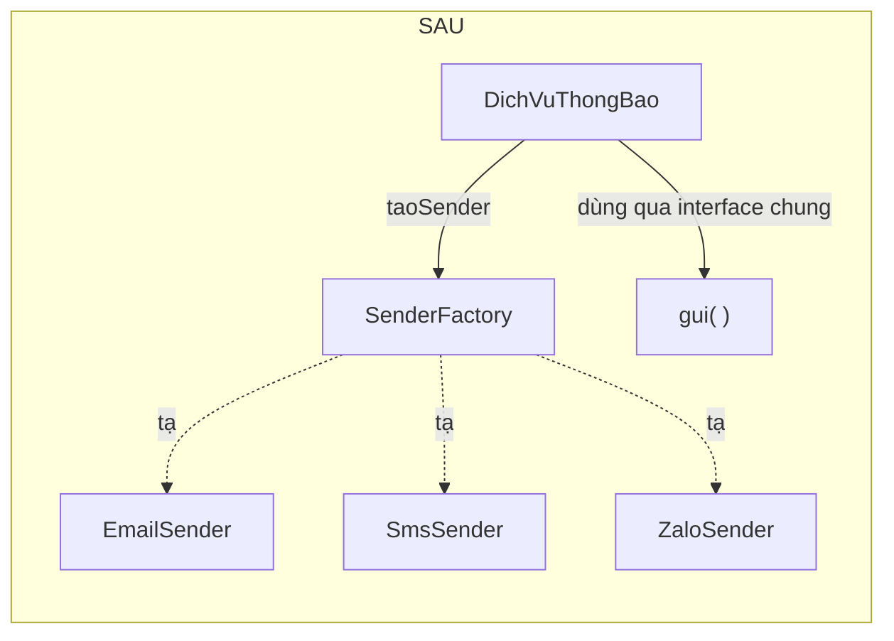
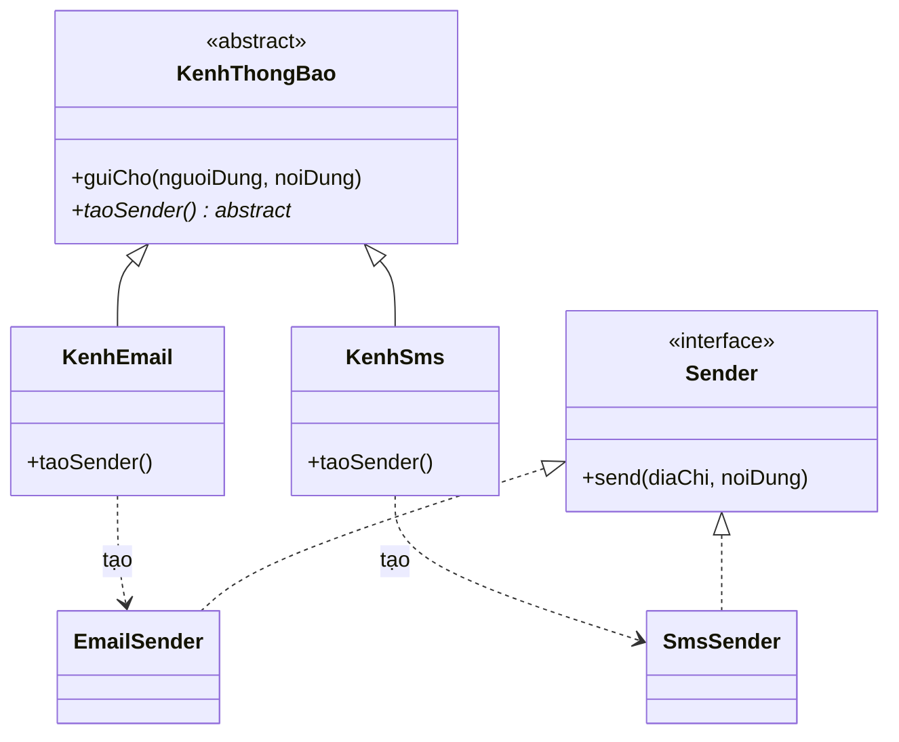

# Bài 01 — Factory

> **Nhóm:** Creational (Khởi tạo)
> **Một câu:** Giấu chuyện "tạo ra object loại nào" khỏi nơi sử dụng object đó.

---

## 1. Cái đau

Bạn viết app gửi thông báo. Ban đầu chỉ có email:

```js
class DichVuThongBao {
  gui(nguoiDung, noiDung) {
    const email = new EmailSender("smtp.gmail.com", 587, process.env.SMTP_USER);
    email.ketNoi();
    email.send(nguoiDung.email, noiDung);
  }
}
```

Rồi sếp bảo: "thêm SMS đi". Bạn thêm `if`. Rồi "thêm Zalo OA". Thêm `if` nữa. Rồi "thêm push notification".

Bây giờ nhìn lại `DichVuThongBao` — nó đang làm **hai việc**:

1. Biết *cách tạo ra* từng loại sender (host, port, credentials, thứ tự khởi tạo…)
2. Biết *phải làm gì* với sender đó

Việc thứ nhất mới là thứ hay thay đổi. Và nó đang dính chặt vào việc thứ hai.

**Dấu hiệu nhận biết trong code review:** bạn thấy `new` một class *cụ thể* nằm sâu bên trong
logic nghiệp vụ.

---

## 2. Ý tưởng của Factory

> Thay vì gọi `new` trực tiếp, ta gọi một **hàm/lớp trung gian** và nói *mình muốn gì*, chứ không
> nói *tạo cái gì*.





`DichVuThongBao` giờ **không còn biết tên** của bất kỳ class sender nào. Thêm sender thứ tư → chỉ
đụng vào Factory.

---

## 3. Ba biến thể — dạy theo thứ tự tăng dần

Người mới hay bị rối vì "Factory" thực ra là tên gọi chung cho ba thứ. Hãy dạy tuần tự:

### 3.1. Simple Factory (không phải pattern GoF, nhưng dùng nhiều nhất)

Một hàm/`switch` duy nhất quyết định tạo gì.

```js
function taoSender(loai) {
  switch (loai) {
    case "email": return new EmailSender();
    case "sms":   return new SmsSender();
    case "zalo":  return new ZaloSender();
    default: throw new Error(`Không hỗ trợ: ${loai}`);
  }
}
```

✅ Đơn giản, đủ dùng cho 90% trường hợp.
❌ Vẫn phải sửa `switch` khi thêm loại mới (nhưng chỉ **một chỗ duy nhất** — đã tốt hơn nhiều).

### 3.2. Factory Method — lớp con quyết định tạo gì

Lớp cha định nghĩa *quy trình*, để **trống một bước tạo object** cho lớp con điền vào.



Điểm mấu chốt để nhấn mạnh: **`guiCho()` được viết MỘT lần ở lớp cha** và không bao giờ phải sửa
nữa, dù có thêm bao nhiêu kênh.

### 3.3. Abstract Factory — tạo cả một BỘ object đi cùng nhau

Khi bạn cần tạo nhiều object mà chúng **phải khớp nhau**. Ví dụ kinh điển: giao diện.

```
                 ┌─────────────────────┐
                 │  GiaoDienFactory    │  (abstract)
                 │  + taoNut()         │
                 │  + taoONhap()       │
                 └──────────┬──────────┘
              ┌─────────────┴─────────────┐
              ▼                           ▼
   ┌────────────────────┐      ┌────────────────────┐
   │ GiaoDienSangFactory│      │ GiaoDienToiFactory │
   └─────────┬──────────┘      └─────────┬──────────┘
             │ tạo ra                    │ tạo ra
      ┌──────┴──────┐             ┌──────┴──────┐
      ▼             ▼             ▼             ▼
  NutSang      ONhapSang      NutToi       ONhapToi
```

Điều Abstract Factory đảm bảo mà Simple Factory không đảm bảo được:
**bạn không bao giờ vô tình ghép `NutSang` với `ONhapToi`.**

---

## 4. Code

```bash
node src/01-factory/demo.js
```

File demo trình bày cả ba biến thể, chạy tuần tự và in ra output có nhãn rõ ràng.

---

## 5. Cách làm "rất JavaScript"

Trong JS, bạn thường không cần class factory — một **object tra cứu (registry)** là đủ, và nó
thậm chí đạt Open/Closed tốt hơn `switch`:

```js
const REGISTRY = new Map();

export function dangKy(loai, constructor) {
  REGISTRY.set(loai, constructor);
}

export function tao(loai, ...args) {
  const C = REGISTRY.get(loai);
  if (!C) throw new Error(`Chưa đăng ký loại: ${loai}`);
  return new C(...args);
}

// Ở file khác — thêm loại mới mà KHÔNG đụng vào file factory:
dangKy("telegram", TelegramSender);
```

Đây chính là cách các plugin system (webpack loader, ESLint rule, Vite plugin) hoạt động.

---

## 6. Khi nào dùng — khi nào KHÔNG

| ✅ Nên dùng khi | ❌ Đừng dùng khi |
|---|---|
| Bạn có ≥ 3 biến thể của cùng một khái niệm | Chỉ có đúng một class, "sau này biết đâu cần thêm" |
| Việc khởi tạo phức tạp (đọc config, kết nối, xác thực) | `new X()` là tất cả những gì cần làm |
| Loại object được quyết định lúc runtime (từ config/DB/input người dùng) | Loại object cố định cứng lúc viết code |
| Bạn muốn viết test và cần thay bằng bản giả (fake) | |

---

## 7. Bẫy thường gặp

1. **Factory trả về kiểu khác nhau.** Nếu `taoSender("email")` trả về object có `send()` còn
   `taoSender("sms")` trả về object có `guiTin()` thì factory vô nghĩa — nơi gọi lại phải `if` tiếp.
   👉 *Mọi sản phẩm phải cùng một "hợp đồng".*

2. **Factory phình to thành God Object.** Khi factory bắt đầu chứa logic nghiệp vụ (validate,
   ghi log, gọi API) thì nó không còn là factory nữa.
   👉 *Factory chỉ làm một việc: tạo và trả về.*

3. **Nhầm Factory với Builder.** Factory: "cho tôi một cái xe" (một lần, một lời gọi).
   Builder: "gắn bánh, gắn máy, sơn màu, rồi giao xe" (nhiều bước). Xem [Bài 03](03-builder.md).

---

## 8. Bài tập

📂 `src/01-factory/bai-tap.js`

**Đề:** Hệ thống xuất báo cáo đang hỗ trợ CSV. Trong file có sẵn `XuatCsv`, và một hàm
`xuatBaoCao()` đang `new XuatCsv()` trực tiếp.

**Yêu cầu:**

1. Viết thêm `XuatJson` và `XuatMarkdown`, cùng "hợp đồng" với `XuatCsv` (đều có `.xuat(duLieu)`).
2. Tạo factory `taoBoXuat(dinhDang)` để `xuatBaoCao()` không còn `new` class cụ thể nào.
3. **Điều kiện nghiệm thu:** trong hàm `xuatBaoCao()` không được xuất hiện chữ `new`.
4. **Nâng cao:** chuyển sang registry để thêm `XuatHtml` từ *một file khác* mà không sửa factory.

**Câu hỏi thảo luận sau khi làm xong:**
> Nếu định dạng báo cáo được người dùng chọn trên giao diện và lưu trong DB, chuyện gì xảy ra khi
> ai đó sửa tay giá trị trong DB thành `"pdf"`? Factory của bạn xử lý ra sao?

Lời giải: `src/01-factory/loi-giai.js`

---

## 9. Kiểm tra nhanh

1. Factory giấu đi thứ gì khỏi nơi sử dụng?
2. Khác nhau giữa Simple Factory và Factory Method là gì?
3. Abstract Factory bảo vệ ta khỏi lỗi nào mà Simple Factory không bảo vệ được?
4. Vì sao mọi sản phẩm của một factory phải có cùng interface?

---

⬅️ [00 — Giới thiệu](00-gioi-thieu.md) | ➡️ [02 — Singleton](02-singleton.md)
