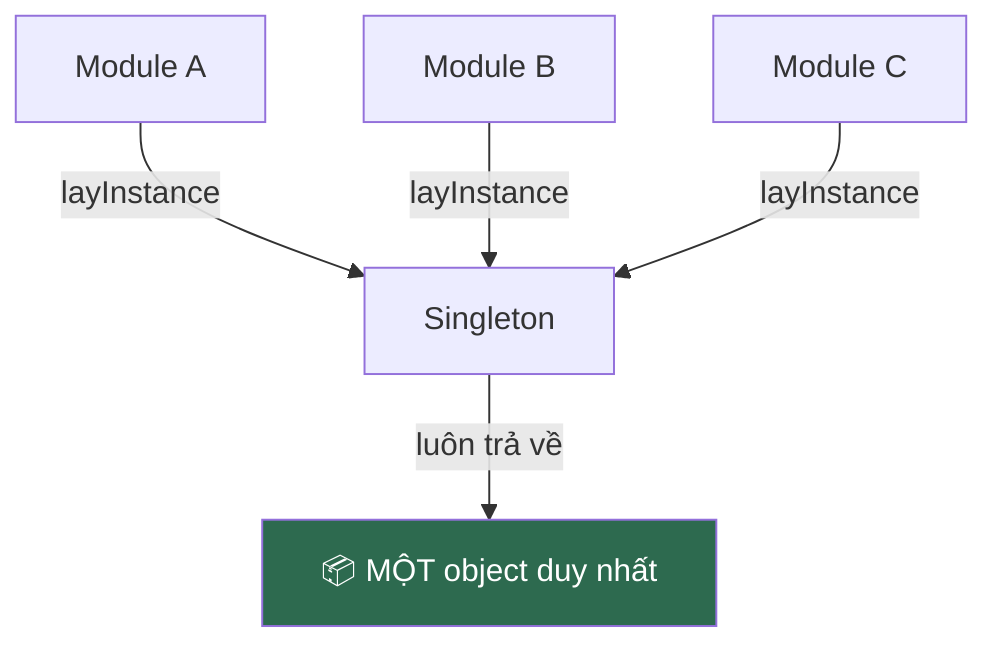

# Bài 02 — Singleton

> **Nhóm:** Creational (Khởi tạo)
> **Một câu:** Đảm bảo cả hệ thống chỉ có đúng một thể hiện, và ai cũng lấy được nó.

> ⚠️ **Lưu ý sư phạm:** Đây là pattern **dễ hiểu nhất nhưng bị lạm dụng nhiều nhất**.
> Hãy dành nửa đầu buổi dạy *cách làm*, nửa sau dạy *vì sao thường không nên làm*.
> Nếu học viên rời lớp mà chỉ nhớ "Singleton hay lắm" thì buổi học đã thất bại.

---

## 1. Cái đau

Ứng dụng của bạn cần kết nối database. Kết nối tốn 200ms để thiết lập và database chỉ cho phép
tối đa 20 kết nối đồng thời.

```js
// file: donHang.js
const db = new KetNoiDB(config);   // +200ms

// file: nguoiDung.js
const db = new KetNoiDB(config);   // +200ms nữa

// file: sanPham.js
const db = new KetNoiDB(config);   // ... và cứ thế
```

Có 30 file → 30 kết nối → database từ chối, app sập. Ta cần **một** kết nối, dùng chung.

Các trường hợp tương tự: cấu hình app, logger, cache, connection pool, i18n.

---

## 2. Ý tưởng



Hai điều kiện của Singleton:

1. **Chặn tạo mới tự do** — không ai `new` được tùy tiện.
2. **Cung cấp một điểm truy cập toàn cục** — `layInstance()`.

---

## 3. Ba cách viết trong JavaScript

### 3.1. Cách "sách giáo khoa" — static instance

```js
class CauHinh {
  static #instance = null;

  constructor() {
    if (CauHinh.#instance) {
      throw new Error("Dùng CauHinh.layInstance() thay vì new");
    }
    this.duLieu = docFileConfig();
  }

  static layInstance() {
    if (!CauHinh.#instance) CauHinh.#instance = new CauHinh();
    return CauHinh.#instance;
  }
}
```

`#instance` là **private field** thật của JS — bên ngoài không truy cập được.

### 3.2. Cách rất JavaScript — module ESM

Đây là điều nhiều lập trình viên không biết:

> **Module ESM đã là Singleton sẵn rồi.** Node/trình duyệt chỉ chạy code trong file `.js`
> **đúng một lần**, dù bạn `import` nó ở 100 nơi.

```js
// cauHinh.js
const duLieu = docFileConfig();   // chạy DUY NHẤT một lần
export default { get: (k) => duLieu[k] };
```

Không cần class, không cần `layInstance()`. **Đây là cách nên dùng trong JS hiện đại.**

### 3.3. Lazy singleton — chỉ khởi tạo khi cần lần đầu

Khi việc khởi tạo tốn kém và có thể không bao giờ dùng tới:

```js
let _instance = null;
export function layKetNoi() {
  if (!_instance) _instance = new KetNoiDB(config);
  return _instance;
}
```

---

## 4. Code

```bash
node src/02-singleton/demo.js
```

---

## 5. ⚠️ Vì sao Singleton bị gọi là "anti-pattern"

Phần này **quan trọng hơn phần cách làm**. Hãy dành thời gian.

### 5.1. Nó là biến toàn cục đội lốt

Biến toàn cục xấu vì: bất kỳ đâu cũng sửa được, và bạn không biết ai đang sửa.
Singleton có đúng nhược điểm đó, chỉ khác là mặc áo class nên trông "chuyên nghiệp" hơn.

### 5.2. Nó giết chết khả năng test

```js
class DichVuDonHang {
  tao(donHang) {
    Logger.layInstance().ghi("Tạo đơn");   // ← phụ thuộc ẩn
    KetNoiDB.layInstance().luu(donHang);   // ← phụ thuộc ẩn
  }
}
```

Nhìn vào signature `tao(donHang)`, bạn **không hề biết** class này cần database và logger. Khi
viết unit test, bạn không có cách nào thay chúng bằng bản giả. Test buộc phải chạm database thật.

**So sánh với cách đưa phụ thuộc từ ngoài vào** (xem [Bài 16 — DI](16-dependency-injection.md)):

```js
class DichVuDonHang {
  constructor(logger, db) { this.logger = logger; this.db = db; }
  tao(donHang) { this.logger.ghi("Tạo đơn"); this.db.luu(donHang); }
}

// Test: new DichVuDonHang(loggerGia, dbGia)  ← dễ dàng
```

### 5.3. Nó tạo trạng thái rò rỉ giữa các test

Test A sửa cấu hình singleton → test B chạy sau nhận cấu hình đã bị sửa → test B fail ngẫu nhiên.
Đây là loại bug tốn nhiều giờ nhất để tìm ra.

### 5.4. Nó ngầm giả định "mãi mãi chỉ có một"

App có một database. Rồi một hôm cần thêm database read-replica. Hoặc cần multi-tenant, mỗi khách
hàng một kết nối riêng. Singleton lúc này phải đập đi làm lại toàn bộ.

---

## 6. Vậy khi nào ĐƯỢC dùng?

| ✅ Chấp nhận được | ❌ Không nên |
|---|---|
| Object **chỉ đọc**, không có trạng thái thay đổi (bảng hằng số, i18n) | Bất cứ thứ gì có trạng thái mà nhiều nơi ghi vào |
| Tài nguyên thật sự chỉ có một ở mức hệ điều hành (file log, cổng lắng nghe) | "Cho tiện" vì lười truyền tham số |
| Cấu hình đọc từ biến môi trường lúc khởi động | Dịch vụ nghiệp vụ (OrderService, UserService) |
| Cache trong tiến trình, có API để xóa sạch khi test | |

**Quy tắc thực dụng:**
> Dùng module ESM để có một instance dùng chung — **nhưng vẫn truyền nó vào như tham số**
> chứ đừng để các class tự đi lấy. Bạn được cái tiện của singleton mà không mất khả năng test.

```js
// main.js — nơi duy nhất "đi lấy" singleton
import db from "./db.js";
import logger from "./logger.js";
const dichVu = new DichVuDonHang(logger, db);   // truyền vào từ trên xuống
```

---

## 7. Bẫy thường gặp

1. **Singleton trong môi trường serverless.** Mỗi lambda instance có bộ nhớ riêng — "toàn cục"
   của bạn thực ra là toàn cục *trong một container*, và có N container.
2. **Đa luồng.** JS đơn luồng nên an toàn, nhưng với `worker_threads` mỗi worker có singleton
   riêng của nó. Đây là nguồn bug rất khó hiểu.
3. **Vòng lặp import.** `a.js` import `b.js`, `b.js` import `a.js` → một trong hai nhận được
   `undefined` lúc khởi tạo. Hay xảy ra khi lạm dụng module singleton.

---

## 8. Bài tập

📂 `src/02-singleton/bai-tap.js`

**Đề:** Xây `NhatKy` (logger) dùng chung cho toàn app.

**Yêu cầu:**

1. Cài đặt `NhatKy` sao cho `new NhatKy()` ném lỗi, chỉ `NhatKy.layInstance()` mới lấy được.
2. Chứng minh hai chỗ khác nhau lấy về **cùng một object** (dùng `===`).
3. `NhatKy` giữ mảng lịch sử log; kiểm chứng ghi ở module A thì module B đọc thấy.
4. **Phần quan trọng nhất:** file có sẵn hàm `test_donHangGhiLog()` đang fail vì log của test
   trước còn sót lại. Sửa cho test pass **bằng hai cách khác nhau**:
   - Cách 1: thêm phương thức `reset()` gọi trước mỗi test.
   - Cách 2: bỏ singleton, truyền logger vào constructor.
   Rồi viết vào comment: cách nào bạn thấy tốt hơn, vì sao?

Lời giải: `src/02-singleton/loi-giai.js`

---

## 9. Kiểm tra nhanh

1. Vì sao module ESM đã là singleton sẵn?
2. Nêu hai lý do Singleton làm code khó test.
3. Trường hợp nào dùng Singleton là hợp lý?
4. "Dùng module singleton nhưng vẫn truyền vào như tham số" — điều này giải quyết vấn đề gì?

---

⬅️ [01 — Factory](01-factory.md) | ➡️ [03 — Builder](03-builder.md)
