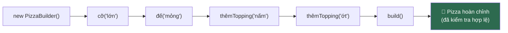

# Bài 03 — Builder

> **Nhóm:** Creational (Khởi tạo)
> **Một câu:** Dựng một object phức tạp theo từng bước, thay vì nhồi tất cả vào constructor.

---

## 1. Cái đau — "telescoping constructor"

Bạn viết class `Pizza`. Ban đầu đơn giản:

```js
new Pizza("lớn");
```

Rồi thêm đế bánh, phô mai, topping, sốt, ghi chú… Constructor phình dần:

```js
new Pizza("lớn", "mỏng", true, ["nấm", "ớt chuông"], "sốt cà", false, true, null, "ít cay");
```

Nhìn dòng này và trả lời ngay: `true` thứ hai là gì? `false` là gì? `null` là cái gì?

Bạn phải mở file `Pizza.js` ra đếm tham số. Mỗi lần. Và chỉ cần đảo nhầm hai tham số cùng kiểu
`boolean`, code vẫn chạy — chỉ là khách nhận sai bánh.

**Hai dấu hiệu cần Builder:**
- Constructor có **quá 4 tham số**, hoặc
- Nhiều tham số là **tùy chọn**, dẫn đến phải truyền `null`/`undefined` để giữ đúng vị trí.

---

## 2. Ý tưởng

Thay vì nhồi mọi thứ vào một lời gọi, ta **gọi nhiều bước có tên**, rồi chốt lại bằng `build()`.



Mỗi phương thức `return this` → nối chuỗi được (fluent interface).

```js
const pizza = new PizzaBuilder()
  .co("lớn")
  .de("mỏng")
  .themTopping("nấm")
  .themTopping("ớt chuông")
  .ghiChu("ít cay")
  .build();
```

Giờ đọc dòng nào cũng hiểu ngay. Đây là lợi ích **lớn nhất** của Builder — người mới hay
tưởng lợi ích chính là "linh hoạt", nhưng thật ra là **code tự giải thích**.

---

## 3. Bốn vai trò

| Vai trò | Trong ví dụ | Nhiệm vụ |
|---|---|---|
| **Product** (sản phẩm) | `Pizza` | Object cuối cùng. Thường **bất biến** sau khi tạo xong |
| **Builder** | `PizzaBuilder` | Gom cấu hình từng bước, kiểm tra hợp lệ ở `build()` |
| **Director** (tùy chọn) | `Menu.pizzaHaiSan()` | Đóng gói *công thức có sẵn* dùng lại nhiều lần |
| **Client** | Code gọi | Chỉ nói *muốn gì*, không cần biết thứ tự dựng |

**Director** là phần hay bị bỏ qua. Nó trả lời câu hỏi: "nếu 20 chỗ trong app đều dựng cùng một
loại pizza thì sao?" → Đặt công thức vào Director, gọi một dòng.

---

## 4. Điểm mấu chốt: `build()` là nơi kiểm tra tính hợp lệ

Đây là lý do Builder **mạnh hơn** một object literal thông thường:

```js
build() {
  if (!this._co) throw new Error("Pizza phải có cỡ");
  if (this._topping.length > 5) throw new Error("Tối đa 5 topping");
  if (this._de === "dày" && this._co === "nhỏ")
    throw new Error("Cỡ nhỏ không làm được đế dày");
  return new Pizza({ ...this });   // trả về object BẤT BIẾN
}
```

Một object literal `{ co: "nhỏ", de: "dày" }` không có chỗ nào để đặt luật đó. Builder có.

> **Câu chốt khi giảng:** Builder không chỉ để *dựng*, mà để **đảm bảo không thể dựng ra thứ sai**.

---

## 5. Code

```bash
node src/03-builder/demo.js
```

---

## 6. Cách "rất JavaScript"

JS có **object tham số** (named arguments giả lập) — thường đã đủ:

```js
function taoPizza({ co, de = "mỏng", topping = [], ghiChu = "" }) { ... }

taoPizza({ co: "lớn", topping: ["nấm"], ghiChu: "ít cay" });
```

Rõ ràng, ngắn, không cần class. **Khi nào vẫn cần Builder thật?**

| Object tham số là đủ | Cần Builder thật |
|---|---|
| Chỉ gán giá trị | Có bước **tích lũy** (`themTopping` gọi nhiều lần) |
| Không có luật ràng buộc chéo | Có luật giữa các trường (đế dày ⇔ cỡ lớn) |
| Dựng một lần | Dựng dần qua nhiều hàm/nhiều file rồi mới chốt |
| | Cần dựng nhiều biến thể từ một base (`.clone()`) |

Ví dụ thực tế của Builder thật trong JS: query builder (Knex, Prisma), `URLSearchParams`,
`new Request()` của fetch API.

---

## 7. Khi nào KHÔNG dùng

- Object có ≤ 3 tham số, tất cả bắt buộc → constructor thường là đủ.
- Bạn viết builder mà mọi phương thức chỉ là `this.x = x` và `build()` không kiểm tra gì
  → bạn vừa viết thêm 40 dòng để thay cho một object literal. Xóa đi.

---

## 8. Bài tập

📂 `src/03-builder/bai-tap.js`

**Đề:** Xây `TruyVanSQLBuilder` sinh ra câu lệnh SELECT.

**Yêu cầu:**

1. Hỗ trợ nối chuỗi: `.chon()`, `.tuBang()`, `.dieuKien()` (gọi nhiều lần → nối bằng AND),
   `.sapXep()`, `.gioiHan()`, `.build()`.
2. `.build()` phải ném lỗi nếu: thiếu bảng, hoặc `gioiHan` ≤ 0.
3. **Bẫy an toàn:** `.dieuKien("ten", "=", giaTri)` phải sinh ra placeholder `?` và gom giá trị
   vào mảng `thamSo` riêng — **không** nối chuỗi trực tiếp (chống SQL injection).
4. **Nâng cao:** thêm `.clone()` để tạo biến thể từ một truy vấn nền.

Kết quả mong muốn:

```js
new TruyVanSQLBuilder()
  .chon("id", "ten")
  .tuBang("nguoi_dung")
  .dieuKien("tuoi", ">", 18)
  .dieuKien("thanh_pho", "=", "Hà Nội")
  .sapXep("ten")
  .gioiHan(10)
  .build();

// { sql: "SELECT id, ten FROM nguoi_dung WHERE tuoi > ? AND thanh_pho = ? ORDER BY ten ASC LIMIT 10",
//   thamSo: [18, "Hà Nội"] }
```

Lời giải: `src/03-builder/loi-giai.js`

---

## 9. Kiểm tra nhanh

1. "Telescoping constructor" là gì? Vì sao nó nguy hiểm hơn chỉ là "khó đọc"?
2. Vì sao mỗi phương thức của builder phải `return this`?
3. `build()` nên làm gì ngoài việc trả về object?
4. Khi nào object tham số `{ }` đã đủ, không cần Builder?
5. Phân biệt Builder với Factory bằng một câu.

---

⬅️ [02 — Singleton](02-singleton.md) | ➡️ [04 — Prototype](04-prototype.md)
