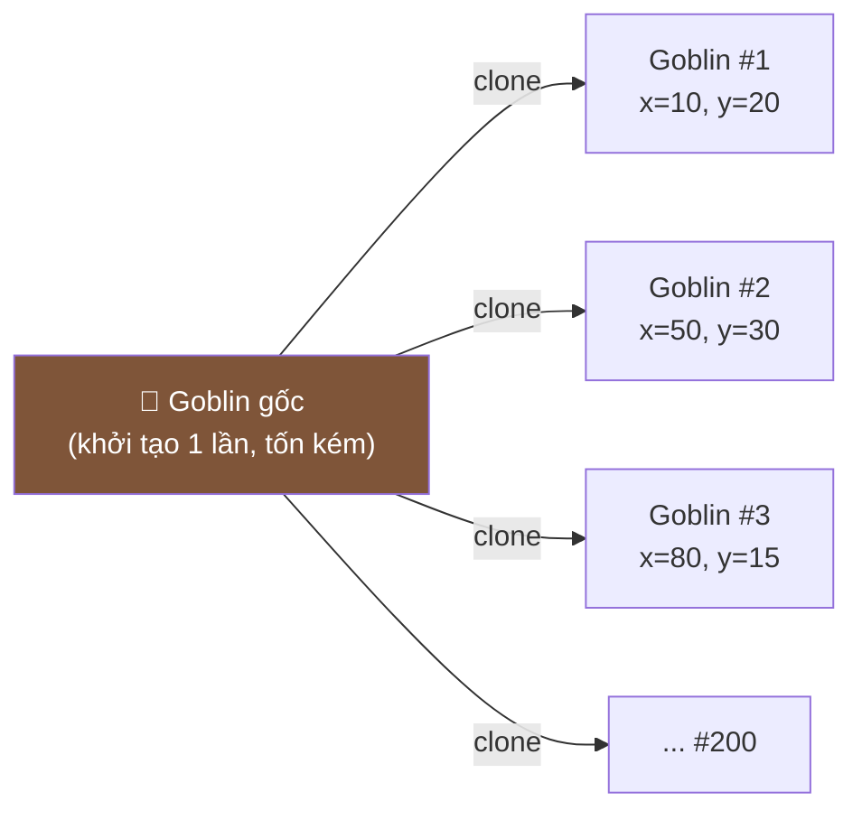

# Bài 04 — Prototype

> **Nhóm:** Creational (Khởi tạo)
> **Một câu:** Tạo object mới bằng cách **nhân bản** một object có sẵn, thay vì dựng lại từ đầu.

> 💡 **Bài này đặc biệt với JavaScript:** JS là ngôn ngữ *dựa trên prototype* ngay từ gốc.
> Nên đây vừa là bài về pattern, vừa là bài về cách JS hoạt động bên dưới.

---

## 1. Cái đau

Bạn làm game. Mỗi con quái có 20 thuộc tính, và việc khởi tạo phải đọc file cấu hình + tải sprite:

```js
class Quai {
  constructor(ten) {
    this.cauHinh = docFileJSON(`quai/${ten}.json`);  // đọc đĩa — chậm
    this.sprite = taiAnh(this.cauHinh.duongDanAnh);   // tải ảnh — rất chậm
    this.mau = this.cauHinh.mau;
    // ... 17 thuộc tính nữa
  }
}
```

Bây giờ sinh 200 con goblin cho một trận đánh. Bạn đọc file 200 lần, tải ảnh 200 lần.

Nhưng cả 200 con **giống hệt nhau** lúc sinh ra — chỉ khác vị trí. Vậy tại sao phải dựng lại từ đầu?

**Một cái đau khác, phổ biến hơn:** bạn cần tạo bản sao của một object để sửa mà không ảnh
hưởng bản gốc (undo, so sánh trước/sau, gửi cho hàm khác). Viết tay `{ ...obj }` thì lồng nhau
bên trong vẫn dùng chung tham chiếu — nguồn bug kinh điển.

---

## 2. Ý tưởng



Object tự biết cách nhân bản chính mình qua phương thức `clone()`. Nơi gọi **không cần biết
class gì** — chỉ cần object đó có `clone()`.

---

## 3. Điểm mấu chốt nhất bài: SHALLOW vs DEEP COPY

Nếu học viên chỉ nhớ được một điều từ buổi này, phải là điều này.

### Shallow copy (sao chép nông)

```js
const goc = { ten: "Goblin", chiSo: { mau: 100, giap: 5 } };
const banSao = { ...goc };

banSao.ten = "Orc";           // ✅ chỉ đổi bản sao
banSao.chiSo.mau = 999;       // ❌ ĐỔI CẢ BẢN GỐC!

console.log(goc.chiSo.mau);   // 999
```

Vì sao? Vẽ lên bảng:

```
   goc ──────┐                          banSao ──────┐
             ▼                                       ▼
   ┌──────────────────┐                  ┌──────────────────┐
   │ ten: "Goblin"    │                  │ ten: "Orc"       │
   │ chiSo: ●─────────┼──────┐    ┌──────┼─● :chiSo         │
   └──────────────────┘      │    │      └──────────────────┘
                             ▼    ▼
                        ┌──────────────┐
                        │ mau: 999     │  ← MỘT object duy nhất,
                        │ giap: 5      │    cả hai cùng trỏ vào!
                        └──────────────┘
```

Spread `{...}` chỉ sao chép **một tầng**. Giá trị nguyên thủy (số, chuỗi) được sao thật;
object/mảng chỉ sao **địa chỉ**.

### Deep copy (sao chép sâu)

```js
const banSao = structuredClone(goc);   // có sẵn trong Node 17+ và mọi trình duyệt hiện đại
banSao.chiSo.mau = 999;
console.log(goc.chiSo.mau);            // 100 ✅
```

### Bảng so sánh các cách deep copy trong JS

| Cách | Ưu | Nhược |
|---|---|---|
| `{ ...obj }` / `Object.assign` | Nhanh nhất | **Chỉ 1 tầng** |
| `JSON.parse(JSON.stringify(obj))` | Đơn giản, ai cũng biết | Mất `Date`, `Map`, `Set`, `undefined`, hàm; vỡ khi có vòng lặp tham chiếu |
| `structuredClone(obj)` | Chuẩn, xử lý `Date`/`Map`/`Set`/vòng lặp | **Không sao chép được hàm**, mất prototype (bản sao là object thường, không còn là instance của class) |
| Tự viết `clone()` | Kiểm soát hoàn toàn: chọn cái nào sâu, cái nào chia sẻ | Phải tự bảo trì khi thêm trường |

> **Bẫy hay gặp nhất:** `structuredClone` một instance của class → nhận về object thường,
> gọi phương thức là lỗi `not a function`. Đây là lý do ta vẫn viết `clone()` thủ công.

---

## 4. Prototype Registry — bạn thân của Factory

Kết hợp Prototype với một kho mẫu:

```js
const KHO_MAU = new Map();
KHO_MAU.set("goblin", new Quai({ ...cauHinhGoblin }));   // khởi tạo 1 lần

function sinhQuai(loai, x, y) {
  const q = KHO_MAU.get(loai).clone();
  q.datViTri(x, y);
  return q;
}
```

So với Factory ở [Bài 01](01-factory.md):

| Factory | Prototype |
|---|---|
| `new` một class **cụ thể** | `clone()` một **instance** có sẵn |
| Loại mới ⇒ viết class mới | Loại mới ⇒ chỉ cần **dữ liệu mới** (từ file JSON, từ DB) |
| Cấu hình nằm trong code | Cấu hình nằm trong dữ liệu |

Đây là lý do game engine và công cụ thiết kế (Figma: copy layer) dùng Prototype: người **thiết kế
màn chơi** thêm loại quái mới mà lập trình viên không phải viết dòng nào.

---

## 5. Prototype trong bản thân JavaScript

Điều đáng nói với học viên: **JS đã làm sẵn pattern này ở mức ngôn ngữ.**

```js
const mauQuai = { mau: 100, tanCong() { return `${this.ten} tấn công!`; } };

const goblin = Object.create(mauQuai);   // tạo object có prototype là mauQuai
goblin.ten = "Goblin";
goblin.tanCong();                        // "Goblin tấn công!" — mượn hàm từ prototype
```

`Object.create` **không sao chép** — nó tạo một liên kết. Đây là "prototypal inheritance", nền
tảng mà `class` của ES6 chỉ là lớp cú pháp phủ lên trên.

Ba khái niệm dễ nhầm, nên viết lên bảng:

| | Ý nghĩa |
|---|---|
| **Prototype pattern** | Tạo object mới bằng cách *sao chép* object cũ |
| **`Object.prototype`** | Object mà mọi object khác *tham chiếu tới* để tìm phương thức |
| **`Object.create(x)`** | Tạo object mới *liên kết tới* x (không sao chép) |

---

## 6. Code

```bash
node src/04-prototype/demo.js
```

---

## 7. Khi nào dùng — khi nào không

| ✅ Nên | ❌ Không nên |
|---|---|
| Khởi tạo tốn kém (I/O, tính toán, tải tài nguyên) | `new X()` đã rẻ và đơn giản |
| Cần nhiều biến thể nhỏ từ một cấu hình nền | Object không có trạng thái để sao chép |
| Loại object đến từ dữ liệu, không từ code | Số lượng loại cố định và ít |
| Cần undo / snapshot / so sánh trước-sau | |

---

## 8. Bài tập

📂 `src/04-prototype/bai-tap.js`

**Đề:** Trình soạn thảo sơ đồ (kiểu Figma thu nhỏ). Có `HinhChuNhat` với các trường lồng nhau
(`viTri`, `kieu.vien`, `nhan`). Người dùng bấm Ctrl+C / Ctrl+V.

**Yêu cầu:**

1. Viết `clone()` cho `HinhChuNhat` sao cho sửa bản sao **không** ảnh hưởng bản gốc.
2. Bộ test có sẵn sẽ bắt lỗi shallow copy — hãy làm nó xanh hết.
3. Viết `Nhom` (nhóm nhiều hình) với `clone()` đệ quy — sao chép cả các hình con.
4. Xây `KhoMau` cho phép `sinhTu("nut-chinh", x, y)`.
5. **Nâng cao — có chủ đích:** trường `anhNen` là một object lớn (giả lập ảnh 5MB). Ảnh này
   **nên được chia sẻ, không nên sao chép**. Hãy viết `clone()` sao chép sâu mọi thứ **trừ**
   `anhNen`, và giải thích vì sao đây không phải là bug.

Lời giải: `src/04-prototype/loi-giai.js`

---

## 9. Kiểm tra nhanh

1. Vẽ sơ đồ giải thích vì sao `{...obj}` không đủ khi obj có trường lồng nhau.
2. `structuredClone` có nhược điểm gì với instance của class?
3. `JSON.parse(JSON.stringify(x))` làm mất những gì?
4. Prototype khác Factory ở điểm nào?
5. Vì sao *không* sao chép sâu mọi trường đôi khi lại là lựa chọn đúng?

---

⬅️ [03 — Builder](03-builder.md) | ➡️ [05 — Adapter](05-adapter.md)
