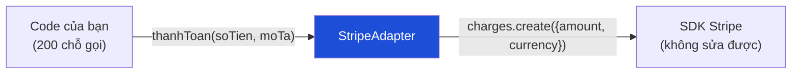

# Bài 05 — Adapter

> **Nhóm:** Structural (Cấu trúc)
> **Một câu:** Bọc một interface *lạ* thành interface mà code của bạn *đã quen*.

---

## 1. Ẩn dụ mở bài (dùng vật thật càng tốt)

Cầm lên một cục **chuyển đổi ổ cắm** đi du lịch. Ổ cắm Nhật là 2 chân dẹt, phích cắm Việt Nam
là 2 chân tròn. Bạn không đập tường để đổi ổ cắm, cũng không cắt phích của cái sạc.
Bạn mua một cục ở giữa.

Adapter trong code làm đúng việc đó. Ba đặc điểm cần nhấn:

- **Không sửa bên A** (code của bạn) — thường vì có 200 chỗ đang gọi.
- **Không sửa bên B** (thư viện bên thứ ba) — thường vì bạn *không thể* sửa.
- Thêm một lớp mỏng ở giữa.

---

## 2. Cái đau

App của bạn đang dùng cổng thanh toán MoMo. Khắp nơi trong code:

```js
await congThanhToan.thanhToan({ soTien: 250000, moTa: "Đơn #1001" });
```

Sếp bảo tuần sau chuyển sang Stripe. SDK của Stripe lại là:

```js
await stripe.charges.create({ amount: 25000000, currency: "vnd", description: "..." });
```

Khác **tên hàm**, khác **tên tham số**, khác **đơn vị tiền** (Stripe dùng đơn vị nhỏ nhất),
khác **cấu trúc kết quả trả về**, khác cả **cách báo lỗi**.

Bạn có 3 lựa chọn:

| Cách | Hậu quả |
|---|---|
| Sửa 200 chỗ gọi | Rủi ro cao, và tháng sau đổi lần nữa thì làm lại |
| Rải `if (dungStripe)` khắp nơi | Code rối, mỗi cổng mới nhân đôi số nhánh |
| **Viết Adapter** | Sửa đúng **một** file mới |

---

## 3. Ý tưởng



Adapter làm **bốn việc dịch thuật**, và học viên hay chỉ nhớ việc đầu tiên:

1. **Đổi tên hàm** — `thanhToan()` → `charges.create()`
2. **Đổi hình dạng dữ liệu** — `{soTien}` → `{amount, currency}`
3. **Đổi đơn vị / định dạng** — 250000 VND → 25000000 (đơn vị nhỏ nhất)
4. **Đổi cách báo lỗi** — `StripeCardError` → `LoiThanhToan` của riêng bạn ⭐

Việc thứ 4 là quan trọng nhất và hay bị bỏ sót. Nếu adapter để lọt exception của thư viện ra
ngoài, thì code gọi vẫn phải `catch (e) { if (e instanceof StripeCardError) ... }` — và bạn
vẫn phụ thuộc Stripe. **Adapter rò rỉ lỗi là adapter thất bại.**

---

## 4. Cấu trúc

| Vai trò | Trong ví dụ |
|---|---|
| **Target** — interface bạn muốn dùng | `CongThanhToan` (`thanhToan`, `hoanTien`) |
| **Adaptee** — thứ có interface lạ | SDK Stripe / PayPal |
| **Adapter** — lớp dịch | `StripeAdapter` |
| **Client** — code của bạn | `DichVuDonHang` |

Trong JS không có `interface`, nên "Target" chỉ là một **quy ước được ghi rõ trong tài liệu**
và được bảo vệ bằng test. Hãy viết nó ra thành comment/JSDoc ở đầu file — đó là hợp đồng.

---

## 5. Code

```bash
node src/05-adapter/demo.js
```

---

## 6. Phân biệt với các pattern trông giống

Đây là phần học viên hay nhầm nhất. Cả bốn pattern dưới đây đều là "một object bọc object khác":

| Pattern | Interface sau khi bọc | Mục đích |
|---|---|---|
| **Adapter** | **Khác** interface gốc | Làm cho hai bên *nói chuyện được* |
| **Decorator** | **Giống hệt** interface gốc | *Thêm* hành vi (log, cache, retry) |
| **Facade** | **Đơn giản hơn** nhiều interface | *Che* độ phức tạp của cả hệ thống con |
| **Proxy** | **Giống hệt** interface gốc | *Kiểm soát* truy cập (lazy, quyền, cache) |

Câu hỏi để tự phân biệt: **"So với thứ bên trong, interface bên ngoài trông thế nào?"**
Khác → Adapter. Giống → Decorator hoặc Proxy. Gộp nhiều thứ lại cho gọn → Facade.

---

## 7. Bẫy thường gặp

1. **Adapter chứa logic nghiệp vụ.** Adapter chỉ *dịch*. Nếu nó bắt đầu quyết định
   "đơn trên 5 triệu thì cần duyệt tay" → logic đó thuộc về tầng nghiệp vụ, không thuộc adapter.

2. **Adapter rò rỉ kiểu dữ liệu của thư viện.** Nếu `thanhToan()` trả về nguyên object của
   Stripe, thì code gọi bắt đầu đọc `.charge_id`, `.livemode`… và bạn lại bị khóa vào Stripe,
   chỉ là gián tiếp hơn. 👉 Luôn ánh xạ về một object *của bạn*.

3. **Viết adapter khi mới có một nhà cung cấp và chắc chắn không đổi.** Đó là trừu tượng hóa
   phòng xa — quay lại "Rule of Three" ở [Bài 00](00-gioi-thieu.md).

4. **Quên rằng adapter phải xử lý cả trường hợp "bên kia không hỗ trợ".** Nếu PayPal không có
   chức năng hoàn tiền một phần thì `hoanTien(50%)` phải làm gì? Ném lỗi rõ ràng, đừng im lặng
   hoàn toàn bộ.

---

## 8. Bài tập

📂 `src/05-adapter/bai-tap.js`

**Đề:** App đang dùng một dịch vụ lưu trữ file với interface:

```js
{ luu(ten, noiDung), doc(ten), xoa(ten), danhSach() }
```

Trong file có sẵn **hai SDK giả lập** với interface hoàn toàn khác nhau
(`SdkAmazonS3` dùng snake_case và callback, `SdkGoogleDrive` dùng promise và cấu trúc lồng).

**Yêu cầu:**

1. Viết `S3Adapter` và `DriveAdapter` đưa cả hai về cùng một hợp đồng.
2. `SdkAmazonS3` dùng **callback** — adapter phải bọc thành **Promise**. (Đây là dạng adapter
   rất thực tế: dịch cả *mô hình bất đồng bộ*, không chỉ tên hàm.)
3. Cả hai adapter phải ném cùng một loại lỗi `LoiLuuTru` khi file không tồn tại — **không**
   để lọt lỗi gốc của SDK ra ngoài.
4. Hàm `saoLuu(nguon, dich)` copy toàn bộ file từ dịch vụ này sang dịch vụ kia — viết nó **một
   lần duy nhất**, chạy đúng với mọi cặp adapter. Đây là bằng chứng cho thấy adapter làm đúng việc.

Lời giải: `src/05-adapter/loi-giai.js`

---

## 9. Kiểm tra nhanh

1. Adapter làm bốn việc dịch thuật nào? Việc nào hay bị quên?
2. Vì sao "adapter rò rỉ lỗi của thư viện" bị coi là thất bại?
3. Phân biệt Adapter với Decorator bằng một câu.
4. Adapter có được chứa logic nghiệp vụ không? Vì sao?

---

⬅️ [04 — Prototype](04-prototype.md) | ➡️ [06 — Decorator](06-decorator.md)
