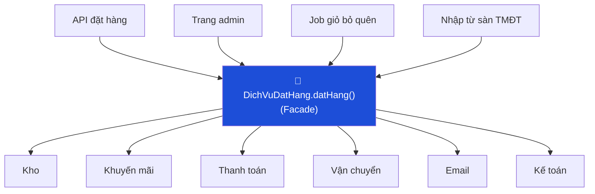

# Bài 07 — Facade

> **Nhóm:** Structural (Cấu trúc)
> **Một câu:** Một cửa vào đơn giản che đi cả một hệ thống con phức tạp.

---

## 1. Ẩn dụ mở bài

Bạn vào nhà hàng và nói: *"Cho tôi một suất cơm gà."*

Bạn **không** nói: "Bật bếp ở 180 độ, lấy gà từ tủ lạnh ngăn 2, ướp 15 phút, vo gạo, canh nước
tỉ lệ 1:1.2, dọn bàn số 5…"

Người phục vụ là **Facade**. Bếp, kho, thu ngân là **hệ thống con**. Bạn vẫn có thể xuống bếp
nếu thật sự cần — Facade **không khóa** bạn lại, nó chỉ khiến việc thông thường trở nên dễ.

---

## 2. Cái đau

Đặt một đơn hàng cần 7 bước, mỗi bước một hệ thống con:

```js
const kho = new DichVuKho();
if (!(await kho.kiemTraTon(maSP, soLuong))) throw new Error("Hết hàng");
const giu = await kho.giuHang(maSP, soLuong);

const km = new DichVuKhuyenMai();
const giam = await km.tinhGiamGia(maKM, tongTien);

const tt = new DichVuThanhToan();
const gd = await tt.thanhToan(theTinDung, tongTien - giam);

const vc = new DichVuVanChuyen();
const van = await vc.taoVanDon(diaChi, canNang);

const mail = new DichVuEmail();
await mail.guiXacNhan(email, { gd, van });

await kho.xacNhanGiu(giu);
await new DichVuKeToan().ghiSo(gd);
```

Và đoạn này bị **copy-paste ở 4 nơi**: API đặt hàng, trang admin, job xử lý giỏ bỏ quên, script
nhập đơn từ sàn thương mại điện tử.

Vấn đề nghiêm trọng nhất **không phải** là dài. Mà là:

- Nếu bước 4 lỗi, ai **nhả hàng đang giữ** ở bước 2? Bốn nơi đó xử lý khác nhau → tồn kho sai.
- Thêm bước "tích điểm thành viên" → phải sửa cả 4 nơi, và chắc chắn sẽ quên một chỗ.
- Người mới vào dự án không biết **thứ tự đúng** là gì.

---

## 3. Ý tưởng



```js
const kq = await dichVuDatHang.datHang({ maSP, soLuong, the, diaChi, email, maKM });
```

Một dòng. Và **quy trình đúng chỉ tồn tại ở một chỗ duy nhất**.

---

## 4. Điểm mấu chốt: Facade là nơi đặt logic bù trừ (compensation)

Đây là phần làm Facade trở nên có giá trị thật, chứ không chỉ là "gom code cho gọn":

```js
async datHang(donHang) {
  const daLam = [];
  try {
    const giu = await this.kho.giuHang(...);
    daLam.push(() => this.kho.nhaHang(giu));      // ghi lại cách hoàn tác

    const gd = await this.thanhToan.tra(...);
    daLam.push(() => this.thanhToan.hoanTien(gd));

    const van = await this.vanChuyen.taoVanDon(...);
    ...
  } catch (e) {
    for (const hoanTac of daLam.reverse()) await hoanTac();  // ngược thứ tự
    throw new LoiDatHang("Đặt hàng thất bại, đã hoàn tác", { nguyenNhan: e });
  }
}
```

Không có Facade, mỗi nơi gọi phải tự viết logic hoàn tác này — và sẽ viết sai.

> **Câu chốt:** Facade không chỉ gom lời gọi. Nó là nơi **duy nhất** biết quy trình đúng,
> thứ tự đúng, và cách dọn dẹp khi hỏng giữa chừng.

---

## 5. Facade **không** cấm truy cập trực tiếp

Điểm này rất hay bị hiểu sai. Facade **không** phải bức tường.

```js
await dichVuDatHang.datHang({...});       // 95% trường hợp — dùng cửa chính

await kho.dieuChinhTonKho(maSP, -3);      // trường hợp đặc biệt — vẫn được vào bếp
```

Nếu bạn thấy mình phải thêm phương thức thứ 30 vào facade để phục vụ mọi tình huống hiếm gặp,
facade đã sai mục đích. Nó chỉ nên phục vụ **những luồng phổ biến nhất**.

---

## 6. Code

```bash
node src/07-facade/demo.js
```

---

## 7. So sánh với các pattern liên quan

| | Facade | Adapter | Mediator |
|---|---|---|---|
| Số object bên dưới | **Nhiều** | Một | Nhiều |
| Đổi interface? | Đơn giản hóa | Dịch sang interface khác | Điều phối |
| Bên dưới có biết nhau? | Có thể có | — | **Không**, chỉ biết mediator |
| Luồng dữ liệu | Một chiều (client → hệ thống con) | Một chiều | Hai chiều |

---

## 8. Bẫy thường gặp

1. **Facade phình thành God Object.** Khi facade có 40 phương thức, nó không còn "đơn giản hóa"
   nữa. 👉 Tách theo *use case*: `DichVuDatHang`, `DichVuTraHang`, `DichVuBaoCao`.

2. **Facade chứa logic nghiệp vụ sâu.** Facade **điều phối**, không **tính toán**. Nếu công thức
   tính giảm giá nằm trong facade, nó phải chuyển về `DichVuKhuyenMai`.

3. **Facade rò rỉ kiểu dữ liệu của hệ thống con.** Nếu `datHang()` trả về nguyên object của
   cổng thanh toán, client lại phụ thuộc vào hệ thống con → facade vô nghĩa.

4. **Chỉ có một hệ thống con.** Nếu facade chỉ bọc một class, đó là Adapter hoặc Proxy, hoặc
   là một lớp thừa. Xóa đi.

---

## 9. Bài tập

📂 `src/07-facade/bai-tap.js`

**Đề:** Hệ thống rạp phim tại nhà, có sẵn 6 hệ thống con (`DanAm`, `MayChieu`, `RemCua`,
`DenPhong`, `MayChoiPhim`, `MayLanh`), mỗi cái có API riêng.

**Yêu cầu:**

1. Viết `RapPhimTaiNha` với hai phương thức: `xemPhim(ten)` và `tatHet()`.
2. `xemPhim()` phải chạy **đúng thứ tự** (bật máy chiếu trước khi hạ rèm là sai — máy chiếu
   cần 3 giây khởi động). Bộ test kiểm tra thứ tự.
3. `tatHet()` phải chạy **ngược thứ tự**.
4. **Phần quan trọng nhất:** `MayChieu.bat()` thất bại ngẫu nhiên. Khi đó facade phải **hoàn tác**
   những gì đã làm (kéo rèm lên, bật đèn) rồi ném lỗi rõ ràng. Không được để phòng tối om
   với rèm đóng mà không có phim.
5. **Nâng cao:** thêm chế độ `xemPhim(ten, { cheDo: "ban-dem" })` — âm lượng nhỏ hơn, đèn mờ.
   Làm sao thêm chế độ mới mà không biến `xemPhim()` thành rừng `if`? (gợi ý: xem trước
   [Bài 09 — Strategy](09-strategy.md))

Lời giải: `src/07-facade/loi-giai.js`

---

## 10. Kiểm tra nhanh

1. Facade khác Adapter ở điểm nào?
2. Vì sao Facade **không nên** cấm truy cập trực tiếp vào hệ thống con?
3. "Logic bù trừ" là gì và vì sao nó thuộc về Facade?
4. Dấu hiệu nào cho thấy một Facade đã phình quá to?

---

⬅️ [06 — Decorator](06-decorator.md) | ➡️ [08 — Proxy](08-proxy.md)
