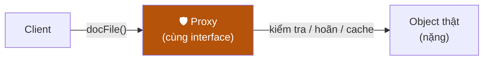

# Bài 08 — Proxy

> **Nhóm:** Structural (Cấu trúc)
> **Một câu:** Một object đứng thay chỗ object thật, **cùng interface**, để kiểm soát lối vào.

---

## 1. Ẩn dụ mở bài

**Thẻ ATM** đứng thay cho tiền trong tài khoản. Nó có cùng "interface" (dùng để trả tiền), nhưng:

- không mang theo tiền thật (**lazy** — tiền chỉ chuyển khi bạn quẹt),
- yêu cầu mã PIN (**kiểm soát quyền**),
- ghi lại mọi giao dịch (**log**),
- chặn nếu quá hạn mức (**điều tiết**).

Đó là bốn loại proxy phổ biến nhất.

---

## 2. Bốn loại Proxy — dạy theo bốn cái đau khác nhau

| Loại | Cái đau | Proxy làm gì |
|---|---|---|
| **Virtual Proxy** | Object nặng, khởi tạo tốn 3s, mà 80% lần chạy không dùng tới | Hoãn khởi tạo tới lần dùng đầu tiên |
| **Protection Proxy** | Ai cũng gọi được `xoaNguoiDung()` | Kiểm tra quyền trước khi cho qua |
| **Logging/Monitoring Proxy** | Không biết ai gọi gì, chậm ở đâu | Ghi lại mọi lời gọi |
| **Caching Proxy** | Gọi API lặp lại tốn tiền/thời gian | Nhớ kết quả |
| **Remote Proxy** | Object nằm ở server khác | Che đi việc phải gọi qua mạng (đây là ý tưởng của RPC/gRPC) |

---

## 3. Ý tưởng



Điều bắt buộc: **Client không phân biệt được** mình đang cầm proxy hay object thật.
Nếu client phải viết `if (laProxy)` thì proxy đã thất bại.

---

## 4. Phân biệt với Decorator — câu hỏi thi hay gặp nhất

Cả hai đều "bọc object, giữ nguyên interface". Khác nhau ở **ý định**:

| | Decorator | Proxy |
|---|---|---|
| Mục đích | **Thêm** khả năng mới | **Kiểm soát** lối vào cái đã có |
| Ai quyết định bọc? | Client, tại lúc dựng object | Thường do hệ thống, client không biết |
| Xếp chồng nhiều lớp? | Có, đó là điểm mạnh chính | Hiếm khi |
| Có object thật ngay từ đầu? | **Có** — bạn truyền vào | **Không nhất thiết** — proxy có thể tự tạo sau |

Cách nhớ nhanh:

> **Decorator** = "cho tôi *thêm* tính năng vào cái này."
> **Proxy** = "cho tôi *đứng gác* trước cái này."

Điểm khác kỹ thuật quan trọng nhất: **Virtual Proxy có thể chưa có object thật.**
Decorator thì bắt buộc phải nhận object để bọc.

---

## 5. `Proxy` — đối tượng có sẵn trong JavaScript

Đây là điểm khiến bài này rất thú vị trong JS: ngôn ngữ có **Proxy ở mức runtime**, cho phép
chặn *mọi* thao tác trên object, kể cả những thuộc tính chưa tồn tại.

```js
const bang = new Proxy({}, {
  get(dich, ten)          { console.log(`đọc ${ten}`);  return dich[ten]; },
  set(dich, ten, giaTri)  { console.log(`ghi ${ten}`);  dich[ten] = giaTri; return true; },
  has(dich, ten)          { return ten in dich; },
  deleteProperty(dich, ten) { delete dich[ten]; return true; },
});
```

Các "bẫy" (trap) hay dùng: `get`, `set`, `has`, `deleteProperty`, `apply`, `construct`,
`ownKeys`.

**Đây chính là cơ chế đằng sau:**
- Vue 3 reactivity (`reactive()` là một Proxy),
- MobX,
- Immer (`produce`),
- các ORM sinh truy vấn từ thuộc tính bạn truy cập.

---

## 6. Code

```bash
node src/08-proxy/demo.js
```

---

## 7. Bẫy thường gặp

1. **Proxy đổi hành vi bất ngờ.** Nếu proxy trả `undefined` thay vì ném lỗi, bug sẽ ẩn rất sâu.
   Proxy phải "trong suốt" — hành vi giống hệt bản gốc, trừ đúng phần nó cố ý kiểm soát.

2. **`instanceof` và `===` không còn tin được.** `proxy !== objectThat`. Đừng so sánh tham chiếu
   khi có proxy trong hệ thống.

3. **Proxy lười khởi tạo trong môi trường bất đồng bộ.** Nếu hai lời gọi đồng thời cùng chạm
   lần đầu, bạn có thể tạo object thật **hai lần**. Cần lưu lại chính cái *Promise* khởi tạo,
   chứ không phải chờ nó xong rồi mới lưu.

4. **`Proxy` của JS làm hiệu năng chậm** ở đường nóng (hot path). Vue 3 dùng nó vì lợi ích lớn
   hơn chi phí — nhưng đừng bọc proxy quanh một vòng lặp chạy triệu lần.

5. **Quên `return true` trong trap `set`** → ném `TypeError` ở strict mode. Lỗi rất khó hiểu
   với người lần đầu dùng.

---

## 8. Bài tập

📂 `src/08-proxy/bai-tap.js`

**Đề gồm 3 phần:**

1. **Virtual Proxy** — `KhoAnhProxy` hoãn việc "tải ảnh" (200ms) tới lần dùng đầu tiên.
   ⚠️ Phải xử lý đúng trường hợp **hai lời gọi đồng thời** — object thật chỉ được tạo một lần.

2. **Protection Proxy** — `TaiKhoanProxy` chỉ cho `admin` gọi `xoa()`, ai cũng gọi được `xem()`.
   Từ chối thì ném `LoiKhongCoQuyen`, **không** trả về `undefined` im lặng.

3. **Proxy của JS** — dùng `new Proxy` để:
   - viết `taoDoiTuongTheoDoi(obj)` ghi lại mọi lần đọc/ghi thuộc tính,
   - viết `chongLoiChinhTa(obj)` ném lỗi ngay khi ai đó đọc một thuộc tính **không tồn tại**
     (bắt lỗi gõ nhầm `user.emial` thay vì để nó thành `undefined` lan đi khắp nơi).

Lời giải: `src/08-proxy/loi-giai.js`

---

## 9. Kiểm tra nhanh

1. Phân biệt Proxy và Decorator bằng ý định, không bằng cấu trúc.
2. Virtual Proxy giải quyết vấn đề gì?
3. Vì sao "proxy phải trong suốt" lại quan trọng?
4. Kể một thư viện JS bạn dùng mà bên trong là `Proxy`.
5. Bẫy khởi tạo lười trong môi trường bất đồng bộ là gì, sửa thế nào?

---

⬅️ [07 — Facade](07-facade.md) | ➡️ [09 — Strategy](09-strategy.md)
