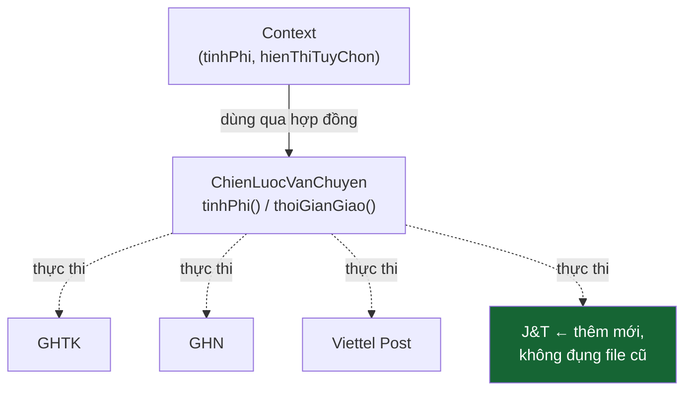

# Bài 09 — Strategy

> **Nhóm:** Behavioral (Hành vi)
> **Một câu:** Đóng gói mỗi thuật toán thành một object riêng, để thay được như thay pin.

> 🔁 **Bài này khép lại vòng tròn:** ta quay về đúng file `bai-tap.js` mà học viên đã đọc ở
> [Bài 00](00-gioi-thieu.md) và chữa nó.

---

## 1. Nhắc lại cái đau từ Bài 00

```js
function tinhPhiShip(hang, donHang) {
  if (hang === "ghtk") { ... }
  else if (hang === "ghn") { ... }
  else if (hang === "viettel-post") { ... }
}

function thoiGianGiao(hang) {
  if (hang === "ghtk") ...       // ← lại if lần nữa
}

function danhSachHangVanChuyen() {
  return ["ghtk", "ghn", "viettel-post"];   // ← và lần nữa
}
```

Thêm một hãng → sửa **ba chỗ**. Ba người cùng làm ba hãng → **conflict cả ba**.
Quên một chỗ → app chạy bình thường cho tới khi khách chọn đúng hãng đó.

**Dấu hiệu vàng nhận biết cần Strategy:**
> Cùng một chuỗi `if/else` (hoặc `switch`) trên **cùng một biến** xuất hiện ở **nhiều hàm khác nhau**.

---

## 2. Ý tưởng



Mỗi hãng trở thành **một object trọn vẹn**, chứa **tất cả** mọi thứ liên quan tới hãng đó:
công thức phí, thời gian giao, tên hiển thị, logo, khu vực phục vụ.

Thêm hãng mới = thêm **một file**. Không sửa file nào cả.

---

## 3. Ba vai trò

| Vai trò | Trong ví dụ | Ghi chú |
|---|---|---|
| **Strategy** (hợp đồng) | `{ ma, ten, tinhPhi(), thoiGianGiao() }` | Trong JS là quy ước + test |
| **Concrete Strategy** | `ChienLuocGHTK`, `ChienLuocGHN`… | Mỗi cái một file |
| **Context** | `DichVuVanChuyen` | Cầm strategy, không biết đó là ai |

Điểm quan trọng: **Context không chọn strategy.** Ai đó ở bên ngoài (người dùng, cấu hình, DB)
chọn và đưa vào.

---

## 4. Strategy trong JavaScript: hàm là đủ

Đây là pattern được JS làm gọn nhất, vì **hàm là first-class**:

```js
const CHIEN_LUOC_SAP_XEP = {
  "gia-tang": (a, b) => a.gia - b.gia,
  "gia-giam": (a, b) => b.gia - a.gia,
  "ten-az": (a, b) => a.ten.localeCompare(b.ten),
  "moi-nhat": (a, b) => b.ngay - a.ngay,
};

sanPham.sort(CHIEN_LUOC_SAP_XEP[luaChonCuaNguoiDung]);
```

Bạn **đã dùng Strategy** mỗi khi truyền hàm so sánh vào `Array.sort()`. Hôm nay chỉ là đặt tên
cho nó.

**Khi nào cần object thay vì hàm đơn?** Khi mỗi chiến lược cần **nhiều hơn một hành vi**
(phí + thời gian + tên hiển thị) hoặc cần **trạng thái riêng** (cấu hình, API key).

---

## 5. Cái giá phải trả — phải nói thật với học viên

| Được | Mất |
|---|---|
| Thêm loại mới không sửa code cũ | Nhiều file hơn, phải nhảy qua lại khi đọc |
| Mỗi thuật toán test riêng được | Người mới khó thấy "toàn cảnh các lựa chọn" |
| Ba người làm ba hãng, không conflict | Cần thêm registry/factory để tra strategy |
| Logic liên quan gom về một chỗ | Với 2 nhánh `if` đơn giản thì đây là bày vẽ |

**Ngưỡng thực dụng:** dưới 3 nhánh và chỉ dùng ở một hàm → giữ `if`. Từ 3 nhánh trở lên hoặc
`if` lặp ở nhiều hàm → chuyển Strategy.

---

## 6. Code

```bash
node src/09-strategy/demo.js
```

---

## 7. Phân biệt với State (Bài 12)

Hai pattern này có **sơ đồ UML gần như giống hệt nhau** — đây là cặp dễ nhầm nhất trong GoF.

| | Strategy | State |
|---|---|---|
| Ai chọn? | **Bên ngoài** (người dùng, config) | **Bản thân object**, tự chuyển |
| Các lựa chọn biết nhau? | Không | **Có** — mỗi state biết state kế tiếp |
| Đổi lúc nào? | Thường một lần, lúc dựng | Liên tục trong vòng đời |
| Ví dụ | Chọn hãng ship | Đơn hàng: chờ → đang giao → đã giao |

Câu hỏi phân biệt: **"Ai quyết định đổi?"** Bên ngoài → Strategy. Bên trong → State.

---

## 8. Bẫy thường gặp

1. **Strategy nhận quá nhiều tham số.** Nếu `tinhPhi(donHang, khachHang, khuyenMai, muaVu, thoiTiet)`
   thì hợp đồng đã quá rộng. Gom thành một object ngữ cảnh.

2. **Context vẫn còn `if` để chọn strategy.** Bạn chỉ mới *dời* chuỗi `if` đi chỗ khác.
   👉 Dùng registry (như [Bài 01](01-factory.md)) để tra bằng `Map`.

3. **Strategy tự lấy dữ liệu bên ngoài** (đọc DB, gọi API). Strategy nên là **hàm thuần**:
   cùng đầu vào → cùng đầu ra. Nếu cần dữ liệu, truyền vào.

4. **Quên chiến lược mặc định.** Người dùng chọn hãng đã ngừng hoạt động → app sập.

---

## 9. Bài tập

📂 `src/09-strategy/bai-tap.js`

**Phần A — chữa lại chính file của Bài 00:**

1. Chuyển 3 hãng vận chuyển thành 3 strategy object, mỗi cái có
   `{ ma, ten, tinhPhi(donHang), thoiGianGiao(), phucVu(donHang) }`.
2. Dùng registry để `danhSachHangVanChuyen()` **tự sinh** từ registry, không viết tay.
3. Thêm **J&T Express** — bộ test kiểm tra bạn không sửa file/hàm nào có sẵn.

**Phần B — Strategy dạng hàm:**

4. Viết bộ chiến lược tính giảm giá (`theo-phan-tram`, `theo-so-tien`, `mua-2-tang-1`,
   `mien-phi-ship`) và **kết hợp nhiều khuyến mãi** — thứ tự áp dụng có ảnh hưởng đến kết quả,
   hãy chứng minh bằng test.

**Phần C — có bẫy:**

5. Có hãng **không phục vụ** một số khu vực. Xử lý thế nào cho đúng: để `tinhPhi()` trả `null`,
   ném lỗi, hay tách một phương thức `phucVu()` riêng? Bộ test sẽ ép bạn chọn phương án tốt.

Lời giải: `src/09-strategy/loi-giai.js`

---

## 10. Kiểm tra nhanh

1. Dấu hiệu vàng nào cho biết nên dùng Strategy?
2. Vì sao `Array.sort(fn)` là một ví dụ Strategy?
3. Strategy khác State ở câu hỏi nào?
4. Khi nào Strategy là bày vẽ không cần thiết?
5. Vì sao Strategy nên là hàm thuần?

---

⬅️ [08 — Proxy](08-proxy.md) | ➡️ [10 — Observer](10-observer.md)
