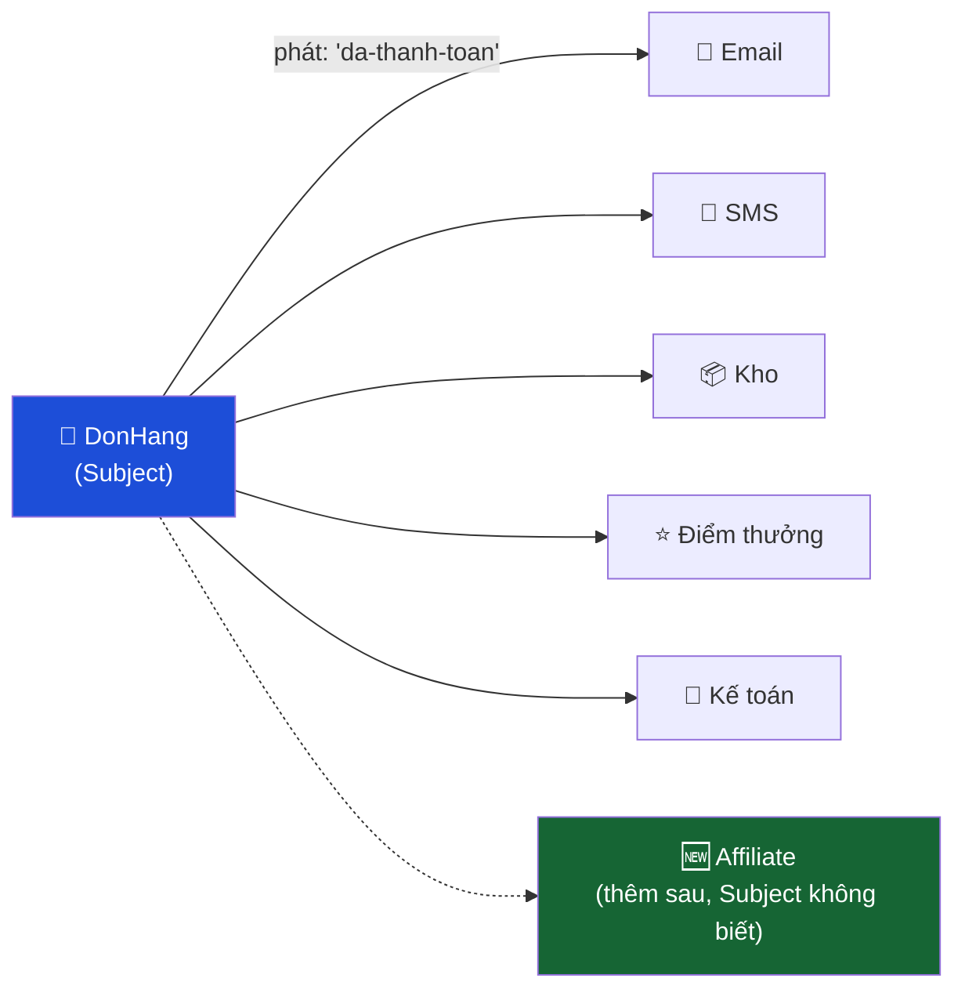

# Bài 10 — Observer

> **Nhóm:** Behavioral (Hành vi)
> **Một câu:** Một chỗ thay đổi, nhiều chỗ tự biết — mà chỗ thay đổi không cần biết ai đang nghe.

---

## 1. Cái đau

Khi một đơn hàng chuyển sang trạng thái "đã thanh toán", phải xảy ra 6 việc:

```js
class DonHang {
  async thanhToan() {
    this.trangThai = "da-thanh-toan";

    await guiEmail(this.khach);            // ← 6 việc này
    await guiSMS(this.khach);              //   không liên quan gì
    await capNhatTonKho(this.cacMon);      //   tới "thanh toán"
    await congDiemThanhVien(this.khach);
    await ghiNhatKyKeToan(this);
    await thongBaoKho(this);
  }
}
```

Ba vấn đề:

1. `DonHang` giờ phụ thuộc vào email, SMS, kho, điểm thưởng, kế toán. Muốn unit test nó, bạn
   phải giả lập cả 6 thứ.
2. Marketing muốn thêm "gửi thông báo cho affiliate" → sửa `DonHang`. Lại sửa. Lại sửa.
3. Nếu `guiSMS` lỗi, `capNhatTonKho` không chạy → **tồn kho sai** vì lý do hoàn toàn không
   liên quan.

---

## 2. Ý tưởng



```js
class DonHang {
  async thanhToan() {
    this.trangThai = "da-thanh-toan";
    this.phat("da-thanh-toan", { donHang: this });   // hết
  }
}

donHang.dangKy("da-thanh-toan", guiEmail);
donHang.dangKy("da-thanh-toan", capNhatTonKho);
```

`DonHang` chỉ nói "chuyện này vừa xảy ra". Ai quan tâm thì tự đăng ký.

---

## 3. Bốn thành phần

| Vai trò | Nhiệm vụ |
|---|---|
| **Subject** (chủ thể) | Giữ danh sách observer, cung cấp `dangKy`/`huyDangKy`/`phat` |
| **Observer** | Hàm/object có phương thức được gọi khi có sự kiện |
| **Sự kiện** | Tên + dữ liệu kèm theo |
| **Đăng ký/Hủy** | ⚠️ Phần hay bị quên nhất — xem mục 5 |

---

## 4. Observer đã có sẵn ở khắp nơi trong JS

Học viên đã dùng Observer hàng ngày:

```js
button.addEventListener("click", xuLy);          // DOM
emitter.on("data", xuLy);                        // Node EventEmitter
socket.on("message", xuLy);                      // WebSocket
store.subscribe(xuLy);                           // Redux
new MutationObserver(xuLy);                      // DOM API
new IntersectionObserver(xuLy);                  // lazy load ảnh
```

Node.js có sẵn `EventEmitter`, nên trong dự án thật bạn hiếm khi tự viết:

```js
import { EventEmitter } from "node:events";
class DonHang extends EventEmitter { ... }
```

Nhưng **hãy để học viên tự viết một bản** trong bài tập — hiểu bên trong nó rồi mới dùng thư viện.

---

## 5. ⚠️ Rò rỉ bộ nhớ — vấn đề số một của Observer

Đây là phần quan trọng nhất bài này, và là bug thật gây sập server trong sản xuất.

```js
class ThanhPhanGioHang {
  constructor(store) {
    store.dangKy("thay-doi", () => this.veLai());   // đăng ký
  }
  // ...và không bao giờ hủy đăng ký
}
```

Người dùng chuyển trang 100 lần → 100 observer còn sống. Mỗi cái giữ tham chiếu tới một component
đã bị hủy → **JS không thể thu hồi bộ nhớ**. Sau vài giờ, tab treo.

Ba cách xử lý, dạy cả ba:

```js
// 1. Trả về hàm hủy — cách gọn nhất, khó quên nhất
const huy = store.dangKy("thay-doi", xuLy);
// khi component bị hủy:
huy();

// 2. AbortController — chuẩn của web hiện đại, hủy nhiều cái cùng lúc
const ac = new AbortController();
el.addEventListener("click", f, { signal: ac.signal });
el.addEventListener("scroll", g, { signal: ac.signal });
ac.abort();   // hủy CẢ HAI

// 3. once — tự hủy sau lần đầu
emitter.once("san-sang", khoiDong);
```

> **Quy tắc để học viên nhớ:** mỗi `dangKy` phải có một `huy` tương ứng ở đâu đó.
> Nếu bạn không viết được câu trả lời cho "ai hủy cái này, khi nào?" thì bạn đang tạo rò rỉ.

---

## 6. Ba cạm bẫy nữa

### 6.1. Một observer lỗi làm chết cả dây

```js
phat(sk, dl) {
  for (const o of this.observers) o(dl);   // ← observer thứ 2 ném lỗi
}                                          //   observer 3,4,5 không bao giờ chạy
```

👉 Bọc từng observer trong `try/catch`. Sự kiện đã xảy ra rồi, một người nghe hỏng không được
làm hỏng những người còn lại.

### 6.2. Thứ tự thực thi không đảm bảo

Đừng bao giờ viết observer B với giả định "A đã chạy xong". Nếu B phụ thuộc A, chúng không nên
là hai observer — đó là một quy trình, thuộc về [Facade](07-facade.md).

### 6.3. Vòng lặp sự kiện vô tận

A phát sự kiện → B nghe được, cập nhật dữ liệu → phát sự kiện → A nghe được → phát tiếp…
Rất khó phát hiện. Dấu hiệu: stack trace dài bất thường hoặc CPU 100%.

---

## 7. Code

```bash
node src/10-observer/demo.js
```

---

## 8. Đồng bộ hay bất đồng bộ?

Một quyết định thiết kế quan trọng mà tài liệu GoF không nói:

| | Đồng bộ (`for` + `await`) | Bất đồng bộ (`Promise.allSettled`) | Hàng đợi (queue) |
|---|---|---|---|
| Subject phải chờ | Có | Có (nhưng chạy song song) | Không |
| Observer lỗi | Biết ngay | Biết ngay | Xử lý riêng, có retry |
| Phù hợp | Ít observer, cần kết quả | Nhiều observer độc lập | Việc nặng, chịu chậm được |

Trong hệ thống thật: gửi email/SMS nên đẩy vào **hàng đợi**, đừng để người dùng chờ SMTP.

---

## 9. Bài tập

📂 `src/10-observer/bai-tap.js`

1. Tự viết `BoPhatSuKien` với `dangKy`, `phat`, `once`, và `dangKy` **trả về hàm hủy**.
2. Bọc try/catch cho từng observer; thu thập lỗi và trả về trong kết quả của `phat()`.
3. Chuyển `DonHang` sang dùng Observer — bộ test kiểm tra `DonHang` **không import** email/SMS/kho.
4. **Chống rò rỉ:** bộ test tạo 1000 component rồi hủy, kiểm tra số observer trở về 0.
5. **Bẫy:** phát hiện và chặn vòng lặp sự kiện vô tận (giới hạn độ sâu đệ quy).
6. **Nâng cao:** thêm ký tự đại diện `phat("don.*")` để một observer nghe nhiều sự kiện.

Lời giải: `src/10-observer/loi-giai.js`

---

## 10. Kiểm tra nhanh

1. Observer giải phóng Subject khỏi điều gì?
2. Vì sao rò rỉ bộ nhớ là vấn đề số một của Observer? Ba cách khắc phục?
3. Vì sao phải bọc try/catch quanh **từng** observer?
4. Khi nào hai việc **không** nên là hai observer?
5. Kể ba API trong JS mà bản chất là Observer.

---

⬅️ [09 — Strategy](09-strategy.md) | ➡️ [11 — Command](11-command.md)
