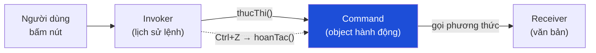

# Bài 11 — Command

> **Nhóm:** Behavioral (Hành vi)
> **Một câu:** Biến một hành động thành một **object**, để có thể lưu lại, xếp hàng, hoàn tác.

---

## 1. Cái đau

Người dùng đòi nút **Undo**.

Nếu code của bạn là:

```js
btnToDam.onclick = () => vanBan.toDam(vungChon);
btnXoa.onclick = () => vanBan.xoa(vungChon);
btnDan.onclick = () => vanBan.chen(viTri, clipboard);
```

thì bạn **không có gì để hoàn tác cả**. Hành động đã xảy ra và biến mất. Bạn không biết:

- vừa rồi làm gì,
- trước đó văn bản trông thế nào,
- làm sao để đảo ngược.

Cách chữa cháy sai lầm mà nhiều người chọn: chụp ảnh toàn bộ văn bản sau mỗi thao tác.
Với file 10MB và 100 bước undo → 1GB RAM.

---

## 2. Ý tưởng

> Đóng gói **hành động + dữ liệu cần thiết + cách đảo ngược** vào một object.

```js
class LenhXoa {
  constructor(vanBan, tu, den) {
    this.vanBan = vanBan;
    this.tu = tu;
    this.den = den;
    this.daXoa = null;          // ← lưu đúng phần cần để hoàn tác
  }
  thucThi() { this.daXoa = this.vanBan.cat(this.tu, this.den); }
  hoanTac() { this.vanBan.chen(this.tu, this.daXoa); }
}
```



Bốn vai trò:

| Vai trò | Trong ví dụ |
|---|---|
| **Command** | `LenhXoa`, `LenhToDam` — có `thucThi()` và `hoanTac()` |
| **Receiver** | `VanBan` — đối tượng thật bị tác động |
| **Invoker** | `LichSuLenh` — giữ ngăn xếp, gọi thực thi/hoàn tác |
| **Client** | Code gắn nút bấm với lệnh |

---

## 3. Điểm mấu chốt: lệnh phải lưu **đủ và chỉ đủ** để hoàn tác

Đây là phần đáng dạy kỹ nhất.

| Cách lưu | Bộ nhớ | Ghi chú |
|---|---|---|
| Chụp toàn bộ trạng thái | 💥 Rất tốn | Đơn giản nhưng không dùng được ở quy mô thật |
| Lưu **phần chênh lệch** | ✅ Nhỏ | Cách đúng — `LenhXoa` chỉ lưu đoạn văn bản đã cắt |
| Tính ngược từ tham số | ✅ Nhỏ nhất | Chỉ được khi phép toán khả nghịch (`+5` ⇄ `-5`) |

⚠️ Bẫy với cách thứ ba: `nhanVoi(0)` **không** khả nghịch. `inHoa()` cũng không (mất thông tin
chữ thường ban đầu). Trước khi dùng "tính ngược", hãy hỏi: *phép toán này có mất thông tin không?*

---

## 4. Command mở ra bốn tính năng "miễn phí"

Người mới thường chỉ nhớ undo. Nhưng khi hành động đã thành object, bạn tự nhiên có được:

1. **Undo/Redo** — hai ngăn xếp.
2. **Hàng đợi & lập lịch** — lệnh có thể lưu lại, chạy sau, chạy trên máy khác.
3. **Nhật ký kiểm toán** — "ai đã làm gì lúc mấy giờ" là danh sách lệnh.
4. **Gộp lệnh (macro)** — nhiều lệnh thành một lệnh, undo một phát ra hết.
5. **Thử lại / phát lại** — dựng lại toàn bộ trạng thái bằng cách chạy lại lịch sử lệnh.

Điểm số 5 chính là ý tưởng của **Event Sourcing** và **CQRS**, cũng như cách Git lưu lịch sử.

---

## 5. Cách rất JavaScript

Với lệnh đơn giản, một object literal là đủ:

```js
const taoLenhToDam = (vanBan, vung) => ({
  ten: "Tô đậm",
  thucThi: () => vanBan.datKieu(vung, "dam", true),
  hoanTac: () => vanBan.datKieu(vung, "dam", false),
});
```

Hoặc chỉ một cặp hàm:

```js
lichSu.chay(
  () => giatri.push(x),
  () => giatri.pop()
);
```

Dùng class khi lệnh có **trạng thái riêng** cần lưu giữa `thucThi` và `hoanTac`.

---

## 6. Code

```bash
node src/11-command/demo.js
```

---

## 7. Bẫy thường gặp

1. **Quên xóa ngăn xếp Redo khi có hành động mới.** Undo 3 bước rồi gõ chữ mới → nhánh redo cũ
   đã vô nghĩa, phải xóa. Không xóa → redo dán nội dung từ một dòng thời gian khác.

2. **Lệnh giữ tham chiếu tới object đã bị xóa.** Hoàn tác một lệnh "sửa đoạn văn" khi đoạn văn
   đó đã bị xóa bởi lệnh sau → lỗi. Giải pháp: dùng **ID** thay vì tham chiếu trực tiếp.

3. **Lệnh bất đồng bộ hoàn tác không được.** Gửi email rồi undo — email đã bay đi rồi. Với hành
   động ra bên ngoài, undo phải là **hành động bù trừ** (gửi email đính chính), không phải phép
   đảo ngược thật.

4. **Ngăn xếp undo phình vô hạn.** Giới hạn số bước (thường 50–100) hoặc giới hạn theo dung lượng.

5. **Lệnh không idempotent bị chạy hai lần.** Trong hàng đợi có retry, `thucThi()` có thể chạy
   lại. Hãy gắn ID cho lệnh và bỏ qua lệnh đã xử lý.

---

## 8. Bài tập

📂 `src/11-command/bai-tap.js`

**Đề:** Trình soạn thảo văn bản đơn giản.

1. Viết `LichSuLenh` với `chay(lenh)`, `hoanTac()`, `lamLai()`.
2. Viết 4 lệnh: `LenhChen`, `LenhXoa`, `LenhThayThe`, `LenhInHoa`.
   ⚠️ `LenhInHoa` **không** khả nghịch bằng tính toán — bạn phải lưu trạng thái cũ.
3. **Bẫy 1:** sau khi hoàn tác rồi chạy lệnh mới, ngăn xếp redo phải bị xóa. Có test.
4. **Bẫy 2:** giới hạn lịch sử 50 bước; bước thứ 51 đẩy bước cũ nhất ra.
5. **Macro:** `LenhGop` chứa nhiều lệnh, hoàn tác một lần ra hết — nhớ hoàn tác **ngược thứ tự**.
6. **Nâng cao:** dùng danh sách lệnh để **phát lại** từ văn bản rỗng, kiểm chứng kết quả khớp
   hoàn toàn (đây là Event Sourcing thu nhỏ).

Lời giải: `src/11-command/loi-giai.js`

---

## 9. Kiểm tra nhanh

1. Vì sao "chụp toàn bộ trạng thái sau mỗi thao tác" là giải pháp tồi?
2. Lệnh nên lưu gì để hoàn tác được mà vẫn tiết kiệm?
3. Nêu ba tính năng mà Command mở ra ngoài undo.
4. Vì sao `inHoa()` không thể hoàn tác bằng cách tính ngược?
5. Undo một hành động đã gửi ra ngoài (email, thanh toán) thì làm thế nào?

---

⬅️ [10 — Observer](10-observer.md) | ➡️ [12 — State](12-state.md)
