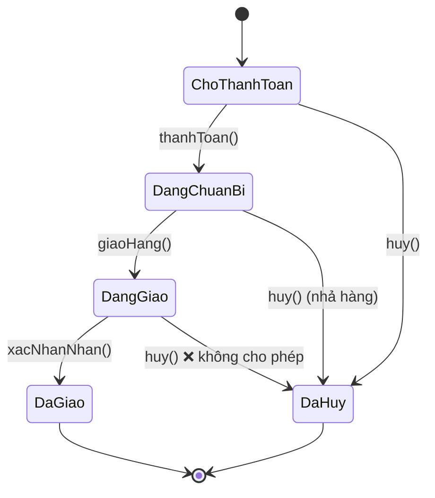

# Bài 12 — State

> **Nhóm:** Behavioral (Hành vi)
> **Một câu:** Object đổi **hành vi** khi đổi **trạng thái** — thay cho rừng `if` rải khắp nơi.

---

## 1. Cái đau

Đơn hàng có 5 trạng thái. Mỗi phương thức lại phải hỏi lại từ đầu:

```js
class DonHang {
  huy() {
    if (this.trangThai === "cho-thanh-toan") { this.trangThai = "da-huy"; }
    else if (this.trangThai === "dang-chuan-bi") { nhaHang(); this.trangThai = "da-huy"; }
    else if (this.trangThai === "dang-giao") { throw new Error("Đang giao, không hủy được"); }
    else if (this.trangThai === "da-giao") { throw new Error("Đã giao rồi"); }
    else if (this.trangThai === "da-huy") { throw new Error("Đã hủy rồi"); }
  }

  giaoHang() { /* lại 5 nhánh if */ }
  hoanTien() { /* lại 5 nhánh if */ }
  capNhatDiaChi() { /* lại 5 nhánh if */ }
}
```

4 phương thức × 5 trạng thái = **20 nhánh** nằm rải rác. Thêm trạng thái "đang khiếu nại" →
phải nhớ sửa **cả 4 phương thức**. Và bạn sẽ quên một chỗ.

Nguy hiểm hơn: **không ai nhìn ra được sơ đồ chuyển trạng thái**. Nó nằm rải trong 20 nhánh `if`.

---

## 2. Ý tưởng

Mỗi trạng thái là **một object riêng**, tự biết mình cho phép gì và chuyển đi đâu.



```js
class TrangThaiDangGiao {
  huy(don) { throw new Error("Đơn đang trên đường giao, không hủy được"); }
  xacNhanNhan(don) { don.chuyenSang(new TrangThaiDaGiao()); }
  capNhatDiaChi(don) { throw new Error("Đang giao, không đổi địa chỉ được"); }
}
```

`DonHang.huy()` giờ chỉ còn **một dòng**:

```js
huy() { return this.trangThai.huy(this); }
```

---

## 3. Lợi ích lớn nhất không phải là "ít if hơn"

Đây là điểm cần nhấn khi giảng:

> Sơ đồ chuyển trạng thái từ chỗ **ẩn trong 20 nhánh if**, trở thành **hiện rõ trong tên class
> và tên phương thức**.

Ba hệ quả thực tế:

1. Người mới vào dự án mở thư mục `trang-thai/` là thấy ngay có bao nhiêu trạng thái.
2. Thêm trạng thái mới = thêm **một file**, không sửa file nào.
3. Không thể quên xử lý một tổ hợp — nếu lớp trạng thái không có phương thức đó,
   lớp cơ sở sẽ ném lỗi rõ ràng.

---

## 4. State và Strategy — nhắc lại

| | Strategy | State |
|---|---|---|
| Ai chọn? | Bên ngoài | **Bản thân object**, tự chuyển |
| Các lựa chọn biết nhau? | Không | **Có** — mỗi state biết state kế tiếp |
| Đổi mấy lần? | Thường một lần | Liên tục |

Đây là điểm khác biệt **duy nhất** thật sự quan trọng: trong State, chính các object trạng thái
**gọi lệnh chuyển sang trạng thái khác**.

---

## 5. Ba cách cài đặt trong JavaScript

### 5.1. Class cho mỗi trạng thái — dễ mapping với UML

Rõ ràng nhất khi mỗi trạng thái có nhiều hành vi phức tạp và dữ liệu riêng.

### 5.2. Bảng chuyển trạng thái (state machine table) — rất JavaScript

```js
const MAY = {
  "cho-thanh-toan": { thanhToan: "dang-chuan-bi", huy: "da-huy" },
  "dang-chuan-bi":  { giaoHang: "dang-giao", huy: "da-huy" },
  "dang-giao":      { xacNhanNhan: "da-giao" },
  "da-giao":        {},
  "da-huy":         {},
};

function chuyen(trangThai, hanhDong) {
  const moi = MAY[trangThai]?.[hanhDong];
  if (!moi) throw new Error(`Không thể "${hanhDong}" khi đang "${trangThai}"`);
  return moi;
}
```

Ưu điểm cực lớn: **toàn bộ sơ đồ nằm gọn trong 7 dòng, nhìn một cái là hiểu**. Bạn còn có thể
sinh sơ đồ hình vẽ tự động từ bảng này.

Nhược điểm: khó gắn hành vi phức tạp (nhả hàng, hoàn tiền) vào từng bước chuyển.

**Cách tốt nhất trong thực tế: kết hợp cả hai** — bảng mô tả *chuyển đi đâu*, hàm mô tả
*làm gì khi chuyển*.

### 5.3. Thư viện

Với máy trạng thái phức tạp (có trạng thái lồng nhau, song song, timeout), dùng **XState**.
Đừng tự viết lại.

---

## 6. Code

```bash
node src/12-state/demo.js
```

---

## 7. Bẫy thường gặp

1. **Trạng thái lưu trong DB không khớp với class.** DB có `"dang_giao"`, code có
   `TrangThaiDangGiao`. Cần một hàm ánh xạ ở đúng một chỗ, và kiểm tra khi nạp dữ liệu.

2. **Object trạng thái giữ dữ liệu của đơn hàng.** Không nên — trạng thái nên **không có
   trạng thái riêng** (stateless), để dùng chung một instance cho mọi đơn. Dữ liệu nằm ở
   `DonHang`, truyền vào như tham số.

3. **Quên hành động khi vào/rời trạng thái.** Vào "đang giao" phải gửi thông báo; rời
   "đang chuẩn bị" phải chốt tồn kho. Hãy thêm `khiVao(don)` / `khiRoi(don)`.

4. **Chuyển trạng thái không nguyên tử.** Nếu vừa đổi trạng thái xong thì lỗi khi lưu DB,
   bộ nhớ và DB lệch nhau. Hãy lưu trước, đổi sau — hoặc dùng transaction.

5. **Đối chiếu bằng chuỗi ở nơi khác.** Nếu ngoài class vẫn còn `if (don.trangThai === "dang-giao")`
   thì bạn chưa gom hết luật vào state.

---

## 8. Bài tập

📂 `src/12-state/bai-tap.js`

**Đề:** Máy trạng thái đơn hàng với 5 trạng thái và 5 hành động.

1. Cài đặt 5 lớp trạng thái, mỗi lớp kế thừa `TrangThaiCoSo` (mặc định ném lỗi rõ nghĩa).
2. `DonHang` chỉ ủy thác — bộ test kiểm tra `DonHang` **không chứa chữ `if`** nào liên quan
   tới trạng thái.
3. Cài `khiVao(don)` — vào "đang giao" thì tạo mã vận đơn; vào "đã hủy" thì nhả hàng.
4. Giữ **lịch sử chuyển trạng thái** kèm mốc thời gian (rất hữu ích khi hỗ trợ khách hàng).
5. Viết lại **cùng máy trạng thái đó** bằng **bảng chuyển**, và so sánh hai cách.
6. **Nâng cao:** sinh sơ đồ Mermaid tự động từ bảng chuyển.

Lời giải: `src/12-state/loi-giai.js`

---

## 9. Kiểm tra nhanh

1. Vì sao 4 phương thức × 5 trạng thái là vấn đề, không chỉ là "code dài"?
2. Lợi ích lớn nhất của State là gì (không phải "ít if hơn")?
3. Vì sao object trạng thái nên stateless?
4. Khi nào dùng bảng chuyển thay vì class?
5. Điểm khác biệt cốt lõi giữa State và Strategy?

---

⬅️ [11 — Command](11-command.md) | ➡️ [13 — Module](13-module.md)
