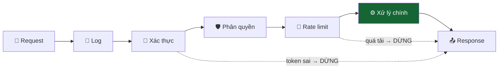

# Bài 14 — Middleware / Chain of Responsibility

> **Nhóm:** Đặc thù JavaScript (nhưng gốc là Chain of Responsibility trong GoF)
> **Một câu:** Xâu chuỗi các bước xử lý, mỗi bước tự quyết định **đi tiếp** hay **dừng lại**.

---

## 1. Cái đau

Mỗi API endpoint cần làm cùng một loạt việc trước khi vào logic chính:

```js
async function xuLyDatHang(req, res) {
  // 1. ghi log
  // 2. kiểm tra token
  // 3. kiểm tra quyền
  // 4. kiểm tra rate limit
  // 5. đọc và validate body
  // 6. bắt lỗi

  // ...và cuối cùng, 5 dòng logic đặt hàng thật sự
}
```

Có 40 endpoint → 6 việc đó bị copy 40 lần. Sửa cách kiểm tra token → sửa 40 chỗ.

---

## 2. Ý tưởng



Mỗi middleware nhận `(nguCanh, tiep)`:

```js
const xacThuc = async (ctx, tiep) => {
  const token = ctx.req.headers.authorization;
  if (!token) {
    ctx.res = { status: 401, body: "Chưa đăng nhập" };
    return;                       // ← KHÔNG gọi tiep() → dây chuyền DỪNG
  }
  ctx.nguoiDung = giaiMa(token);
  await tiep();                   // ← gọi tiep() → đi tiếp
};
```

Hai quyền năng của mỗi middleware:

1. **Quyết định có đi tiếp không** — không gọi `tiep()` là chặn đứng.
2. **Chạy code cả TRƯỚC lẫn SAU** phần còn lại của dây chuyền — vì `await tiep()` trả về
   sau khi mọi thứ phía sau đã xong.

---

## 3. Mô hình "củ hành" — điểm quan trọng nhất

```
       ┌─── Log (trước) ────────────────────────────┐
       │  ┌── Xác thực (trước) ──────────────────┐  │
       │  │  ┌── Rate limit (trước) ─────────┐   │  │
       │  │  │      ⚙️ XỬ LÝ CHÍNH            │   │  │
       │  │  └── Rate limit (sau) ───────────┘   │  │
       │  └── Xác thực (sau) ───────────────────┘  │
       └─── Log (sau) ─────────────────────────────┘
```

```js
const doThoiGian = async (ctx, tiep) => {
  const t = Date.now();      // ← chạy TRƯỚC
  await tiep();              // ← toàn bộ phần còn lại chạy ở đây
  ctx.res.thoiGian = Date.now() - t;   // ← chạy SAU, khi đã có kết quả
};
```

Đây là điều khiến middleware **mạnh hơn** một chuỗi `if` thông thường: một middleware có thể
bọc trọn phần còn lại của dây chuyền.

> **So với Decorator ([Bài 06](06-decorator.md)):** ý tưởng giống nhau. Khác biệt là
> middleware xâu chuỗi **động, theo danh sách**, và mỗi mắt xích được quyền **chấm dứt** sớm.

---

## 4. Cài đặt lõi — chỉ 10 dòng

```js
function taoDayChuyen(cacMiddleware) {
  return function chay(ctx) {
    let i = -1;
    const buoc = async (n) => {
      if (n <= i) throw new Error("tiep() bị gọi nhiều lần");   // ⚠️ quan trọng
      i = n;
      const mw = cacMiddleware[n];
      if (!mw) return;
      await mw(ctx, () => buoc(n + 1));
    };
    return buoc(0);
  };
}
```

Đây gần như chính xác là lõi của **Koa** (`koa-compose`). 10 dòng, và bạn hiểu toàn bộ.

Chi tiết dễ bỏ qua: kiểm tra `tiep()` gọi hai lần. Nếu không có, một middleware viết sai sẽ
khiến phần sau chạy hai lần — và bug đó cực kỳ khó lần ra.

---

## 5. Bắt lỗi tập trung

Middleware **đầu tiên** trở thành nơi bắt mọi lỗi của toàn dây chuyền:

```js
const batLoi = async (ctx, tiep) => {
  try {
    await tiep();
  } catch (e) {
    ctx.res = { status: e.status ?? 500, body: e.message };
    ghiLog(e);
  }
};
```

Một `try/catch` duy nhất thay cho 40 cái rải rác. Đây là lý do thứ tự middleware quan trọng:
**bắt lỗi phải ở ngoài cùng**.

---

## 6. Code

```bash
node src/14-middleware/demo.js
```

---

## 7. Bạn đã dùng nó ở đâu

| Nơi | Dạng |
|---|---|
| Express | `app.use((req, res, next) => ...)` |
| Koa | `app.use(async (ctx, next) => ...)` — chính là mô hình củ hành |
| Redux | `store => next => action => ...` |
| Axios | interceptors |
| Webpack | loader chain |
| Xử lý sự kiện DOM | bubbling + `stopPropagation()` |

---

## 8. Bẫy thường gặp

1. **Quên `await tiep()`.** Dùng `tiep()` không `await` → phần "sau" chạy trước khi phần trong
   xong. Response gửi đi khi dữ liệu chưa sẵn sàng. Rất khó phát hiện vì đôi khi vẫn "chạy đúng".

2. **Gọi `tiep()` hai lần.** Middleware phía sau chạy hai lần. Phải có kiểm tra.

3. **Thứ tự sai.** `batLoi` đặt sau `xacThuc` → lỗi xác thực không được bắt.

4. **Middleware nặng đặt quá sớm.** Parse body 10MB *trước* khi kiểm tra token → kẻ tấn công
   không cần đăng nhập vẫn làm bạn tốn CPU.

5. **Đổi `ctx` một cách bừa bãi.** `ctx` là bộ nhớ dùng chung của cả dây chuyền. Hãy quy ước rõ
   middleware nào ghi trường nào.

---

## 9. Bài tập

📂 `src/14-middleware/bai-tap.js`

1. Viết `taoDayChuyen(cacMiddleware)` — lõi 10 dòng, có chống gọi `tiep()` hai lần.
2. Viết 6 middleware: `batLoi`, `ghiLog`, `doThoiGian`, `xacThuc`, `phanQuyen(vaiTro)`,
   `gioiHanTanSuat(max)`.
3. Bộ test kiểm tra **mô hình củ hành**: thứ tự vào/ra phải đối xứng.
4. **Bẫy 1:** một middleware trong đề bài quên `await` — tìm và sửa.
5. **Bẫy 2:** chứng minh việc đặt `batLoi` sai chỗ khiến lỗi lọt ra ngoài.
6. **Nâng cao:** viết `chiKhi(dieuKien, middleware)` để middleware chỉ chạy với một số route.

Lời giải: `src/14-middleware/loi-giai.js`

---

## 10. Kiểm tra nhanh

1. Hai quyền năng của một middleware là gì?
2. Vì sao gọi là "mô hình củ hành"?
3. Vì sao `batLoi` phải ở ngoài cùng?
4. Điều gì xảy ra nếu quên `await tiep()`?
5. Middleware khác Decorator ở điểm nào?

---

⬅️ [13 — Module](13-module.md) | ➡️ [15 — Pub/Sub](15-pubsub.md)
