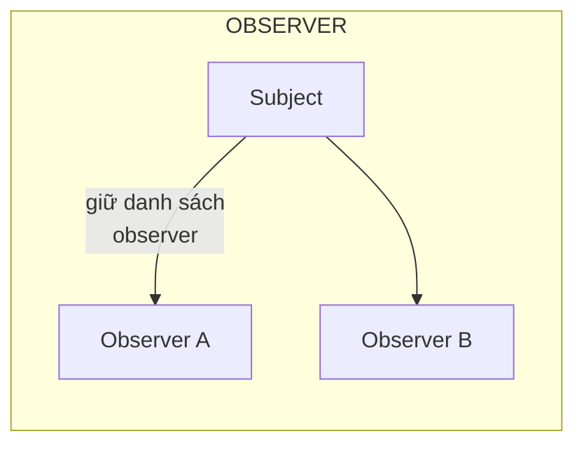
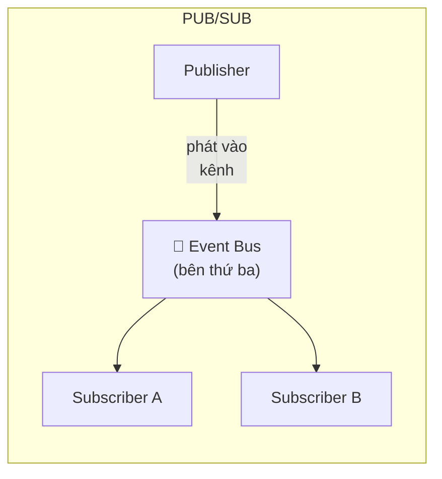

# Bài 15 — Pub/Sub (Event Bus)

> **Nhóm:** Đặc thù JavaScript
> **Một câu:** Giống Observer, nhưng bên gửi và bên nhận **không hề biết nhau tồn tại**.

---

## 1. Pub/Sub khác Observer thế nào?

Đây là câu hỏi trung tâm của bài. Nhiều tài liệu dùng lẫn lộn hai tên, nhưng khác biệt là thật:





| | Observer | Pub/Sub |
|---|---|---|
| Subject giữ danh sách người nghe? | **Có** | Không — bus giữ |
| Hai bên biết nhau? | Subject biết observer | **Không bên nào biết bên nào** |
| Cần bên thứ ba? | Không | **Có** — event bus / broker |
| Đăng ký khi nào? | Phải có subject trước | Bất cứ lúc nào, kể cả trước khi publisher tồn tại |
| Mức tách rời | Vừa | **Rất cao** |

Trong Observer, `donHang.dangKy(...)` — bạn **phải cầm được** đối tượng đơn hàng.
Trong Pub/Sub, `bus.dangKy("don.da-thanh-toan", ...)` — bạn chỉ cần biết **tên kênh**.

---

## 2. Cái đau mà Pub/Sub giải quyết

Module "báo cáo doanh thu" cần biết khi có đơn hàng mới. Với Observer, nó phải:

1. lấy được tham chiếu tới từng object `DonHang`,
2. đăng ký vào từng cái một,
3. và làm việc đó với **mọi** đơn hàng được tạo ra ở **mọi** nơi trong app.

Không khả thi. Với Pub/Sub, module báo cáo chỉ cần một dòng lúc khởi động:

```js
bus.dangKy("don.da-thanh-toan", capNhatBaoCao);
```

Nó không cần biết ai tạo đơn, tạo ở đâu, tạo lúc nào.

---

## 3. Cái giá — phải nói rất rõ với học viên

Pub/Sub mua sự tách rời bằng **khả năng truy vết**. Đây là đánh đổi nghiêm túc nhất trong
toàn bộ giáo trình này:

| Được | Mất |
|---|---|
| Hai bên hoàn toàn độc lập | **Không "Go to definition" được** — bấm vào tên kênh, IDE không đưa bạn tới đâu cả |
| Thêm subscriber không sửa code cũ | Không biết ai đang nghe, không biết ai đã phát |
| Chạy qua ranh giới tiến trình (Redis, Kafka) | Gõ sai tên kênh → im lặng không có gì xảy ra |
| Test từng phần dễ | Test cả luồng khó |

> **Quy tắc thực dụng:** Trong một module, dùng lời gọi hàm trực tiếp. Giữa các module,
> cân nhắc Pub/Sub. **Đừng** dùng event bus như một cách tránh việc suy nghĩ về kiến trúc.

Có một triệu chứng rất dễ nhận ra khi Pub/Sub bị lạm dụng:
> Bạn phải grep toàn bộ dự án để trả lời câu hỏi "chuyện gì xảy ra khi người dùng bấm nút này?"

---

## 4. Bốn kỹ thuật làm Pub/Sub bớt nguy hiểm

Đây là phần đáng dạy nhất, vì nó biến một pattern nguy hiểm thành dùng được:

### 4.1. Danh mục sự kiện tập trung

```js
export const SU_KIEN = Object.freeze({
  DON_DA_THANH_TOAN: "don.da-thanh-toan",
  DON_DA_HUY: "don.da-huy",
});
```

Gõ sai `SU_KIEN.DON_DA_THANHTOAN` → `undefined` → lỗi ngay. Gõ sai chuỗi thô → im lặng.
Và bạn có được một chỗ duy nhất để đọc *toàn bộ* sự kiện của hệ thống.

### 4.2. Bus tự ghi lại sơ đồ

Cho bus tự thu thập "ai phát gì, ai nghe gì", rồi sinh sơ đồ. Đây là cách bù lại đúng thứ
bạn vừa mất.

### 4.3. Cảnh báo sự kiện không ai nghe

Phát một sự kiện mà không có subscriber nào → gần như luôn là bug (gõ sai tên, hoặc module
chưa được nạp). Hãy log cảnh báo.

### 4.4. Kiểm tra hình dạng dữ liệu

Publisher và subscriber không biết nhau, nên không có gì đảm bảo payload đúng.
Hãy khai báo và kiểm tra ở bus.

---

## 5. Code

```bash
node src/15-pubsub/demo.js
```

---

## 6. Pub/Sub ngoài đời

| Trong tiến trình | Qua mạng |
|---|---|
| `EventEmitter` của Node | Redis Pub/Sub |
| `BroadcastChannel` (giữa các tab) | Kafka, RabbitMQ, NATS |
| `postMessage` (worker, iframe) | AWS SNS/SQS, Google Pub/Sub |
| Vuex/Pinia actions | WebSocket / Socket.IO |

Điểm hay: **cùng một mô hình tư duy** cho cả hai cột. Học viên hiểu event bus trong bộ nhớ thì
hiểu luôn kiến trúc hướng sự kiện ở quy mô hệ thống.

---

## 7. Bẫy thường gặp

1. **Gõ sai tên kênh** → không lỗi, không gì xảy ra. Bug tệ nhất là bug im lặng.
2. **Không hủy đăng ký** → rò rỉ bộ nhớ, giống [Bài 10](10-observer.md).
3. **Vòng lặp sự kiện** — A phát B, B phát A. Với bus toàn cục, vòng lặp có thể đi qua 6 module.
4. **Dùng Pub/Sub cho việc cần kết quả trả về.** Publish là "bắn rồi quên". Nếu bạn cần biết
   kết quả, hãy gọi hàm.
5. **Thứ tự subscriber** — không đảm bảo, đừng phụ thuộc vào nó (xem lại Bài 10).

---

## 8. Bài tập

📂 `src/15-pubsub/bai-tap.js`

1. Viết `EventBus` với `dangKy`, `phat`, `once`, hủy đăng ký, và hỗ trợ ký tự đại diện.
2. **Danh mục sự kiện** đóng băng, và bus **từ chối** tên kênh không có trong danh mục.
3. **Cảnh báo** khi phát sự kiện không ai nghe.
4. **Kiểm tra payload** theo lược đồ khai báo sẵn cho từng kênh.
5. **Ghi lại sơ đồ**: bus tự thu thập ai phát gì / ai nghe gì, sinh sơ đồ Mermaid.
6. **Nâng cao:** `phatVaCho()` — publish rồi chờ tất cả subscriber xong, gom kết quả và lỗi.

Lời giải: `src/15-pubsub/loi-giai.js`

---

## 9. Kiểm tra nhanh

1. Khác biệt cốt lõi giữa Observer và Pub/Sub là gì?
2. Pub/Sub mua sự tách rời bằng cái giá nào?
3. Nêu bốn kỹ thuật làm Pub/Sub an toàn hơn.
4. Vì sao "phát sự kiện không ai nghe" nên cảnh báo?
5. Khi nào **không** nên dùng Pub/Sub?

---

⬅️ [14 — Middleware](14-middleware.md) | ➡️ [16 — Dependency Injection](16-dependency-injection.md)
