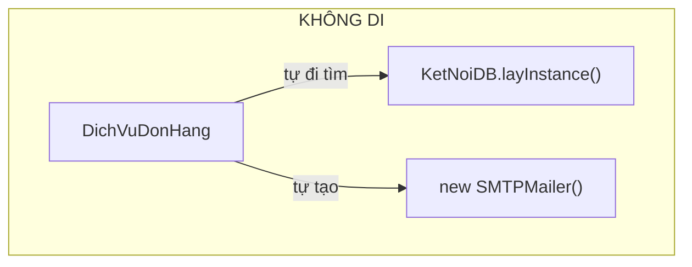
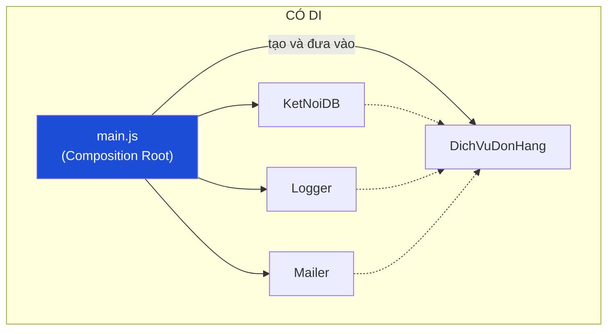

# Bài 16 — Dependency Injection

> **Nhóm:** Đặc thù JavaScript (thực ra là nguyên lý chung, mọi ngôn ngữ)
> **Một câu:** Một class **không tự đi tìm** những thứ nó cần — người khác **đưa vào** cho nó.

> 🔁 Bài này khép lại chủ đề đã mở ở [Bài 02 — Singleton](02-singleton.md).

---

## 1. Cái đau

```js
class DichVuDonHang {
  async tao(donHang) {
    const db = KetNoiDB.layInstance();          // ← tự đi tìm
    const logger = Logger.layInstance();        // ← tự đi tìm
    const mailer = new SMTPMailer(process.env.SMTP_HOST);  // ← tự tạo
    ...
  }
}
```

Nhìn vào `new DichVuDonHang()` bạn **không biết** class này cần gì. Bốn hậu quả:

1. **Không test được.** Muốn test `tao()`, bạn phải có database thật, SMTP thật.
2. **Không biết phụ thuộc.** Phải đọc hết thân hàm mới biết.
3. **Không thay được.** Muốn dùng mailer khác ở môi trường dev? Không có chỗ nào để can thiệp.
4. **Thứ tự khởi tạo ngầm.** Class này phải chạy sau khi DB đã kết nối — nhưng không ai ghi ra.

---

## 2. Ý tưởng

```js
class DichVuDonHang {
  constructor({ db, logger, mailer }) {
    this.db = db;
    this.logger = logger;
    this.mailer = mailer;
  }
  async tao(donHang) { ... }
}
```

Constructor giờ là một **bản khai báo trung thực**: "tôi cần ba thứ này để làm việc".





---

## 3. Composition Root — khái niệm quan trọng nhất bài này

> **Chỉ có một nơi duy nhất trong toàn bộ ứng dụng được phép "đi lấy" và "lắp ráp" mọi thứ.**
> Nơi đó là điểm khởi động: `main.js`.

```js
// main.js — nơi DUY NHẤT biết cách lắp ráp
const db = await taoKetNoiDB(cauHinh.db);
const logger = taoLogger(cauHinh.mucLog);
const mailer = cauHinh.moiTruong === "production"
  ? new SMTPMailer(cauHinh.smtp)
  : new MailerGiaLap();                       // ← dev không gửi email thật

const dichVuDonHang = new DichVuDonHang({ db, logger, mailer });
const controller = new DonHangController({ dichVuDonHang });
```

Mọi class khác chỉ **nhận**, không bao giờ **đi tìm**. Đây chính là câu trả lời cho câu hỏi
ở Bài 02: *"làm sao vừa dùng chung một instance, vừa test được?"*

---

## 4. Ba kiểu tiêm phụ thuộc

| Kiểu | Cú pháp | Dùng khi |
|---|---|---|
| **Constructor injection** | `new X({ db, logger })` | **Mặc định** — phụ thuộc bắt buộc |
| **Method injection** | `x.chay(donHang, { logger })` | Phụ thuộc chỉ dùng ở một phương thức |
| **Property injection** | `x.logger = logger` | Phụ thuộc tùy chọn, có mặc định |

Ưu tiên **constructor injection**: nếu thiếu thì lỗi ngay lúc dựng object, chứ không phải
lúc 3 giờ sáng khi người dùng bấm nút.

---

## 5. Có cần framework DI không?

Trong Java/C#, DI thường đi kèm framework (Spring, .NET DI). Trong JavaScript, **thường không cần**:

```js
// Đây đã là DI. Không cần thư viện nào.
const dichVu = new DichVuDonHang({ db, logger, mailer });
```

Khi nào cần container?

- Khi cây phụ thuộc sâu 5+ tầng và bạn mệt vì truyền tay.
- Khi cần vòng đời phức tạp (singleton / theo request / tạo mới mỗi lần).
- Khi có phụ thuộc vòng cần giải quyết.

Nhưng **hãy bắt đầu bằng cách truyền tay**. Rất nhiều dự án Node không bao giờ cần hơn thế.
Nếu dùng NestJS thì bạn đã có container sẵn.

---

## 6. Code

```bash
node src/16-dependency-injection/demo.js
```

---

## 7. Bẫy thường gặp

1. **Tiêm quá nhiều.** Constructor 9 tham số là dấu hiệu class làm quá nhiều việc.
   Đây không phải lỗi của DI — DI chỉ **làm lộ ra** vấn đề vốn đã có.

2. **Tiêm cả container vào.** `constructor(container)` rồi `container.get("db")` — bạn quay
   lại đúng chỗ cũ (Service Locator), chỉ khác cái tên. Phụ thuộc lại bị giấu.

3. **Tiêm thứ không cần tiêm.** `Math.random`, `Date` — chỉ tiêm khi bạn *thật sự* cần điều
   khiển chúng trong test. (Nhưng nếu logic phụ thuộc thời gian, hãy tiêm `dongHo` — đó là
   một trong những thứ đáng tiêm nhất.)

4. **Giả lập quá nhiều trong test.** Nếu test có 8 mock, có thể bạn đang test cấu trúc code
   thay vì test hành vi.

5. **Composition Root rò rỉ.** Nếu một class ở tầng sâu vẫn `import db from "./db.js"`,
   bạn có DI trên giấy nhưng không có trên thực tế.

---

## 8. Bài tập

📂 `src/16-dependency-injection/bai-tap.js`

**Đề:** Có sẵn `DichVuDatHang` viết theo kiểu "tự đi tìm" — đang **không test được**.

1. Refactor sang constructor injection.
2. Viết các bản giả (`db`, `mailer`, `dongHo`, `sinhMa`) và test **không chạm** vào hệ thống thật.
3. **Điểm mấu chốt:** tiêm cả `dongHo` và `sinhMa` để test có kết quả **lặp lại được** —
   `new Date()` và `Math.random()` làm test không tất định.
4. Viết `main.js` giả lập: cấu hình `production` vs `test` lắp ráp khác nhau.
5. **Nâng cao:** viết container DI đơn giản (`dangKy`, `lay`) có phát hiện **phụ thuộc vòng**.
6. **Câu hỏi thiết kế:** sau khi có container, vì sao **không** nên tiêm container vào class?

Lời giải: `src/16-dependency-injection/loi-giai.js`

---

## 9. Kiểm tra nhanh

1. DI giải quyết bốn vấn đề gì?
2. Composition Root là gì và vì sao chỉ nên có một?
3. Vì sao tiêm container vào class là phản tác dụng?
4. Vì sao nên tiêm `dongHo` thay vì gọi `new Date()` trực tiếp?
5. Khi nào JS thật sự cần một DI container?

---

⬅️ [15 — Pub/Sub](15-pubsub.md) | ➡️ [17 — Reactive / Signal](17-signal.md)
