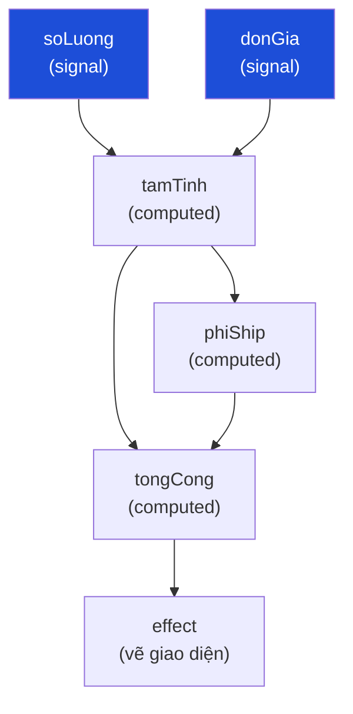

# Bài 17 — Reactive / Signal

> **Nhóm:** Đặc thù JavaScript
> **Một câu:** Giá trị tự lan truyền — đổi một chỗ, mọi thứ phụ thuộc nó **tự** cập nhật.

> Đây là nền tảng của Vue, Solid, Svelte 5, Angular 16+, và Preact Signals.
> Bài này ta **tự viết lại lõi của nó trong 40 dòng**.

---

## 1. Cái đau

Giỏ hàng: đổi số lượng → phải cập nhật tổng tiền, phí ship, thuế, nút thanh toán, badge trên
header, và gợi ý "mua thêm 50k để freeship".

```js
function doiSoLuong(ma, sl) {
  gioHang.doi(ma, sl);
  capNhatTongTien();
  capNhatPhiShip();
  capNhatThue();
  capNhatNutThanhToan();
  capNhatBadge();
  capNhatGoiY();
  // ...và nhớ gọi đúng THỨ TỰ, vì thuế tính trên tổng tiền
}
```

Ba vấn đề:

1. Có 5 chỗ khác cũng đổi giỏ hàng (thêm món, xóa món, áp mã, đổi địa chỉ) → copy 6 dòng đó 5 lần.
2. Quên gọi một hàm → giao diện hiển thị **số cũ**. Người dùng thấy tổng tiền sai.
3. Gọi sai thứ tự → thuế tính trên tổng tiền cũ.

---

## 2. Ý tưởng: khai báo **quan hệ**, không viết **thao tác cập nhật**

```js
const soLuong = signal(2);
const donGia = signal(250_000);

const tamTinh = computed(() => soLuong() * donGia());
const phiShip = computed(() => (tamTinh() >= 500_000 ? 0 : 30_000));
const tongCong = computed(() => tamTinh() + phiShip());

effect(() => console.log("Tổng:", tongCong()));

soLuong.set(3);   // → tamTinh, phiShip, tongCong và effect TỰ cập nhật
```

Bạn **không hề gọi** `capNhatTongTien()`. Bạn chỉ **mô tả quan hệ**, hệ thống lo phần còn lại.



---

## 3. Cơ chế bên trong — chỉ có ba mảnh ghép

Đây là phần thú vị nhất, và nó **đơn giản hơn học viên tưởng rất nhiều**:

### Mảnh 1: một biến toàn cục ghi "ai đang chạy"

```js
let dangChay = null;
```

### Mảnh 2: khi ĐỌC signal, nó ghi lại ai đang đọc mình

```js
function signal(giaTri) {
  const nguoiPhuThuoc = new Set();
  const doc = () => {
    if (dangChay) nguoiPhuThuoc.add(dangChay);   // ← tự động đăng ký!
    return giaTri;
  };
  doc.set = (moi) => {
    if (Object.is(giaTri, moi)) return;          // không đổi → không làm gì
    giaTri = moi;
    for (const f of [...nguoiPhuThuoc]) f();     // báo cho mọi người
  };
  return doc;
}
```

### Mảnh 3: khi chạy effect, đặt `dangChay` trỏ vào nó

```js
function effect(fn) {
  const chay = () => {
    const truoc = dangChay;
    dangChay = chay;
    try { fn(); } finally { dangChay = truoc; }
  };
  chay();
}
```

**Đó là toàn bộ.** Sự "kỳ diệu" của Vue/Solid nằm ở ba mảnh này.

> **Điểm mấu chốt để nhấn mạnh:** phụ thuộc được **phát hiện tự động lúc chạy**, không phải
> khai báo tay. Bạn không viết `[soLuong, donGia]` như mảng dependency của React `useEffect` —
> hệ thống tự biết vì nó **quan sát việc đọc**.

---

## 4. Signal khác Observer thế nào?

| | Observer (Bài 10) | Signal |
|---|---|---|
| Đăng ký | **Thủ công** — `dangKy(...)` | **Tự động** khi đọc giá trị |
| Cái được truyền | Sự kiện (đã xảy ra) | Giá trị (hiện tại) |
| Chuỗi phụ thuộc | Tự nối tay | Tự động, nhiều tầng |
| Giá trị không đổi | Vẫn thông báo | **Không** thông báo (tối ưu sẵn) |

---

## 5. Hai vấn đề khó — phải dạy, vì đây là chỗ người ta hay viết sai

### 5.1. Tính toán thừa (glitch)

```
tamTinh đổi → phiShip đổi → tongCong chạy
            → tongCong chạy lần nữa (vì tamTinh cũng là phụ thuộc trực tiếp)
```

`tongCong` chạy **hai lần**, và lần đầu với dữ liệu **không nhất quán**. Với UI phức tạp, đây là
nguyên nhân của những lần nhấp nháy khó hiểu.

Cách chữa: **gom cập nhật theo lô** (batching) — hoãn effect tới cuối, chạy mỗi cái đúng một lần.

### 5.2. Phụ thuộc cũ không được dọn

```js
effect(() => {
  if (hienChiTiet()) console.log(chiTiet());
});
```

Khi `hienChiTiet` thành `false`, effect **không còn dùng** `chiTiet` — nhưng nó vẫn nằm trong danh
sách phụ thuộc, và vẫn bị đánh thức vô ích.

Cách chữa: mỗi lần chạy lại, **xóa sạch phụ thuộc cũ** rồi thu thập lại từ đầu.

---

## 6. Code

```bash
node src/17-signal/demo.js
```

---

## 7. Ai đang dùng?

| Thư viện | Tên gọi |
|---|---|
| Vue 3 | `ref`, `computed`, `watchEffect` |
| Solid.js | `createSignal`, `createMemo`, `createEffect` |
| Svelte 5 | `$state`, `$derived`, `$effect` (runes) |
| Angular 16+ | `signal`, `computed`, `effect` |
| Preact | `@preact/signals` |
| MobX | `observable`, `computed`, `autorun` |

**Không phải React `useState`** — React chọn hướng khác (so sánh lại toàn bộ cây, dependency array
khai báo tay). Đây là điểm so sánh rất hay để giảng.

---

## 8. Bẫy thường gặp

1. **Effect gây tác dụng phụ vô hạn.** Effect ghi vào chính signal nó đọc → vòng lặp.
2. **Đọc signal ngoài effect** → không đăng ký gì, và bạn tưởng nó "không hoạt động".
3. **Quên rằng computed là lười.** Nếu không ai đọc, nó có thể không bao giờ chạy.
4. **Signal chứa object.** `s.set({...})` với object mới luôn khác → luôn thông báo, kể cả khi
   nội dung giống hệt. Hãy dùng signal cho giá trị nguyên thủy khi có thể.
5. **Rò rỉ effect.** Effect trong component bị hủy vẫn sống → giống Bài 10, cần hàm dọn dẹp.

---

## 9. Bài tập

📂 `src/17-signal/bai-tap.js`

1. Cài `signal(giaTri)` — đọc bằng `s()`, ghi bằng `s.set(x)`.
2. Cài `effect(fn)` — tự động chạy lại khi phụ thuộc đổi, trả về hàm dừng.
3. Cài `computed(fn)` — giá trị dẫn xuất, **có nhớ (memo)**, chạy được nhiều tầng.
4. **Không thông báo khi giá trị không đổi** (dùng `Object.is`).
5. **Dọn phụ thuộc cũ** — bộ test kiểm tra effect ngừng theo dõi nhánh không còn dùng.
6. **Gom theo lô:** `batch(fn)` — effect chỉ chạy **một lần** ở cuối.
7. Dựng lại bài toán giỏ hàng bằng signal và chứng minh: đổi số lượng → mọi thứ tự đúng.

Lời giải: `src/17-signal/loi-giai.js`

---

## 10. Kiểm tra nhanh

1. Ba mảnh ghép của cơ chế signal là gì?
2. Vì sao phụ thuộc được phát hiện tự động mà không cần khai báo?
3. Signal khác Observer ở điểm nào?
4. "Glitch" là gì, khắc phục bằng cách nào?
5. Vì sao cần dọn phụ thuộc cũ mỗi lần effect chạy lại?

---

⬅️ [16 — Dependency Injection](16-dependency-injection.md) | ➡️ [99 — Tổng kết](99-tong-ket.md)
