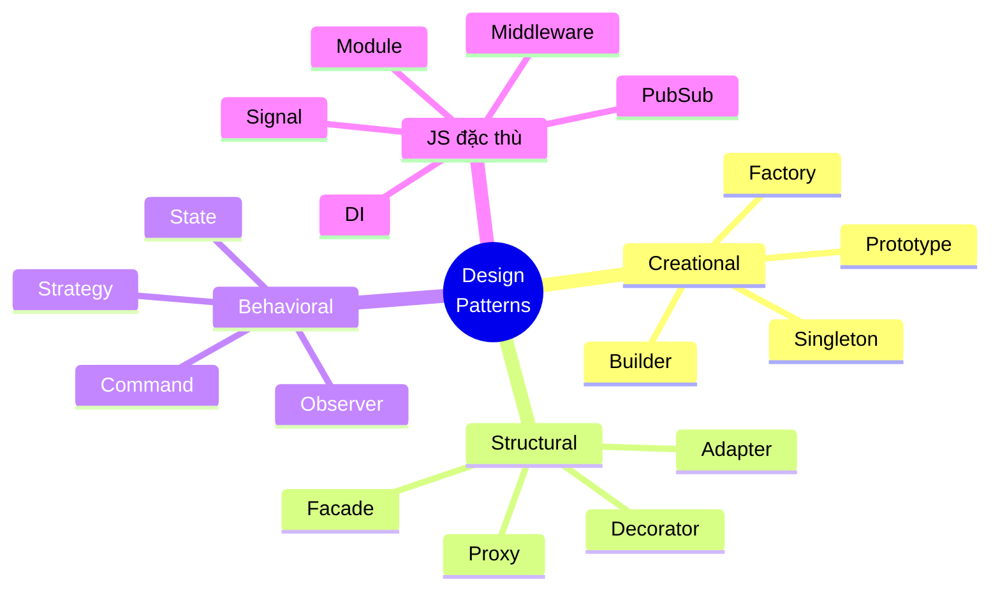

# Bài 99 — Tổng kết & Phân biệt

> Buổi cuối khóa. Mục tiêu **không phải** ôn lại 17 pattern, mà là giúp học viên
> **chọn đúng** và **biết khi nào không cần pattern nào cả**.

---

## 1. Bản đồ toàn khóa



---

## 2. Bảng tra nhanh — "tôi đang gặp vấn đề này thì dùng gì?"

| Triệu chứng trong code | Pattern | Bài |
|---|---|---|
| `new` một class cụ thể nằm sâu trong logic nghiệp vụ | **Factory** | [01](01-factory.md) |
| Nhiều nơi tạo trùng lặp một tài nguyên tốn kém | **Singleton** (cẩn thận!) | [02](02-singleton.md) |
| Constructor quá 4 tham số, nhiều tham số tùy chọn | **Builder** | [03](03-builder.md) |
| Khởi tạo tốn kém, cần nhiều bản gần giống nhau | **Prototype** | [04](04-prototype.md) |
| Thư viện bên thứ ba có interface không khớp | **Adapter** | [05](05-adapter.md) |
| Muốn thêm log/cache/retry mà không sửa class gốc | **Decorator** | [06](06-decorator.md) |
| Một thao tác phải gọi 7 hệ thống con theo đúng thứ tự | **Facade** | [07](07-facade.md) |
| Cần lazy load, kiểm tra quyền, hoặc chặn truy cập | **Proxy** | [08](08-proxy.md) |
| Cùng chuỗi `if` trên cùng một biến, ở nhiều hàm | **Strategy** | [09](09-strategy.md) |
| Một thay đổi kéo theo 6 việc không liên quan nhau | **Observer** | [10](10-observer.md) |
| Cần undo/redo, hàng đợi, nhật ký thao tác | **Command** | [11](11-command.md) |
| Object có nhiều trạng thái, mỗi phương thức lại `if` lại | **State** | [12](12-state.md) |
| Cần đóng gói riêng tư / nhiều instance có dữ liệu riêng | **Module** | [13](13-module.md) |
| 40 endpoint copy cùng 6 bước tiền xử lý | **Middleware** | [14](14-middleware.md) |
| Hai module ở xa nhau cần liên lạc mà không nên biết nhau | **Pub/Sub** | [15](15-pubsub.md) |
| Class tự đi tìm phụ thuộc → không test được | **DI** | [16](16-dependency-injection.md) |
| Đổi một giá trị, phải nhớ gọi 6 hàm cập nhật | **Signal** | [17](17-signal.md) |

---

## 3. Sáu cặp hay bị nhầm — phần quan trọng nhất buổi này

### 3.1. Factory vs Builder

| Factory | Builder |
|---|---|
| **Một** lời gọi | **Nhiều** bước |
| "Cho tôi một cái xe" | "Gắn bánh, gắn máy, sơn màu, rồi giao" |
| Quyết định **tạo loại nào** | Quyết định **cấu hình ra sao** |

### 3.2. Adapter vs Decorator vs Proxy vs Facade

Cả bốn đều "bọc một object". Hỏi đúng một câu: **interface bên ngoài trông thế nào so với bên trong?**

```
KHÁC interface        → Adapter    (làm hai bên nói chuyện được)
GIỐNG, thêm hành vi   → Decorator  (log, cache, retry)
GIỐNG, kiểm soát vào  → Proxy      (lazy, quyền, chặn)
GỘP nhiều thứ, đơn giản hơn → Facade
```

Điểm phân biệt kỹ thuật giữa Decorator và Proxy: **Proxy có thể chưa có object thật**
(virtual proxy tự tạo sau); Decorator **bắt buộc** nhận object để bọc.

### 3.3. Strategy vs State

> **Ai quyết định đổi?** Bên ngoài → Strategy. Bản thân object → State.

Bổ sung: trong State, các trạng thái **biết nhau** (mỗi cái biết trạng thái kế tiếp).
Trong Strategy, các chiến lược **không biết nhau tồn tại**.

### 3.4. Observer vs Pub/Sub vs Signal

```
Observer   subject GIỮ danh sách người nghe;  đăng ký thủ công;  truyền SỰ KIỆN
Pub/Sub    bên thứ ba (bus) giữ;  hai bên không biết nhau;  truyền SỰ KIỆN
Signal     đăng ký TỰ ĐỘNG khi đọc;  truyền GIÁ TRỊ;  lan truyền nhiều tầng
```

### 3.5. DI vs Strategy

Code trông giống hệt nhau. Khác ở **ý đồ**:

- **Strategy**: nhiều lựa chọn cùng hợp lệ trong môi trường thật → là **tính năng**.
- **DI**: môi trường thật thường chỉ một lựa chọn; các lựa chọn khác để test → là **kiến trúc**.

DI là *cơ chế*, Strategy là *ý đồ*. Bạn thường dùng DI để hiện thực hóa Strategy.

### 3.6. Middleware vs Decorator

Middleware = Decorator + **quyền chấm dứt sớm** + **xâu chuỗi động** + **ngữ cảnh dùng chung**.

---

## 4. Ba pattern nguy hiểm nhất với người mới

Nhắc lại rõ ràng ở buổi cuối:

| Pattern | Nguy hiểm vì | Dùng đúng cách |
|---|---|---|
| **Singleton** | Là biến toàn cục đội lốt; giết khả năng test | Dùng module ESM, nhưng **truyền vào** như tham số |
| **Pub/Sub** | Mất khả năng truy vết; bug im lặng | Danh mục sự kiện + kiểm tra payload + sinh sơ đồ |
| **Inheritance sâu** (không phải pattern, nhưng hay bị dùng thay pattern) | Không tổ hợp được (2ⁿ class) | Ưu tiên **composition** — Decorator/Strategy |

---

## 5. Khi nào KHÔNG dùng pattern nào cả

Đây là bài học quan trọng nhất, và nên là slide cuối cùng.

```
❌ "Sau này biết đâu cần"        → không. Viết đơn giản trước.
❌ Một interface, một cài đặt     → chi phí không có lợi ích
❌ 2 nhánh if trong một hàm       → giữ nguyên if
❌ Pattern để code trông chuyên nghiệp → đó là lý do tệ nhất
```

**Rule of Three:** chỉ refactor sang pattern khi cùng một loại thay đổi xuất hiện **lần thứ ba**.

> Pattern là **phản ứng** với một thay đổi đã xảy ra,
> không phải **dự đoán** một thay đổi có thể xảy ra.

---

## 6. Ba câu hỏi phải trả lời được trước khi thêm bất kỳ pattern nào

1. **Nó chống lại thay đổi nào?** (nếu không trả lời được → đừng dùng)
2. **Cái giá là gì?** (thêm file, thêm gián tiếp, khó debug hơn)
3. **Không dùng thì code trông thế nào?** (nếu "cũng ổn thôi" → đừng dùng)

---

## 7. Đề kiểm tra cuối khóa (gợi ý)

Đưa học viên **một codebase xấu** và yêu cầu:

1. Chỉ ra **ba** chỗ nên dùng pattern, nêu tên pattern và lý do.
2. Chỉ ra **một** chỗ *có vẻ* nên dùng pattern nhưng thực ra **không nên** — giải thích.
3. Refactor **một** trong ba chỗ đó, kèm test chứng minh hành vi không đổi.

Câu 2 mới là câu phân loại thật sự. Học viên nào cũng nhét được pattern vào code;
người giỏi là người biết chỗ nào **không** nên nhét.

---

## 8. Học tiếp gì?

| Chủ đề | Vì sao liên quan |
|---|---|
| **SOLID** đầy đủ | Nền tảng lý thuyết của mọi pattern trong khóa |
| **Refactoring** (Martin Fowler) | Cách *đi tới* pattern một cách an toàn, từng bước nhỏ |
| **Domain-Driven Design** | Pattern ở mức kiến trúc, không chỉ mức class |
| **Event Sourcing / CQRS** | Mở rộng tự nhiên của [Command](11-command.md) |
| **XState** | Khi [State](12-state.md) trở nên phức tạp thật sự |
| **Functional programming** | Nhiều pattern OOP tan biến khi có hàm bậc cao |

Điểm cuối đáng nói với học viên: khoảng **một nửa** số pattern GoF tồn tại để bù cho những thứ
mà ngôn ngữ hồi đó thiếu. JavaScript có hàm là first-class, nên Strategy, Command, Observer,
Template Method đều thu gọn lại đáng kể. **Biết pattern là tốt; biết khi nào ngôn ngữ đã giải
quyết sẵn còn tốt hơn.**

---

## 9. Checklist tự đánh giá cho học viên

Sau khóa học, bạn nên trả lời được:

- [ ] Ba nhóm pattern trả lời ba câu hỏi gì?
- [ ] Phân biệt Adapter / Decorator / Proxy / Facade bằng một câu hỏi duy nhất
- [ ] Vì sao Singleton bị gọi là anti-pattern, và cách dùng đúng
- [ ] Vì sao kế thừa không thay thế được Decorator (con số 2ⁿ)
- [ ] Strategy khác State ở câu hỏi nào
- [ ] Vì sao mỗi `dangKy` phải có một `huy`
- [ ] Vì sao cache không được lưu kết quả lỗi
- [ ] Vì sao nên tiêm `dongHo` thay vì gọi `new Date()`
- [ ] Nêu được **một** trường hợp không dùng pattern là lựa chọn đúng

---

⬅️ [17 — Signal](17-signal.md) | 🏠 [Mục lục](../README.md)
