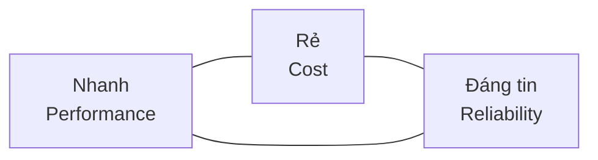
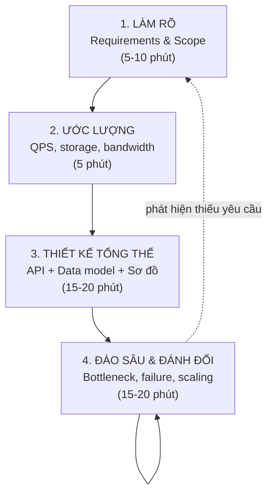
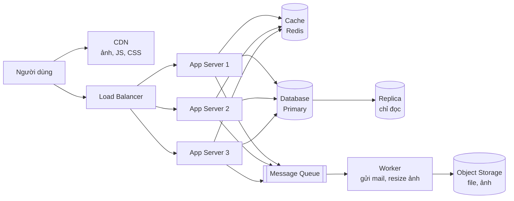

# Buổi 01 — Nhập môn: tư duy đánh đổi & khung 4 bước

> **Mục tiêu**: Sau buổi này học viên (1) hiểu System Design là gì và *không* là gì, (2) dùng được
> khung 4 bước để tiếp cận bất kỳ bài toán thiết kế nào, (3) biết đọc một sơ đồ kiến trúc.

---

## 1. Câu chuyện mở đầu (15')

Bạn viết một app bán vé concert. Code chạy ngon trên máy bạn. Deploy lên 1 con VPS $5.

- **Ngày thường**: 50 người truy cập. Mọi thứ hoàn hảo.
- **19:59:00 ngày mở bán**: 80.000 người bấm F5 cùng lúc.
- **19:59:03**: server hết RAM, database từ chối kết nối, trang trắng.
- **20:05**: bạn tăng RAM lên gấp 4. Vẫn trắng.
- **20:30**: vé bán hết qua... đường dây riêng. Bạn lên báo.

**Câu hỏi cho lớp**: Tăng RAM gấp 4 mà vẫn chết. Tại sao? Cái gì thực sự là nút thắt?

*(Đừng trả lời ngay. Cuối buổi 04 học viên sẽ tự trả lời được.)*

---

## 2. System Design là gì?

**Định nghĩa dùng được**:

> System Design là việc quyết định **các thành phần** của hệ thống, **cách chúng nói chuyện** với
> nhau, và **đánh đổi** gì để đạt được yêu cầu về quy mô, tốc độ, độ tin cậy và chi phí.

### System Design KHÔNG phải là:

| Hiểu lầm | Thực tế |
|---|---|
| Học thuộc tên công nghệ (Kafka, Redis, K8s) | Công nghệ chỉ là *cách hiện thực*. Ý tưởng mới là cái bạn phải hiểu. |
| Vẽ càng nhiều box càng giỏi | Kiến trúc tốt là kiến trúc **đơn giản nhất** đáp ứng được yêu cầu. |
| Có một đáp án đúng | Mọi đáp án đều là đánh đổi. Người phỏng vấn nghe **lý do**, không nghe đáp án. |
| Chỉ dành cho senior | Junior không thiết kế hệ thống lớn, nhưng phải *đọc hiểu* được để không phá nó. |

### Ba đại lượng luôn kéo nhau



Bạn hầu như không bao giờ tối ưu được cả ba. Ví dụ:

- Muốn **nhanh** → thêm cache, thêm server ở nhiều vùng → **đắt hơn** và dễ **sai dữ liệu** hơn.
- Muốn **đáng tin** → nhân bản dữ liệu 3 nơi, chờ cả 3 xác nhận → **chậm hơn**, **đắt hơn**.
- Muốn **rẻ** → 1 server duy nhất → chết là chết cả hệ thống.

> 🎯 **Câu thần chú của khoá học**: *"Được cái này thì mất cái gì?"*

---

## 3. Bốn thuộc tính chất lượng cần hỏi ở mọi bài toán

Người mới hay lao vào vẽ ngay. Hãy dừng lại và hỏi bốn nhóm câu hỏi sau.

### 3.1. Scalability — Mở rộng

- Bao nhiêu user? Bao nhiêu request/giây? Peak gấp mấy lần trung bình?
- Dữ liệu tăng bao nhiêu GB/tháng?
- Đọc nhiều hay ghi nhiều? (tỉ lệ read:write cực kỳ quan trọng)

### 3.2. Availability — Sẵn sàng

- Chết 1 giờ có sao không? Chết 1 ngày?
- SLA bao nhiêu? (99.9% = ~43 phút chết/tháng; 99.99% = ~4.3 phút/tháng)

```
99%     → 3.65 ngày chết/năm
99.9%   → 8.77 giờ/năm      ("three nines")
99.99%  → 52.6 phút/năm     ("four nines")
99.999% → 5.26 phút/năm     ("five nines" — rất đắt)
```

### 3.3. Consistency — Nhất quán

- User A ghi xong, user B đọc ngay có thấy không?
- Chỗ nào chấp nhận dữ liệu cũ vài giây? (số like → được; số dư ngân hàng → không)

### 3.4. Latency — Độ trễ

- p50, p95, p99 mục tiêu là bao nhiêu?
- **Vì sao dùng p99 chứ không dùng trung bình?** → Xem buổi 03.

---

## 4. KHUNG 4 BƯỚC — công cụ dùng cả khoá

Đây là phần quan trọng nhất buổi hôm nay. Học viên phải thuộc.



### Bước 1 — Làm rõ yêu cầu

Chia làm hai loại, **luôn viết ra bảng**:

| Functional (hệ thống làm gì) | Non-functional (làm tốt đến đâu) |
|---|---|
| User rút gọn được URL dài | 100 triệu link/tháng |
| Truy cập link ngắn → redirect | Redirect p99 < 100ms |
| Xem thống kê click | Đọc:Ghi = 100:1 |
| | Uptime 99.9% |

**Kỹ thuật quan trọng: cắt scope.** Nói to lên: *"Em sẽ bỏ qua tính năng custom domain và
analytics real-time để tập trung vào luồng chính, nếu còn thời gian em quay lại."*

### Bước 2 — Ước lượng (back-of-the-envelope)

Chỉ cần đúng ở mức **bậc độ lớn** (order of magnitude). Chi tiết ở buổi 03.

### Bước 3 — Thiết kế tổng thể

Theo đúng thứ tự này để không bị lạc:

1. **API** — hệ thống lộ ra những endpoint nào? (`POST /links`, `GET /:code`)
2. **Data model** — bảng/collection nào, khoá chính là gì?
3. **Sơ đồ** — vẽ từ client sang phải: Client → LB → Service → Cache → DB.

### Bước 4 — Đào sâu

Với mỗi thành phần, hỏi ba câu:

1. **Nó chết thì sao?** (single point of failure ở đâu?)
2. **Nó quá tải thì sao?** (component nào vỡ trước?)
3. **Dữ liệu ở đây có thể cũ không?** (consistency)

---

## 5. Đọc hiểu một sơ đồ kiến trúc

Kiến trúc điển hình của một web app "trưởng thành":



Bản ASCII để vẽ nhanh lên bảng:

```
           ┌─────┐
  User ───►│ CDN │  (file tĩnh)
    │      └─────┘
    ▼
┌────────┐   ┌──────────┐   ┌───────┐
│   LB   ├──►│ App x N  ├──►│ Cache │
└────────┘   └────┬─────┘   └───────┘
                  │  │
                  │  └────────────► [Queue] ──► Worker ──► Object Storage
                  ▼
             ┌─────────┐   ┌──────────┐
             │ DB (W)  ├──►│ Replica  │ (R)
             └─────────┘   └──────────┘
```

**Bài tập tại lớp (5')**: Chỉ vào sơ đồ và trả lời: nếu Cache chết, chuyện gì xảy ra? Nếu DB
Primary chết? Nếu Queue chết?

---

## 6. Lab (40')

📂 `labs/lab01-khung-thiet-ke/`

```bash
node labs/lab01-khung-thiet-ke/01-checklist.js
```

Lab này chạy một "phỏng vấn viên ảo" trong terminal: nó đưa đề bài và bắt bạn điền câu trả lời
theo khung 4 bước vào file `bai-lam.js`, rồi chấm xem bạn có bỏ sót bước nào không.

---

## 7. Cái giá phải trả

Khung 4 bước là **giàn giáo, không phải nhà tù**. Rủi ro khi dùng máy móc:

- Đọc thuộc lòng khung mà không suy nghĩ → nghe rất giả trong phỏng vấn.
- Dành 30 phút ước lượng cho một bài mà con số không ảnh hưởng thiết kế → lãng phí.
- Vẽ sơ đồ đẹp nhưng không nói được vì sao chọn từng thành phần → trượt.

---

## 8. Bài tập về nhà

1. Chọn 1 app bạn dùng hàng ngày (Shopee, Spotify, Grab...). Viết ra:
   - 5 yêu cầu functional, 4 yêu cầu non-functional.
   - Vẽ sơ đồ kiến trúc bạn *đoán* (bằng tay hoặc mermaid), tối đa 8 box.
   - Với mỗi box, viết 1 câu: "nếu nó chết thì user thấy gì?"
2. Tra và ghi lại SLA công bố của 3 dịch vụ cloud bất kỳ. Quy đổi ra số phút chết/tháng.

---

## 9. Câu hỏi kiểm tra

1. Availability 99.9% cho phép chết bao nhiêu phút mỗi tháng?
2. Vì sao "vẽ nhiều thành phần" không đồng nghĩa với "thiết kế tốt"?
3. Bốn bước của khung thiết kế là gì? Bước nào hay bị người mới bỏ qua nhất?
4. Ba câu hỏi phải đặt cho mọi thành phần trong bước 4 là gì?
5. Cho tỉ lệ đọc:ghi = 100:1 — điều này gợi ý ta nên đầu tư vào đâu trước?
