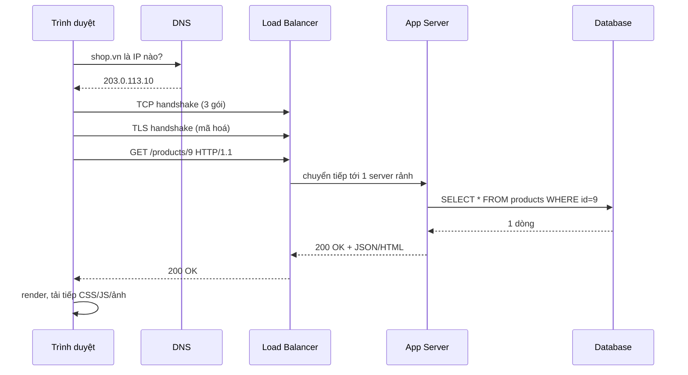
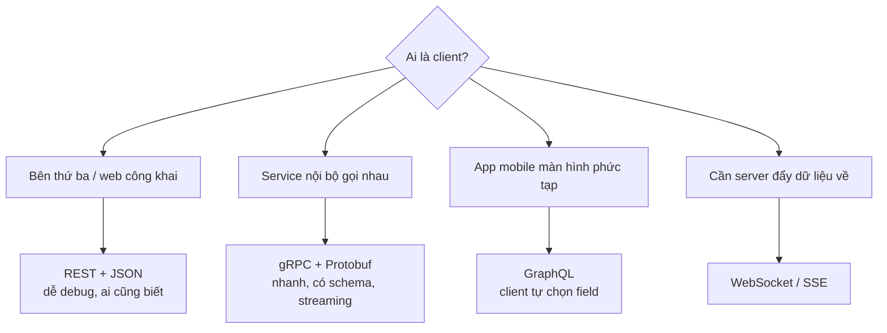

# Buổi 02 — Client–Server, HTTP và thiết kế API

> **Mục tiêu**: Hiểu chuyện gì thực sự xảy ra khi gõ một URL; nắm HTTP đủ sâu để thiết kế API;
> phân biệt REST / gRPC / GraphQL và biết khi nào dùng cái nào.

---

## 1. Câu chuyện mở đầu (15')

Team bạn ra API mới cho app mobile:

```
GET /getUserData?id=42
```

Sáu tháng sau:
- Có `getUserData`, `getUserInfo`, `fetchUser`, `user_detail` — không ai biết cái nào còn dùng.
- App mobile bản cũ gọi API, server đổi format → 200.000 máy crash.
- Mỗi lần mở màn hình profile, app gọi 14 request → 3G mất 6 giây mới hiện.

**Không có lỗi kỹ thuật nào ở đây.** Vấn đề là *thiết kế giao diện giữa các hệ thống*. Đó là nội
dung buổi hôm nay.

---

## 2. Chuyện gì xảy ra khi bạn gõ `https://shop.vn/products/9`?



**Điểm cần nhấn cho người mới**: mỗi mũi tên là một chuyến đi khứ hồi qua mạng. Từ Việt Nam sang
server ở Singapore mất ~30–50ms *mỗi lượt*. TCP + TLS đã ăn 2–3 lượt trước khi byte dữ liệu đầu
tiên được gửi. Đây là lý do "gộp request" là một kỹ thuật tối ưu lớn.

---

## 3. HTTP — phần tối thiểu cần thuộc

### 3.1. Method và ý nghĩa ngữ nghĩa

| Method | Ý nghĩa | An toàn? | Idempotent? |
|---|---|---|---|
| `GET` | Đọc | ✅ không đổi dữ liệu | ✅ |
| `POST` | Tạo mới / hành động | ❌ | ❌ |
| `PUT` | Thay thế toàn bộ | ❌ | ✅ |
| `PATCH` | Sửa một phần | ❌ | ❌ (thường) |
| `DELETE` | Xoá | ❌ | ✅ |

> **Idempotent** = gọi 1 lần hay 10 lần cho cùng kết quả. Cực kỳ quan trọng: khi mạng lỗi và client
> retry, chỉ method idempotent mới an toàn để thử lại. Ghi nhớ khái niệm này — buổi 08 và 09 sẽ
> quay lại rất nhiều.

### 3.2. Status code — nhóm theo "ai có lỗi"

```
2xx  Thành công          200 OK · 201 Created · 204 No Content
3xx  Chuyển hướng        301 vĩnh viễn · 302 tạm thời · 304 Not Modified (cache)
4xx  LỖI CỦA CLIENT      400 sai format · 401 chưa đăng nhập · 403 không có quyền
                         404 không tồn tại · 409 xung đột · 429 quá nhiều request
5xx  LỖI CỦA SERVER      500 lỗi chung · 502 upstream hỏng · 503 quá tải · 504 timeout
```

Hai lỗi người mới hay mắc:
- Trả `200 OK` kèm `{ "error": "..." }` → client không thể phân biệt, monitoring mù.
- Trả `500` khi user nhập sai → làm nhiễu cảnh báo, che mất sự cố thật.

### 3.3. Header đáng nhớ

| Header | Dùng để | Gặp lại ở buổi |
|---|---|---|
| `Cache-Control`, `ETag` | Cache phía client/CDN | 05 |
| `Authorization: Bearer …` | Xác thực | 13 |
| `Idempotency-Key` | Chống tạo trùng khi retry | 08, 09 |
| `X-Request-Id` / `traceparent` | Truy vết xuyên dịch vụ | 12 |
| `Retry-After` | Server bảo client chờ bao lâu | 09 |

### 3.4. HTTP/1.1 vs HTTP/2 vs HTTP/3

- **HTTP/1.1**: 1 request/1 connection tại một thời điểm → trình duyệt mở 6 connection, vẫn tắc.
- **HTTP/2**: nhiều stream trên 1 connection (multiplexing), nén header. Vẫn dính head-of-line
  blocking ở tầng TCP.
- **HTTP/3 (QUIC)**: chạy trên UDP, mất 1 gói không chặn các stream khác. Tốt cho mạng di động.

---

## 4. Thiết kế API kiểu REST

### 4.1. Nguyên tắc: URL là **danh từ**, method là **động từ**

```
❌ POST /createOrder          ✅ POST   /orders
❌ GET  /getOrderById?id=9    ✅ GET    /orders/9
❌ POST /deleteOrder          ✅ DELETE /orders/9
❌ GET  /getOrdersOfUser?u=3  ✅ GET    /users/3/orders
```

### 4.2. Phân trang — bắt buộc, không có ngoại lệ

```
❌ GET /orders                 → 4 triệu bản ghi, server chết
✅ GET /orders?limit=20&cursor=eyJpZCI6MTIzfQ
```

Hai kiểu phân trang:

| | Offset (`?page=5&size=20`) | Cursor (`?cursor=abc&limit=20`) |
|---|---|---|
| Dễ hiểu | ✅ | ❌ |
| Nhảy tới trang bất kỳ | ✅ | ❌ |
| Hiệu năng khi offset lớn | ❌ `OFFSET 1000000` cực chậm | ✅ luôn nhanh |
| Dữ liệu thay đổi khi đang duyệt | ❌ trùng/sót bản ghi | ✅ ổn định |

> Feed mạng xã hội **luôn** dùng cursor. Bảng quản trị nội bộ dùng offset cũng được.

### 4.3. Versioning

```
/v1/orders            ← đơn giản nhất, khuyên dùng khi mới bắt đầu
Accept: application/vnd.shop.v2+json   ← "đúng chuẩn" hơn nhưng khó debug
```

**Quy tắc vàng**: đừng bao giờ thay đổi ý nghĩa của một field đã tồn tại. Chỉ *thêm* field mới
(backward compatible). Đổi kiểu dữ liệu = tạo version mới.

### 4.4. Định dạng lỗi thống nhất

```json
{
  "error": {
    "code": "ORDER_ALREADY_PAID",
    "message": "Đơn hàng này đã được thanh toán",
    "requestId": "req_01HX3K..."
  }
}
```

`code` cho máy đọc (client switch-case), `message` cho người đọc, `requestId` để tra log (buổi 12).

---

## 5. REST vs gRPC vs GraphQL vs WebSocket



| | REST | gRPC | GraphQL |
|---|---|---|---|
| Định dạng | JSON (text) | Protobuf (nhị phân) | JSON |
| Tốc độ / kích thước | Trung bình | Nhanh, nhỏ ~3-10x | Trung bình |
| Debug bằng curl | ✅ dễ | ❌ cần tool | 🟡 được |
| Over-fetching | ❌ hay thừa field | ❌ | ✅ lấy đúng cái cần |
| Cache HTTP | ✅ tự nhiên | ❌ | ❌ khó (mọi thứ là POST) |
| Rủi ro | — | Khó dùng từ trình duyệt | Query độc hại làm sập DB (N+1) |

**Lời khuyên thực dụng cho người mới**: bắt đầu bằng REST. Chỉ đổi khi có nỗi đau cụ thể:
- Đau vì latency giữa các service nội bộ → gRPC.
- Đau vì mobile phải gọi 14 request/màn hình → GraphQL hoặc endpoint tổng hợp (BFF).
- Đau vì phải polling liên tục → WebSocket/SSE.

### WebSocket vs SSE vs Polling

| Kỹ thuật | Hướng | Dùng khi |
|---|---|---|
| Short polling (`setInterval` gọi API) | client → server | Đơn giản, cập nhật thưa (mỗi 30s) |
| Long polling | client giữ request chờ | Không dùng được WS (proxy cũ) |
| **SSE** (`text/event-stream`) | server → client (1 chiều) | Thông báo, giá cổ phiếu, token LLM |
| **WebSocket** | 2 chiều | Chat, game, collaborative editing |

---

## 6. Lab (40')

📂 `labs/lab02-http-api/`

```bash
node labs/lab02-http-api/server.js       # terminal 1
node labs/lab02-http-api/client-test.js  # terminal 2
```

Bạn sẽ tự viết một REST API bằng `node:http` thuần (không Express) có:
- CRUD đúng chuẩn REST cho `/v1/products`
- Phân trang bằng cursor
- Định dạng lỗi thống nhất + `X-Request-Id`
- `ETag` / `304 Not Modified`
- Endpoint SSE để thấy server đẩy dữ liệu

Sau đó `client-test.js` sẽ chạy một loạt kiểm thử và chỉ ra chỗ API của bạn chưa đúng chuẩn.

---

## 7. Cái giá phải trả

- **REST thuần túy quá mức** → phải gọi 5 endpoint mới dựng nổi 1 màn hình. Đôi khi một endpoint
  "không REST" như `POST /orders/9/cancel` lại rõ ràng và an toàn hơn `PATCH /orders/9`.
- **GraphQL** cho client sức mạnh — cũng có nghĩa cho client khả năng làm sập DB của bạn. Phải
  giới hạn độ sâu query, chi phí query, và DataLoader chống N+1.
- **Versioning** nghe hay nhưng mỗi version là một nhánh code phải bảo trì. Nhiều công ty chỉ giữ
  2 version cùng lúc và ép nâng cấp.

---

## 8. Bài tập về nhà

1. Lấy một API công khai bất kỳ (GitHub, Stripe...). Tìm và ghi lại: họ phân trang kiểu gì, format
   lỗi ra sao, versioning thế nào, có `Idempotency-Key` không.
2. Thiết kế API cho hệ thống đặt bàn nhà hàng: liệt kê endpoint, method, request/response mẫu, và
   ít nhất 3 mã lỗi. Endpoint nào cần idempotent? Vì sao?
3. Sửa `labs/lab02-http-api/server.js` để thêm `DELETE /v1/products/:id` trả `204` và `404` đúng chuẩn.

---

## 9. Câu hỏi kiểm tra

1. `PUT` và `PATCH` khác nhau ở đâu? Cái nào idempotent?
2. Vì sao trả `200 OK` kèm body chứa lỗi là một thiết kế tồi?
3. Khi nào cursor pagination bắt buộc thay vì offset?
4. Ba lượt khứ hồi mạng trước byte dữ liệu đầu tiên là những lượt nào?
5. Client mobile phàn nàn "mở màn hình mất 4 giây vì gọi 12 API". Nêu 2 hướng giải quyết khác nhau.
