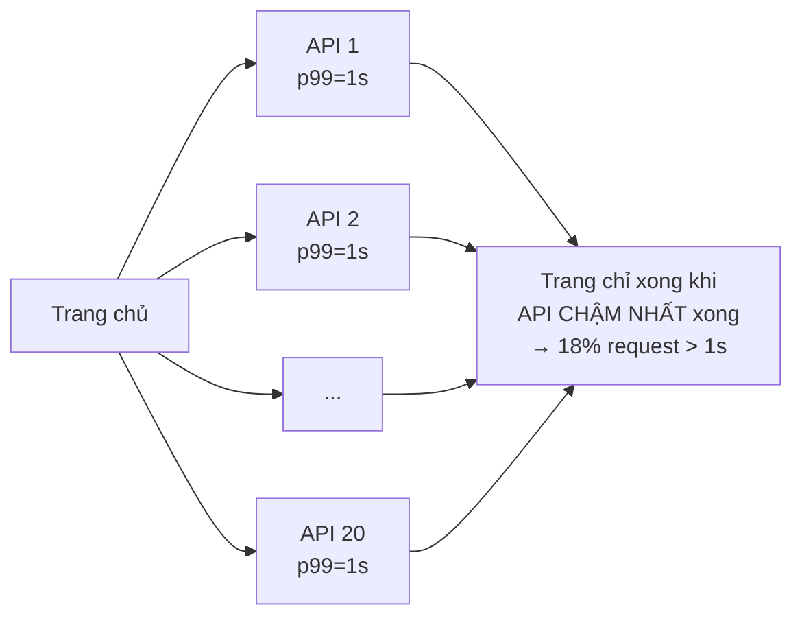

# Buổi 03 — Đo lường & ước lượng: latency, throughput, capacity

> **Mục tiêu**: Học viên hết sợ con số. Biết ước lượng QPS/storage/bandwidth trong 3 phút, hiểu vì
> sao p99 quan trọng hơn trung bình, và biết đọc kết quả đo tải.

---

## 1. Câu chuyện mở đầu (15')

Sếp hỏi: *"Hệ thống mình chịu được bao nhiêu user?"*

Bạn trả lời: *"Em không biết chính xác ạ."*

Sếp: *"Anh không cần chính xác. Anh cần biết là 1.000 hay 1.000.000, vì hai con số đó dẫn tới hai
quyết định mua sắm khác nhau hoàn toàn."*

**Bài học**: trong System Design, sai 2–3 lần là bình thường. Sai 1000 lần là thảm hoạ. Ước lượng
thô nhưng nhanh **luôn tốt hơn** không ước lượng.

---

## 2. Latency vs Throughput — hai thứ khác nhau hoàn toàn

```
Latency    = một request mất bao lâu          (đơn vị: ms)
Throughput = xử lý được bao nhiêu request/giây (đơn vị: QPS/RPS)
```

Ví dụ trực quan: đường cao tốc.

```
Latency    = thời gian một chiếc xe đi từ HN vào SG
Throughput = số xe qua trạm mỗi giờ

Thêm làn đường  → throughput ↑, latency của 1 xe KHÔNG đổi
Tăng tốc độ tối đa → latency ↓
Kẹt xe          → latency ↑ đột biến, throughput ↓
```

> ⚠️ Sai lầm kinh điển của người mới: *"Thêm server để app chạy nhanh hơn."*
> Thêm server tăng **throughput**. Latency của 1 request không đổi (thậm chí tăng nhẹ vì thêm chặng
> load balancer). Muốn giảm latency phải: bớt việc, bớt chặng mạng, hoặc cache.

### Định luật Little (dùng được ngay)

```
L = λ × W

L = số request đang xử lý đồng thời (concurrency)
λ = throughput (req/s)
W = latency trung bình (s)
```

Ví dụ: bạn cần chịu **2.000 QPS**, mỗi request mất **50ms**:
→ `L = 2000 × 0.05 = 100` request đồng thời.
Nếu mỗi worker xử lý 1 request tại một thời điểm, bạn cần ~100 worker (+ dự phòng).

---

## 3. Vì sao dùng p99 chứ không dùng trung bình?

Giả sử 1000 request: 990 request mất 10ms, 10 request mất 5000ms.

```
Trung bình = (990×10 + 10×5000) / 1000 = 59,9ms   ← nghe rất ổn!
p50        = 10ms
p95        = 10ms
p99        = 10ms
p99.9      = 5000ms                               ← sự thật
```

Nhưng **10 user đó thấy app treo 5 giây**. Nếu bạn có 1 triệu user/ngày, đó là 10.000 người mỗi
ngày có trải nghiệm tồi.

### Hiệu ứng khuếch đại đuôi (tail amplification)

Một trang gọi 20 API nội bộ. Mỗi API có p99 = 1s (tức 1% chậm).
Xác suất **cả 20** đều nhanh = `0.99^20 ≈ 0.82`.
→ **18% số lần tải trang bị dính ít nhất một API chậm.**



> 🎯 **Kết luận**: p99 của service con trở thành p80 của trang. Càng nhiều microservice, tail
> latency càng nguy hiểm. (Buổi 09 sẽ chữa bằng timeout + hedged request.)

---

## 4. Bảng số cần thuộc lòng

### 4.1. Latency của các thao tác (thứ tự độ lớn)

```
Đọc 1 dòng L1 cache                 0,5 ns
Đọc 1 dòng RAM                      100 ns      (0,0001 ms)
Nén 1KB                             10.000 ns   (0,01 ms)
SSD đọc ngẫu nhiên 4KB              100.000 ns  (0,1 ms)
Gửi 1MB qua mạng 1Gbps              10 ms
Đọc 1MB tuần tự từ SSD              1 ms
Đọc 1MB tuần tự từ ổ cứng HDD       20 ms
Round-trip trong cùng datacenter    0,5 ms
Round-trip VN → Singapore           ~40 ms
Round-trip VN → US East             ~200 ms
```

**Hệ quả thiết kế rút ra ngay**:
- RAM nhanh hơn SSD ~1000 lần → đó là toàn bộ lý do tồn tại của cache (buổi 05).
- Một round-trip xuyên lục địa = 200ms. Bạn không thể "tối ưu code" để phá vỡ tốc độ ánh sáng.
  Giải pháp duy nhất là **đặt dữ liệu gần user** (CDN, multi-region).
- Gọi DB 100 lần trong 1 request (N+1 query) = 100 × 0,5ms = 50ms lãng phí.

### 4.2. Quy đổi nhanh

```
1 ngày           = 86.400 giây  ≈ 10⁵ giây   (dùng số này khi ước lượng!)
1 tháng          ≈ 2,6 triệu giây
1 triệu/ngày     ≈ 12 QPS
1 tỷ/ngày        ≈ 12.000 QPS
1 KB × 1 triệu   = 1 GB
1 MB × 1 triệu   = 1 TB
```

### 4.3. Sức chứa của một máy (2026, ước lượng bảo thủ)

| Thành phần | Con số an toàn để nói trong phỏng vấn |
|---|---|
| App server Node.js (I/O bound) | 1.000–5.000 QPS/instance |
| PostgreSQL (query đơn giản có index) | 5.000–15.000 QPS đọc |
| Redis | 50.000–200.000 ops/s |
| RAM 1 máy | 64–512 GB |
| SSD NVMe | ~500.000 IOPS, 3 GB/s |
| Băng thông NIC | 10–25 Gbps |

---

## 5. Quy trình ước lượng 5 bước (làm mẫu tại lớp)

**Đề: Thiết kế Twitter mini. 300 triệu user, 50% dùng hàng ngày.**

### Bước 1 — DAU
```
DAU = 300tr × 50% = 150 triệu
```

### Bước 2 — QPS ghi
```
Mỗi user đăng 2 tweet/ngày → 300 triệu tweet/ngày
QPS ghi = 300.000.000 / 86.400 ≈ 3.500
Peak (×3)                     ≈ 10.500 QPS ghi
```

### Bước 3 — QPS đọc
```
Mỗi user xem feed 10 lần/ngày, mỗi lần 20 tweet
= 150tr × 10 = 1,5 tỷ lượt xem feed/ngày
QPS đọc = 1.500.000.000 / 86.400 ≈ 17.000
Peak                             ≈ 52.000 QPS đọc

→ Tỉ lệ đọc:ghi ≈ 5:1  → hệ ĐỌC NHIỀU → ưu tiên cache + read replica
```

### Bước 4 — Storage
```
1 tweet ≈ 300 bytes (text + metadata)
300tr tweet/ngày × 300 B = 90 GB/ngày
                         = 32 TB/năm
                         = 160 TB trong 5 năm  → BẮT BUỘC sharding

Ảnh: 10% tweet có ảnh, mỗi ảnh 200KB
30tr × 200KB = 6 TB/ngày = 2 PB/năm  → object storage, không nhét vào DB
```

### Bước 5 — Bandwidth
```
Đọc: 52.000 QPS × 20 tweet × 300 B ≈ 312 MB/s ≈ 2,5 Gbps (chỉ riêng text)
Ảnh sẽ lớn hơn nhiều → phải dùng CDN
```

**Kết luận rút ra từ con số** (đây mới là mục đích của việc tính!):
1. Đọc nhiều gấp 5 lần ghi → đầu tư cache và replica.
2. 160 TB → không một máy nào chứa nổi → phải sharding (buổi 07).
3. Ảnh 2 PB → object storage + CDN (buổi 11), tuyệt đối không lưu blob trong DB.
4. 52.000 QPS → cần ~50–100 app server → cần load balancer (buổi 04).

---

## 6. Lab (40')

📂 `labs/lab03-do-luong/`

```bash
node labs/lab03-do-luong/01-capacity.js       # máy tính ước lượng
node labs/lab03-do-luong/02-percentile.js     # p50/p95/p99 vs trung bình
node labs/lab03-do-luong/03-load-test.js      # tự viết công cụ đo tải
node labs/lab03-do-luong/04-little-law.js     # mô phỏng hàng đợi & định luật Little
```

Điểm nhấn của lab: `03-load-test.js` bắn tải tăng dần vào server của lab 02 và vẽ biểu đồ ASCII
latency theo concurrency. Học viên sẽ **nhìn thấy tận mắt** cái "đầu gối" (knee) — điểm mà tăng tải
thêm chút nữa khiến latency bùng nổ.

---

## 7. Cái giá phải trả

- **Ước lượng quá chi tiết** làm mất thời gian mà không đổi được quyết định. Nếu đáp án là "cần
  sharding" thì tính 160 TB hay 200 TB không quan trọng.
- **Tin vào benchmark của người khác**. Con số phụ thuộc phần cứng, schema, query. Luôn tự đo.
- **Đo tải trên máy dev** cho kết quả vô nghĩa (không có mạng thật, không có dữ liệu thật, không có
  hàng xóm ồn ào). Kết quả chỉ dùng để so sánh tương đối trước/sau tối ưu.

---

## 8. Bài tập về nhà

1. Ước lượng đầy đủ 5 bước cho **YouTube**: 2 tỷ user, mỗi user xem 5 video/ngày, video trung bình
   10 phút @ 1080p (~5 Mbps). Tính QPS, storage/năm, bandwidth. Con số bandwidth nói lên điều gì
   về kiến trúc?
2. Một API có p50=20ms, p99=800ms. Nêu 3 giả thuyết vì sao đuôi lại dài như vậy.
3. Chạy `03-load-test.js`, tìm điểm knee của server lab 02. Ghi lại QPS tối đa và latency tại đó.

---

## 9. Câu hỏi kiểm tra

1. Thêm 10 server làm latency của 1 request giảm bao nhiêu? Vì sao?
2. Một trang gọi 5 service, mỗi service p99 = 200ms. Ước tính bao nhiêu % request tải trang vượt 200ms?
3. Cần 5.000 QPS, latency 100ms → cần bao nhiêu request đồng thời? (Little)
4. Vì sao không nên lưu ảnh trong database quan hệ?
5. RAM nhanh hơn SSD khoảng bao nhiêu lần? Điều đó dẫn tới kỹ thuật gì?
