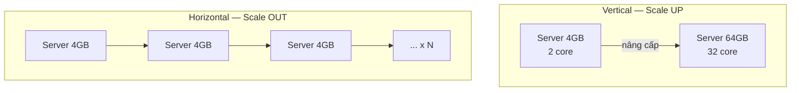
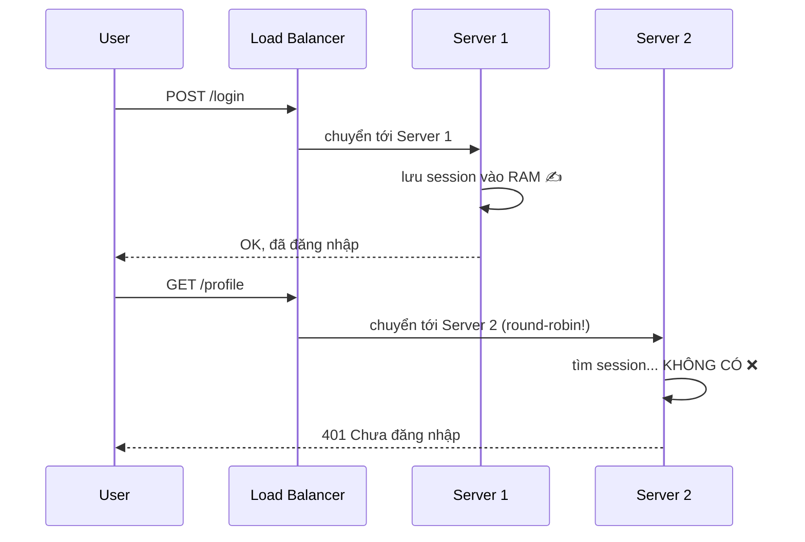
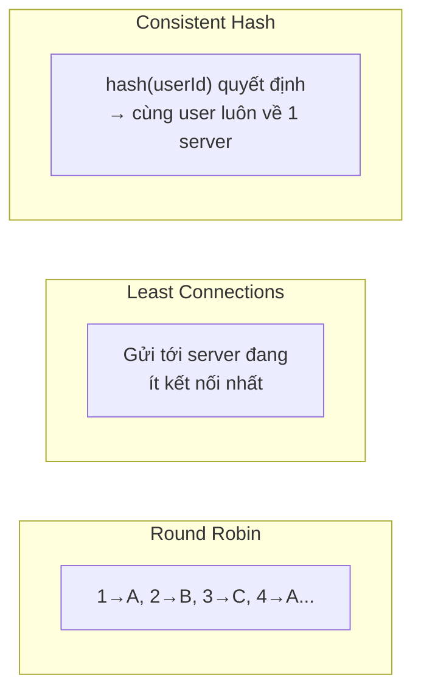
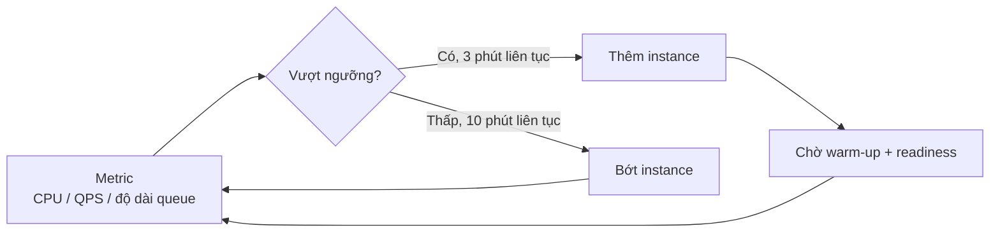

# Buổi 04 — Scaling & Load Balancer

> **Mục tiêu**: Trả lời được câu hỏi bỏ ngỏ từ buổi 01 ("tăng RAM gấp 4 mà vẫn chết — vì sao?").
> Hiểu stateless, các thuật toán cân bằng tải, health check, và sticky session.

---

## 1. Câu chuyện mở đầu (15')

Quay lại app bán vé. Bạn tăng RAM từ 4GB lên 16GB. Vẫn chết. Vì sao?

```
Nút thắt thật sự KHÔNG phải RAM:
  → CPU đã 100% (mỗi request phải tính toán, render, mã hoá)
  → DB connection pool chỉ có 20 slot, 80.000 request tranh nhau
  → Băng thông NIC đầy
  → Node.js chỉ dùng 1 core (event loop đơn luồng!)
```

**Bài học 1**: Trước khi scale, phải biết **nút thắt nằm ở đâu**. Tăng thứ không phải nút thắt = đốt tiền.

**Bài học 2**: Dù có tìm đúng nút thắt, 1 máy cũng có trần. Muốn đi xa hơn phải có **nhiều máy**.

---

## 2. Vertical vs Horizontal Scaling



| | Vertical (scale up) | Horizontal (scale out) |
|---|---|---|
| Cách làm | Máy to hơn | Nhiều máy hơn |
| Độ khó code | ✅ Không phải sửa gì | ❌ Phải làm stateless, xử lý phân tán |
| Giới hạn | ❌ Có trần cứng | ✅ Gần như vô hạn |
| Giá | ❌ Tăng phi tuyến (máy gấp đôi giá gấp 4) | ✅ Tuyến tính |
| Chịu lỗi | ❌ 1 máy chết = hết | ✅ 1 máy chết = còn N-1 |
| Downtime khi nâng | ❌ Phải restart | ✅ Rolling, không downtime |

> 💡 **Lời khuyên thực dụng**: Với hầu hết startup, **scale vertical trước**. Một máy 32 core /
> 128GB chạy được rất xa (hàng chục nghìn user hoạt động). Scale ngang đúng lúc, không sớm quá —
> nó kéo theo cả một chuỗi phức tạp mà bạn chưa cần.

---

## 3. Điều kiện tiên quyết: STATELESS

Đây là khái niệm quan trọng nhất buổi hôm nay.

### Vấn đề với server có state



User bị đăng xuất ngẫu nhiên. Kinh điển.

### Ba cách chữa

| Cách | Mô tả | Đánh đổi |
|---|---|---|
| **Sticky session** | LB luôn gửi user X về server X | Server chết = mất session; tải không đều; khó rolling deploy |
| **Session store dùng chung** | Session lưu vào Redis | ✅ Khuyên dùng. Thêm 1 hop mạng (~1ms) và 1 điểm phụ thuộc |
| **Token tự chứa (JWT)** | Không lưu session ở đâu cả | ✅ Không cần store. ❌ Khó thu hồi trước hạn (buổi 13) |

### Quy tắc stateless

> Server không được giữ bất cứ thứ gì **cần thiết cho request tiếp theo** trong RAM hay đĩa cục bộ.

Những thứ hay bị quên:
- ❌ Session trong biến `global`
- ❌ File upload lưu vào `./uploads/` → server khác không thấy → dùng object storage (buổi 11)
- ❌ Cache trong RAM tiến trình → mỗi server một bản khác nhau → dùng Redis (buổi 05)
- ❌ Cron/scheduler chạy trên mọi instance → job chạy N lần → cần leader election (buổi 10)
- ❌ Biến đếm `let counter = 0` → mỗi server đếm riêng

---

## 4. Load Balancer

### 4.1. Nó nằm ở đâu?

```
                    ┌──── App Server 1
User ──► DNS ──► LB ├──── App Server 2
                    └──── App Server 3
```

LB đồng thời làm nhiều việc: phân phối tải, health check, kết thúc TLS, giữ connection (keep-alive),
đôi khi cả rate limiting và nén.

### 4.2. Layer 4 vs Layer 7

| | L4 (transport) | L7 (application) |
|---|---|---|
| Nhìn thấy | IP + port | URL, header, cookie, body |
| Tốc độ | Rất nhanh | Chậm hơn (phải parse HTTP) |
| Định tuyến theo path | ❌ | ✅ `/api/*` → service A |
| Kết thúc TLS | ❌ (pass-through) | ✅ |
| Ví dụ | AWS NLB, LVS | Nginx, HAProxy, AWS ALB, Envoy |

### 4.3. Các thuật toán cân bằng tải



| Thuật toán | Cách hoạt động | Dùng khi |
|---|---|---|
| **Round Robin** | Lần lượt | Request đồng đều, server giống nhau |
| **Weighted RR** | Server mạnh nhận nhiều hơn | Server không đồng đều |
| **Least Connections** | Ít kết nối nhất | Request có thời lượng chênh lệch lớn |
| **Least Response Time** | Nhanh nhất | Nhạy với server đang ốm |
| **Consistent Hashing** | `hash(key) → server` | Cần cache locality, sticky (buổi 07) |
| **Power of Two Choices** | Chọn ngẫu nhiên 2, lấy cái ít tải hơn | ⭐ Gần tối ưu mà cực rẻ |

> **Power of Two Choices** là một kết quả đẹp: chỉ cần hỏi 2 server ngẫu nhiên thay vì tất cả, độ
> mất cân bằng giảm từ O(log n) xuống O(log log n). Lab hôm nay sẽ đo được điều này.

### 4.4. Health check — thứ quyết định LB có ích hay không

```
Passive: LB thấy request lỗi/timeout → đánh dấu server ốm
Active : LB tự gọi GET /health mỗi 5s
```

Phân biệt hai loại endpoint (rất hay bị hỏi):

| Endpoint | Trả OK khi | LB dùng để |
|---|---|---|
| `/health/live` (liveness) | Tiến trình còn sống | Có nên **restart** không |
| `/health/ready` (readiness) | Sẵn sàng nhận traffic (đã kết nối DB, đã warm cache) | Có nên **gửi request** không |

⚠️ **Bẫy chết người**: nếu `/health` cũng query DB, thì DB chết → **tất cả** server bị đánh dấu ốm →
LB không còn server nào → 100% downtime, dù có thể vẫn phục vụ được nội dung cache. Health check nên
kiểm tra "tôi có phục vụ được không", không phải "mọi dependency có sống không".

### 4.5. Ai cân bằng tải cho Load Balancer?

Câu hỏi hay. LB cũng là một điểm chết đơn lẻ (SPOF).

```
DNS round-robin  →  LB1 (active)  ─┐
                    LB2 (standby) ─┴─► App servers
                    ↑ chia sẻ Virtual IP, keepalived tự chuyển khi LB1 chết
```

Ở quy mô lớn: Anycast IP + nhiều LB ở nhiều datacenter.

---

## 5. Auto-scaling



Bốn điều người mới hay sai:

1. **Chọn sai metric.** CPU không phải lúc nào cũng đúng. Với app I/O-bound (Node.js gọi API),
   metric tốt hơn là **độ dài hàng đợi** hoặc **QPS**.
2. **Quên thời gian khởi động.** Instance mất 2 phút mới sẵn sàng → nếu đợi CPU 90% mới scale thì
   đã muộn 2 phút. Scale ở 60–70%.
3. **Flapping** (thêm/bớt liên tục) → cần cooldown và ngưỡng bất đối xứng (scale-out nhanh, scale-in chậm).
4. **Scale app nhưng quên DB.** Thêm 50 app server × 20 connection = 1.000 connection → DB sập.
   Đây là lý do cần **connection pooler** (PgBouncer) — sẽ nói ở buổi 06.

---

## 6. Lab (40')

📂 `labs/lab04-load-balancer/`

```bash
node labs/lab04-load-balancer/03-demo.js
```

Bạn sẽ:
1. Chạy 4 backend server giả (mỗi cái có tốc độ khác nhau, 1 cái thỉnh thoảng "ốm").
2. Viết/chạy load balancer với 5 thuật toán, so sánh phân bố tải và p99.
3. Bật/tắt health check để thấy điều gì xảy ra khi 1 backend chết.
4. Đo sticky session và quan sát mất cân bằng.

---

## 7. Cái giá phải trả

- **LB là thêm một hop mạng** (+0,5–2ms) và **thêm một thứ có thể hỏng**.
- **Stateless không miễn phí**: mọi state phải đẩy sang Redis/DB → chậm hơn, thêm phụ thuộc.
- **Auto-scaling che giấu bug**: memory leak được "chữa" bằng cách thêm instance, đến khi hoá đơn về.
- **Scale ngang không cứu được nút thắt dùng chung**: 100 app server vẫn chỉ có 1 database.
  Đây chính là lý do buổi 05, 06, 07 tồn tại.

---

## 8. Bài tập về nhà

1. Chạy `labs/lab04-load-balancer/03-demo.js`, ghi lại bảng so sánh 5 thuật toán. Thuật toán nào
   cho p99 tốt nhất khi có 1 backend chậm? Giải thích vì sao.
2. Liệt kê 5 chỗ trong một app Node.js điển hình vi phạm nguyên tắc stateless. Với mỗi chỗ, đề xuất
   cách sửa.
3. Thiết kế endpoint `/health/ready` cho một service phụ thuộc: PostgreSQL, Redis, và một API bên
   thứ ba (thanh toán). Cái nào nên làm readiness fail? Cái nào không? Vì sao?

---

## 9. Câu hỏi kiểm tra

1. Vì sao "tăng RAM" không giải quyết được bài toán bán vé ở buổi 01?
2. Sticky session giải quyết vấn đề gì và tạo ra vấn đề gì?
3. Liveness và readiness khác nhau ra sao? Điều gì xảy ra nếu gộp làm một?
4. Power of Two Choices tốt hơn round-robin ở điểm nào?
5. Bạn scale từ 5 lên 50 app server. Nêu 2 thứ có thể vỡ mà không phải app server.
