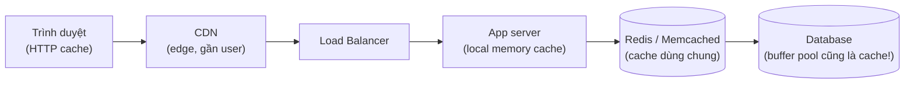
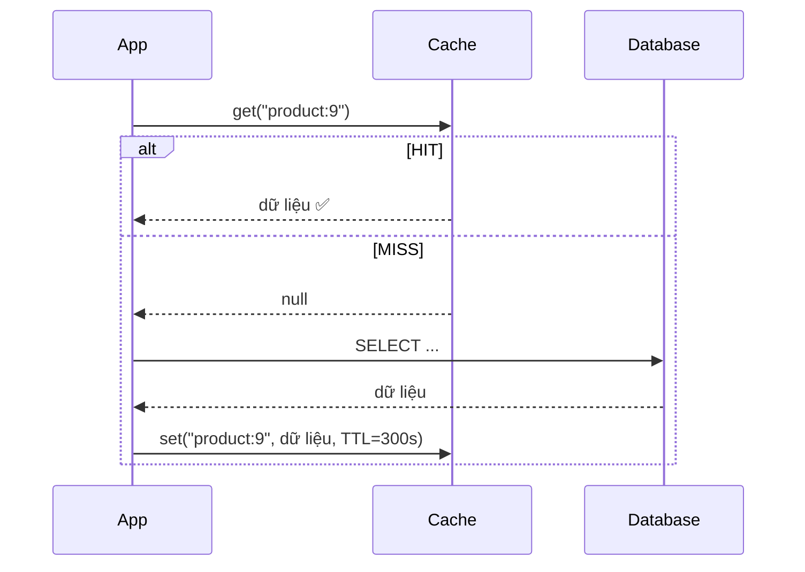
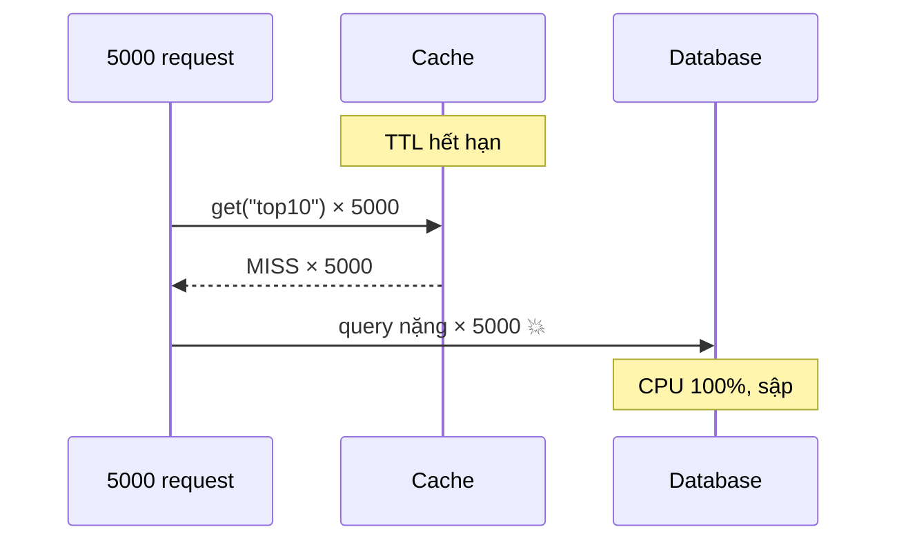

# Buổi 05 — Caching

> **Mục tiêu**: Hiểu vì sao cache là công cụ hiệu quả nhất trong System Design, nắm 4 chiến lược
> cache, thuật toán loại bỏ (LRU/LFU), và ba vấn đề kinh điển: invalidation, stampede, hot key.

---

## 1. Câu chuyện mở đầu (15')

Trang chủ shop hiển thị "Top 10 sản phẩm bán chạy". Query rất nặng: JOIN 4 bảng, GROUP BY, ORDER BY —
mất **800ms**. Trang chủ có 5.000 lượt xem/phút.

```
5.000 lượt/phút × 800ms = 4.000 giây CPU database mỗi phút
                        = 66 CPU-giây mỗi giây
→ Database cần 66 core chỉ để phục vụ MỘT query. Và kết quả GIỐNG HỆT NHAU cho mọi người.
```

Chúng ta đang tính lại cùng một đáp án 5.000 lần mỗi phút. Đó là toàn bộ lý do cache tồn tại.

> **Định nghĩa**: Cache = lưu kết quả của việc đắt đỏ để lần sau khỏi làm lại.

Nhắc lại buổi 03: RAM nhanh hơn SSD ~1.000 lần, và cache tránh luôn cả việc tính toán.

---

## 2. Cache ở khắp mọi nơi



| Tầng | Độ trễ | Ai kiểm soát | Vấn đề chính |
|---|---|---|---|
| Browser (`Cache-Control`) | 0ms | Header từ server | Không xoá được sau khi đã gửi |
| CDN | 10–30ms | Bạn (purge API) | Chi phí, purge chậm |
| In-process (Map trong Node) | ~0,001ms | Bạn | Mỗi instance một bản khác nhau |
| Redis dùng chung | ~1ms | Bạn | Thêm hop mạng, thêm SPOF |
| DB buffer pool | ~0,1ms | Database tự lo | Không kiểm soát được |

---

## 3. Bốn chiến lược cache

### 3.1. Cache-Aside (Lazy Loading) — dùng 90% trường hợp



```js
async function getProduct(id) {
  const key = `product:${id}`;
  const cached = await cache.get(key);
  if (cached) return cached;              // HIT
  const row = await db.query('SELECT * FROM products WHERE id=$1', [id]);
  await cache.set(key, row, { ttl: 300 }); // ghi vào cache cho lần sau
  return row;
}
```

✅ Chỉ cache thứ thực sự được dùng · Cache chết vẫn chạy được (chậm hơn)
❌ Lần đầu luôn chậm (cold start) · Có thể đọc dữ liệu cũ trong khoảng TTL

### 3.2. Read-Through
Ứng dụng chỉ nói chuyện với cache; cache tự đi lấy từ DB khi miss. Code app sạch hơn nhưng phải có
thư viện/proxy hỗ trợ.

### 3.3. Write-Through
Ghi vào cache **và** DB cùng lúc, đồng bộ.
✅ Cache luôn đúng · ❌ Mọi lần ghi đều chậm hơn · ❌ Cache đầy dữ liệu không ai đọc

### 3.4. Write-Behind (Write-Back)
Ghi vào cache trước, trả về ngay, sau đó mới đẩy xuống DB bất đồng bộ.
✅ Ghi cực nhanh, gộp được nhiều lần ghi · ❌ **Cache chết = MẤT DỮ LIỆU**

| Chiến lược | Latency đọc | Latency ghi | Nguy cơ mất dữ liệu | Dùng cho |
|---|---|---|---|---|
| Cache-aside | Nhanh (khi hit) | Bình thường | Không | Mặc định |
| Read-through | Nhanh | Bình thường | Không | Có sẵn hạ tầng |
| Write-through | Nhanh | Chậm | Không | Dữ liệu đọc ngay sau khi ghi |
| Write-behind | Nhanh | Rất nhanh | **Có** | Đếm view, log, metric |

---

## 4. Thuật toán loại bỏ (eviction)

Cache có giới hạn. Đầy rồi thì bỏ ai?

| Thuật toán | Ý tưởng | Điểm yếu |
|---|---|---|
| **LRU** (Least Recently Used) | Bỏ cái lâu nhất chưa dùng | Một lần quét toàn bảng làm sạch cache |
| **LFU** (Least Frequently Used) | Bỏ cái ít được dùng nhất | Dữ liệu "hot" cũ không chịu ra đi |
| **FIFO** | Bỏ cái vào trước | Bỏ cả những thứ đang nóng |
| **TTL** | Bỏ khi hết hạn | Không phản ứng theo mức dùng |
| **Random** | Bỏ ngẫu nhiên | Bất ngờ là khá tốt, rất rẻ |
| **W-TinyLFU** | LFU xấp xỉ + cửa sổ LRU | Phức tạp (nhưng là mặc định của Caffeine/Ristretto) |

Thực tế Redis dùng `allkeys-lru` xấp xỉ (lấy mẫu ngẫu nhiên 5 key, bỏ cái cũ nhất) — vì LRU chính
xác tốn quá nhiều bộ nhớ cho con trỏ.

---

## 5. Ba vấn đề kinh điển

### 5.1. Cache Invalidation

> *"Chỉ có hai việc khó trong khoa học máy tính: cache invalidation và đặt tên biến."* — Phil Karlton

Ba cách, theo thứ tự nên dùng:

1. **TTL** — đơn giản nhất, luôn dùng làm lưới an toàn. Chấp nhận dữ liệu cũ tối đa TTL giây.
2. **Xoá khi ghi (write-invalidate)** — cập nhật DB xong thì `cache.del(key)`.
   ⚠️ Có race condition: xoá xong, một request khác nạp lại **giá trị cũ** trước khi DB commit xong.
3. **Version key** — không xoá, đổi khoá: `product:9:v12`. Key cũ tự hết hạn. An toàn nhất.

⚠️ **Bẫy hay gặp**: cập nhật cache thay vì xoá cache. Hai request ghi song song có thể ghi vào cache
theo thứ tự ngược với thứ tự ghi vào DB → cache sai vĩnh viễn. **Xoá luôn an toàn hơn cập nhật.**

### 5.2. Cache Stampede (Thundering Herd)

```
Key "top10" hết hạn lúc 12:00:00.000
→ 5.000 request cùng lúc đều MISS
→ 5.000 query nặng đập vào DB cùng một khoảnh khắc
→ DB sập
→ Cache không bao giờ được nạp lại
→ Sập vĩnh viễn
```



Ba cách chữa:

| Cách | Ý tưởng |
|---|---|
| **Single-flight / mutex** | Chỉ 1 request được đi xuống DB, 4.999 cái còn lại chờ kết quả đó |
| **TTL + jitter** | TTL = 300s ± ngẫu nhiên 60s → các key không hết hạn cùng lúc |
| **Làm mới sớm (probabilistic early expiration)** | Trước khi hết hạn, một số ít request chủ động nạp lại nền |

Lab hôm nay sẽ đo cả ba.

### 5.3. Hot Key

Một key (ví dụ post của người nổi tiếng) chiếm 40% lưu lượng → một shard Redis quá tải trong khi
các shard khác nhàn rỗi.

Cách chữa: nhân bản key (`hot:post9:copy1..10`, đọc ngẫu nhiên 1 bản) hoặc thêm một tầng cache
in-process ngắn hạn (1–2 giây) trước Redis.

---

## 6. Cache có đáng không? Công thức tính

```
Latency trung bình = hitRate × latencyCache + (1 − hitRate) × (latencyCache + latencyDB)

Ví dụ: cache 1ms, DB 100ms
  hit 0%   → 101ms
  hit 50%  →  51ms
  hit 90%  →  11ms
  hit 99%  →   2ms
```

📌 **Quan trọng**: 80% → 90% chỉ tiết kiệm 10ms, nhưng 90% → 99% tiết kiệm 9ms nữa và **giảm tải DB
gấp 10 lần**. Tác dụng lớn nhất của cache thường không phải là latency mà là **bảo vệ database**.

Và nhớ bài học buổi 03: cache cải thiện trung bình rất tốt nhưng **gần như không cải thiện p99**,
vì p99 chính là các request bị miss.

---

## 7. Lab (40')

📂 `labs/lab05-cache/`

```bash
node labs/lab05-cache/01-lru.js         # tự cài LRU + LFU, so hit rate
node labs/lab05-cache/02-cache-aside.js # cache-aside, đo tải DB giảm bao nhiêu
node labs/lab05-cache/03-stampede.js    # ⭐ tái hiện và chữa cache stampede
node labs/lab05-cache/04-invalidation.js# race condition khi invalidate
```

---

## 8. Cái giá phải trả

- **Dữ liệu cũ (stale)**. Mọi cache đều đánh đổi tính đúng đắn lấy tốc độ. Phải hỏi: "cũ 5 phút có
  chết ai không?" Số like → không. Số dư ví → có.
- **Thêm một thứ để vận hành**: Redis cần monitor, backup, failover.
- **Cache chết = tải tăng đột ngột 10–100 lần** xuống DB. Nhiều sự cố lớn bắt đầu từ việc restart
  cache. Phải có rate limit và circuit breaker ở dưới (buổi 09).
- **Debug khó hơn**: "sao máy tôi thấy giá cũ mà máy anh thấy giá mới?"
- **Cache sai còn tệ hơn không cache**: người dùng A nhìn thấy giỏ hàng của người dùng B (thiếu
  userId trong cache key) là sự cố bảo mật, không phải sự cố hiệu năng.

---

## 9. Bài tập về nhà

1. Chạy `03-stampede.js`. Ghi lại số query DB trong 3 kịch bản (không bảo vệ / mutex / jitter).
2. Thiết kế chiến lược cache cho trang chi tiết sản phẩm gồm: thông tin sản phẩm, tồn kho, giá
   khuyến mãi cá nhân hoá, đánh giá. **Mỗi phần TTL bao nhiêu? Vì sao khác nhau?**
3. Tìm 3 chỗ trong dự án hiện tại của bạn có thể cache. Ước lượng hit rate và tải DB tiết kiệm được.

---

## 10. Câu hỏi kiểm tra

1. Cache-aside và write-through khác nhau ở đâu? Khi nào chọn cái nào?
2. Vì sao **xoá** cache an toàn hơn **cập nhật** cache?
3. Cache stampede là gì? Nêu 2 cách chữa.
4. Hit rate tăng từ 90% lên 99% giúp giảm tải DB bao nhiêu lần?
5. Vì sao cache không cải thiện p99 nhiều?
6. Kể một tình huống cache gây lỗi bảo mật.
