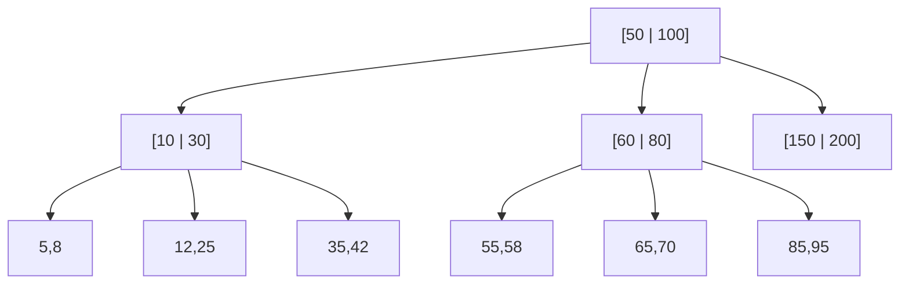
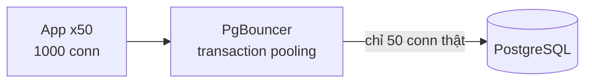

# Buổi 06 — Database I: quan hệ, index, transaction

> **Mục tiêu**: Hiểu index thực sự làm gì (và khi nào phản tác dụng), nắm ACID và các mức isolation,
> nhận diện N+1 query và connection pool exhaustion.

---

## 1. Câu chuyện mở đầu (15')

Trang danh sách đơn hàng chạy ngon 6 tháng. Rồi bỗng nhiên mất 12 giây để load.

```sql
SELECT * FROM orders WHERE user_id = 42 ORDER BY created_at DESC LIMIT 20;
```

Không ai đổi câu query. Không ai đổi code. Chuyện gì đã xảy ra?

> Bảng `orders` tăng từ 10.000 lên 40.000.000 dòng. Không có index trên `user_id`.
> Database phải **đọc từng dòng một** để tìm 20 dòng cần thiết.

Đây là lỗi phổ biến nhất trong mọi hệ thống thực tế. Buổi hôm nay chữa nó.

---

## 2. Index là gì?

Hãy tưởng tượng một cuốn từ điển 40 triệu từ **không sắp xếp**. Tìm từ "system" phải lật từng trang.

Index = một bản sao đã **sắp xếp** của một (hoặc vài) cột, kèm con trỏ tới dòng gốc.

```
Bảng orders (heap, thứ tự ngẫu nhiên)      Index trên user_id (B-Tree, đã sắp xếp)
┌────┬─────────┬────────┐                  ┌──────────┬─────────┐
│ id │ user_id │ total  │                  │ user_id  │ → row   │
├────┼─────────┼────────┤                  ├──────────┼─────────┤
│ 1  │   42    │ 100k   │                  │    7     │ row 3   │
│ 2  │   99    │ 250k   │  ◄──────────────  │    42    │ row 1   │
│ 3  │    7    │  80k   │                  │    42    │ row 5   │
│ 4  │   99    │  30k   │                  │    99    │ row 2   │
│ 5  │   42    │ 500k   │                  │    99    │ row 4   │
└────┴─────────┴────────┘                  └──────────┴─────────┘
  Tìm user 42: đọc 5 dòng            Tìm user 42: nhị phân → 2-3 bước
  Với 40 triệu dòng: 40 triệu lần    Với 40 triệu dòng: ~25 bước (log₂ 40tr)
```

### B-Tree — cấu trúc index mặc định



Đặc điểm quan trọng: B-Tree **rất nông**. Cây 4 tầng với fanout 100 chứa được 100 triệu bản ghi.
Nghĩa là tìm 1 dòng trong 100 triệu chỉ tốn ~4 lần đọc đĩa.

### Các loại index khác

| Loại | Dùng cho | Không dùng cho |
|---|---|---|
| **B-Tree** | `=`, `<`, `>`, `BETWEEN`, `ORDER BY`, prefix `LIKE 'abc%'` | `LIKE '%abc'` |
| **Hash** | Chỉ `=` | Range, sort |
| **GIN / inverted** | Tìm trong mảng, JSONB, full-text | Range |
| **GiST / R-Tree** | Dữ liệu không gian (toạ độ) | |
| **Bitmap** | Cột có ít giá trị khác nhau (giới tính, trạng thái) | Cột có nhiều giá trị |

---

## 3. Bốn quy tắc index cần thuộc

### 3.1. Index tổ hợp — thứ tự cột QUAN TRỌNG

```sql
CREATE INDEX idx ON orders (user_id, created_at);
```

Index này phục vụ được:
- ✅ `WHERE user_id = 42`
- ✅ `WHERE user_id = 42 AND created_at > '2026-01-01'`
- ✅ `WHERE user_id = 42 ORDER BY created_at DESC`
- ❌ `WHERE created_at > '2026-01-01'` (không có cột đầu → không dùng được)

> **Quy tắc "leftmost prefix"**: index `(A, B, C)` dùng được cho `A`, `A+B`, `A+B+C`, nhưng không
> dùng được cho `B` hay `C` một mình. Giống như tra danh bạ sắp theo (Họ, Tên): tìm theo Họ thì
> nhanh, tìm theo Tên thì vô dụng.

### 3.2. Covering index — không cần đọc bảng gốc

```sql
-- Query: SELECT user_id, total FROM orders WHERE user_id = 42
CREATE INDEX idx ON orders (user_id) INCLUDE (total);
```
Index đã chứa đủ dữ liệu → không cần "nhảy" về bảng gốc. Nhanh hơn nhiều (index-only scan).

### 3.3. Index bị vô hiệu hoá khi bọc cột trong hàm

```sql
❌ WHERE YEAR(created_at) = 2026        -- index trên created_at VÔ DỤNG
✅ WHERE created_at >= '2026-01-01' AND created_at < '2027-01-01'

❌ WHERE LOWER(email) = 'a@b.com'       -- trừ khi có index biểu thức
✅ CREATE INDEX ON users (LOWER(email));

❌ WHERE user_id::text = '42'           -- ép kiểu cũng phá index
```

### 3.4. Index không phải lúc nào cũng tốt

- Mỗi index làm **INSERT/UPDATE/DELETE chậm hơn** (phải cập nhật cả index).
- Index tốn dung lượng (đôi khi lớn hơn cả bảng).
- Index trên cột có ít giá trị khác nhau (ví dụ `status` chỉ có 3 giá trị) thường **vô ích** —
  planner sẽ chọn full scan vì đằng nào cũng phải đọc phần lớn bảng.
- Với bảng nhỏ (< vài nghìn dòng), full scan còn nhanh hơn.

> Câu hỏi phỏng vấn hay: *"Vì sao không index mọi cột?"* → Ghi chậm, tốn chỗ, planner rối.

---

## 4. Cách đọc EXPLAIN

```sql
EXPLAIN ANALYZE SELECT * FROM orders WHERE user_id = 42;
```

| Xuất hiện | Nghĩa là | Đánh giá |
|---|---|---|
| `Seq Scan` | Đọc toàn bộ bảng | ⚠️ Xấu nếu bảng lớn |
| `Index Scan` | Dùng index rồi lấy dòng | ✅ Tốt |
| `Index Only Scan` | Chỉ đọc index, không đụng bảng | ✅✅ Rất tốt |
| `Bitmap Heap Scan` | Nhiều dòng khớp, gom lại rồi đọc | 🟡 Bình thường |
| `Nested Loop` với `rows=1` sai lệch nhiều | Thống kê cũ | ⚠️ Chạy `ANALYZE` |
| `Sort` với `external merge Disk` | Sort tràn ra đĩa | ⚠️ Tăng `work_mem` hoặc thêm index |

---

## 5. Transaction & ACID

```
A — Atomicity   : cả cụm thành công hoặc không gì cả
C — Consistency : ràng buộc dữ liệu luôn được giữ (FK, CHECK, UNIQUE)
I — Isolation   : các transaction chạy song song không giẫm lên nhau
D — Durability  : đã commit thì mất điện cũng không mất
```

### Các mức isolation và hiện tượng lỗi

| Mức | Dirty read | Non-repeatable read | Phantom read |
|---|---|---|---|
| Read Uncommitted | ❌ có thể | ❌ | ❌ |
| **Read Committed** (mặc định Postgres) | ✅ không | ❌ có thể | ❌ có thể |
| **Repeatable Read** (mặc định MySQL) | ✅ | ✅ | ❌ (Postgres thì ✅) |
| **Serializable** | ✅ | ✅ | ✅ |

Giải thích ba hiện tượng bằng ví dụ:

```
Dirty read           : T1 ghi số dư = 0 (chưa commit), T2 đọc thấy 0, T1 rollback → T2 đọc rác.
Non-repeatable read  : T1 đọc giá = 100. T2 sửa thành 200 và commit. T1 đọc lại → 200. Khác lần đầu.
Phantom read         : T1 đếm được 5 đơn. T2 thêm 1 đơn. T1 đếm lại → 6. "Bóng ma" xuất hiện.
```

### Lost update — bug hay gặp nhất

```js
// ❌ SAI: hai request cùng chạy → mất một lần trừ kho
const sp = await db.query('SELECT ton_kho FROM products WHERE id=1');   // đọc 10
await db.query('UPDATE products SET ton_kho=$1 WHERE id=1', [sp.ton_kho - 1]); // ghi 9
// Request B cũng đọc 10, cũng ghi 9. Bán 2 cái nhưng chỉ trừ 1!

// ✅ ĐÚNG 1: cập nhật nguyên tử — để DB tự tính
await db.query('UPDATE products SET ton_kho = ton_kho - 1 WHERE id=1 AND ton_kho > 0');

// ✅ ĐÚNG 2: khoá bi quan (pessimistic lock)
await db.query('SELECT ton_kho FROM products WHERE id=1 FOR UPDATE');

// ✅ ĐÚNG 3: khoá lạc quan (optimistic lock) bằng version
await db.query('UPDATE products SET ton_kho=$1, version=version+1 WHERE id=1 AND version=$2',
               [moi, versionCu]);
// Nếu affectedRows === 0 → có người khác đã sửa → thử lại
```

| | Pessimistic (`FOR UPDATE`) | Optimistic (version) |
|---|---|---|
| Cách hoạt động | Khoá trước, ai đến sau phải chờ | Không khoá, kiểm tra lúc ghi |
| Tốt khi | Xung đột **nhiều** | Xung đột **hiếm** |
| Rủi ro | Deadlock, giữ khoá lâu làm nghẽn | Phải retry, có thể đói (starvation) |

### Deadlock

```
T1: khoá A → chờ B
T2: khoá B → chờ A      → cả hai chờ nhau vĩnh viễn
```
Database tự phát hiện và huỷ một transaction. Cách phòng: **luôn khoá tài nguyên theo cùng một thứ
tự** (ví dụ luôn theo id tăng dần), giữ transaction ngắn.

---

## 6. Hai sát thủ hiệu năng ở tầng ứng dụng

### 6.1. N+1 Query

```js
// ❌ 1 query lấy 100 đơn + 100 query lấy user = 101 round-trip × 0,5ms = 50ms lãng phí
const orders = await db.query('SELECT * FROM orders LIMIT 100');
for (const o of orders) {
  o.user = await db.query('SELECT * FROM users WHERE id=$1', [o.user_id]);
}

// ✅ 2 query
const orders = await db.query('SELECT * FROM orders LIMIT 100');
const ids = [...new Set(orders.map(o => o.user_id))];
const users = await db.query('SELECT * FROM users WHERE id = ANY($1)', [ids]);
```

ORM là nguồn gốc phổ biến nhất của N+1. Luôn bật log SQL khi phát triển.

### 6.2. Connection pool exhaustion

```
50 app server × pool 20 connection = 1.000 connection tới Postgres
Postgres mặc định max_connections = 100
→ 900 connection bị từ chối → app sập
```

Mỗi connection Postgres là **một tiến trình riêng** (~5–10MB RAM). Không thể có hàng nghìn.

**Giải pháp**: connection pooler (PgBouncer) ở giữa — nhận 5.000 connection từ app, chỉ dùng
50 connection thật tới DB, tái sử dụng theo transaction.



> Nhớ lại buổi 04: scale app server mà quên DB chính là bẫy này.

---

## 7. Lab (40')

📂 `labs/lab06-index-transaction/`

```bash
node labs/lab06-index-transaction/01-index.js       # tự cài B-Tree, đo full scan vs index
node labs/lab06-index-transaction/02-transaction.js # lost update & 3 cách chữa
node labs/lab06-index-transaction/03-n-plus-1.js    # đo chi phí N+1
```

---

## 8. Cái giá phải trả

- **Mỗi index là thuế đánh lên mọi lần ghi.** Bảng có 10 index thì INSERT chậm gấp nhiều lần.
- **Serializable rất đúng nhưng rất chậm** và hay bị abort → phải viết code retry.
- **`FOR UPDATE` đúng nhưng biến DB thành nút cổ chai**: mọi người xếp hàng chờ cùng một dòng.
  Với hàng "hot" (vé concert!), đây chính là điểm sập.
- **Transaction dài giữ khoá lâu** → nghẽn cả hệ thống. Đừng bao giờ gọi API bên ngoài **bên trong**
  một transaction.

---

## 9. Bài tập về nhà

1. Cho bảng `orders(id, user_id, status, created_at, total)` và các query sau, hãy thiết kế bộ index
   **tối thiểu**:
   - `WHERE user_id=? ORDER BY created_at DESC`
   - `WHERE status='pending' AND created_at < ?`
   - `WHERE user_id=? AND status=?`
2. Viết lại 3 query sau để dùng được index: `WHERE DATE(created_at)='2026-01-01'`,
   `WHERE total*1.1 > 1000`, `WHERE name LIKE '%phone%'`.
3. Chạy `02-transaction.js`, ghi lại số lượng bán quá kho ở mỗi cách. Giải thích.
4. Hệ thống có 200 pod, mỗi pod pool 10 connection, Postgres `max_connections=200`. Tính toán và
   đề xuất giải pháp.

---

## 10. Câu hỏi kiểm tra

1. Index `(user_id, created_at)` có dùng được cho `WHERE created_at > ?` không? Vì sao?
2. Vì sao `WHERE YEAR(created_at)=2026` không dùng được index?
3. Lost update là gì? Nêu 3 cách chữa và khi nào dùng cái nào.
4. Khoá lạc quan và bi quan khác nhau ở đâu?
5. Vì sao không nên gọi API thanh toán bên trong một transaction DB?
6. N+1 query là gì? Vì sao ORM hay gây ra nó?
