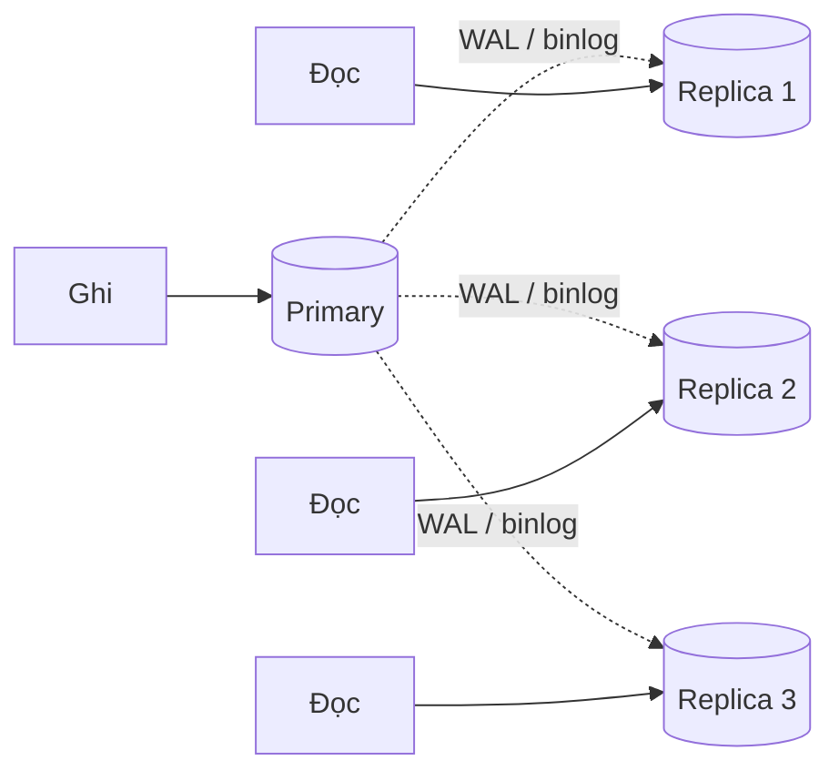
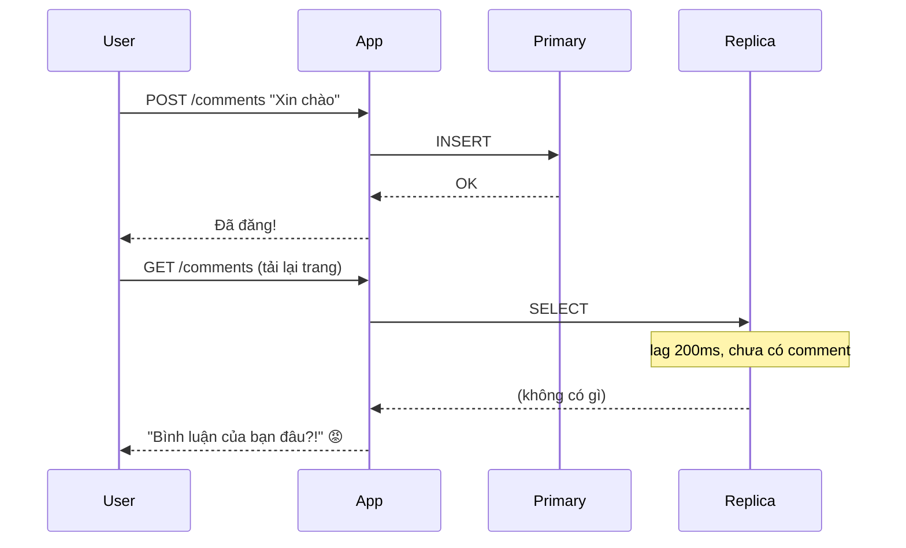
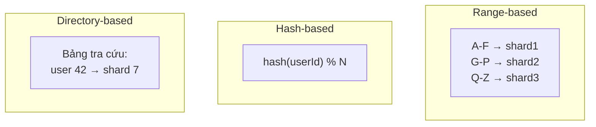
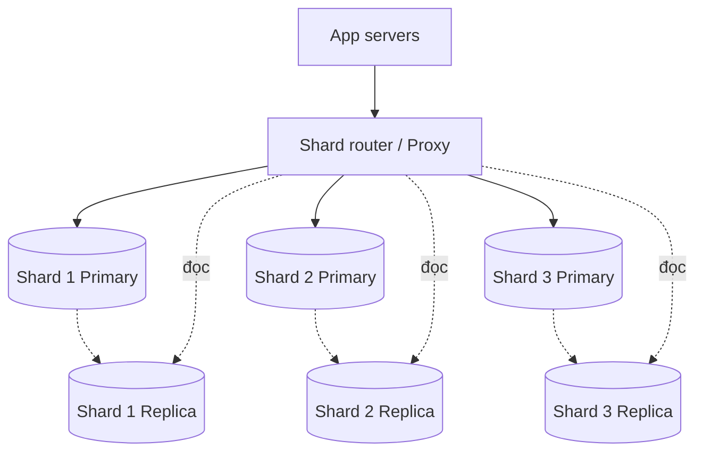

# Buổi 07 — Database II: replication, sharding, NoSQL

> **Mục tiêu**: Biết cách mở rộng database vượt quá một máy. Hiểu replication lag, consistent
> hashing, và chọn được đúng loại database cho từng bài toán.

---

## 1. Câu chuyện mở đầu (15')

Bạn đã làm mọi thứ ở buổi 04–06: 50 app server, cache hit 90%, index đầy đủ.

Nhưng **vẫn chỉ có một database**. Và giờ:
- Dữ liệu 8 TB — ổ SSD lớn nhất bạn mua được là 4 TB.
- 15.000 QPS đọc — DB đã 90% CPU.
- Backup mất 6 tiếng, restore mất 9 tiếng.
- DB chết = **toàn bộ** hệ thống chết.

Ba vấn đề, ba giải pháp khác nhau:

| Vấn đề | Giải pháp | Phần |
|---|---|---|
| Quá nhiều **đọc** | Replication (bản sao chỉ đọc) | 2 |
| Quá nhiều **dữ liệu / ghi** | Sharding (chia nhỏ) | 3 |
| Dữ liệu không hợp mô hình quan hệ | NoSQL | 5 |

---

## 2. Replication — nhân bản



### 2.1. Đồng bộ vs Bất đồng bộ

| | Synchronous | Asynchronous |
|---|---|---|
| Primary chờ replica xác nhận? | ✅ Có | ❌ Không |
| Latency ghi | Chậm (+RTT tới replica) | Nhanh |
| Mất dữ liệu khi primary chết | ❌ Không mất | ⚠️ Có thể mất vài giây cuối |
| Replica chết thì sao? | ❌ Ghi bị chặn! | ✅ Vẫn ghi bình thường |

**Thực tế thường dùng**: semi-synchronous — chờ **ít nhất 1** replica xác nhận, các replica còn
lại bất đồng bộ. Cân bằng giữa an toàn và tốc độ.

### 2.2. Replication lag — vấn đề bạn SẼ gặp



Đây gọi là vi phạm **read-your-own-writes**. Ba cách chữa:

1. **Đọc từ primary sau khi ghi** — trong X giây sau khi user ghi, mọi đọc của *chính user đó*
   đi vào primary. Đơn giản, hiệu quả nhất.
2. **Sticky theo phiên** — gắn user vào primary trong 30 giây.
3. **Đọc theo LSN/timestamp** — client giữ vị trí log đã ghi, chỉ đọc từ replica đã bắt kịp.

### 2.3. Failover

Primary chết → phải bầu một replica lên làm primary.

⚠️ **Split-brain**: nếu mạng chia đôi, có thể có **hai** primary cùng nhận ghi → dữ liệu phân kỳ,
không thể hợp nhất. Cách phòng: yêu cầu **quorum** (đa số) mới được lên làm primary. Buổi 10 sẽ đào sâu.

---

## 3. Sharding — chia nhỏ dữ liệu

### 3.1. Trước hết: đã thử hết cách khác chưa?

> **Sharding là biện pháp cuối cùng.** Trước khi shard, hãy chắc chắn bạn đã: thêm index, thêm
> cache, thêm read replica, dọn dữ liệu cũ sang kho lạnh, tách bảng lớn ra service riêng, và nâng
> cấp phần cứng. Một máy 128 core / 2 TB RAM đi được rất xa.

Sharding lấy đi của bạn: JOIN xuyên shard, transaction xuyên shard, `ORDER BY` toàn cục,
`COUNT(*)` toàn cục, và sự yên tâm.

### 3.2. Các chiến lược sharding



| Chiến lược | Ưu | Nhược |
|---|---|---|
| **Range** (theo khoảng giá trị) | Range query hiệu quả | Hot spot: dữ liệu mới đổ hết vào shard cuối |
| **Hash** | Phân bố đều | Mất khả năng range query |
| **Directory** | Linh hoạt, dễ rebalance | Bảng tra cứu thành SPOF, thêm 1 hop |
| **Geo** (theo vùng) | Latency thấp, tuân thủ luật dữ liệu | Mất cân bằng theo múi giờ |

### 3.3. Vấn đề của `hash % N` và lời giải Consistent Hashing

```
4 shard:  hash(user) % 4
Thêm 1 shard → % 5
→ user 10: 10%4=2 → 10%5=0   PHẢI DI CHUYỂN
→ user 11: 11%4=3 → 11%5=1   PHẢI DI CHUYỂN
→ ~80% dữ liệu phải di chuyển. Không thể chấp nhận với 8 TB.
```

**Consistent hashing**: đặt cả shard và key lên một *vòng tròn* băm. Mỗi key thuộc về shard đầu
tiên theo chiều kim đồng hồ.

```
        0
    ┌───────┐
 S3 │       │ S1        Thêm S4 vào giữa S1 và S2:
    │   ●   │           → chỉ các key nằm giữa S1 và S4 phải chuyển
    │       │           → ~1/N dữ liệu thay vì ~80%
 S2 └───────┘
       2^32
```

**Virtual nodes**: mỗi shard vật lý được đặt ở ~150 vị trí ngẫu nhiên trên vòng → phân bố đều hơn
nhiều, và khi một shard chết thì tải của nó được chia cho **tất cả** các shard còn lại (không dồn
vào một cái duy nhất).

### 3.4. Những thứ bạn mất khi shard

```sql
-- ❌ JOIN xuyên shard: user ở shard 1, order ở shard 3
SELECT * FROM users u JOIN orders o ON u.id = o.user_id;

-- ❌ Transaction xuyên shard: chuyển tiền A (shard 1) → B (shard 5)
--    Cần 2PC hoặc Saga (buổi 08) — phức tạp hơn nhiều bậc.

-- ❌ COUNT(*) toàn cục: phải hỏi mọi shard rồi cộng lại
-- ❌ ORDER BY ... LIMIT 20 toàn cục: phải lấy top 20 từ MỌI shard rồi trộn
-- ❌ AUTO_INCREMENT: mỗi shard tự tăng → trùng id! Cần Snowflake ID (buổi 15)
```

**Cách chọn shard key — quan trọng nhất**:

| Nguyên tắc | Ví dụ |
|---|---|
| Chọn key mà **hầu hết query đều có** | `user_id` nếu đa số query lọc theo user |
| Tránh key gây **hot spot** | ❌ `created_at` (dữ liệu mới dồn 1 shard) · ❌ `country` (VN chiếm 90%) |
| Chọn key có **độ phân tán cao** | ✅ `user_id`, `order_id` · ❌ `status` |
| Nhóm dữ liệu hay đọc cùng nhau vào **cùng shard** | Đơn hàng shard theo `user_id` để lấy hết đơn của 1 user trong 1 shard |

---

## 4. Kết hợp: kiến trúc DB thực tế



---

## 5. NoSQL — chọn đúng công cụ

| Loại | Ví dụ | Mô hình dữ liệu | Mạnh nhất ở | Đừng dùng khi |
|---|---|---|---|---|
| **Quan hệ** | Postgres, MySQL | Bảng, quan hệ | Transaction, query linh hoạt | Dữ liệu > vài chục TB, schema đổi liên tục |
| **Key-Value** | Redis, DynamoDB | key → value | Tra cứu theo khoá, cực nhanh | Cần query theo nhiều điều kiện |
| **Document** | MongoDB | JSON lồng nhau | Schema linh hoạt, đọc nguyên object | Cần JOIN nhiều, transaction phức tạp |
| **Wide-column** | Cassandra, HBase | hàng có hàng nghìn cột | Ghi cực nhiều, chuỗi thời gian | Cần query ad-hoc |
| **Graph** | Neo4j | đỉnh & cạnh | "Bạn của bạn", đường đi | Dữ liệu ít quan hệ |
| **Time-series** | InfluxDB, Timescale | (thời gian, giá trị) | Metric, IoT | Dữ liệu không theo thời gian |
| **Search** | Elasticsearch | inverted index | Tìm kiếm toàn văn (buổi 11) | Là nguồn dữ liệu chính (nó KHÔNG phải DB) |

### Cách chọn trong 3 câu hỏi

1. **Truy vấn của tôi trông như thế nào?** — Đây là câu hỏi quan trọng nhất. NoSQL bắt bạn thiết kế
   dữ liệu **theo query**, không phải theo thực thể.
2. **Tôi có cần transaction đa bản ghi không?** — Nếu có → nghiêng về quan hệ.
3. **Quy mô thật của tôi là bao nhiêu?** — Dưới 1 TB, dưới 10.000 QPS: **PostgreSQL làm được hết**
   (kể cả JSON, full-text, geo, queue). Đừng chọn Cassandra cho 10.000 dòng dữ liệu.

> 💡 **Lời khuyên thẳng thắn**: 90% startup chọn NoSQL vì "nghe nói scale tốt" rồi hối hận khi cần
> một câu JOIN. Bắt đầu bằng PostgreSQL. Chuyển đi khi có lý do đo được.

---

## 6. Lab (40')

📂 `labs/lab07-sharding-replication/`

```bash
node labs/lab07-sharding-replication/01-consistent-hashing.js  # ⭐ đo % dữ liệu phải di chuyển
node labs/lab07-sharding-replication/02-replication-lag.js     # tái hiện lỗi read-your-writes
```

---

## 7. Cái giá phải trả

- **Replica = tiền × N** và vẫn phải chịu replication lag.
- **Sharding là con đường một chiều.** Un-shard rất khó. Chọn sai shard key thì phải migrate lại
  toàn bộ dữ liệu — dự án hàng tháng trời.
- **Mỗi shard là một hệ thống phải vận hành**: backup, monitor, nâng cấp × N.
- **NoSQL "schemaless" không có nghĩa là không có schema** — schema chỉ chuyển từ database sang
  **code của bạn**, nơi không ai kiểm tra nó.

---

## 8. Bài tập về nhà

1. Chạy `01-consistent-hashing.js`. Ghi lại % key phải di chuyển khi thêm 1 shard, với
   `hash % N` và với consistent hashing (thử vnode = 1, 10, 150).
2. Chọn shard key cho: (a) hệ thống chat, (b) log truy cập, (c) sàn thương mại điện tử.
   Với mỗi lựa chọn, chỉ ra một query sẽ trở nên **rất chậm**.
3. Hệ thống đang có replication lag 5 giây. Liệt kê 3 tính năng sẽ bị hỏng và cách sửa từng cái.

---

## 9. Câu hỏi kiểm tra

1. Replication giải quyết vấn đề gì? Nó **không** giải quyết vấn đề gì?
2. Read-your-own-writes là gì? Nêu 2 cách đảm bảo.
3. Vì sao `hash % N` là ý tưởng tồi khi thêm shard?
4. Virtual node dùng để làm gì?
5. Kể 3 thứ bạn mất khi sharding.
6. Khi nào **nên** chọn Cassandra thay vì PostgreSQL?
