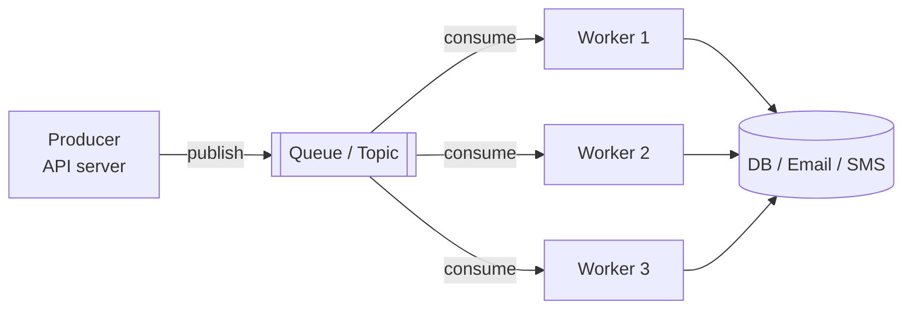
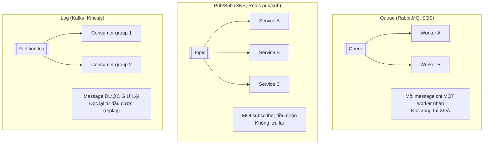
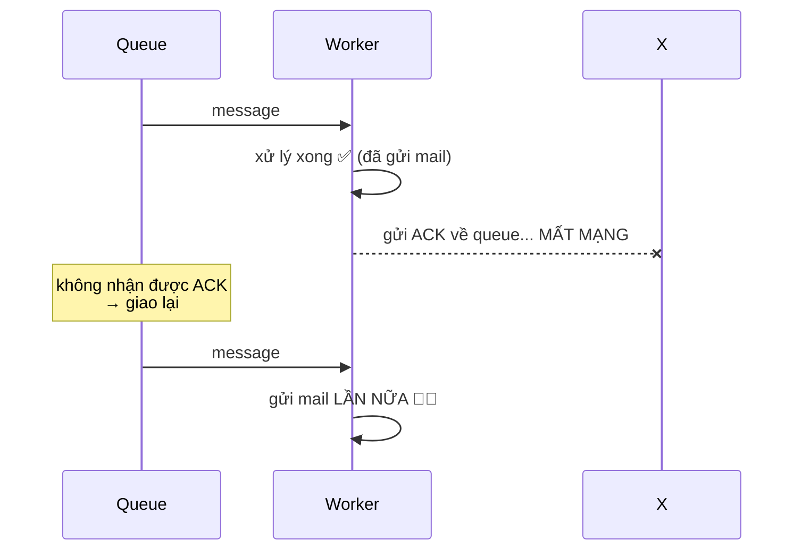
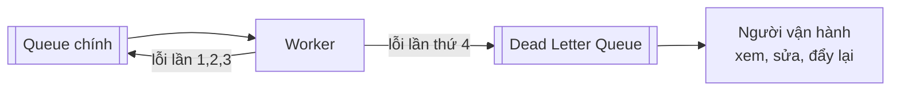
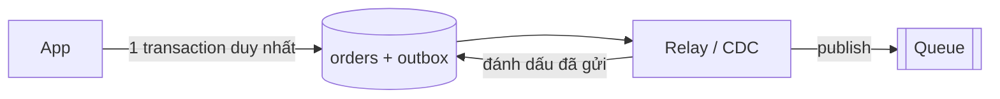
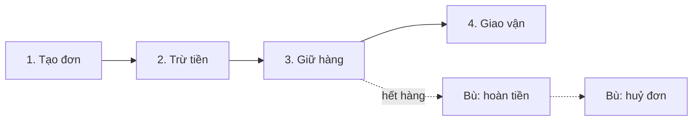

# Buổi 08 — Bất đồng bộ: Message Queue, Worker, Idempotency

> **Mục tiêu**: Biết khi nào tách việc ra chạy nền, hiểu at-least-once/exactly-once, viết được
> consumer idempotent, và nắm Saga cho transaction phân tán.

---

## 1. Câu chuyện mở đầu (15')

Endpoint `POST /orders` hiện làm 7 việc:

```js
app.post('/orders', async (req, res) => {
  const order = await db.createOrder(req.body);   //   20ms
  await payment.charge(order);                    //  800ms  ← API bên thứ ba
  await inventory.reserve(order);                 //  150ms
  await email.sendConfirmation(order);            // 1200ms  ← SMTP chậm
  await sms.send(order);                          //  600ms
  await analytics.track(order);                   //  300ms
  await warehouse.notify(order);                  //  400ms
  res.json(order);                                // TỔNG: 3.470ms
});
```

Ba vấn đề:

1. **Chậm**: user chờ 3,5 giây để nhìn thấy "Đặt hàng thành công".
2. **Mong manh**: SMTP server chết → **không đặt được hàng**. Dù việc gửi mail chẳng liên quan gì
   tới việc đơn hàng có hợp lệ hay không.
3. **Không retry được**: SMS lỗi ở bước 5 → đơn đã tạo, tiền đã trừ, giờ làm gì?

**Câu hỏi then chốt**: trong 7 việc trên, việc nào **phải xong trước khi trả lời user**?

> Chỉ 3 việc đầu. Bốn việc còn lại — mail, SMS, analytics, kho — có thể xong sau 2 giây hay 20 giây
> đều được. Chúng thuộc về **hàng đợi**.

```js
app.post('/orders', async (req, res) => {
  const order = await db.createOrder(req.body);   //  20ms
  await payment.charge(order);                    // 800ms
  await inventory.reserve(order);                 // 150ms
  await queue.publish('order.created', { orderId: order.id }); // 5ms
  res.json(order);                                // TỔNG: 975ms
});
```

---

## 2. Message Queue là gì?



Bốn lợi ích:

| Lợi ích | Giải thích |
|---|---|
| **Tách rời (decoupling)** | Producer không cần biết ai xử lý, hay có bao nhiêu consumer |
| **Đệm tải (buffering)** | Peak 10.000 msg/s, worker xử lý 1.000/s → queue phình rồi xẹp, không ai chết |
| **Thử lại (retry)** | Việc lỗi thì đưa lại vào queue, không mất |
| **Mở rộng độc lập** | Thêm worker gửi mail mà không đụng tới API server |

---

## 3. Queue vs Pub/Sub vs Log



| | Queue | Pub/Sub | Log (Kafka) |
|---|---|---|---|
| Ai nhận message | 1 consumer | Tất cả subscriber | Mỗi consumer group 1 lần |
| Sau khi đọc | Xoá | Bỏ đi | **Giữ lại** (theo retention) |
| Đọc lại lịch sử | ❌ | ❌ | ✅ replay được |
| Đảm bảo thứ tự | Hạn chế | ❌ | ✅ trong một partition |
| Dùng cho | Task nền | Thông báo sự kiện | Event sourcing, stream, audit |

> **Câu hỏi phỏng vấn hay**: "Vì sao chọn Kafka thay vì RabbitMQ?" → Vì cần **replay** (xử lý lại
> dữ liệu khi sửa bug), cần **thứ tự trong partition**, hoặc cần **nhiều nhóm consumer khác nhau
> đọc cùng một luồng**. Nếu chỉ cần chạy task nền thì RabbitMQ/SQS đơn giản hơn nhiều.

---

## 4. Đảm bảo giao nhận — phần quan trọng nhất

| Mức | Nghĩa là | Rủi ro | Dùng khi |
|---|---|---|---|
| **At-most-once** | Gửi 1 lần, lỗi thì thôi | ⚠️ **Mất message** | Metric, log không quan trọng |
| **At-least-once** | Thử lại đến khi thành công | ⚠️ **Trùng lặp** | Mặc định, dùng 95% trường hợp |
| **Exactly-once** | Đúng một lần | Rất đắt, thường là ảo tưởng | Hầu như không cần |

### Vì sao "exactly-once" gần như không tồn tại?



Không có cách nào để worker và queue **đồng thời** biết chắc "đã xử lý xong VÀ đã ghi nhận xong".
Đây là bài toán Two Generals — **chứng minh được là không giải được**.

> 🎯 **Giải pháp thực tế**: chấp nhận **at-least-once** ở tầng vận chuyển, rồi làm cho **việc xử lý
> trở nên idempotent** ở tầng ứng dụng. Đó là toàn bộ mẹo.

---

## 5. Idempotency — kỹ thuật quan trọng nhất buổi này

> **Idempotent** = xử lý message 1 lần hay 10 lần cho **cùng kết quả**.

Ba cách làm:

### 5.1. Bảng khoá idempotency (phổ biến nhất)

```js
async function xuLy(msg) {
  // INSERT sẽ THẤT BẠI nếu message này đã xử lý rồi — nhờ ràng buộc UNIQUE
  try {
    await db.query('INSERT INTO processed_messages(id) VALUES ($1)', [msg.id]);
  } catch (e) {
    if (e.code === '23505') return; // đã xử lý → bỏ qua, không làm gì cả
    throw e;
  }
  await lamViecThatSu(msg);
}
```

⚠️ Vẫn có kẽ hở: nếu tiến trình chết **giữa** INSERT và `lamViecThatSu`, message bị coi là đã xử lý
nhưng thực tế chưa. Muốn kín thì phải đưa cả hai vào **cùng một transaction** — điều chỉ làm được
khi việc đó cũng là ghi vào cùng database ấy.

### 5.2. Thiết kế thao tác vốn đã idempotent

```js
❌ balance = balance + 100          // gọi 2 lần → cộng 200
✅ balance = 500                    // gọi 2 lần → vẫn 500 (dùng giá trị tuyệt đối)

❌ INSERT INTO items ...            // gọi 2 lần → 2 dòng
✅ INSERT ... ON CONFLICT DO NOTHING

❌ UPDATE orders SET status='paid'  // ổn, vốn đã idempotent
✅ UPDATE orders SET status='paid' WHERE status='pending'  // còn kèm bảo vệ chuyển trạng thái
```

### 5.3. Dedup theo khoá tự nhiên

Dùng `orderId` thay vì `messageId` — vì cùng một đơn hàng có thể sinh ra nhiều message.

---

## 6. Dead Letter Queue (DLQ)



Không có DLQ → một message hỏng ("poison message") bị retry vô hạn, chiếm hết worker, chặn cả queue.

**Chuẩn mực vận hành**: DLQ có message = phải có cảnh báo. DLQ đầy im lặng nghĩa là bạn đang mất
dữ liệu mà không biết.

---

## 7. Transactional Outbox — bài toán "hai lần ghi"

```js
// ❌ SAI: hai hệ thống, không có transaction chung
await db.createOrder(order);        // ✅ thành công
await queue.publish('order.created'); // ❌ queue chết → KHÔNG AI biết đơn đã tạo
```

Hoặc ngược lại: publish thành công, DB rollback → có sự kiện cho đơn hàng **không tồn tại**.

**Giải pháp Outbox**: ghi message vào **cùng database, cùng transaction**, rồi một tiến trình riêng
đọc bảng outbox và đẩy lên queue.



```sql
BEGIN;
  INSERT INTO orders (...) VALUES (...);
  INSERT INTO outbox (topic, payload) VALUES ('order.created', '{...}');
COMMIT;   -- cả hai cùng thành công hoặc cùng thất bại
```

Relay có thể publish trùng (nếu chết sau khi publish, trước khi đánh dấu) → lại là at-least-once →
lại cần idempotency ở consumer. Mọi con đường đều dẫn về idempotency.

---

## 8. Saga — transaction xuyên nhiều service

Không thể `BEGIN...COMMIT` xuyên 4 database. Thay vào đó: chuỗi bước, mỗi bước có **hành động bù trừ**.



| Kiểu Saga | Cách hoạt động | Ưu / Nhược |
|---|---|---|
| **Choreography** | Mỗi service nghe sự kiện và tự phản ứng | Không có SPOF · Khó theo dõi luồng tổng thể |
| **Orchestration** | Một "nhạc trưởng" điều phối từng bước | Dễ hiểu, dễ debug · Nhạc trưởng là SPOF |

⚠️ Saga cho **atomicity** nhưng **không** cho **isolation**: giữa chừng, hệ thống ở trạng thái nửa
vời mà người khác có thể nhìn thấy (đơn đã tạo nhưng chưa trừ tiền).

---

## 9. Lab (40')

📂 `labs/lab08-message-queue/`

```bash
node labs/lab08-message-queue/02-demo.js
```

Bạn sẽ tự cài một message queue mini có: visibility timeout, retry với backoff, DLQ, và so sánh
consumer idempotent vs không idempotent (đếm số email gửi trùng).

---

## 10. Cái giá phải trả

- **Eventual consistency**: user đặt hàng xong nhưng chưa thấy email — đúng nhưng khó giải thích.
- **Debug khó hơn nhiều**: luồng bị cắt thành nhiều mảnh, không còn stack trace xuyên suốt.
  → Bắt buộc phải có trace id (buổi 12).
- **Thêm hạ tầng phải vận hành**: queue đầy, consumer lag, partition mất cân bằng.
- **Thứ tự message**: hầu hết queue **không** đảm bảo thứ tự toàn cục. "Cập nhật địa chỉ" có thể
  tới trước "tạo user".
- **Đừng lạm dụng**: nếu công việc chỉ mất 5ms và phải trả kết quả cho user ngay, queue chỉ làm
  chậm và phức tạp thêm.

---

## 11. Bài tập về nhà

1. Chạy `02-demo.js`. Ghi lại số email trùng ở phiên bản không idempotent.
2. Thiết kế luồng "đăng ký tài khoản" bằng queue: việc nào đồng bộ, việc nào bất đồng bộ? Vẽ sơ đồ.
3. Thiết kế Saga cho đặt vé máy bay (giữ chỗ → thanh toán → xuất vé). Viết ra hành động bù trừ cho
   từng bước. Điều gì xảy ra nếu chính hành động bù trừ cũng lỗi?
4. Hệ thống của bạn xử lý 1.000 msg/s, worker xử lý 800 msg/s. Sau 1 giờ queue dài bao nhiêu?
   Cần bao nhiêu worker? Nếu message có TTL 5 phút thì sao?

---

## 12. Câu hỏi kiểm tra

1. Vì sao exactly-once gần như không tồn tại trong hệ phân tán?
2. Idempotent là gì? Nêu 2 cách làm cho consumer idempotent.
3. DLQ dùng để làm gì? Điều gì xảy ra nếu không có?
4. Bài toán "hai lần ghi" (dual write) là gì? Outbox giải quyết nó thế nào?
5. Saga đảm bảo được gì và KHÔNG đảm bảo được gì?
6. Khi nào **không** nên dùng queue?
