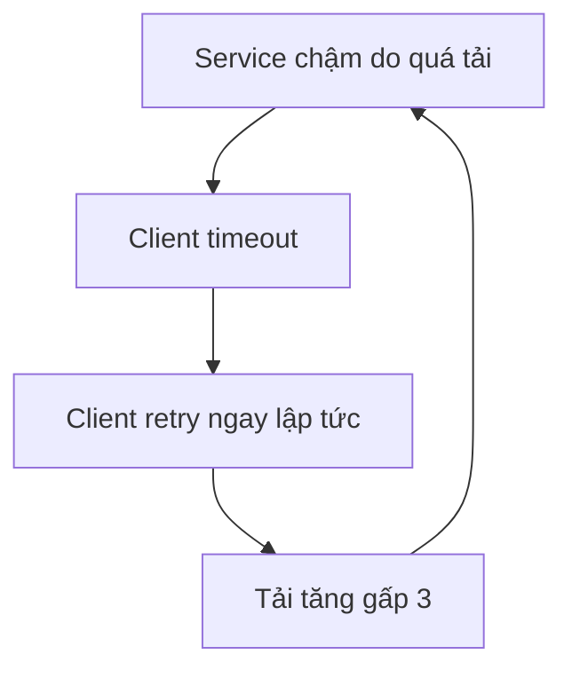
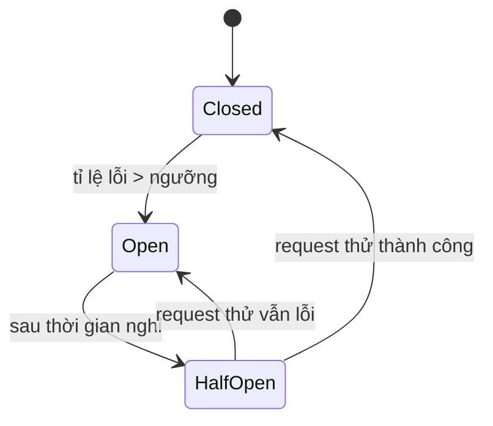

# Buổi 09 — Độ tin cậy: timeout, retry, circuit breaker, rate limit

> **Mục tiêu**: Thiết kế hệ thống **chịu được lỗi**. Hiểu retry storm, circuit breaker, bulkhead,
> rate limiting, graceful degradation. Đây là buổi biến một dev thành một kỹ sư hệ thống.

---

## 1. Câu chuyện mở đầu (15')

Service "Gợi ý sản phẩm" bị chậm — p99 lên 8 giây. Nó chỉ là một widget nhỏ ở cuối trang chủ.

```
1. Trang chủ gọi Gợi ý, không có timeout → mỗi request giữ 1 thread 8 giây
2. Thread pool đầy → trang chủ bắt đầu chậm
3. Client thấy chậm → tự động retry → tải TĂNG GẤP 3
4. Gợi ý sập hẳn
5. Trang chủ vẫn cố gọi, mỗi lần chờ 8 giây rồi lỗi
6. TOÀN BỘ SITE SẬP — vì một widget không quan trọng
```

Đây là **cascading failure**. Nó là nguyên nhân của phần lớn các sự cố lớn ngoài đời thật.

> 🎯 **Nguyên tắc số 1 của buổi hôm nay**: Trong hệ phân tán, **mọi cuộc gọi mạng đều sẽ thất bại**.
> Câu hỏi không phải "nếu" mà là "khi nào" và "lúc đó chuyện gì xảy ra".

---

## 2. Timeout — hàng phòng thủ đầu tiên

```js
// ❌ Không timeout = chờ vô hạn = giữ tài nguyên vô hạn
const res = await fetch(url);

// ✅ Có timeout
const res = await fetch(url, { signal: AbortSignal.timeout(500) });
```

### Chọn timeout bao nhiêu?

```
Timeout ≈ p99 của service đó × 1.5   (không phải trung bình!)

Ví dụ: service có p99 = 200ms → timeout 300ms
```

- Timeout **quá dài** → giữ tài nguyên, không phát hiện lỗi kịp, cascading failure.
- Timeout **quá ngắn** → huỷ oan những request lẽ ra sắp xong, tự tạo thêm lỗi.

### Timeout phải giảm dần theo chuỗi gọi (timeout budget)

```
Client   → 3000ms
  API    → 2000ms   (còn 1000ms cho retry + tổng hợp)
    SvcA → 800ms
      DB → 500ms
```

❌ **Lỗi kinh điển**: service trong có timeout **dài hơn** service ngoài. Kết quả: client đã bỏ đi
từ lâu mà server vẫn cặm cụi làm việc vô ích cho một kết nối đã đóng.

---

## 3. Retry — con dao hai lưỡi

### 3.1. Chỉ retry những gì AN TOÀN để retry

| Tình huống | Retry? |
|---|---|
| Timeout kết nối (chưa gửi được gì) | ✅ An toàn |
| `503 Service Unavailable`, `429` | ✅ An toàn (có `Retry-After`) |
| `500` sau khi đã gửi request | ⚠️ Chỉ khi thao tác idempotent |
| `400 Bad Request`, `404`, `403` | ❌ **Không bao giờ** — retry cũng lỗi y hệt |
| `POST /payments` không có idempotency key | ❌ **Nguy hiểm — trừ tiền 2 lần** |

### 3.2. Retry storm — vì sao retry ngây thơ làm mọi thứ tệ hơn



Đây là vòng phản hồi dương. Service đang ngộp thở thì bạn bóp cổ nó thêm.

### 3.3. Ba kỹ thuật bắt buộc phải có

**a) Exponential backoff**: chờ 100ms, 200ms, 400ms, 800ms...

**b) Jitter (ngẫu nhiên hoá)** — quan trọng không kém backoff:

```js
// ❌ Không jitter: 1000 client cùng timeout lúc T → cùng retry lúc T+100 → lại đập cùng lúc
const cho = base * 2 ** lan;

// ✅ Full jitter: rải đều ra
const cho = Math.random() * base * 2 ** lan;
```

**c) Retry budget**: chỉ cho phép retry tối đa ~10% tổng số request. Vượt ngưỡng thì ngừng retry.
Điều này ngăn retry biến sự cố nhỏ thành sập toàn hệ thống.

---

## 4. Circuit Breaker — cầu dao tự động

Ý tưởng: nếu một service đang hỏng, **đừng gọi nó nữa**. Fail nhanh còn hơn chờ rồi cũng fail.



| Trạng thái | Hành vi |
|---|---|
| **CLOSED** (đóng mạch) | Cho qua bình thường, đếm tỉ lệ lỗi |
| **OPEN** (ngắt mạch) | **Từ chối ngay lập tức**, không gọi service. Trả fallback. |
| **HALF-OPEN** (thăm dò) | Cho qua vài request thử. Tốt → CLOSED. Xấu → OPEN lại. |

Lợi ích kép:
1. **Bảo vệ mình**: không lãng phí thread chờ một service đã chết.
2. **Bảo vệ nó**: cho service đang ngộp có cơ hội hồi phục thay vì bị dồn tải liên tục.

---

## 5. Bulkhead — vách ngăn khoang tàu

Tên gọi lấy từ khoang kín trên tàu thuỷ: thủng một khoang thì tàu không chìm.

```
❌ Một pool 100 connection dùng chung:
   endpoint /recommendations chậm → chiếm hết 100 → /checkout cũng chết

✅ Chia pool:
   /checkout        → pool riêng 50   (quan trọng, phải luôn sống)
   /recommendations → pool riêng 20   (chậm cũng chỉ tự chết một mình)
   /search          → pool riêng 30
```

Nhớ lại lab 06.3: một endpoint viết N+1 làm cạn pool và kéo mọi endpoint khác xuống. Bulkhead là
cách chữa mang tính kiến trúc.

---

## 6. Rate Limiting

### Bốn thuật toán

| Thuật toán | Cách hoạt động | Ưu | Nhược |
|---|---|---|---|
| **Fixed Window** | Đếm trong mỗi phút | Đơn giản, ít bộ nhớ | Cho qua 2× ở ranh giới cửa sổ |
| **Sliding Window Log** | Lưu timestamp mọi request | Chính xác tuyệt đối | Tốn RAM |
| **Sliding Window Counter** | Nội suy giữa 2 cửa sổ | Cân bằng tốt | Xấp xỉ |
| **Token Bucket** ⭐ | Token nhỏ giọt vào xô, mỗi request tiêu 1 | Cho phép burst có kiểm soát | Cần chỉnh 2 tham số |

**Lỗi cửa sổ cố định** (hay bị hỏi):
```
Giới hạn 100 req/phút.
12:00:59 → 100 request  ✅ (cửa sổ 12:00)
12:01:00 → 100 request  ✅ (cửa sổ 12:01)
→ 200 request trong 1 GIÂY. Giới hạn bị phá gấp đôi.
```

**Token bucket** là lựa chọn mặc định tốt nhất: cho phép burst ngắn (tốt cho trải nghiệm) nhưng
giới hạn tốc độ trung bình dài hạn.

### Rate limit theo cái gì?

```
IP        → dễ, nhưng NAT làm cả công ty dùng chung 1 IP
User ID   → công bằng, nhưng chỉ áp dụng được sau khi đăng nhập
API key   → tốt nhất cho API công khai
Endpoint  → /login nên chặt hơn /products
```

Luôn trả `429 Too Many Requests` kèm `Retry-After` và header `X-RateLimit-Remaining`.

---

## 7. Load Shedding & Graceful Degradation

**Load shedding**: khi quá tải, **chủ động từ chối** một phần request để phần còn lại vẫn nhanh.

> Phục vụ tốt 70% người dùng tốt hơn là phục vụ tệ cho 100%.

Thứ tự ưu tiên khi phải bỏ bớt: bỏ request của bot trước, rồi người dùng free, giữ lại người dùng
trả tiền và luồng thanh toán.

**Graceful degradation**: hỏng một phần thì giảm chất lượng, không sập.

| Thành phần chết | Hành vi kém duyên | Hành vi tử tế |
|---|---|---|
| Service gợi ý | Trang trắng 500 | Ẩn widget, hiện "Sản phẩm bán chạy" tĩnh |
| Search | Lỗi | Rơi về tìm kiếm SQL đơn giản |
| Ảnh đại diện (CDN) | Ảnh vỡ | Hiện chữ cái đầu tên |
| Cache | Sập DB | Rate limit + phục vụ dữ liệu cũ |

---

## 8. Bảng tổng hợp: chống lại cái gì?

| Kỹ thuật | Bảo vệ khỏi | Phía |
|---|---|---|
| Timeout | Chờ vô hạn | Client |
| Retry + backoff + jitter | Lỗi thoáng qua | Client |
| Circuit breaker | Cascading failure | Client |
| Bulkhead | Một phần hỏng kéo cả hệ | Client |
| Rate limiting | Lạm dụng, quá tải | Server |
| Load shedding | Sụp đổ khi quá tải | Server |
| Graceful degradation | Trải nghiệm tệ | Cả hai |

---

## 9. Lab (40')

📂 `labs/lab09-resilience/`

```bash
node labs/lab09-resilience/04-demo.js
```

Bạn sẽ đo: retry storm làm tải tăng bao nhiêu lần, jitter cứu được gì, circuit breaker giảm latency
thế nào khi downstream chết, và so sánh 4 thuật toán rate limiting.

---

## 10. Cái giá phải trả

- **Circuit breaker có thể mở nhầm**: một đợt lỗi nhất thời khiến nó cắt dịch vụ đang khoẻ.
  Ngưỡng quá nhạy còn hại hơn không có.
- **Timeout quá chặt tự tạo ra lỗi** — huỷ những request lẽ ra thành công.
- **Rate limit chặn nhầm khách hàng thật** (một công ty sau NAT).
- **Mỗi lớp bảo vệ là thêm code, thêm cấu hình, thêm thứ để hiểu sai.** Đừng thêm circuit breaker
  vào một hệ thống chưa có nổi timeout.

**Thứ tự triển khai đúng**: Timeout → Retry có backoff+jitter → Circuit breaker → Bulkhead.

---

## 11. Bài tập về nhà

1. Chạy `04-demo.js`. Ghi lại hệ số khuếch đại tải của retry storm và tác dụng của jitter.
2. Đặt timeout budget cho chuỗi: Mobile → API Gateway → Order Service → Payment Service → Bank API,
   biết p99 của Bank API là 2s. Viết ra từng con số và lý do.
3. Với 3 tính năng bất kỳ trong app của bạn, thiết kế hành vi degradation khi dependency chết.
4. Cài rate limit cho `/login`: 5 lần/phút/IP **và** 20 lần/giờ/tài khoản. Vì sao cần cả hai?

---

## 12. Câu hỏi kiểm tra

1. Vì sao retry không có jitter lại nguy hiểm?
2. Ba trạng thái của circuit breaker là gì? Half-open để làm gì?
3. Vì sao timeout của service bên trong phải **ngắn hơn** service bên ngoài?
4. Lỗi của fixed window rate limiter là gì?
5. Bulkhead giải quyết vấn đề gì? Cho ví dụ cụ thể.
6. Kể tên 3 request có thể retry an toàn và 2 request tuyệt đối không.
