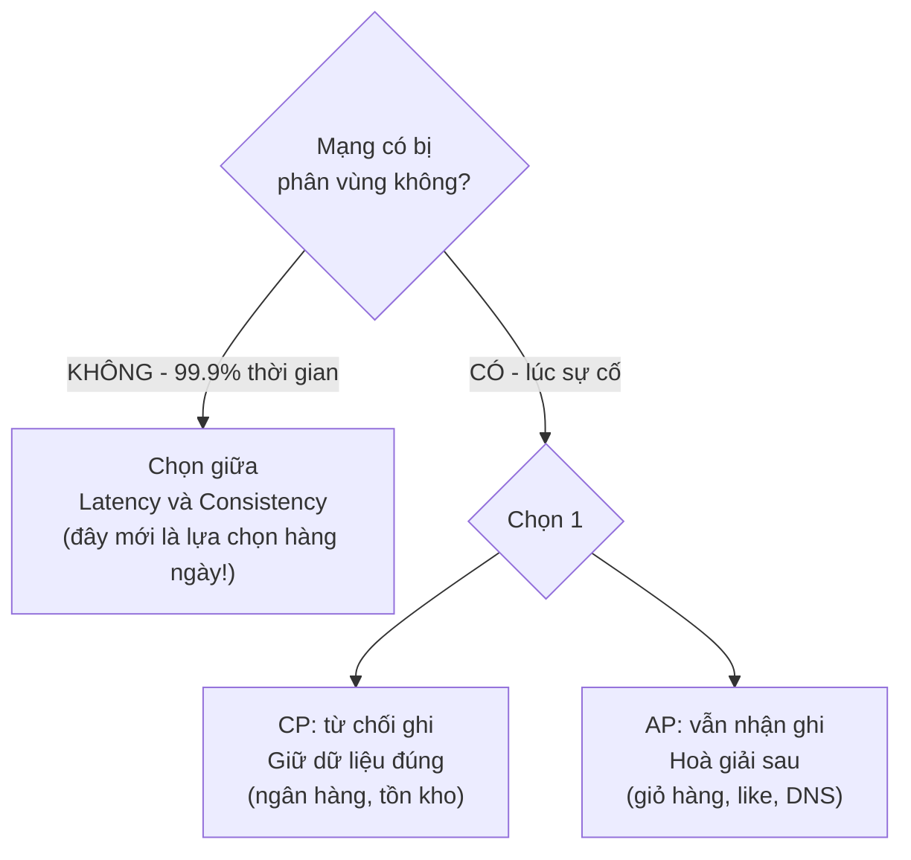
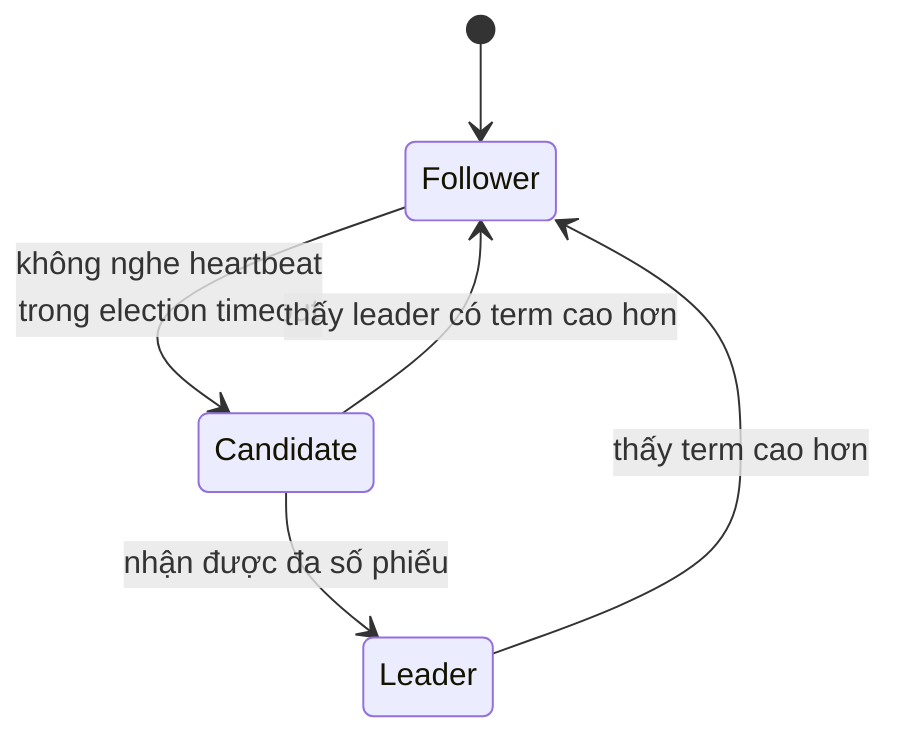

# Buổi 10 — Hệ phân tán: CAP, đồng hồ, đồng thuận

> **Mục tiêu**: Hiểu vì sao hệ phân tán khó *về bản chất*. Nắm CAP/PACELC đúng cách (không phải kiểu
> học vẹt), hiểu vì sao không tin được đồng hồ, và biết consensus/quorum dùng để làm gì.

---

## 1. Câu chuyện mở đầu (15')

Bạn có 3 server. Cáp mạng giữa datacenter A (server 1) và B (server 2, 3) bị đứt.

```
     ┌─── A ───┐        ✂️        ┌─── B ───┐
     │ Node 1  │  ← đứt cáp →     │ Node 2  │
     └─────────┘                  │ Node 3  │
                                  └─────────┘
```

Một người dùng ở phía A gửi lệnh **rút 10 triệu**. Node 1 không liên lạc được với Node 2 và 3.

Node 1 phải chọn **một trong hai**:

- **(A) Chấp nhận lệnh rút** → nhanh, người dùng vui. Nhưng nếu bên B cũng có người rút 10 triệu từ
  cùng tài khoản → **rút hai lần từ số dư một lần**.
- **(C) Từ chối, báo lỗi** → dữ liệu an toàn, nhưng người dùng không rút được tiền dù hệ thống
  "vẫn chạy".

**Không có lựa chọn thứ ba.** Đây chính là định lý CAP, và nó không phải lý thuyết suông.

---

## 2. Tám ngộ nhận về hệ phân tán

Peter Deutsch, 1994 — vẫn đúng nguyên si:

1. Mạng luôn đáng tin ❌
2. Độ trễ bằng 0 ❌
3. Băng thông vô hạn ❌
4. Mạng an toàn ❌
5. Cấu trúc mạng không đổi ❌
6. Chỉ có một người quản trị ❌
7. Chi phí vận chuyển bằng 0 ❌
8. Mạng đồng nhất ❌

> Người mới viết code như thể cả 8 điều đều đúng. Kỹ sư hệ thống viết code như thể cả 8 đều sai.

---

## 3. CAP — hiểu cho đúng



### Ba cách hiểu SAI phổ biến

| Hiểu sai | Đúng ra là |
|---|---|
| "Chọn 2 trong 3 (CA, CP, AP)" | **P không phải lựa chọn** — mạng *sẽ* đứt. Bạn chỉ chọn giữa C và A **khi** nó đứt. |
| "MongoDB là CP, Cassandra là AP" | Hầu hết DB hiện đại **cấu hình được**. Cassandra với `QUORUM` nghiêng CP hơn. |
| "CAP là toàn bộ câu chuyện" | CAP chỉ nói về lúc **có phân vùng**. 99,9% thời gian không có phân vùng — lúc đó bạn vẫn phải chọn giữa latency và consistency. |

### PACELC — bản đầy đủ hơn

```
if (Partition)  then  choose A or C
else (Else)     then  choose L(atency) or C(onsistency)
```

Ví dụ:
- **PostgreSQL đơn node**: PC/EC — luôn ưu tiên consistency.
- **DynamoDB mặc định**: PA/EL — ưu tiên availability và latency.
- **DynamoDB với strongly consistent read**: PA/EC — trả tiền gấp đôi để đọc chắc chắn.
- **Cassandra `ONE`**: PA/EL. **Cassandra `QUORUM`**: PC/EC.

---

## 4. Các mức nhất quán

```
Mạnh                                                                     Yếu
├─────────────────┬──────────────┬────────────────┬───────────────────────┤
Linearizable   Sequential   Causal          Eventual              Không có gì
(như 1 máy)                  (nhân-quả)     (rồi sẽ hội tụ)
```

| Mức | Đảm bảo | Ví dụ dùng |
|---|---|---|
| **Linearizable** | Như thể chỉ có một bản sao duy nhất | Số dư ngân hàng, khoá phân tán |
| **Sequential** | Mọi node thấy cùng một thứ tự | |
| **Causal** | Nhân trước quả sau (thấy câu hỏi trước câu trả lời) | Bình luận, chat |
| **Read-your-writes** | Thấy được cái mình vừa ghi | Buổi 07 |
| **Eventual** | Ngừng ghi thì cuối cùng sẽ giống nhau | Số like, DNS, giỏ hàng |

> 💡 Câu hỏi thực dụng: *"Dữ liệu này sai trong 3 giây thì ai chết?"* Nếu không ai → eventual là đủ,
> và bạn tiết kiệm được rất nhiều tiền lẫn latency.

---

## 5. Đừng tin đồng hồ

```js
// ❌ Cách này SAI trong hệ phân tán
if (banGhiA.updatedAt > banGhiB.updatedAt) dungA();
```

Vì sao sai:
- Đồng hồ các máy **lệch nhau** (clock skew) — vài ms tới vài giây, kể cả có NTP.
- NTP có thể **kéo lùi** đồng hồ → `Date.now()` chạy giật lùi.
- Máy ảo bị "đóng băng" khi migrate → đồng hồ nhảy cóc.
- Lá thư gửi sau có thể mang dấu bưu điện sớm hơn.

### Đồng hồ logic — giải pháp

**Lamport timestamp**: mỗi node giữ một bộ đếm.
```
Khi làm việc gì đó:      counter++
Khi gửi message:          gửi kèm counter
Khi nhận message:         counter = max(counter, nhận được) + 1
```
Cho ta: nếu A → B (nhân quả) thì `L(A) < L(B)`. Nhưng chiều ngược lại **không** đúng.

**Vector clock**: mỗi node giữ một vector đếm của **tất cả** các node. Nhờ đó phân biệt được
"xảy ra trước" và "đồng thời (xung đột)".

```
Node A: [2, 1, 0]      A biết: mình làm 2 việc, đã thấy 1 việc của B
Node B: [1, 3, 0]

So sánh: A[0]=2 > B[0]=1  nhưng  A[1]=1 < B[1]=3
→ KHÔNG so sánh được → hai bản ghi ĐỒNG THỜI → XUNG ĐỘT, cần hoà giải
```

### Hoà giải xung đột

| Cách | Mô tả | Hệ quả |
|---|---|---|
| **LWW** (Last Write Wins) | Lấy timestamp lớn hơn | Đơn giản, nhưng **âm thầm mất dữ liệu** |
| **Giữ cả hai** | Trả về nhiều phiên bản, để app quyết | Amazon giỏ hàng: hợp nhất → không mất món hàng nào |
| **CRDT** | Cấu trúc dữ liệu tự hội tụ theo toán học | Counter, Set, văn bản cộng tác (Google Docs) |

---

## 6. Quorum và Consensus

### Quorum: W + R > N

```
N = số bản sao
W = số bản sao phải xác nhận khi GHI
R = số bản sao phải hỏi khi ĐỌC

Nếu W + R > N thì tập ghi và tập đọc CHẮC CHẮN giao nhau
→ lần đọc luôn chạm được ít nhất một bản có dữ liệu mới nhất
```

| Cấu hình (N=3) | Đặc điểm |
|---|---|
| W=1, R=1 | Nhanh nhất, có thể đọc dữ liệu cũ |
| W=3, R=1 | Đọc nhanh, ghi chậm, không chịu được node chết khi ghi |
| **W=2, R=2** | ⭐ Cân bằng, chịu được 1 node chết |
| W=1, R=3 | Ghi nhanh, đọc chậm |

### Consensus (Raft/Paxos) — bầu leader

Dùng khi cần **mọi node đồng ý về một giá trị duy nhất**: ai là leader, thứ tự các lệnh, cấu hình cụm.



Ba ý tưởng cốt lõi của Raft:

1. **Term** — mỗi "nhiệm kỳ" có số tăng dần. Term cao hơn luôn thắng.
2. **Đa số (majority)** — cần > N/2 phiếu để làm leader. Nhờ đó **không thể có 2 leader cùng term**:
   hai đa số của cùng một tập luôn giao nhau.
3. **Randomized election timeout** — mỗi node chờ một khoảng ngẫu nhiên (150–300ms) trước khi ứng cử
   → tránh mọi node cùng ứng cử và chia phiếu vô tận.

> Vì sao cụm etcd/ZooKeeper luôn có **số lẻ** node? Vì 4 node cũng chỉ chịu được 1 node chết như
> 3 node (đa số của 4 là 3, của 3 là 2) — thêm node thứ 4 chỉ tốn tiền.

**Khi nào bạn cần consensus?** Hầu như không bao giờ tự cài. Bạn *dùng* nó qua: etcd, ZooKeeper,
Consul, hoặc leader election có sẵn trong database. Nhưng phải hiểu để dùng đúng.

---

## 7. Lab (40')

📂 `labs/lab10-phan-tan/`

```bash
node labs/lab10-phan-tan/01-dong-ho.js     # clock skew, Lamport, vector clock, LWW mất dữ liệu
node labs/lab10-phan-tan/02-bau-leader.js  # bầu leader kiểu Raft + split-brain
```

---

## 8. Cái giá phải trả

- **Consensus chậm**: mọi lệnh ghi phải qua leader và chờ đa số xác nhận → thêm 1–2 RTT.
- **Nhất quán mạnh giới hạn quy mô**: không thể có linearizability xuyên lục địa mà vẫn nhanh —
  tốc độ ánh sáng không thương lượng được.
- **Vector clock phình to** theo số node → phải cắt tỉa, mà cắt tỉa thì mất chính xác.
- **CRDT chỉ hoạt động cho một số kiểu dữ liệu** và thường tốn metadata gấp nhiều lần dữ liệu.

---

## 9. Bài tập về nhà

1. Chạy `01-dong-ho.js`. Ghi lại: LWW làm mất bao nhiêu % cập nhật? Vector clock phát hiện được
   bao nhiêu xung đột?
2. Với N=5, liệt kê mọi cặp (W,R) thoả `W+R>N`. Cặp nào tốt cho hệ đọc nhiều? Ghi nhiều?
3. Phân loại theo PACELC: hệ thống chat, hệ thống đặt vé máy bay, đếm lượt xem video.
4. Chạy `02-bau-leader.js` với phân vùng 3-2. Vì sao phía 2 node không bầu được leader? Điều đó
   bảo vệ ta khỏi cái gì?

---

## 10. Câu hỏi kiểm tra

1. Vì sao "chọn 2 trong 3" là cách hiểu sai về CAP?
2. PACELC bổ sung gì cho CAP?
3. Vì sao không nên dùng `updatedAt` để hoà giải xung đột?
4. Vector clock cho biết điều gì mà Lamport timestamp không cho biết?
5. Giải thích `W + R > N` bằng lời.
6. Vì sao cụm consensus luôn có số lẻ node?
7. Split-brain là gì và quorum ngăn nó thế nào?
