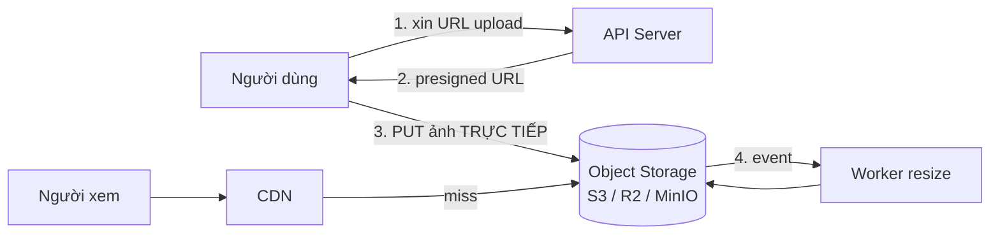
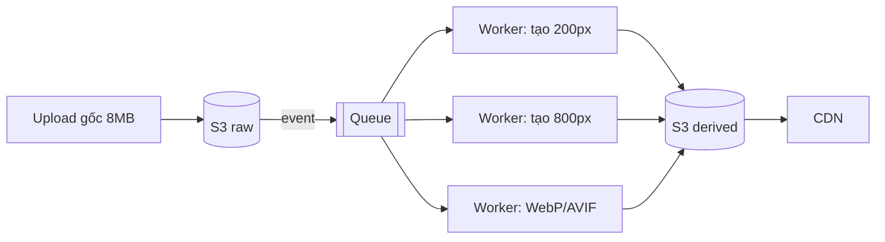
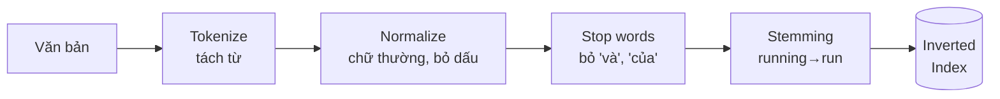

# Buổi 11 — Lưu trữ file, Object Storage, CDN và Tìm kiếm

> **Mục tiêu**: Biết lưu ảnh/video ở đâu và phục vụ thế nào, hiểu CDN hoạt động ra sao, và tự cài
> được một search engine mini để hiểu inverted index.

---

## 1. Câu chuyện mở đầu (15')

Startup của bạn cho người dùng upload ảnh đại diện. Bản đầu tiên:

```js
app.post('/avatar', (req, res) => {
  fs.writeFileSync(`./uploads/${userId}.jpg`, req.body);  // lưu vào đĩa server
});
app.get('/avatar/:id', (req, res) => {
  res.sendFile(`./uploads/${id}.jpg`);
});
```

Sáu tháng sau:
- Scale lên 3 server → **ảnh chỉ có trên 1 server**, 2/3 request trả 404 (nhớ buổi 04: stateless!)
- Đĩa 100GB đầy sau 4 tháng.
- Ảnh gốc 8MB từ điện thoại → trang tải mất 15 giây trên 3G.
- Server tốn 90% băng thông chỉ để gửi ảnh, không còn chỗ cho API.
- Ai biết URL đều xem được ảnh của người khác.

---

## 2. Object Storage



### So sánh nơi lưu file

| | Đĩa server | Network FS (NFS/EFS) | Object Storage (S3) |
|---|---|---|---|
| Nhiều server dùng chung | ❌ | ✅ | ✅ |
| Dung lượng | Giới hạn | Lớn | **Vô hạn thực tế** |
| Giá / GB | Cao | Rất cao | **Rẻ nhất** |
| Độ bền | 1 đĩa hỏng = mất | Tốt | 99.999999999% (11 số 9) |
| Có CDN sẵn | ❌ | ❌ | ✅ |
| Sửa một phần file | ✅ | ✅ | ❌ (phải ghi lại cả object) |

> 🎯 **Quy tắc**: File nhị phân (ảnh, video, PDF, backup) → **object storage**.
> Metadata của file (tên, chủ sở hữu, kích thước, URL) → **database**.
> **Đừng bao giờ** lưu blob trong database quan hệ: nó làm backup phình, replication chậm, và
> buffer pool bị ô nhiễm.

### Presigned URL — mẹo quan trọng

```js
// Client upload TRỰC TIẾP lên S3, không đi qua server của bạn
const url = await s3.getSignedUrl('putObject', {
  Bucket: 'anh', Key: `avatar/${userId}.jpg`, Expires: 300,
  ContentType: 'image/jpeg', ContentLengthRange: [0, 5_000_000],
});
res.json({ uploadUrl: url });
```

Lợi ích: server không phải nhận 8MB dữ liệu, không tốn băng thông, không tốn RAM, không bị chặn.
Vẫn kiểm soát được quyền vì URL có chữ ký và hết hạn.

### Storage class — tiết kiệm tiền

```
Hot     (S3 Standard)        truy cập thường xuyên      $$$$
Warm    (Infrequent Access)  vài lần/tháng              $$
Cold    (Glacier)            lưu trữ, lấy mất vài giờ   $
```
Đặt lifecycle rule: ảnh cũ hơn 90 ngày → chuyển sang IA; hơn 1 năm → Glacier.

---

## 3. CDN — Content Delivery Network

```
Không CDN:  User (Hà Nội) ──────── 200ms ────────► Origin (Virginia)
Có CDN:     User (Hà Nội) ── 15ms ──► Edge (Singapore) ─┈┈ (chỉ khi miss) ┈┈► Origin
```

| Khái niệm | Ý nghĩa |
|---|---|
| **Edge / PoP** | Máy chủ CDN đặt gần user |
| **Origin** | Nguồn thật (S3, server của bạn) |
| **TTL** | Edge giữ bản sao bao lâu |
| **Purge / Invalidation** | Ép edge bỏ bản cũ (chậm, thường tính phí) |
| **Cache key** | Cái gì tạo nên "cùng một nội dung" (URL + vài header) |

### Kỹ thuật quan trọng nhất: cache busting bằng tên file

```
❌ /style.css  với TTL 1 năm   → sửa CSS xong không ai thấy, phải purge
✅ /style.a3f8b21.css với TTL 1 năm → đổi nội dung = đổi tên file = URL mới
```

Đây là lý do mọi bundler (Vite, Webpack) đều gắn hash vào tên file. Kết hợp:
- `index.html` → TTL ngắn (60s) hoặc `no-cache`
- Mọi asset có hash → TTL 1 năm, `immutable`

### Bẫy hay gặp

⚠️ **Cache nội dung riêng tư**: quên `Cache-Control: private` trên trang có dữ liệu cá nhân → CDN
cache lại và **phục vụ dữ liệu của người này cho người khác**. Đây là sự cố bảo mật thật, đã xảy ra
với nhiều công ty lớn.

⚠️ **Cache key quá rộng**: cache theo URL nhưng nội dung phụ thuộc header `Accept-Language` →
người Việt nhận trang tiếng Anh. Phải khai báo `Vary`.

---

## 4. Xử lý ảnh/video



Nguyên tắc: **không bao giờ resize đồng bộ trong request**. Đó là việc tốn CPU, hãy đẩy vào queue
(buổi 08). Trong lúc chờ, hiện ảnh placeholder mờ (blurhash).

Với video: chia nhỏ (chunk) → transcode nhiều độ phân giải → HLS/DASH → CDN. Người xem tự chọn chất
lượng theo băng thông (adaptive bitrate).

---

## 5. Tìm kiếm toàn văn

### Vì sao `LIKE '%điện thoại%'` không dùng được?

```sql
SELECT * FROM products WHERE name LIKE '%điện thoại%';
```
- Không dùng được index → full table scan → chậm tuyến tính theo số dòng.
- Không xếp hạng theo độ liên quan.
- Không xử lý được: gõ sai chính tả, từ đồng nghĩa, biến thể, dấu tiếng Việt.

### Inverted Index — trái tim của mọi search engine

```
Tài liệu:
  d1: "điện thoại samsung màn hình đẹp"
  d2: "điện thoại iphone camera đẹp"
  d3: "laptop dell màn hình lớn"

Inverted index (từ → danh sách tài liệu):
  điện     → [d1, d2]
  thoại    → [d1, d2]
  samsung  → [d1]
  màn      → [d1, d3]
  hình     → [d1, d3]
  đẹp      → [d1, d2]
  laptop   → [d3]

Tìm "màn hình đẹp":
  màn  ∩ hình → [d1, d3]
  còn "đẹp"   → [d1, d2]
  → d1 chứa cả 3 từ → xếp đầu; d3 và d2 mỗi cái chứa một phần
```

### Quy trình đầy đủ



### Xếp hạng: TF-IDF và BM25

```
TF  (Term Frequency)      : từ xuất hiện nhiều trong tài liệu → tài liệu đó liên quan hơn
IDF (Inverse Doc Frequency): từ HIẾM trong toàn bộ kho → có sức phân biệt cao hơn

score = TF × IDF
```

Trực giác: từ "của" xuất hiện trong 100% tài liệu → IDF ≈ 0 → không giúp phân biệt gì.
Từ "iphone" chỉ có trong 2% tài liệu → IDF cao → rất có giá trị.

**BM25** là bản cải tiến (chuẩn công nghiệp): thêm bão hoà TF (xuất hiện 100 lần không tốt gấp 10
lần xuất hiện 10 lần) và chuẩn hoá theo độ dài tài liệu.

### Elasticsearch KHÔNG phải database

| | Database (Postgres) | Search (Elasticsearch) |
|---|---|---|
| Nguồn chân lý | ✅ | ❌ **Không bao giờ** |
| Transaction | ✅ | ❌ |
| Đọc ngay sau ghi | ✅ | ❌ (near real-time, ~1s refresh) |
| Tìm toàn văn, xếp hạng | Hạn chế | ✅ |

**Kiến trúc đúng**: Postgres là nguồn chân lý → CDC/queue đồng bộ sang Elasticsearch → mất
Elasticsearch thì index lại từ Postgres.

> 💡 Với dự án nhỏ/vừa, PostgreSQL full-text search (`tsvector` + GIN index) là đủ. Đừng dựng
> Elasticsearch cho 50.000 sản phẩm.

---

## 6. Lab (40')

📂 `labs/lab11-search/`

```bash
node labs/lab11-search/01-inverted-index.js
```

Bạn sẽ tự cài: tokenizer tiếng Việt (bỏ dấu), inverted index, TF-IDF, BM25, tìm kiếm cụm từ, và
so sánh tốc độ với `LIKE '%...%'`.

---

## 7. Cái giá phải trả

- **CDN cache dữ liệu sai/riêng tư** là sự cố nghiêm trọng và khó phát hiện.
- **Purge CDN chậm** (vài phút) và có thể tốn tiền — nên thiết kế để không cần purge.
- **Search index luôn trễ hơn DB** → user vừa sửa tên sản phẩm mà tìm không ra.
- **Elasticsearch ngốn RAM khủng khiếp** và vận hành phức tạp (shard, replica, split brain).
- **Presigned URL bị lộ = ai cũng upload/tải được** trong thời gian còn hiệu lực. Hạn ngắn thôi.

---

## 8. Bài tập về nhà

1. Chạy `01-inverted-index.js`. Ghi lại tốc độ inverted index vs LIKE với 50.000 tài liệu.
2. Thiết kế luồng upload video 500MB: từ lúc user bấm chọn file đến lúc xem được. Vẽ sơ đồ, chỉ rõ
   chỗ nào đồng bộ, chỗ nào qua queue, và điều gì xảy ra nếu transcode lỗi.
3. Đặt `Cache-Control` cho: `/index.html`, `/app.a3f8.js`, `/api/me`, `/avatar/123.jpg`.
   Giải thích từng cái.
4. Tìm kiếm "iphon" (gõ sai) không ra kết quả. Nêu 2 kỹ thuật xử lý.

---

## 9. Câu hỏi kiểm tra

1. Vì sao không lưu ảnh trong database quan hệ?
2. Presigned URL giải quyết vấn đề gì?
3. Cache busting bằng tên file hoạt động thế nào và vì sao tốt hơn purge?
4. Inverted index là gì? Vì sao nó nhanh hơn `LIKE '%x%'`?
5. IDF đo cái gì? Vì sao từ "của" có IDF thấp?
6. Vì sao Elasticsearch không nên là nguồn chân lý?
