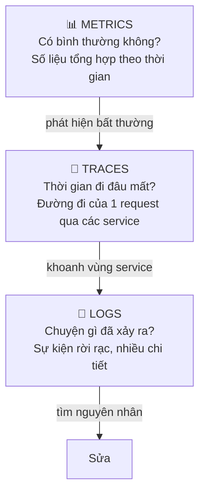

# Buổi 12 — Observability: Log, Metric, Trace, SLO

> **Mục tiêu**: Biết cách trả lời câu hỏi "hệ thống đang bị gì?" trong 5 phút thay vì 5 giờ. Hiểu
> ba trụ cột, viết được structured log, đo được percentile, và đặt được SLO có ý nghĩa.

---

## 1. Câu chuyện mở đầu (15')

3 giờ sáng. Điện thoại reo: *"Website chậm."*

Bạn mở laptop. Và rồi:

```
- Log ở đâu? → SSH vào từng server trong 12 server, `tail -f`
- Log trông thế nào? → console.log("error", err)  ... không có thời gian, không có user, không có request id
- Chậm bao nhiêu? → "khách hàng bảo chậm"
- Chậm từ khi nào? → không ai biết
- Chậm ở tầng nào? → API? DB? Cache? Bên thứ ba? → không biết
- Có gì thay đổi không? → có deploy lúc 22h, nhưng cũng có thể không liên quan
```

Bạn mất 5 tiếng để phát hiện: một query thiếu index sau khi bảng vượt 10 triệu dòng.

**Với observability tốt, việc đó mất 5 phút.**

> **Monitoring** trả lời câu hỏi bạn *biết trước* sẽ hỏi (CPU cao chưa?).
> **Observability** cho bạn trả lời câu hỏi *chưa từng nghĩ tới* (vì sao chỉ user ở Đà Nẵng dùng
> Android mới bị lỗi thanh toán?).

---

## 2. Ba trụ cột



| | Logs | Metrics | Traces |
|---|---|---|---|
| Trả lời | Chuyện gì xảy ra? | Có bình thường không? | Chậm ở đâu? |
| Dung lượng | Rất lớn | Nhỏ | Trung bình (có sampling) |
| Chi phí | $$$ | $ | $$ |
| Dùng để | Debug chi tiết | Cảnh báo, dashboard | Tìm nút thắt |

**Quy trình điều tra chuẩn**: Metric báo động → Trace khoanh vùng service chậm → Log xem chi tiết
lỗi trong service đó.

---

## 3. Logging cho đúng

### 3.1. Structured logging — bắt buộc

```js
// ❌ Không thể tìm kiếm, không thể tổng hợp, không thể cảnh báo
console.log('User ' + userId + ' failed to pay: ' + err.message);

// ✅ Máy đọc được → tìm kiếm, lọc, đếm, cảnh báo đều được
logger.error({
  event: 'payment_failed',
  userId, orderId,
  amount: 500000,
  gateway: 'vnpay',
  errorCode: err.code,
  durationMs: 1234,
  requestId: ctx.requestId,   // ← nối được với trace
  traceId: ctx.traceId,
});
```

Với structured log, bạn truy vấn được: *"Đếm số `payment_failed` theo `gateway` trong 1 giờ qua"* —
điều bất khả thi với chuỗi văn bản tự do.

### 3.2. Mức log

| Mức | Dùng khi | Ở production |
|---|---|---|
| `ERROR` | Cần người xử lý | Luôn bật, có cảnh báo |
| `WARN` | Bất thường nhưng tự xử lý được (retry thành công) | Luôn bật |
| `INFO` | Sự kiện nghiệp vụ quan trọng (đặt hàng, đăng nhập) | Luôn bật |
| `DEBUG` | Chi tiết kỹ thuật | Tắt (bật tạm khi cần) |

### 3.3. Điều TUYỆT ĐỐI không được log

```
❌ Mật khẩu, token, API key, session id
❌ Số thẻ tín dụng, CVV
❌ CMND/CCCD, số điện thoại đầy đủ (tuỳ quy định)
❌ Toàn bộ request body (thường chứa những thứ trên)
```

Log bị lộ là sự cố bảo mật. Hãy có một hàm `redact()` dùng chung và kiểm thử nó.

### 3.4. Correlation ID — sợi chỉ xuyên suốt

```
Client gửi:        X-Request-Id: req_abc123
API Gateway:       nhận, hoặc tự sinh nếu chưa có
  → Order Service: TRUYỀN TIẾP header này
    → DB query:    log kèm requestId
    → Queue msg:   ĐÍNH KÈM requestId vào message
      → Worker:    log kèm requestId
```

Nhờ đó, một câu truy vấn `requestId = "req_abc123"` cho bạn **toàn bộ** hành trình, kể cả phần chạy
bất đồng bộ sau đó vài phút. Không có nó, hệ microservices là hộp đen.

---

## 4. Metrics

### Bốn loại

| Loại | Ý nghĩa | Ví dụ |
|---|---|---|
| **Counter** | Chỉ tăng | `http_requests_total` |
| **Gauge** | Lên xuống | `queue_depth`, `memory_bytes` |
| **Histogram** | Phân phối theo khoảng | `http_duration_seconds` |
| **Summary** | Percentile tính sẵn tại client | |

### Bốn tín hiệu vàng (Google SRE)

```
1. LATENCY   — mất bao lâu (TÁCH RIÊNG request thành công và request lỗi!)
2. TRAFFIC   — bao nhiêu request/giây
3. ERRORS    — bao nhiêu % lỗi
4. SATURATION— tài nguyên đã dùng bao nhiêu % (CPU, RAM, pool, disk)
```

> ⚠️ Bẫy: nếu gộp latency của request lỗi vào chung, một loạt lỗi trả về nhanh (`fail fast`) sẽ
> **kéo p99 xuống đẹp hơn** trong khi hệ thống đang hỏng.

### Vì sao KHÔNG được lấy trung bình của percentile

```
Server A: p99 = 100ms
Server B: p99 = 900ms
Trung bình = 500ms  ❌ VÔ NGHĨA — con số này không mô tả bất kỳ request thật nào
```

Muốn có p99 toàn cục, phải **gộp histogram** rồi mới tính percentile. Đây là lý do Prometheus dùng
histogram bucket chứ không lưu sẵn percentile.

### Cardinality — sát thủ ngân sách

```js
// ❌ userId có 10 triệu giá trị → 10 triệu chuỗi thời gian → sập hệ thống metric
metrics.increment('requests', { userId, url: req.url });

// ✅ Dùng nhãn có ÍT giá trị
metrics.increment('requests', { route: '/orders/:id', method: 'GET', status: '200' });
```

Quy tắc: nhãn của metric phải có **ít giá trị khác nhau** (< vài trăm). Chi tiết cao đưa vào **log**
và **trace**, không đưa vào metric.

---

## 5. Distributed Tracing

```
Trace: req_abc123 (tổng 850ms)
├─ [API Gateway]           850ms  ████████████████████████████████
│  ├─ [Auth Service]        30ms  █
│  ├─ [Order Service]      780ms  ██████████████████████████████
│  │  ├─ [DB: SELECT]       15ms  ▌
│  │  ├─ [Cache: GET]        2ms  ▏
│  │  └─ [Payment Svc]     750ms  █████████████████████████  ← THỦ PHẠM
│  │     └─ [Bank API]     740ms  █████████████████████████
│  └─ [Notification]        20ms  ▌
```

Nhìn một cái là biết ngay thời gian đi đâu. Không có trace, bạn phải đoán và thêm log thủ công vào
từng chỗ.

**Chuẩn**: OpenTelemetry (OTel) — vendor-neutral, truyền context qua header `traceparent`.

**Sampling**: trace 100% thì quá đắt. Cách làm thực tế:
- Sample ngẫu nhiên 1–10% traffic bình thường
- **Luôn giữ 100%** trace của request bị lỗi hoặc chậm (tail-based sampling)

---

## 6. SLI, SLO, SLA và Error Budget

```
SLI (Indicator) : con số ĐO ĐƯỢC        → "99,95% request thành công trong 30 ngày qua"
SLO (Objective) : MỤC TIÊU nội bộ       → "99,9% request thành công"
SLA (Agreement) : CAM KẾT với khách + đền bù → "99,5%, không đạt thì hoàn 10% phí"

SLA luôn LỎNG HƠN SLO. SLO là vạch bạn tự đặt để còn kịp sửa trước khi phá vỡ SLA.
```

### Error Budget — công cụ quản lý mạnh nhất

```
SLO 99,9% trong 30 ngày → được phép "hỏng" 43 phút 12 giây
Đã dùng 30 phút         → còn 13 phút ngân sách

Còn nhiều ngân sách → cứ deploy nhanh, thử nghiệm mạnh dạn
Hết ngân sách        → ĐÓNG BĂNG tính năng mới, chỉ làm việc về độ ổn định
```

Đây là cách biến tranh cãi "làm tính năng mới hay sửa nợ kỹ thuật" thành một **con số** ai cũng
đồng ý được.

### Cảnh báo dựa trên triệu chứng, không dựa trên nguyên nhân

```
❌ "CPU server 3 vượt 80%"       → có thể hoàn toàn bình thường, gọi dậy lúc 3h sáng vô ích
✅ "Tỉ lệ lỗi > 1% trong 5 phút" → người dùng ĐANG bị ảnh hưởng
✅ "p99 checkout > 2s trong 10 phút"
✅ "Đốt hết 5% error budget trong 1 giờ"   ← cảnh báo tốt nhất
```

> **Quy tắc vàng**: mỗi cảnh báo phải (1) có người dùng thực sự bị ảnh hưởng, và (2) có hành động
> cụ thể để làm. Cảnh báo không thoả mãn cả hai điều → xoá nó đi. Alert fatigue giết chết đội trực.

---

## 7. Lab (40')

📂 `labs/lab12-observability/`

```bash
node labs/lab12-observability/01-demo.js
```

Bạn sẽ cài: structured logger có redact, metrics registry (counter/gauge/histogram), tracer với
span lồng nhau, tính error budget, và thấy vì sao trung bình của percentile là vô nghĩa.

---

## 8. Cái giá phải trả

- **Log đắt khủng khiếp**: 1 TB log/ngày có thể tốn hơn cả cụm server sinh ra nó.
- **Metric cardinality cao làm sập chính hệ thống monitoring** — và nó thường sập đúng lúc bạn
  cần nó nhất.
- **Tracing thêm overhead** vào mọi request (thường 1–3%).
- **Quá nhiều dashboard = không có dashboard nào.** Mỗi service nên có đúng 1 dashboard "sức khoẻ"
  với 4 tín hiệu vàng.
- **SLO đặt quá cao rất tốn kém**: từ 99,9% lên 99,99% có thể tốn gấp 10 lần chi phí.

---

## 9. Bài tập về nhà

1. Chạy `01-demo.js`. Giải thích vì sao p99 gộp khác với trung bình các p99.
2. Viết structured log cho 3 sự kiện trong app của bạn. Liệt kê các trường và lý do có mặt.
3. Đặt SLO cho: trang chủ, API thanh toán, và tính năng "gợi ý sản phẩm". Ba con số có nên giống
   nhau không? Vì sao?
4. Xem lại cảnh báo hiện có của team bạn (nếu có). Cái nào vi phạm "quy tắc vàng"?

---

## 10. Câu hỏi kiểm tra

1. Ba trụ cột observability là gì? Dùng cái nào trước khi điều tra sự cố?
2. Vì sao structured log tốt hơn `console.log` nối chuỗi?
3. Correlation ID để làm gì? Nó phải đi qua những đâu?
4. Vì sao không được lấy trung bình của p99?
5. Cardinality là gì và vì sao nó nguy hiểm?
6. Error budget là gì? Nó giúp ra quyết định như thế nào?
7. Vì sao cảnh báo "CPU > 80%" là cảnh báo tồi?
