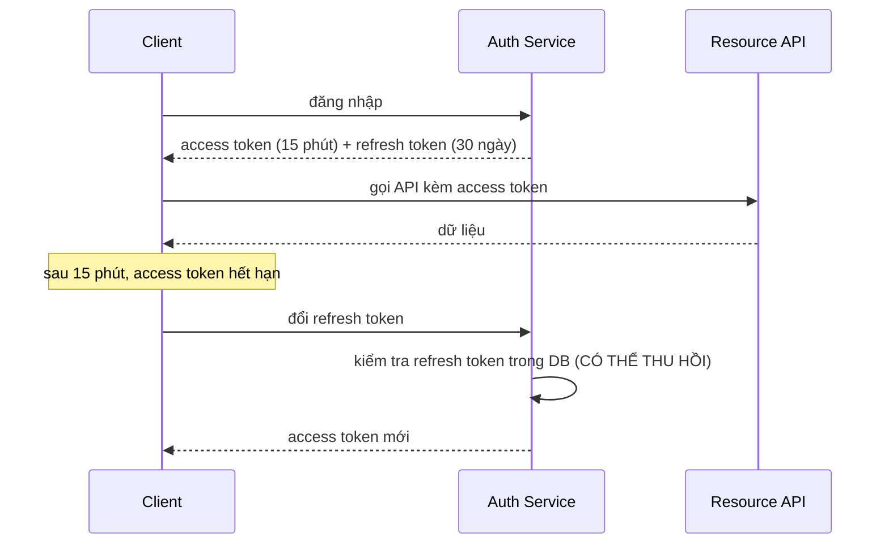
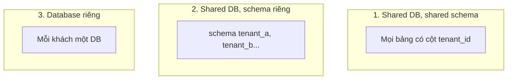

# Buổi 13 — Bảo mật hệ thống & Multi-tenant

> **Mục tiêu**: Phân biệt authentication/authorization, hiểu JWT (và giới hạn của nó), biết thiết
> kế phân quyền và cô lập dữ liệu giữa các khách hàng.

---

## 1. Câu chuyện mở đầu (15')

```
GET /api/orders/1042
Authorization: Bearer <token hợp lệ của user A>
```

Server kiểm tra token → hợp lệ → trả về đơn hàng 1042.

**Nhưng đơn hàng 1042 là của user B.**

Đây là lỗ hổng **IDOR (Insecure Direct Object Reference)** — lỗi phổ biến nhất và bị khai thác
nhiều nhất trong các API thực tế. Nguyên nhân: lập trình viên đã kiểm tra "bạn là ai" nhưng quên
kiểm tra "bạn có được xem cái này không".

```js
// ❌ SAI
const order = await db.getOrder(req.params.id);

// ✅ ĐÚNG — luôn ràng buộc theo chủ sở hữu ngay trong truy vấn
const order = await db.getOrder(req.params.id, { ownerId: req.user.id });
if (!order) return res.status(404).json(...);  // 404 chứ không phải 403 — xem mục 4
```

---

## 2. Authentication vs Authorization

```
Authentication (AuthN): BẠN LÀ AI?          → đăng nhập, token, sinh trắc học
Authorization  (AuthZ): BẠN ĐƯỢC LÀM GÌ?    → vai trò, quyền, chủ sở hữu
```

Hai việc khác nhau, thường bị gộp làm một và đó là nguồn gốc của hầu hết lỗ hổng.

### Các cơ chế xác thực

| Cơ chế | Cách hoạt động | Ưu / Nhược |
|---|---|---|
| **Session + Cookie** | Server lưu session, cookie giữ session id | ✅ Thu hồi ngay được · ❌ Cần store dùng chung (buổi 04) |
| **JWT** | Token tự chứa, có chữ ký | ✅ Không cần store · ❌ **Không thu hồi được trước hạn** |
| **OAuth 2.0** | Uỷ quyền cho bên thứ ba ("Đăng nhập bằng Google") | ✅ Không giữ mật khẩu người dùng · ❌ Phức tạp |
| **API Key** | Chuỗi bí mật cố định | ✅ Đơn giản cho server-to-server · ❌ Lộ là mất hết |
| **mTLS** | Cả hai bên đều có chứng chỉ | ✅ Rất mạnh · ❌ Vận hành nặng |

---

## 3. JWT — hiểu cho đúng

```
eyJhbGciOiJIUzI1NiJ9 . eyJzdWIiOiI0MiIsImV4cCI6MTc... . 3x9Kd2mQ...
└──── HEADER ────────┘ └────── PAYLOAD ──────────┘ └── SIGNATURE ──┘
     thuật toán            dữ liệu (base64,             chữ ký
                           KHÔNG mã hoá!)
```

### Ba sự thật người mới hay hiểu sai

1. **Payload KHÔNG được mã hoá**, chỉ là base64. Ai cũng đọc được.
   → **Đừng bao giờ** để dữ liệu nhạy cảm trong JWT.
2. **Chữ ký chỉ chứng minh token không bị sửa**, không giấu nội dung.
3. **JWT không thu hồi được.** Đây là nhược điểm lớn nhất. User đổi mật khẩu / bị khoá tài khoản
   nhưng token cũ vẫn hợp lệ cho tới khi hết hạn.

### Mẫu Access + Refresh token



Ý tưởng: access token **ngắn hạn** (không cần thu hồi vì sắp hết hạn), refresh token **dài hạn**
nhưng **lưu trong DB** nên thu hồi được. Đây là cách dung hoà tốt nhất.

### Các lỗi bảo mật JWT kinh điển

```js
❌ jwt.verify(token, secret)                       // không chỉ định thuật toán
✅ jwt.verify(token, secret, { algorithms: ['HS256'] })
   // Lỗ hổng "alg: none": kẻ tấn công đổi header thành {"alg":"none"} và bỏ chữ ký.
   // Lỗ hổng đổi RS256 → HS256: dùng public key làm secret để tự ký token.

❌ Lưu token trong localStorage                    // XSS đọc được
✅ Cookie HttpOnly + Secure + SameSite=Strict

❌ Không đặt exp                                    // token sống mãi
❌ Secret yếu ("secret123")                         // brute-force được
```

---

## 4. Authorization: RBAC, ABAC, ReBAC

| Mô hình | Ý tưởng | Ví dụ |
|---|---|---|
| **RBAC** (theo vai trò) | user → role → permission | admin, editor, viewer |
| **ABAC** (theo thuộc tính) | Quy tắc dựa trên thuộc tính | "được sửa nếu là tác giả VÀ trong 24h" |
| **ReBAC** (theo quan hệ) | Đồ thị quan hệ | Google Docs: "được xem vì nằm trong folder được share" |

### Ba tầng kiểm tra bắt buộc

```js
// 1. AuthN — bạn là ai?
if (!req.user) return res.status(401).json({ error: { code: 'UNAUTHENTICATED' } });

// 2. AuthZ theo vai trò — vai trò của bạn có quyền này không?
if (!can(req.user, 'order:read')) return res.status(403).json(...);

// 3. AuthZ theo bản ghi — bạn có quyền với ĐÚNG bản ghi này không?  ← HAY BỊ QUÊN NHẤT
const order = await db.getOrder(id, { tenantId: req.user.tenantId });
if (!order) return res.status(404).json(...);
```

> 💡 **Vì sao trả 404 chứ không phải 403?** Vì `403` xác nhận rằng bản ghi đó **có tồn tại** —
> kẻ tấn công có thể dò id để biết hệ thống có bao nhiêu đơn hàng, khách hàng nào tồn tại.
> Trả `404` không tiết lộ gì.

---

## 5. Multi-tenant — nhiều khách hàng trên một hệ thống



| | Shared schema | Schema riêng | DB riêng |
|---|---|---|---|
| Chi phí | ✅ Rẻ nhất | Trung bình | ❌ Đắt nhất |
| Cô lập dữ liệu | ❌ Yếu (phụ thuộc code) | Trung bình | ✅ Mạnh nhất |
| Rủi ro rò rỉ chéo | ⚠️ Cao — quên 1 câu WHERE là lộ | Thấp | ✅ Gần như không |
| Backup/restore 1 khách | ❌ Khó | Trung bình | ✅ Dễ |
| Số khách hàng chịu được | Hàng triệu | Hàng nghìn | Hàng trăm |
| "Hàng xóm ồn ào" | ⚠️ Có | Có | ✅ Không |

### Bảo vệ ở tầng database: Row Level Security

Với shared schema, chỉ dựa vào `WHERE tenant_id = ?` trong code là rất nguy hiểm — chỉ cần **một**
truy vấn quên là rò rỉ toàn bộ.

```sql
ALTER TABLE orders ENABLE ROW LEVEL SECURITY;
CREATE POLICY tenant_isolation ON orders
  USING (tenant_id = current_setting('app.tenant_id')::uuid);
```

Giờ thì kể cả code quên `WHERE`, database vẫn **không trả** dữ liệu của tenant khác. Đây là
**defense in depth** — nhiều lớp phòng thủ, không tin vào một lớp duy nhất.

---

## 6. Danh sách kiểm tra bảo mật thực dụng

| Nguy cơ | Phòng chống |
|---|---|
| **SQL Injection** | Prepared statement, không nối chuỗi. **Không có ngoại lệ.** |
| **XSS** | Escape output, `Content-Security-Policy`, không `innerHTML` |
| **CSRF** | `SameSite=Strict`, CSRF token cho form |
| **IDOR** | Kiểm tra chủ sở hữu ở mọi truy vấn (mục 4) |
| **Mật khẩu yếu / lộ** | bcrypt/argon2 (**không bao giờ** MD5/SHA), rate limit login |
| **Brute-force** | Rate limit theo IP **và** theo tài khoản (buổi 09) |
| **Rò rỉ secret** | Biến môi trường / secret manager, không commit vào git, xoay vòng định kỳ |
| **Dữ liệu trên đường truyền** | TLS mọi nơi, kể cả nội bộ |
| **Dữ liệu lưu trữ** | Mã hoá đĩa, mã hoá cột nhạy cảm |

### Nguyên tắc nền tảng

1. **Least privilege** — cho quyền tối thiểu đủ dùng. Service đọc báo cáo không cần quyền `DELETE`.
2. **Defense in depth** — nhiều lớp. Một lớp thủng thì còn lớp khác.
3. **Fail secure** — lỗi thì **từ chối**, không phải cho qua.
4. **Đừng tự viết mã hoá.** Dùng thư viện đã được kiểm chứng.

---

## 7. Lab (40')

📂 `labs/lab13-auth/`

```bash
node labs/lab13-auth/01-jwt.js
```

Bạn sẽ: tự cài JWT bằng `node:crypto`, tái hiện lỗ hổng `alg: none`, cài RBAC + kiểm tra chủ sở hữu,
tái hiện lỗ hổng IDOR và rò rỉ chéo tenant.

---

## 8. Cái giá phải trả

- **Access token ngắn hạn** → client phải xử lý refresh, thêm phức tạp và thêm chỗ để hỏng.
- **DB riêng cho mỗi tenant** → migration phải chạy hàng trăm lần, vận hành nặng.
- **RLS làm query chậm hơn** và khó debug ("sao câu này không ra dữ liệu?").
- **Bảo mật chặt làm trải nghiệm tệ đi** (2FA, session ngắn, captcha). Luôn có đánh đổi.

---

## 9. Bài tập về nhà

1. Chạy `01-jwt.js`. Giải thích lỗ hổng `alg: none` và cách sửa.
2. Thiết kế phân quyền cho một hệ thống quản lý dự án: Owner, Admin, Member, Guest.
   Lập bảng vai trò × hành động. Vai trò nào xem được hoá đơn?
3. Chọn mô hình multi-tenant cho: (a) app ghi chú cá nhân miễn phí, (b) phần mềm bệnh viện.
   Giải thích lựa chọn.
4. Tìm 3 chỗ trong dự án của bạn có nguy cơ IDOR. Viết cách sửa.

---

## 10. Câu hỏi kiểm tra

1. AuthN và AuthZ khác nhau ra sao?
2. Payload JWT có được mã hoá không? Hệ quả là gì?
3. Vì sao cần cả access token và refresh token?
4. IDOR là gì? Vì sao nên trả 404 thay vì 403?
5. Ba mô hình multi-tenant khác nhau ở điểm nào về cô lập và chi phí?
6. Row Level Security bảo vệ ta khỏi loại lỗi nào?
7. "Fail secure" nghĩa là gì? Cho một ví dụ vi phạm.
