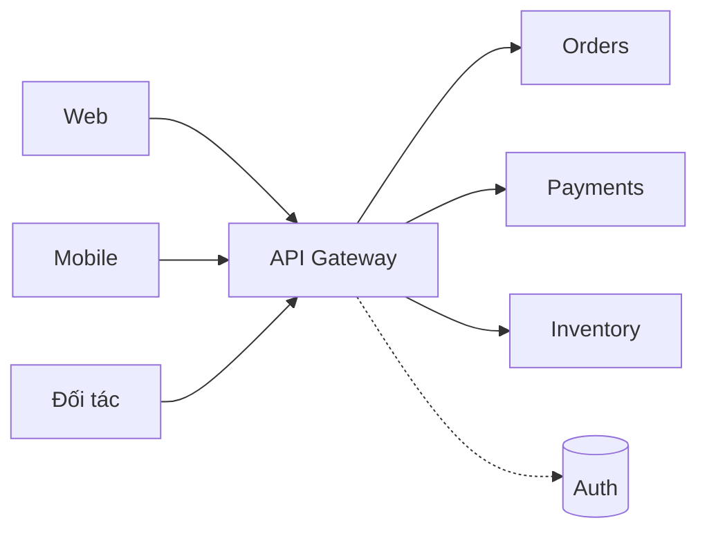
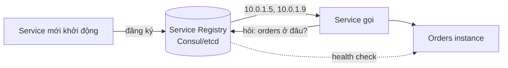
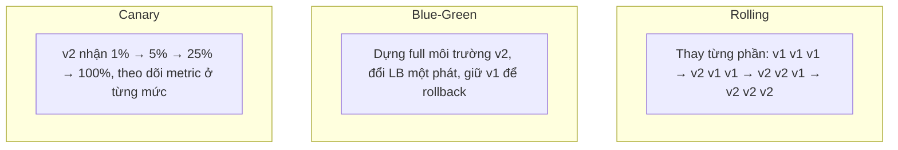

# Buổi 14 — Monolith → Microservices, API Gateway, Deploy

> **Mục tiêu**: Biết khi nào **nên** và khi nào **không nên** tách microservices. Hiểu API Gateway,
> service discovery, và các chiến lược deploy không downtime.

---

## 1. Câu chuyện mở đầu (15')

Team 6 người, một monolith Node.js. Mọi thứ đang chạy tốt. Sếp đọc một bài blog và tuyên bố:
*"Chúng ta phải chuyển sang microservices."*

Sáu tháng sau:

| Trước (monolith) | Sau (12 microservices) |
|---|---|
| 1 repo | 12 repo |
| 1 pipeline CI | 12 pipeline |
| Gọi hàm: 0,001ms | Gọi HTTP: 5ms × 6 chặng |
| Stack trace đầy đủ | "Lỗi ở đâu đó trong 12 service" |
| `BEGIN...COMMIT` | Saga, outbox, eventual consistency |
| Deploy 5 phút | Deploy 12 service theo đúng thứ tự |
| 1 database | 12 database phải backup |
| Team 6 người | Vẫn 6 người 😵 |

**Kết quả**: chậm hơn, đắt hơn, khó debug hơn, và tính năng ra chậm hơn.

> 🎯 **Sự thật ít người nói**: Microservices là giải pháp cho vấn đề **TỔ CHỨC**, không phải vấn đề
> **KỸ THUẬT**. Nó tồn tại để 200 kỹ sư không giẫm chân nhau. Với 6 người, nó là gánh nặng thuần tuý.

---

## 2. Monolith không phải là từ bẩn

### Modular Monolith — điểm đến của phần lớn dự án

```
src/
├── modules/
│   ├── orders/       ← có service, repository, model riêng
│   │   ├── index.js  ← CHỈ file này được export ra ngoài (ranh giới rõ ràng)
│   ├── payments/
│   ├── inventory/
│   └── users/
└── shared/
```

Quy tắc: module A **chỉ** gọi module B qua interface công khai của B, **không** truy cập trực tiếp
bảng dữ liệu của B.

Bạn được: ranh giới rõ ràng, dễ hiểu, dễ test, deploy đơn giản, transaction thật, gọi hàm 0ms.
Và khi thật sự cần tách, mỗi module đã sẵn sàng thành một service.

> 💡 **Lời khuyên**: Bắt đầu bằng modular monolith. Tách ra microservice **từng cái một**, khi có
> lý do cụ thể đo được — không phải vì "kiến trúc hiện đại".

### Khi nào THỰC SỰ nên tách một service ra?

| Lý do chính đáng | Lý do KHÔNG chính đáng |
|---|---|
| Nhiều team giẫm chân nhau khi deploy | "Microservices là hiện đại" |
| Một phần cần scale khác hẳn (video transcode ngốn CPU) | "Google làm thế" |
| Cần công nghệ khác (ML bằng Python) | "Monolith nghe cũ" |
| Yêu cầu tuân thủ, cách ly dữ liệu | "Để code sạch hơn" (→ dùng module!) |
| Một phần cần SLA cao hơn hẳn | |

---

## 3. Chia service theo đâu?

### Sai: chia theo tầng kỹ thuật

```
❌ user-service, database-service, api-service, validation-service
   → Mọi tính năng đều phải sửa cả 4 service. Tệ hơn monolith.
```

### Đúng: chia theo miền nghiệp vụ (bounded context)

```
✅ orders, payments, inventory, shipping, notifications
   → Một tính năng thường chỉ đụng 1 service.
```

**Phép thử tốt nhất**: nếu một thay đổi nghiệp vụ bình thường buộc phải sửa và deploy đồng thời
nhiều service, thì ranh giới của bạn đã **sai**.

### Định luật Conway

> *"Kiến trúc hệ thống sẽ phản chiếu cấu trúc giao tiếp của tổ chức tạo ra nó."*

Nếu bạn có 3 team, bạn sẽ có 3 service — dù muốn hay không. **Inverse Conway Maneuver**: thiết kế
tổ chức trước để có được kiến trúc mong muốn.

---

## 4. API Gateway



Gateway gánh những việc **mọi service đều cần**, để service chỉ lo nghiệp vụ:

| Việc | Vì sao đặt ở gateway |
|---|---|
| Kết thúc TLS | Chứng chỉ quản lý một chỗ |
| Xác thực token | Service không phải tự verify |
| Rate limiting | Chặn trước khi vào hệ thống |
| Định tuyến theo path | `/orders/*` → Order Service |
| Gộp response | 1 request từ mobile → 3 service |
| Log/trace/metric | Điểm quan sát tập trung |
| Chuyển đổi giao thức | REST ngoài → gRPC trong |

⚠️ **Bẫy**: gateway dễ phình thành "monolith mới" chứa đầy logic nghiệp vụ. Quy tắc: gateway chỉ
làm **những việc chung**, tuyệt đối không chứa quy tắc nghiệp vụ.

### BFF — Backend for Frontend

```
Web BFF     → gộp dữ liệu cho màn hình rộng
Mobile BFF  → gộp gọn, ít field, tiết kiệm 3G
Partner API → ổn định, có version chặt chẽ
```
Mỗi loại client có nhu cầu khác nhau — một API "vừa cho tất cả" thì không vừa cho ai.

---

## 5. Service Discovery

Service không thể hard-code IP của nhau (IP đổi liên tục khi autoscale).



| Kiểu | Cách hoạt động | Ví dụ |
|---|---|---|
| **Client-side** | Client hỏi registry rồi tự chọn instance | Consul + client lib |
| **Server-side** | Client gọi LB, LB tra registry | Kubernetes Service |
| **DNS-based** | Tra DNS nội bộ | `orders.svc.cluster.local` |
| **Service mesh** | Sidecar proxy lo hết | Istio, Linkerd |

**Service Mesh** đưa mọi thứ ở buổi 09 (retry, circuit breaker, timeout, mTLS) xuống tầng hạ tầng —
code ứng dụng không cần biết. Cái giá: thêm một sidecar mỗi pod, thêm latency, và thêm một hệ thống
rất phức tạp để vận hành. Chỉ đáng khi bạn có hàng chục service trở lên.

---

## 6. Chiến lược deploy



| Chiến lược | Downtime | Rollback | Chi phí | Rủi ro |
|---|---|---|---|---|
| Recreate | ❌ Có | Chậm | Thấp | Cao |
| **Rolling** | ✅ Không | Trung bình | Thấp | Trung bình |
| **Blue-Green** | ✅ Không | ⚡ Tức thì | **Gấp đôi** | Thấp |
| **Canary** | ✅ Không | Nhanh | Trung bình | ✅ Thấp nhất |

### Feature flag — tách "deploy" khỏi "release"

```js
if (await flags.enabled('checkout_v2', { userId })) return checkoutV2(...);
return checkoutV1(...);
```

Deploy code lên production nhưng **tắt**. Bật dần cho 1% → 10% → 100%. Có sự cố thì **tắt cờ**
(vài giây) thay vì rollback deploy (vài phút). Đây là công cụ giảm rủi ro mạnh nhất trong deploy.

### Migration database không downtime — mẫu Expand/Contract

Đây là chỗ người mới hay gây downtime nhất.

```
❌ SAI: đổi tên cột full_name → name trong một lần deploy
   → code cũ (chưa kịp thay hết) tìm full_name → lỗi hàng loạt

✅ ĐÚNG — 4 bước, mỗi bước một lần deploy:
   1. EXPAND   : thêm cột `name`, code ghi vào CẢ HAI, đọc từ `full_name`
   2. BACKFILL : copy dữ liệu cũ sang cột mới (chạy nền, theo lô)
   3. SWITCH   : code đọc từ `name`, vẫn ghi cả hai
   4. CONTRACT : bỏ ghi `full_name`, sau đó mới xoá cột
```

Nguyên tắc bất di bất dịch: **schema mới phải tương thích với code cũ**, vì trong lúc rolling
deploy, code cũ và code mới **chạy song song**.

---

## 7. Lab (40')

📂 `labs/lab14-gateway/`

```bash
node labs/lab14-gateway/01-demo.js
```

Bạn sẽ cài: service registry có health check, API gateway (auth + rate limit + routing + gộp
response), canary deploy theo tỉ lệ, và so sánh monolith vs microservices về latency.

---

## 8. Cái giá phải trả

- **Latency cộng dồn**: mỗi chặng mạng thêm 1–5ms và thêm một cơ hội thất bại (nhớ tail
  amplification ở buổi 03).
- **Không còn transaction**: mọi thứ thành Saga + eventual consistency (buổi 08).
- **Debug xuyên service** đòi hỏi tracing — không có nó thì bạn mù.
- **Chi phí vận hành nhân lên** theo số service: CI/CD, monitor, secret, backup, on-call.
- **"Distributed monolith"** — trạng thái tệ nhất: các service phải deploy cùng lúc. Bạn nhận đủ
  nhược điểm của cả hai kiến trúc và không được ưu điểm nào.

---

## 9. Bài tập về nhà

1. Chạy `01-demo.js`. Ghi lại chênh lệch latency giữa monolith và chuỗi 4 microservice.
2. Chia một hệ thống thương mại điện tử thành các bounded context. Với mỗi ranh giới, viết một câu
   giải thích. Sau đó chỉ ra một thay đổi nghiệp vụ buộc phải sửa nhiều service — ranh giới đó có
   nên vẽ lại không?
3. Viết kế hoạch 4 bước expand/contract để đổi cột `phone` (string) thành bảng `phone_numbers`
   (một user nhiều số). Mỗi bước deploy gì, rollback ra sao?
4. Team bạn có 8 người và một monolith. Nêu 3 dấu hiệu cho biết ĐÃ ĐẾN LÚC tách service, và 3 dấu
   hiệu cho biết CHƯA.

---

## 10. Câu hỏi kiểm tra

1. Microservices giải quyết vấn đề gì là chính?
2. Vì sao chia service theo tầng kỹ thuật là sai?
3. Định luật Conway nói gì?
4. API Gateway nên và không nên chứa những gì?
5. Canary khác blue-green ở đâu? Khi nào chọn cái nào?
6. Vì sao feature flag rollback nhanh hơn rollback deploy?
7. "Distributed monolith" là gì và vì sao nó là trạng thái tệ nhất?
