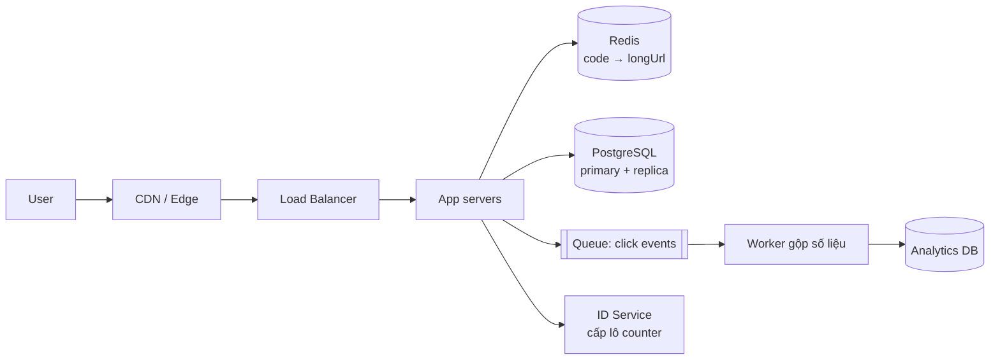
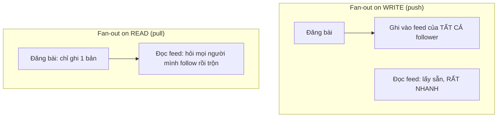

# Buổi 15 — Case study tổng hợp & Mock interview

> **Mục tiêu**: Ghép mọi thứ đã học thành một thiết kế hoàn chỉnh. Luyện cách trình bày trong 45
> phút phỏng vấn.

---

## 1. Cách buổi này diễn ra

| Thời lượng | Hoạt động |
|---|---|
| 20' | Giảng viên làm mẫu case study 1 (URL Shortener) — vừa nói vừa vẽ, **không** chuẩn bị sẵn slide |
| 30' | Học viên chia cặp: một người phỏng vấn, một người trả lời case study 2 |
| 30' | Đổi vai, case study 3 |
| 20' | Lab code: chạy `01-url-shortener.js` để thấy thiết kế thành code thật |
| 20' | Tổng kết khoá học, hỏi đáp |

---

## 2. CASE STUDY 1 — URL Shortener (làm mẫu)

### Bước 1 — Làm rõ yêu cầu (5')

| Functional | Non-functional |
|---|---|
| Dán URL dài → nhận link ngắn | 100 triệu link/tháng |
| Truy cập link ngắn → redirect 301/302 | Redirect p99 < 100ms |
| Đặt hạn dùng | Đọc:Ghi = 100:1 |
| Xem số lượt click | Uptime 99,9% |
| | Link không đoán được (bảo mật) |

**Ngoài phạm vi (nói rõ ra)**: custom domain, analytics real-time, chỉnh sửa link.

### Bước 2 — Ước lượng (5')

```
Ghi   : 100tr/tháng ÷ 2,6tr giây = 38 QPS  → peak ~120 QPS
Đọc   : 38 × 100 = 3.800 QPS               → peak ~12.000 QPS
Storage: 100tr × 500 B × 12 × 5 năm = 3 TB → một máy vẫn chứa được, CHƯA cần shard
Cache : 20% link nóng × 500 B = 10 GB      → vừa một instance Redis
```

**Kết luận rút ra**: hệ đọc nhiều tuyệt đối → cache là thành phần quan trọng nhất.
3 TB → chưa cần sharding ngay, nhưng thiết kế phải sẵn sàng.

### Bước 3 — Thiết kế tổng thể (15')

**API**
```
POST /v1/links      { longUrl, expiresAt? }  → 201 { code, shortUrl }
GET  /{code}                                 → 302 Location: <longUrl>
GET  /v1/links/{code}/stats                  → 200 { clicks, createdAt }
```

**Data model**
```sql
CREATE TABLE links (
  code        VARCHAR(7) PRIMARY KEY,   -- base62, 7 ký tự
  long_url    TEXT NOT NULL,
  owner_id    BIGINT,
  created_at  TIMESTAMPTZ DEFAULT now(),
  expires_at  TIMESTAMPTZ
);
CREATE INDEX ON links (owner_id, created_at DESC);  -- buổi 06: index theo QUERY
```

**Sinh mã ngắn — bốn phương án và đánh đổi**

| Cách | Ưu | Nhược |
|---|---|---|
| Băm URL (MD5 rồi cắt) | Không cần state | Va chạm; cùng URL → cùng mã (rò rỉ thông tin) |
| Counter tăng dần + base62 | Ngắn nhất, không va chạm | **Đoán được** mã kế tiếp; counter là SPOF |
| Ngẫu nhiên + kiểm tra trùng | Không đoán được | Cần kiểm tra DB mỗi lần |
| ⭐ **Counter + trộn (Feistel/XOR)** | Không va chạm, không đoán được | Phức tạp hơn chút |

> Với 62⁷ ≈ 3,5 nghìn tỉ tổ hợp, 7 ký tự là quá đủ cho 6 tỉ link trong 5 năm.

**Sơ đồ**



### Bước 4 — Đào sâu (15')

**a) Đường redirect (nóng nhất, 12.000 QPS)**
```js
// Cache-aside + TTL dài vì link gần như bất biến (buổi 05)
let longUrl = await redis.get(`l:${code}`);
if (!longUrl) {
  longUrl = await db.readReplica.getLink(code);   // đọc từ replica (buổi 07)
  if (!longUrl) return res.status(404).render('not-found');
  await redis.set(`l:${code}`, longUrl, 'EX', 86400);
}
queue.publish('click', { code, ts: Date.now(), ua, ip });  // KHÔNG chặn redirect (buổi 08)
res.redirect(302, longUrl);
```
Hit rate kỳ vọng > 95% → DB chỉ nhận ~600 QPS.

**b) 301 hay 302?**
- `301` (vĩnh viễn): trình duyệt cache → server nhẹ hơn nhiều, **nhưng không đếm được click** và
  không đổi được đích đến.
- `302` (tạm thời): mọi lần click đều qua server → đếm được, đổi được.
→ Có analytics thì phải chọn `302`. Đây là một đánh đổi rất đáng nêu ra khi phỏng vấn.

**c) Đếm click 12.000 QPS**
Không `UPDATE ... SET clicks = clicks + 1` (buổi 06: hot row, khoá, tuần tự hoá).
→ Đẩy vào queue → worker gộp theo lô 10 giây → 1 UPDATE cho hàng nghìn click.
→ Hoặc `INCR` trong Redis rồi flush định kỳ (write-behind, buổi 05).

**d) Nếu X chết thì sao?**

| Chết | Hậu quả | Giảm nhẹ |
|---|---|---|
| Redis | Toàn bộ đọc dồn xuống DB (12.000 QPS) | Rate limit + circuit breaker (buổi 09), warm cache trước khi mở traffic |
| DB primary | Không tạo link mới được; **redirect vẫn chạy** (đọc từ replica + cache) | Đây là graceful degradation tốt |
| Queue | Mất số liệu click, redirect vẫn chạy | Chấp nhận được — analytics không phải chức năng cốt lõi |
| ID Service | Không tạo link mới | Mỗi app server giữ sẵn một lô 1.000 id |

**e) Chống lạm dụng**
Rate limit theo IP + theo tài khoản (buổi 09); kiểm tra URL trong danh sách đen malware;
không cho redirect tới `file://`, `localhost`, IP nội bộ (chống SSRF).

**f) Khi cần shard (buổi 07)**
Shard theo `code` bằng consistent hashing. Vì mọi truy vấn nóng đều theo `code`, đây là shard key
hoàn hảo — không có query xuyên shard.

---

## 3. CASE STUDY 2 — News Feed (học viên tự làm)

**Câu hỏi trung tâm**: Fan-out on **write** hay fan-out on **read**?



| | Fan-out on write | Fan-out on read |
|---|---|---|
| Đọc feed | ⚡ Rất nhanh | 🐢 Chậm (phải trộn) |
| Đăng bài | 🐢 Chậm (ghi N bản) | ⚡ Nhanh |
| Lưu trữ | ❌ Tốn (nhân bản) | ✅ Tiết kiệm |
| Người nổi tiếng 50 triệu follower | 💥 **Sập** | ✅ Ổn |

**Đáp án đúng: kết hợp (hybrid)** — đây chính là điều người phỏng vấn muốn nghe:
- User thường (< 10.000 follower) → fan-out on write, đẩy vào feed sẵn.
- Người nổi tiếng → fan-out on read, trộn vào lúc đọc.
- Feed cuối = feed đã dựng sẵn ⊕ bài của người nổi tiếng mình follow.

**Điểm đào sâu**: xếp hạng feed, phân trang bằng cursor (buổi 02), feed lưu trong Redis sorted set,
xử lý user không hoạt động 6 tháng (đừng fan-out cho họ).

---

## 4. CASE STUDY 3 — Hệ thống Chat (học viên tự làm)

**Điểm cốt lõi**:
- **Kết nối**: WebSocket (2 chiều, buổi 02). 1 triệu user online = 1 triệu kết nối bền → cần nhiều
  gateway server + registry biết "user X đang ở gateway nào".
- **Thứ tự tin nhắn**: dùng số thứ tự **theo từng cuộc hội thoại**, không dùng timestamp
  (buổi 10: đừng tin đồng hồ).
- **Đã gửi / đã nhận / đã đọc**: 3 trạng thái, ba lần cập nhật khác nhau.
- **Offline**: lưu vào hộp thư, đẩy push notification.
- **Data model**: `messages(conversation_id, seq, sender_id, body, created_at)` — shard theo
  `conversation_id` để mọi tin nhắn của một cuộc trò chuyện nằm cùng shard (buổi 07).
- **Group chat 1.000 người**: một tin nhắn → 1.000 lượt gửi. Fan-out lại xuất hiện.

---

## 5. Rubric chấm mock interview

| Tiêu chí | Điểm | Dấu hiệu tốt | Dấu hiệu xấu |
|---|---|---|---|
| Làm rõ yêu cầu | 15% | Hỏi trước khi vẽ, cắt scope rõ ràng | Vẽ ngay lập tức |
| Ước lượng | 10% | Con số hợp lý, **rút ra kết luận** từ nó | Bỏ qua, hoặc tính mà không dùng |
| Thiết kế tổng thể | 25% | API → data model → sơ đồ, mạch lạc | Nhảy cóc, thiếu data model |
| Đào sâu | 25% | Xử lý bottleneck, lỗi, hot key | Chỉ nói happy path |
| **Đánh đổi** | 15% | Luôn nói "được X thì mất Y" | "Cách này tốt nhất" |
| Giao tiếp | 10% | Vừa vẽ vừa nói, kiểm tra lại với người nghe | Im lặng suy nghĩ 5 phút |

**Ba lỗi khiến trượt nhanh nhất**:
1. Vẽ Kafka + Kubernetes + Elasticsearch cho hệ thống 1.000 user.
2. Không bao giờ nói tới nhược điểm của lựa chọn của mình.
3. Im lặng. Người phỏng vấn chấm **quá trình suy nghĩ**, không chấm sơ đồ cuối cùng.

---

## 6. Lab (20')

📂 `labs/lab15-case-study/`

```bash
node labs/lab15-case-study/01-url-shortener.js
```

Cài đặt hoàn chỉnh: base62, Snowflake ID, counter có trộn, cache-aside, đếm click qua queue,
degradation khi Redis chết.

---

## 7. Tổng kết khoá học — 12 điều cần mang theo

1. **"Được cái này thì mất cái gì?"** — câu hỏi quan trọng nhất.
2. Đơn giản nhất mà đáp ứng được yêu cầu là **đúng nhất**.
3. **Ước lượng trước khi vẽ.** Con số quyết định kiến trúc.
4. Latency ≠ throughput. Thêm server tăng throughput, không giảm latency.
5. **Latency nổ tung khi tải > 80%.** Luôn chừa dư địa.
6. Đo bằng **p99**, không bao giờ bằng trung bình.
7. **Cache là đòn bẩy lớn nhất** — và là nguồn bug tinh vi nhất.
8. Trong hệ phân tán, **mọi cuộc gọi mạng sẽ thất bại**. Timeout, retry có jitter, circuit breaker.
9. **At-least-once + idempotent** là mô hình đúng. Exactly-once là ảo tưởng.
10. **Sharding là biện pháp cuối cùng.** Thử mọi cách khác trước.
11. **Không quan sát được thì không sửa được.** Log có cấu trúc, metric, trace, request id.
12. **Microservices là giải pháp tổ chức**, không phải giải pháp kỹ thuật.

---

## 8. Học tiếp gì?

| Chủ đề | Gợi ý |
|---|---|
| Sách nền tảng | *Designing Data-Intensive Applications* — Martin Kleppmann |
| Vận hành | *Site Reliability Engineering* (Google, đọc miễn phí) |
| Thực chiến | Đọc các bài "engineering blog" của Discord, Figma, Stripe, Cloudflare |
| Kỷ luật | Đọc **post-mortem** sự cố công khai — học từ lỗi của người khác rẻ hơn nhiều |
| Luyện tập | Mỗi tuần thiết kế 1 hệ thống, viết ra, nhờ người khác vặn |

---

## 9. Bài tập cuối khoá (dự án nhóm)

Chọn một hệ thống (đặt xe, đặt vé, livestream, thanh toán, giao đồ ăn...) và nộp:

1. **Tài liệu thiết kế** theo khung 4 bước (tối đa 6 trang).
2. **Prototype code** bằng Node.js cho *một* thành phần cốt lõi, kèm số đo.
3. **Bảng đánh đổi**: ít nhất 5 quyết định, mỗi quyết định nêu rõ được gì / mất gì.
4. **Kế hoạch xử lý sự cố**: với mỗi thành phần, "nếu nó chết thì user thấy gì và ta làm gì".
5. **Thuyết trình 15 phút** + 10 phút bị vặn.
